normalization_layer = layers.Rescaling(1./127.5, offset=-1)
dataset = dataset.map(lambda x, y: (normalization_layer(x), y), 
                     num_parallel_calls=tf.data.AUTOTUNE)
```

**Normalization Steps:**
1. Input: uint8 images from `image_dataset_from_directory` (range 0-255)
2. Scale: Divide by 127.5 → range [0, 2]
3. Offset: Subtract 1 → range [-1, 1]

This differs from the deprecated `load_and_preprocess` method ([kaggle-notebook.ipynb:161-177](../kaggle-notebook.ipynb#L161-L177), [train.py:161-177](../train.py#L161-L177)), which manually normalized with `(image / 255.0 - 0.5) / 0.5`. The current approach leverages built-in Keras preprocessing for better performance.

**Sources:** [kaggle-notebook.ipynb:255-258](../kaggle-notebook.ipynb#L255-L258), [train.py:255-258](../train.py#L255-L258)

---

## Augmentation Strategies

### Training Augmentations

When `is_training=True`, the pipeline applies three geometric augmentations sequentially:

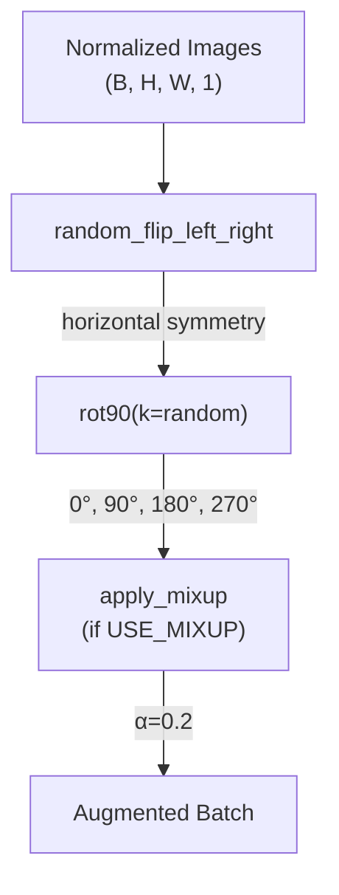

#### 1. Random Horizontal Flip
```python
dataset = dataset.map(
    lambda x, y: (tf.image.random_flip_left_right(x), y),
    num_parallel_calls=tf.data.AUTOTUNE
)
```
- **Rationale**: Wafer defects exhibit horizontal symmetry
- **Probability**: 50% (TensorFlow default)

**Sources:** [kaggle-notebook.ipynb:262-265](../kaggle-notebook.ipynb#L262-L265), [train.py:262-265](../train.py#L262-L265)

#### 2. Random 90° Rotation
```python
def random_rotate(x, y):
    k = tf.random.uniform([], 0, 4, dtype=tf.int32)
    return tf.image.rot90(x, k), y

dataset = dataset.map(random_rotate, num_parallel_calls=tf.data.AUTOTUNE)
```
- **Rotation angles**: 0°, 90°, 180°, 270° (equal probability)
- **Rationale**: Wafer orientation is arbitrary during fabrication

**Sources:** [kaggle-notebook.ipynb:267-272](../kaggle-notebook.ipynb#L267-L272), [train.py:267-272](../train.py#L267-L272)

#### 3. MixUp Augmentation

MixUp ([kaggle-notebook.ipynb:194-210](../kaggle-notebook.ipynb#L194-L210), [train.py:194-210](../train.py#L194-L210)) is applied at the batch level with `α=0.2`:

```python
@tf.function
def apply_mixup(self, images, labels):
    batch_size = tf.shape(images)[0]
    
    # Generate mixing coefficient
    lam = tf.random.uniform([batch_size, 1, 1, 1], 0.2, 0.8)
    indices = tf.random.shuffle(tf.range(batch_size))
    
    # Mix images
    mixed_images = lam * images + (1.0 - lam) * tf.gather(images, indices)
    
    # Mix labels
    lam_labels = tf.reshape(lam, [batch_size, 1])
    mixed_labels = lam_labels * labels + (1.0 - lam_labels) * tf.gather(labels, indices)
    
    return mixed_images, mixed_labels
```

**MixUp Formula:**
- Mixed image: `x̃ = λ·xᵢ + (1-λ)·xⱼ`
- Mixed label: `ỹ = λ·yᵢ + (1-λ)·yⱼ`
- λ ~ Uniform(0.2, 0.8) (per-sample in batch)

**Key Implementation Details:**
- **Vectorized**: Operates on entire batch for GPU efficiency
- **Limited range**: λ ∈ [0.2, 0.8] avoids extreme blending
- **Graph compilation**: `@tf.function` decorator for optimized execution

**Sources:** [kaggle-notebook.ipynb:194-210](../kaggle-notebook.ipynb#L194-L210), [train.py:194-210](../train.py#L194-L210), [kaggle-notebook.ipynb:274-279](../kaggle-notebook.ipynb#L274-L279), [train.py:274-279](../train.py#L274-L279)

### Deprecated Augmentation Method

The `augment` method ([kaggle-notebook.ipynb:179-192](../kaggle-notebook.ipynb#L179-L192), [train.py:179-192](../train.py#L179-L192)) includes random brightness adjustment but is **not currently used** in the pipeline:

```python
def augment(self, image, label):
    """Lightweight augmentation"""
    image = tf.image.random_flip_left_right(image)
    k = tf.random.uniform([], 0, 4, dtype=tf.int32)
    image = tf.image.rot90(image, k)
    
    # Random brightness (DEPRECATED - NOT USED)
    image = tf.image.random_brightness(image, 0.1)
    image = tf.clip_by_value(image, -1.0, 1.0)
    
    return image, label
```

**Reason for deprecation**: Brightness augmentation was found to be unnecessary for grayscale wafer images where intensity values encode critical defect information.

**Sources:** [kaggle-notebook.ipynb:179-192](../kaggle-notebook.ipynb#L179-L192), [train.py:179-192](../train.py#L179-L192)

---

## Class Weighting Mechanism

To handle class imbalance, the pipeline implements weighted sampling when `USE_CLASS_WEIGHTS=True` ([kaggle-notebook.ipynb:227-253](../kaggle-notebook.ipynb#L227-L253), [train.py:227-253](../train.py#L227-L253)).

### Weight Calculation

Class weights are computed by `ProgressiveTrainer.__init__` ([kaggle-notebook.ipynb:391-397](../kaggle-notebook.ipynb#L391-L397), [train.py:391-397](../train.py#L391-L397)):

```python
total = sum(class_counts.values())
self.class_weights = {
    i: total / (num_classes * count) 
    for i, count in class_counts.items()
}
```

**Formula:** `weight_i = N / (C × n_i)`
- N = total training samples
- C = number of classes (8)
- n_i = samples in class i

**Example (typical distribution):**
| Class | Count | Weight |
|-------|-------|--------|
| clean | 159 | 1.03 |
| scratch | 163 | 1.00 |
| foreign material | 27 | 6.06 |
| voids dents | 54 | 3.03 |

**Sources:** [kaggle-notebook.ipynb:391-397](../kaggle-notebook.ipynb#L391-L397), [train.py:391-397](../train.py#L391-L397)

### Weighted Sampling Implementation

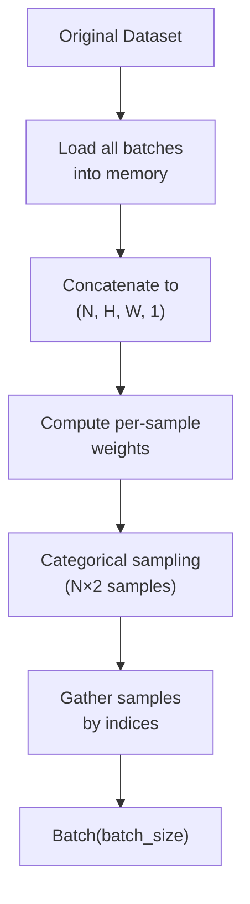

The implementation ([kaggle-notebook.ipynb:227-253](../kaggle-notebook.ipynb#L227-L253), [train.py:227-253](../train.py#L227-L253)) performs these steps:

1. **Load entire dataset into memory**:
   ```python
   all_images = []
   all_labels = []
   for images, labels in dataset:
       all_images.append(images)
       all_labels.append(labels)
   
   all_images = tf.concat(all_images, axis=0)
   all_labels = tf.concat(all_labels, axis=0)
   ```

2. **Calculate per-sample weights**:
   ```python
   sample_weights = tf.reduce_sum(
       all_labels * tf.constant([list(class_weights.values())]), 
       axis=1
   )
   sample_weights = sample_weights / tf.reduce_sum(sample_weights)
   ```

3. **Weighted sampling with 2× oversampling**:
   ```python
   num_samples = len(all_images) * 2
   indices = tf.random.categorical(
       tf.math.log(sample_weights[None, :]), 
       num_samples
   )[0]
   
   all_images = tf.gather(all_images, indices)
   all_labels = tf.gather(all_labels, indices)
   ```

4. **Recreate dataset**:
   ```python
   dataset = tf.data.Dataset.from_tensor_slices((all_images, all_labels))
   dataset = dataset.batch(batch_size)
   ```

**Trade-offs:**
- ✅ **Benefit**: Minority classes receive ~6× more exposure
- ⚠️ **Cost**: Entire dataset loaded into GPU memory (manageable for ~1300 images)
- ⚠️ **Implication**: Training set effectively doubled to ~2600 samples per epoch

**Sources:** [kaggle-notebook.ipynb:227-253](../kaggle-notebook.ipynb#L227-L253), [train.py:227-253](../train.py#L227-L253)

---

## tf.data Performance Optimization

The pipeline employs several optimization techniques to maximize GPU utilization:

### Optimization Techniques

| Technique | Implementation | Impact |
|-----------|----------------|--------|
| **Parallel mapping** | `num_parallel_calls=tf.data.AUTOTUNE` | CPU preprocessing parallelized |
| **Prefetching** | `dataset.prefetch(tf.data.AUTOTUNE)` | Next batch prepared during training |
| **Repeat** | `dataset.repeat()` (training only) | Eliminate epoch boundaries |
| **Shuffle** | `dataset.shuffle(1000)` | 1000-sample shuffle buffer |
| **Graph compilation** | `@tf.function` on `apply_mixup` | GPU kernel optimization |

### Pipeline Execution Flow

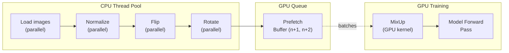

### AUTOTUNE Behavior

`tf.data.AUTOTUNE` ([kaggle-notebook.ipynb:258](../kaggle-notebook.ipynb#L258), [kaggle-notebook.ipynb:264](../kaggle-notebook.ipynb#L264), [kaggle-notebook.ipynb:272](../kaggle-notebook.ipynb#L272), [kaggle-notebook.ipynb:278](../kaggle-notebook.ipynb#L278), [kaggle-notebook.ipynb:284](../kaggle-notebook.ipynb#L284)) dynamically adjusts:
- Number of parallel CPU threads
- Prefetch buffer size (typically 2-5 batches)
- Memory allocation for shuffle buffer

**Sources:** [kaggle-notebook.ipynb:255-284](../kaggle-notebook.ipynb#L255-L284), [train.py:255-284](../train.py#L255-L284)

---

## Training vs Validation Pipelines

The `create_dataset` method produces different pipelines based on the `is_training` flag:

### Configuration Differences

| Feature | Training (`is_training=True`) | Validation (`is_training=False`) |
|---------|-------------------------------|----------------------------------|
| **Shuffle** | ✅ Yes (1000-sample buffer) | ❌ No |
| **Repeat** | ✅ Yes (infinite epochs) | ❌ No |
| **Augmentation** | ✅ Flip + Rotate + MixUp | ❌ None |
| **Class weighting** | ✅ Weighted sampling (2× data) | ❌ Natural distribution |
| **Seed** | 42 (reproducible shuffle) | None |

### Pipeline Comparison Diagram

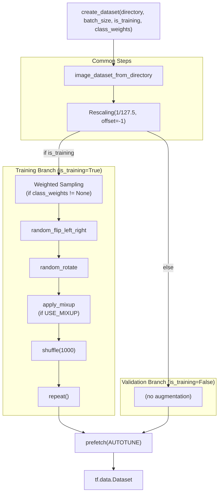

**Sources:** [kaggle-notebook.ipynb:212-286](../kaggle-notebook.ipynb#L212-L286), [train.py:212-286](../train.py#L212-L286)

---

## Steps Per Epoch Calculation

The `ProgressiveTrainer.train_stage` method ([kaggle-notebook.ipynb:493-494](../kaggle-notebook.ipynb#L493-L494), [train.py:493-494](../train.py#L493-L494)) calculates training steps:

```python
total_train = sum(self.class_counts.values()) * 2  # Account for oversampling
steps_per_epoch = max(1, total_train // batch_size)
```

**Example Calculation:**
- Original training samples: 1309
- After 2× weighted sampling: 2618
- Batch size: 32
- **Steps per epoch: 81**

This ensures each epoch sees the full resampled dataset, including all minority class duplicates.

**Sources:** [kaggle-notebook.ipynb:493-494](../kaggle-notebook.ipynb#L493-L494), [train.py:493-494](../train.py#L493-L494)

---

## Configuration Parameters

All augmentation behavior is controlled by the `Config` class ([kaggle-notebook.ipynb:28-65](../kaggle-notebook.ipynb#L28-L65), [train.py:28-65](../train.py#L28-L65)):

### Augmentation Parameters

| Parameter | Default | Description |
|-----------|---------|-------------|
| `BATCH_SIZE` | 32 | Batch size (reduced for T4 GPU stability) |
| `USE_CLASS_WEIGHTS` | `True` | Enable weighted sampling |
| `USE_MIXUP` | `True` | Enable MixUp augmentation |
| `MIXUP_ALPHA` | 0.2 | MixUp blending range [0.2, 0.8] |
| `RANDOM_SEED` | 42 | Reproducible dataset shuffling |

### Progressive Resizing Interaction

The `DataPipeline` is instantiated separately for each progressive stage:

```python
# Stage 1: 128×128
pipeline = DataPipeline(128, num_classes)
train_ds = pipeline.create_dataset(train_dir, 32, is_training=True)

# Stage 2: 160×160
pipeline = DataPipeline(160, num_classes)
train_ds = pipeline.create_dataset(train_dir, 32, is_training=True)

# Stage 3: 224×224
pipeline = DataPipeline(224, num_classes)
train_ds = pipeline.create_dataset(train_dir, 32, is_training=True)
```

This allows image loading to occur at the correct resolution for each stage, minimizing interpolation artifacts.

**Sources:** [kaggle-notebook.ipynb:28-65](../kaggle-notebook.ipynb#L28-L65), [train.py:28-65](../train.py#L28-L65), [kaggle-notebook.ipynb:479](../kaggle-notebook.ipynb#L479), [train.py:479](../train.py#L479)

---

## Summary of Pipeline Components

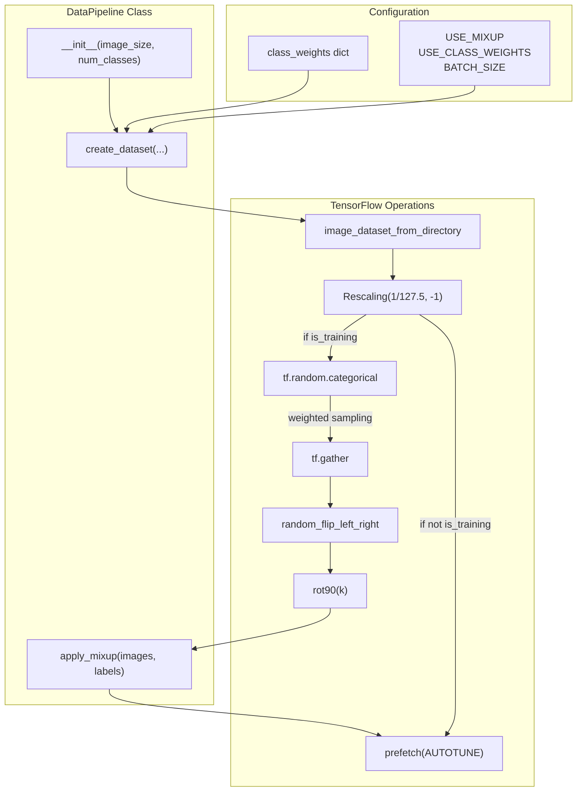

**Key Architectural Points:**
1. **Single class, dual modes**: Training and validation use the same `DataPipeline` class with conditional logic
2. **Memory trade-off**: Weighted sampling loads full dataset into GPU memory for better class balance
3. **Optimization-first design**: Heavy use of `AUTOTUNE`, `@tf.function`, and `prefetch` for maximum throughput
4. **MixUp at batch level**: Applied after geometric augmentations for efficient GPU execution
5. **Progressive-aware**: Image size is a constructor parameter, allowing easy integration with curriculum learning

**Sources:** [kaggle-notebook.ipynb:156-286](../kaggle-notebook.ipynb#L156-L286), [train.py:156-286](../train.py#L156-L286)

# Kaggle Notebook Implementation


## Purpose and Scope

This document describes the Jupyter notebook implementation (`kaggle-notebook.ipynb`) used for interactive development and experimentation in the Kaggle environment. The notebook serves as the primary training artifact that prototypes the model architecture, training strategy, and evaluation framework before production deployment. 

For details on the underlying model architecture, see [Model Architecture](./Model_Architecture.md#2.1). For the progressive training methodology, see [Progressive Training Strategy](./Progressive_Training_Strategy.md#2.2). For the production script version, see [Production Training Script (train.py)](#2.5).

---

## Notebook Structure Overview

The `kaggle-notebook.ipynb` contains two primary execution cells that implement a complete training-to-evaluation pipeline. The notebook is designed for the Kaggle environment with specific hardware constraints (NVIDIA Tesla T4 GPU) and platform-specific optimizations.

### Notebook Components

```mermaid
graph TB
    subgraph "Cell 1: Training Pipeline"
        IMPORTS["Imports & Environment Setup<br/>[lines 15-35]"]
        CONFIG["Config Class<br/>[lines 42-80]"]
        COMBINE["combine_validation_sets()<br/>[lines 87-130]"]
        SEBLOCK["SEBlock Layer<br/>[lines 137-155]"]
        DATAPIPE["DataPipeline Class<br/>[lines 162-324]"]
        FOCAL["FocalLoss<br/>[lines 331-354]"]
        BUILDMODEL["build_model()<br/>[lines 361-407]"]
        WARMUP["warmup_gpu()<br/>[lines 414-420]"]
        TRAINER["ProgressiveTrainer<br/>[lines 427-653]"]
        MAIN1["main()<br/>[lines 660-723]"]
    end
    
    subgraph "Cell 2: Evaluation Pipeline"
        EVALCONFIG["Config Class (Eval)<br/>[lines 733-747]"]
        EVALSE["SEBlock (duplicate)<br/>[lines 754-772]"]
        EVALFOCAL["FocalLoss (duplicate)<br/>[lines 775-787]"]
        TESTPIPE["TestDataPipeline<br/>[lines 794-816]"]
        TEST1["test_confusion_matrix()<br/>[lines 823-907]"]
        TEST2["test_generalization_gap()<br/>[lines 914-1004]"]
        TEST3["test_confidence_distribution()<br/>[lines 1011-1115]"]
        TEST4["test_noise_robustness()<br/>[lines 1122-1201]"]
        TEST5["test_prediction_entropy()<br/>[lines 1208-1277]"]
        REPORT["generate_final_report()<br/>[lines 1284-1339]"]
        MAIN2["main() (eval)<br/>[lines 1346-1408]"]
    end
    
    IMPORTS --> CONFIG
    CONFIG --> COMBINE
    COMBINE --> SEBLOCK
    SEBLOCK --> DATAPIPE
    DATAPIPE --> FOCAL
    FOCAL --> BUILDMODEL
    BUILDMODEL --> WARMUP
    WARMUP --> TRAINER
    TRAINER --> MAIN1
    
    MAIN1 -.model output.-> EVALCONFIG
    EVALCONFIG --> EVALSE
    EVALSE --> EVALFOCAL
    EVALFOCAL --> TESTPIPE
    TESTPIPE --> TEST1
    TEST1 --> TEST2
    TEST2 --> TEST3
    TEST3 --> TEST4
    TEST4 --> TEST5
    TEST5 --> REPORT
    REPORT --> MAIN2
```

**Sources**: [kaggle-notebook.ipynb:1-1408](../kaggle-notebook.ipynb#L1-L1408)

---

## Kaggle Environment Configuration

The notebook begins with environment-specific setup to handle Kaggle platform constraints, including XLA compilation timeouts and TensorFlow logging verbosity.

### Environment Variables and Warnings Suppression

[kaggle-notebook.ipynb:15-35](../kaggle-notebook.ipynb#L15-L35) establishes the execution environment:

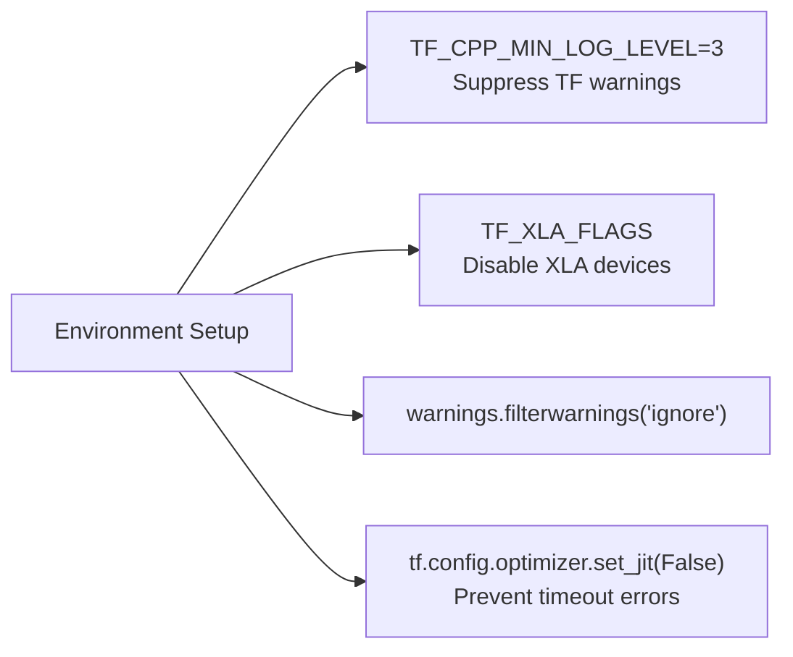

The critical configuration `tf.config.optimizer.set_jit(False)` at [kaggle-notebook.ipynb:34](../kaggle-notebook.ipynb#L34) prevents XLA compilation timeouts that occur on Kaggle's T4 GPUs during long training runs.

**Sources**: [kaggle-notebook.ipynb:15-35](../kaggle-notebook.ipynb#L15-L35)

---

## Configuration Architecture

The `Config` class [kaggle-notebook.ipynb:42-80](../kaggle-notebook.ipynb#L42-L80) defines all hyperparameters and paths using Kaggle's input/output directory structure.

### Path Configuration

| Configuration | Value | Purpose |
|--------------|-------|---------|
| `DATASET_ROOT` | `/kaggle/input/dataset/dataset` | Kaggle dataset mount point |
| `TRAIN_DIR` | `{DATASET_ROOT}/train` | Training images |
| `VAL_DIR` | `{DATASET_ROOT}/val` | Validation images |
| `TEST_DIR` | `{DATASET_ROOT}/test` | Test images |
| `OUTPUT_DIR` | `/kaggle/working/prototype_b_optimized` | Writable output directory |
| `MODEL_DIR` | `{OUTPUT_DIR}/models` | Model checkpoints |
| `COMBINED_VAL_DIR` | `/kaggle/working/combined_validation_optimized` | Merged val+test set |

### Training Parameters

| Parameter | Value | Justification |
|-----------|-------|---------------|
| `PROGRESSIVE_SIZES` | `[128, 160, 224]` | Reduced stages for stability |
| `PROGRESSIVE_EPOCHS` | `[20, 25, 35]` | Conservative epoch counts |
| `INITIAL_LR` | `1e-3` | Conservative to avoid instability |
| `FINE_TUNE_LR` | `5e-5` | Very low for fine-tuning |
| `BATCH_SIZE` | `32` | Reduced for T4 GPU memory |
| `FOCAL_GAMMA` | `1.5` | Focal loss focusing parameter |
| `MIXUP_ALPHA` | `0.2` | MixUp interpolation strength |

**Sources**: [kaggle-notebook.ipynb:42-80](../kaggle-notebook.ipynb#L42-L80)

---

## Dataset Combination Strategy

The `combine_validation_sets()` function [kaggle-notebook.ipynb:87-130](../kaggle-notebook.ipynb#L87-L130) implements stratified sampling to create a unified validation set from both `val/` and `test/` directories, addressing the limited validation data available in the Kaggle dataset.

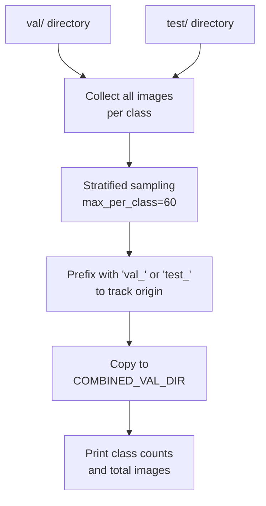

This function returns a `class_counts` dictionary used for computing class weights in the training pipeline.

**Sources**: [kaggle-notebook.ipynb:87-130](../kaggle-notebook.ipynb#L87-L130)

---

## Core Training Components

The notebook implements the complete training architecture through several interconnected classes that are also documented in related pages.

### Component Dependency Map

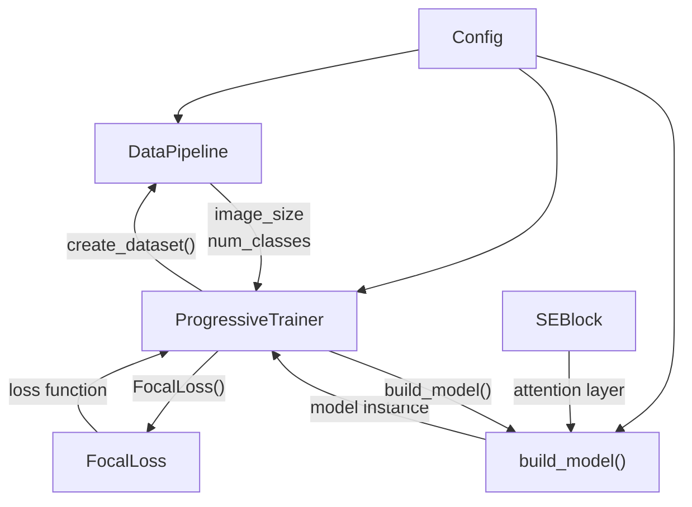

**Sources**: [kaggle-notebook.ipynb:137-653](../kaggle-notebook.ipynb#L137-L653)

### GPU Warmup Function

The `warmup_gpu()` function [kaggle-notebook.ipynb:414-420](../kaggle-notebook.ipynb#L414-L420) is a Kaggle-specific optimization that prevents first-batch compilation overhead:

```python
def warmup_gpu(model, image_size, batch_size=8):
    """Minimal GPU warmup"""
    dummy_data = tf.random.normal([batch_size, image_size, image_size, 1])
    _ = model(dummy_data, training=False)
    print("✓ GPU warmup complete")
```

This is called before each training stage at [kaggle-notebook.ipynb:523](../kaggle-notebook.ipynb#L523) to ensure consistent timing.

**Sources**: [kaggle-notebook.ipynb:414-420](../kaggle-notebook.ipynb#L414-L420), [kaggle-notebook.ipynb:523](../kaggle-notebook.ipynb#L523)

---

## Progressive Training Execution

The `ProgressiveTrainer` class [kaggle-notebook.ipynb:427-653](../kaggle-notebook.ipynb#L427-L653) orchestrates the multi-stage training process with Kaggle-specific adaptations.

### Training Stage Flow

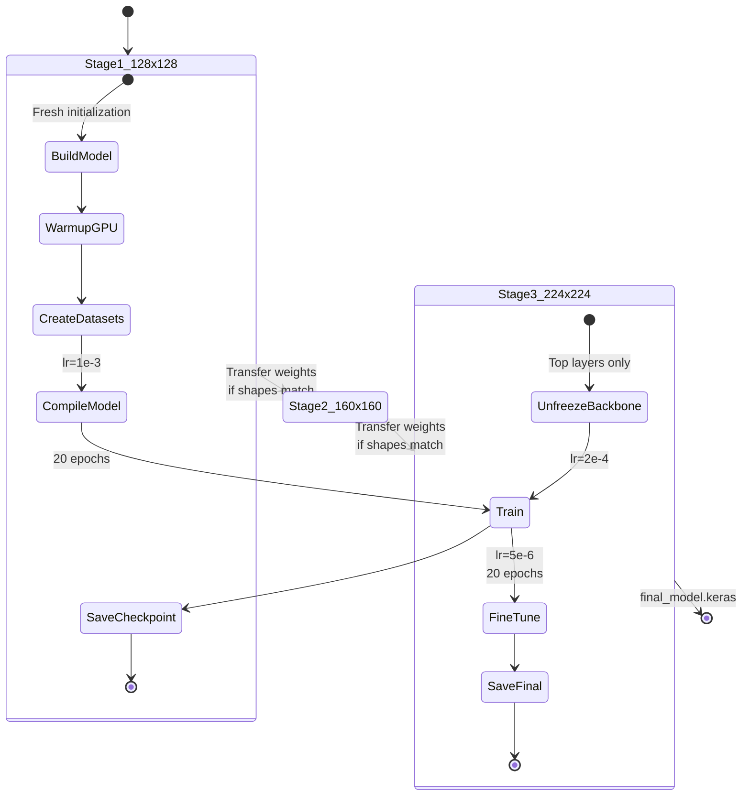

### Weight Transfer Logic

The notebook implements careful weight transfer between stages at [kaggle-notebook.ipynb:477-502](../kaggle-notebook.ipynb#L477-L502):

1. **Save previous weights**: `prev_weights = prev_model.get_weights()`
2. **Build new model**: `model, base = build_model(...)`
3. **Check shape compatibility**: Verify `len(prev_weights) == len(current_weights)` and all shapes match
4. **Transfer if compatible**: `model.set_weights(prev_weights)`
5. **Fall back to fresh weights**: If shapes don't match, use ImageNet initialization

**Sources**: [kaggle-notebook.ipynb:427-653](../kaggle-notebook.ipynb#L427-L653), [kaggle-notebook.ipynb:477-502](../kaggle-notebook.ipynb#L477-L502)

---

## Integrated Evaluation Framework

Unlike the production script, the Kaggle notebook includes a complete evaluation pipeline in the second cell [kaggle-notebook.ipynb:727-1408](../kaggle-notebook.ipynb#L727-L1408). This allows interactive assessment of trained models within the same environment.

### Evaluation Architecture

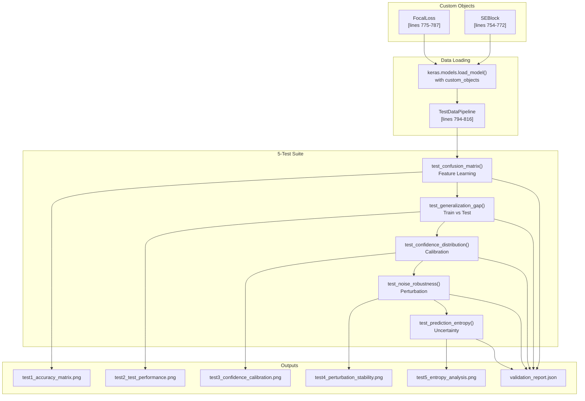

The evaluation section duplicates the `SEBlock` and `FocalLoss` definitions because they are required as `custom_objects` when loading the trained model with `keras.models.load_model()` at [kaggle-notebook.ipynb:1362-1365](../kaggle-notebook.ipynb#L1362-L1365).

**Sources**: [kaggle-notebook.ipynb:727-1408](../kaggle-notebook.ipynb#L727-L1408)

### Test Functions Overview

| Test Function | Lines | Purpose | Output File |
|--------------|-------|---------|-------------|
| `test_confusion_matrix()` | 823-907 | Validate semantic feature learning | `test1_accuracy_matrix.png` |
| `test_generalization_gap()` | 914-1004 | Compare train vs test performance | `test2_test_performance.png` |
| `test_confidence_distribution()` | 1011-1115 | Analyze prediction calibration | `test3_confidence_calibration.png` |
| `test_noise_robustness()` | 1122-1201 | Test stability under perturbation | `test4_perturbation_stability.png` |
| `test_prediction_entropy()` | 1208-1277 | Quantify uncertainty | `test5_entropy_analysis.png` |
| `generate_final_report()` | 1284-1339 | Aggregate scores and verdict | `validation_report.json` |

For detailed documentation of each test, see [Model Evaluation Framework](./Model_Evaluation_Framework.md#4).

**Sources**: [kaggle-notebook.ipynb:823-1339](../kaggle-notebook.ipynb#L823-L1339)

---

## Kaggle-Specific Optimizations

The notebook implements several optimizations tailored to Kaggle's environment constraints.

### Memory and Performance Optimizations

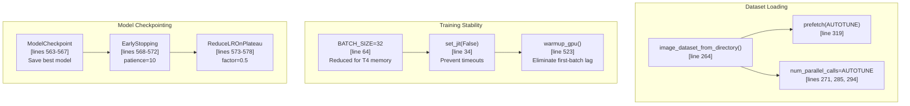

### Critical Optimizations Explained

1. **XLA Disabled** [kaggle-notebook.ipynb:34](../kaggle-notebook.ipynb#L34): `tf.config.optimizer.set_jit(False)` prevents XLA graph compilation timeouts on Kaggle's T4 GPUs, which occur after ~30 minutes of training.

2. **GPU Warmup** [kaggle-notebook.ipynb:523](../kaggle-notebook.ipynb#L523): Forces CUDA kernel compilation before training begins, eliminating the 2-3 minute first-batch overhead.

3. **Reduced Batch Size** [kaggle-notebook.ipynb:64](../kaggle-notebook.ipynb#L64): `BATCH_SIZE=32` instead of 64 ensures stable memory usage on 16GB T4 GPUs with MixUp augmentation.

4. **tf.data.AUTOTUNE** [kaggle-notebook.ipynb:267,285,294,319](): Lets TensorFlow dynamically optimize parallelism and prefetching.

5. **Conservative Learning Rates** [kaggle-notebook.ipynb:55-56](../kaggle-notebook.ipynb#L55-L56): `INITIAL_LR=1e-3` and `FINE_TUNE_LR=5e-5` prevent training instability observed at higher rates in Kaggle environment.

**Sources**: [kaggle-notebook.ipynb:34](../kaggle-notebook.ipynb#L34), [kaggle-notebook.ipynb:64](../kaggle-notebook.ipynb#L64), [kaggle-notebook.ipynb:523](../kaggle-notebook.ipynb#L523)

---

## Main Execution Flow

The training main function [kaggle-notebook.ipynb:660-723](../kaggle-notebook.ipynb#L660-L723) orchestrates the complete pipeline.

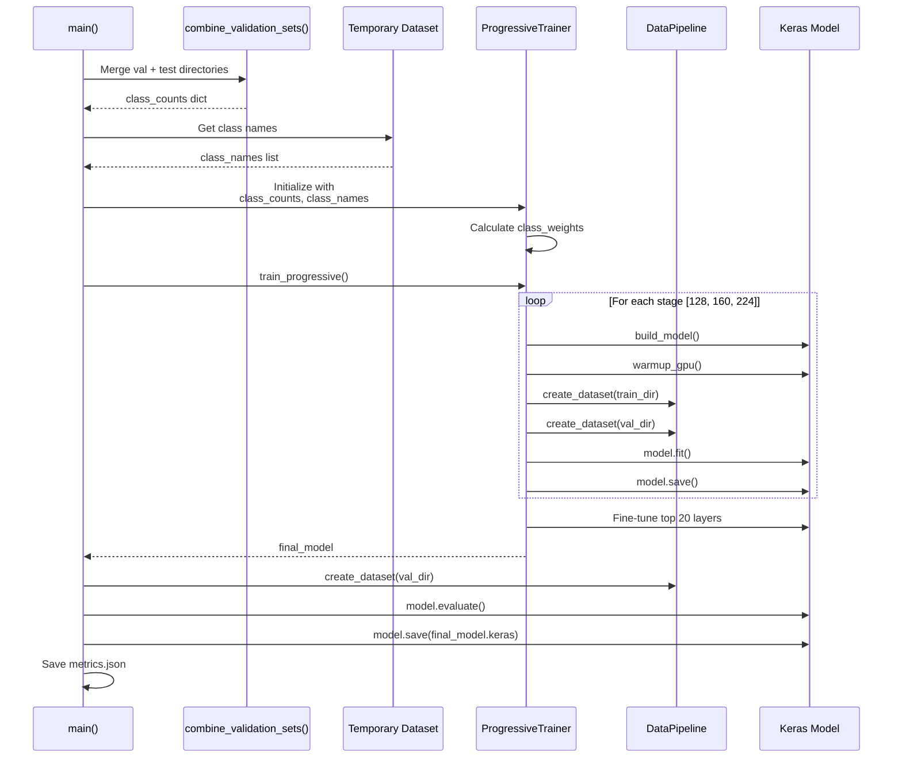

### Output Artifacts

The notebook produces the following outputs in `/kaggle/working/`:

| Artifact | Path | Purpose |
|----------|------|---------|
| Stage checkpoints | `models/stage_{128,160,224}.keras` | Intermediate models |
| Best stage models | `models/checkpoint_{128,160,224}.keras` | Best validation accuracy per stage |
| Final fine-tuned model | `models/final_best.keras` | After top-layer fine-tuning |
| Production model | `models/final_model.keras` | Final saved model |
| Training metrics | `results/metrics.json` | Accuracy, precision, recall |

**Sources**: [kaggle-notebook.ipynb:660-723](../kaggle-notebook.ipynb#L660-L723)

---

## Evaluation Execution Flow

The evaluation main function [kaggle-notebook.ipynb:1346-1408](../kaggle-notebook.ipynb#L1346-L1408) runs the 5-test validation suite.

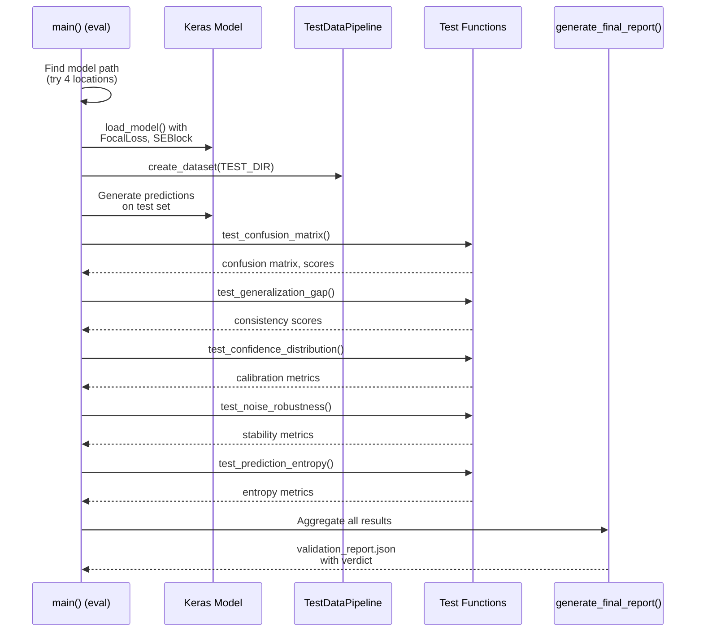

The evaluation section automatically searches for the trained model in multiple locations:
1. `/kaggle/input/test2/final_best.keras` (manually uploaded model)
2. `/kaggle/working/prototype_b_optimized/models/final_model.keras`
3. `/kaggle/working/prototype_b_optimized/models/stage_224.keras`
4. `/kaggle/working/prototype_b_optimized/models/checkpoint_224.keras`

This flexibility allows evaluation of models from the current run or previous Kaggle notebook versions.

**Sources**: [kaggle-notebook.ipynb:1346-1408](../kaggle-notebook.ipynb#L1346-L1408), [kaggle-notebook.ipynb:1351-1360](../kaggle-notebook.ipynb#L1351-L1360)

---

## Interactive Features

The notebook format provides several advantages over the production script for development and experimentation:

### Kaggle-Specific Interactive Capabilities

1. **Cell-by-Cell Execution**: Training and evaluation can be run independently by executing different cells.

2. **Output Preservation**: All print statements, progress bars, and metrics are preserved in the notebook output at [kaggle-notebook.ipynb output cells]().

3. **Direct Visualization**: Generated PNG plots are displayed inline below the evaluation cell.

4. **Dataset Inspection**: The initial cell at [kaggle-notebook.ipynb:1](../kaggle-notebook.ipynb#L1) lists available Kaggle datasets: `os.listdir('/kaggle/input/')`.

5. **Incremental Development**: Code can be modified and re-executed without restarting the entire training pipeline.

6. **Version Tracking**: Kaggle automatically versions notebook runs, allowing comparison of different hyperparameter configurations.

### Training Progress Output

The notebook prints structured progress information: