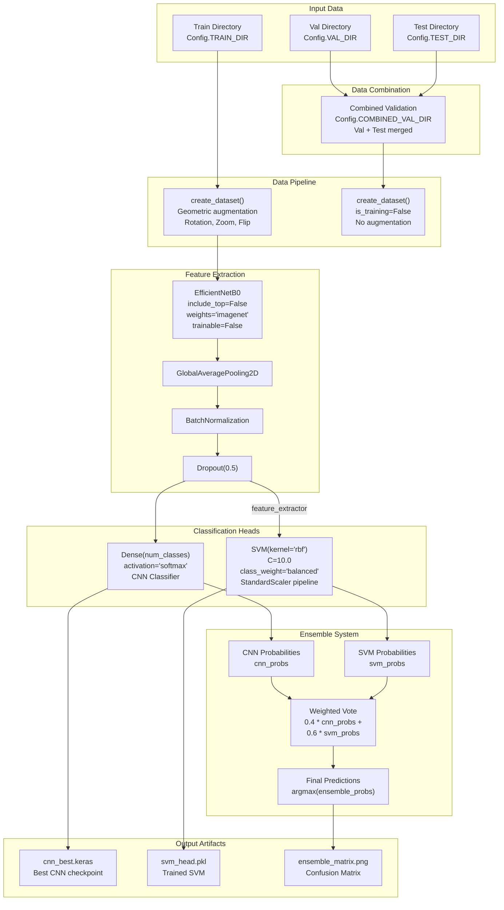
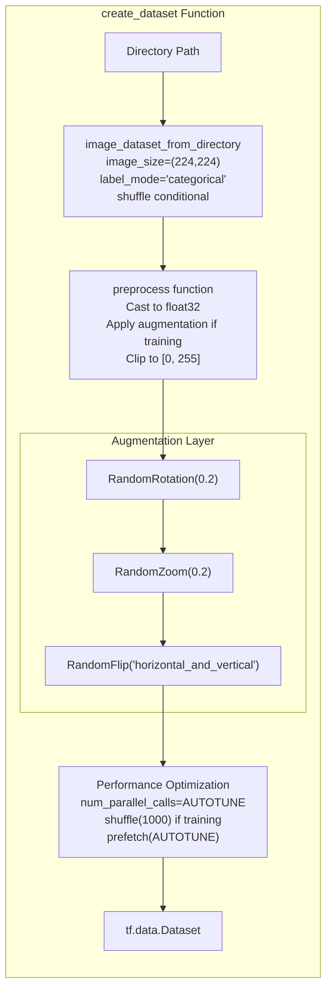
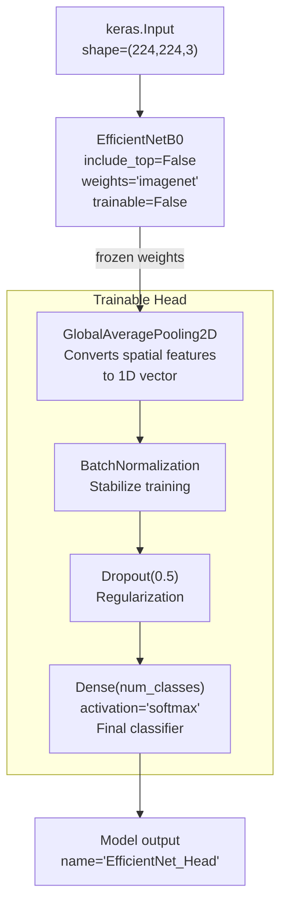
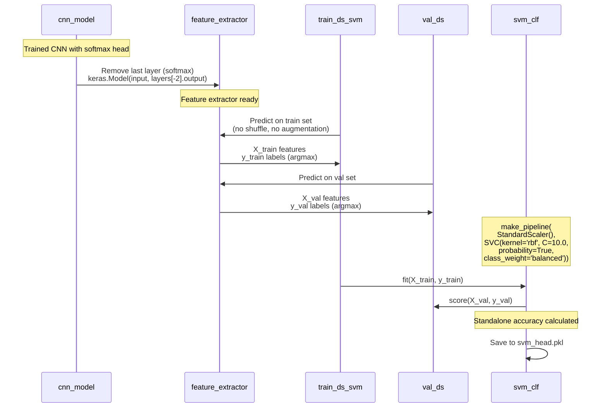
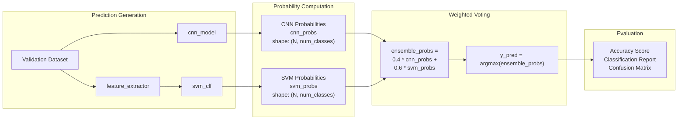
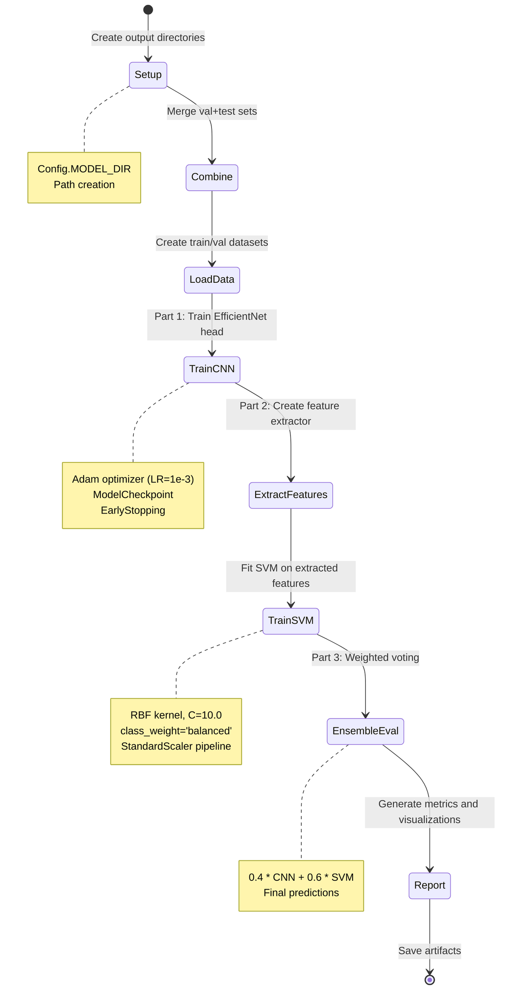

## Purpose and Scope

This document describes the CNN-SVM ensemble training approach implemented in [Previous_training_scripts/train1.py:1-220](../Previous_training_scripts/train1.py#L1-L220). This script represents an alternative training method that combines deep learning feature extraction with classical machine learning classification. The approach trains a frozen EfficientNetB0 backbone for feature extraction, then trains two separate classifiers: a neural network head and an SVM classifier. Final predictions are made through weighted voting (40% CNN + 60% SVM), with the SVM receiving higher weight due to its expected robustness on the extracted features.

For the current production training approach, see [Core Training System](#2). For the class-balanced two-phase training method, see [Two-Phase Training with Class Balancing (train2.py)](#5.1).

**Sources:** [Previous_training_scripts/train1.py:1-220](../Previous_training_scripts/train1.py#L1-L220)

---

## System Architecture Overview

The train1.py system implements a hybrid architecture that separates feature learning from classification. This design philosophy treats the EfficientNetB0 backbone as a feature extractor and trains two independent classification heads that vote on final predictions.

**Diagram: CNN-SVM Ensemble Architecture with Code Entities**

**Sources:** [Previous_training_scripts/train1.py:82-96](../Previous_training_scripts/train1.py#L82-L96), [Previous_training_scripts/train1.py:157-176](../Previous_training_scripts/train1.py#L157-L176), [Previous_training_scripts/train1.py:184-196](../Previous_training_scripts/train1.py#L184-L196)

---

## Configuration System

The `Config` class centralizes all hyperparameters and directory paths for the training pipeline. This configuration is designed for execution in the Kaggle environment with high-quality training settings.

| Parameter | Value | Purpose |
|-----------|-------|---------|
| `DATASET_ROOT` | `/kaggle/input/dataset/dataset` | Base directory for input data |
| `TRAIN_DIR` | `{DATASET_ROOT}/train` | Training images directory |
| `VAL_DIR` | `{DATASET_ROOT}/val` | Validation images directory |
| `TEST_DIR` | `{DATASET_ROOT}/test` | Test images directory |
| `COMBINED_VAL_DIR` | `/kaggle/working/combined_validation_server` | Merged val+test for robust evaluation |
| `OUTPUT_DIR` | `/kaggle/working/prototype_g_server` | Output directory for all artifacts |
| `MODEL_DIR` | `{OUTPUT_DIR}/models` | Saved model checkpoints |
| `INPUT_SHAPE` | `(224, 224, 3)` | Input image dimensions (RGB) |
| `BATCH_SIZE` | 32 | Batch size for training |
| `EPOCHS` | 20 | Maximum training epochs |
| `LR` | 1e-3 | Initial learning rate |
| `RANDOM_SEED` | 42 | Reproducibility seed |

The configuration includes a unique approach of combining validation and test sets into `COMBINED_VAL_DIR` for more robust scoring during ensemble evaluation [Previous_training_scripts/train1.py:108-119](../Previous_training_scripts/train1.py#L108-L119).

**Sources:** [Previous_training_scripts/train1.py:26-41](../Previous_training_scripts/train1.py#L26-L41)

---

## Data Pipeline Architecture

The data pipeline implements conservative augmentation strategies suitable for defect detection, avoiding aggressive augmentation that might alter defect characteristics.

**Diagram: Data Pipeline Function Flow**

The `create_dataset` function [Previous_training_scripts/train1.py:47-76](../Previous_training_scripts/train1.py#L47-L76) creates a `tf.data.Dataset` with the following characteristics:

1. **Image Loading**: Uses `tf.keras.utils.image_dataset_from_directory` to load images at 224×224 resolution with categorical labels
2. **Geometric-Only Augmentation**: Applies rotation (±20%), zoom (±20%), and horizontal/vertical flips only during training
3. **EfficientNet Preprocessing**: Maintains [0-255] range as EfficientNet handles normalization internally [Previous_training_scripts/train1.py:68-69](../Previous_training_scripts/train1.py#L68-L69)
4. **Conditional Behavior**: Training datasets apply augmentation and shuffling with repeat, while validation/test datasets use deterministic ordering

**Key Design Decision**: The comment "Geometric Augmentation Only (Safe for Defects)" [Previous_training_scripts/train1.py:57](../Previous_training_scripts/train1.py#L57) indicates that color-based or intensity-based augmentations are deliberately avoided to preserve defect characteristics.

**Sources:** [Previous_training_scripts/train1.py:47-76](../Previous_training_scripts/train1.py#L47-L76)

---

## Two-Stage Training Process

The training process is divided into two sequential stages: CNN training followed by SVM training. This separation allows independent optimization of each classifier before ensemble combination.

### Stage 1: CNN Training with Frozen EfficientNet

The `build_cnn` function [Previous_training_scripts/train1.py:82-96](../Previous_training_scripts/train1.py#L82-L96) constructs a classifier with a frozen feature extractor:

**Diagram: CNN Architecture with Frozen Backbone**

The CNN is trained with:
- **Optimizer**: Adam with learning rate 1e-3
- **Loss Function**: Categorical crossentropy
- **Callbacks**: ModelCheckpoint (saves best model to `cnn_best.keras`), EarlyStopping (patience=5)
- **Frozen Backbone**: EfficientNetB0 weights remain fixed, only the head layers are trained [Previous_training_scripts/train1.py:86-87](../Previous_training_scripts/train1.py#L86-L87)

This approach allows rapid training by only optimizing a small number of parameters in the classification head while leveraging pretrained ImageNet features.

**Sources:** [Previous_training_scripts/train1.py:82-96](../Previous_training_scripts/train1.py#L82-L96), [Previous_training_scripts/train1.py:132-151](../Previous_training_scripts/train1.py#L132-L151)

### Stage 2: SVM Training on Extracted Features

After CNN training, the system creates a feature extractor by removing the final softmax layer and trains an SVM classifier on the extracted features.

**Diagram: SVM Training Sequence**

The SVM training process [Previous_training_scripts/train1.py:153-182](../Previous_training_scripts/train1.py#L153-L182) involves:

1. **Feature Extractor Creation**: Removes the softmax layer from the trained CNN to create a feature extraction model [Previous_training_scripts/train1.py:157](../Previous_training_scripts/train1.py#L157)
2. **Feature Extraction**: 
   - Creates a non-shuffled, non-augmented training dataset [Previous_training_scripts/train1.py:162](../Previous_training_scripts/train1.py#L162)
   - Predicts features for all training samples [Previous_training_scripts/train1.py:164](../Previous_training_scripts/train1.py#L164)
   - Extracts features from validation set [Previous_training_scripts/train1.py:169](../Previous_training_scripts/train1.py#L169)
   - Converts one-hot labels to class indices using `argmax` [Previous_training_scripts/train1.py:166,171](../Previous_training_scripts/train1.py#L166)
3. **SVM Training**: Fits an SVM with RBF kernel (C=10.0) wrapped in a StandardScaler pipeline [Previous_training_scripts/train1.py:175](../Previous_training_scripts/train1.py#L175)
4. **SVM Configuration**:
   - `kernel='rbf'`: Radial basis function kernel for non-linear decision boundaries
   - `C=10.0`: Regularization parameter
   - `probability=True`: Enables probability estimates for ensemble voting
   - `class_weight='balanced'`: Compensates for class imbalance

The SVM achieves standalone accuracy on the validation set and is saved using `joblib` [Previous_training_scripts/train1.py:182](../Previous_training_scripts/train1.py#L182).

**Sources:** [Previous_training_scripts/train1.py:153-182](../Previous_training_scripts/train1.py#L153-L182)

---

## Ensemble Voting Mechanism

The ensemble combines predictions from both classifiers using weighted voting, with the SVM receiving higher weight based on the assumption that it performs better on the extracted features.

**Diagram: Ensemble Voting Pipeline**

The ensemble prediction process [Previous_training_scripts/train1.py:184-196](../Previous_training_scripts/train1.py#L184-L196) executes as follows:

1. **CNN Predictions**: Calls `cnn_model.predict()` on validation dataset to obtain probability distributions [Previous_training_scripts/train1.py:188](../Previous_training_scripts/train1.py#L188)
2. **SVM Predictions**: Calls `svm_clf.predict_proba()` on extracted features to obtain probability distributions [Previous_training_scripts/train1.py:191](../Previous_training_scripts/train1.py#L191)
3. **Weighted Combination**: Computes weighted average with 40% weight for CNN and 60% weight for SVM [Previous_training_scripts/train1.py:194](../Previous_training_scripts/train1.py#L194)
4. **Final Prediction**: Applies `argmax` to select the class with highest ensemble probability [Previous_training_scripts/train1.py:195](../Previous_training_scripts/train1.py#L195)

The 60/40 split favoring the SVM (referenced as "The 'Disqualified' Logic" in comments [Previous_training_scripts/train1.py:184](../Previous_training_scripts/train1.py#L184)) suggests that during experimentation, the SVM demonstrated superior performance on the extracted features compared to the neural network classifier.

**Sources:** [Previous_training_scripts/train1.py:184-196](../Previous_training_scripts/train1.py#L184-L196)

---

## Validation Set Combination Strategy

A unique aspect of this implementation is the combination of validation and test sets for ensemble evaluation, creating a larger and more robust validation dataset.

The combination process [Previous_training_scripts/train1.py:107-119](../Previous_training_scripts/train1.py#L107-L119):

1. **Directory Creation**: Creates `COMBINED_VAL_DIR` and removes it if it already exists
2. **File Copying**: Iterates through both `VAL_DIR` and `TEST_DIR`
3. **Class Structure Preservation**: Maintains class subdirectories in the combined directory
4. **Filename Prefixing**: Copies files with `copy_` prefix to avoid name collisions [Previous_training_scripts/train1.py:119](../Previous_training_scripts/train1.py#L119)

This approach provides more samples for ensemble evaluation, which is particularly valuable when the validation set is small or when seeking more stable performance metrics.

**Sources:** [Previous_training_scripts/train1.py:107-119](../Previous_training_scripts/train1.py#L107-L119)

---

## Output Artifacts and Reporting

The training process generates several artifacts for model persistence and performance evaluation:

### Model Artifacts

| Artifact | Location | Description |
|----------|----------|-------------|
| `cnn_best.keras` | `{MODEL_DIR}/cnn_best.keras` | Best CNN checkpoint based on validation accuracy |
| `svm_head.pkl` | `{MODEL_DIR}/svm_head.pkl` | Trained SVM classifier with StandardScaler pipeline |

### Evaluation Artifacts

The final reporting section [Previous_training_scripts/train1.py:197-216](../Previous_training_scripts/train1.py#L197-L216) generates:

1. **Ensemble Accuracy**: Overall accuracy score printed to console [Previous_training_scripts/train1.py:198-201](../Previous_training_scripts/train1.py#L198-L201)
2. **Classification Report**: Per-class precision, recall, and F1-score using `sklearn.metrics.classification_report` [Previous_training_scripts/train1.py:203-204](../Previous_training_scripts/train1.py#L203-L204)
3. **Confusion Matrix Visualization**: 
   - Generated using `seaborn.heatmap` with annotations [Previous_training_scripts/train1.py:207-209](../Previous_training_scripts/train1.py#L207-L209)
   - Saved to `{OUTPUT_DIR}/ensemble_matrix.png` [Previous_training_scripts/train1.py:213](../Previous_training_scripts/train1.py#L213)
   - Includes accuracy in the title [Previous_training_scripts/train1.py:210](../Previous_training_scripts/train1.py#L210)

The console output provides immediate feedback on ensemble performance, while the saved confusion matrix enables detailed analysis of per-class prediction patterns.

**Sources:** [Previous_training_scripts/train1.py:197-216](../Previous_training_scripts/train1.py#L197-L216)

---

## Execution Workflow

The `main()` function [Previous_training_scripts/train1.py:102-219](../Previous_training_scripts/train1.py#L102-L219) orchestrates the complete training pipeline:

**Diagram: Main Execution Workflow State Machine**

The execution is strictly sequential with no parallel training, ensuring deterministic behavior. The script prints progress messages at each major stage to provide execution visibility.

**Sources:** [Previous_training_scripts/train1.py:102-219](../Previous_training_scripts/train1.py#L102-L219)

---

## Design Philosophy and Trade-offs

### Advantages

1. **Hybrid Approach**: Combines deep learning feature extraction with classical ML classification
2. **Frozen Backbone**: Reduces training time and GPU memory requirements by only training the classifier heads
3. **SVM Robustness**: The RBF kernel SVM can learn complex decision boundaries in the feature space
4. **Ensemble Diversity**: Two fundamentally different classifiers (neural network vs. kernel method) provide complementary predictions
5. **Conservative Augmentation**: Geometric-only augmentation preserves defect characteristics

### Limitations

1. **No End-to-End Training**: Frozen backbone prevents feature adaptation to the wafer defect domain
2. **Fixed Ensemble Weights**: 40/60 split is hardcoded rather than learned or optimized
3. **Sequential Training**: Cannot leverage joint training of both classifiers
4. **Memory Requirements**: Must store extracted features for entire dataset in memory for SVM training
5. **Inference Complexity**: Requires maintaining two separate models and a feature extraction pipeline

This approach represents an intermediate stage in the evolution toward the current progressive training system documented in [Core Training System](#2), which uses end-to-end training with advanced loss functions and attention mechanisms.

**Sources:** [Previous_training_scripts/train1.py:1-220](../Previous_training_scripts/train1.py#L1-L220)