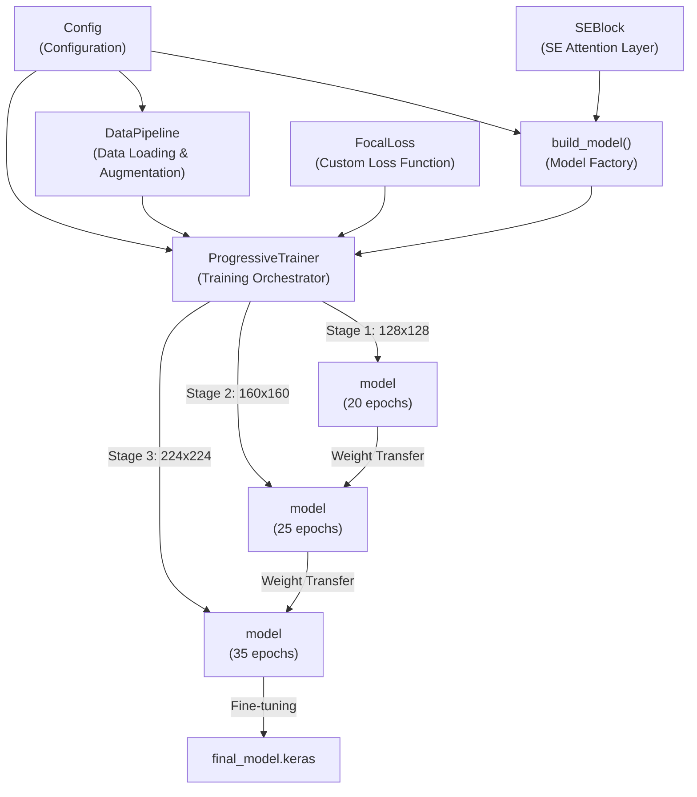
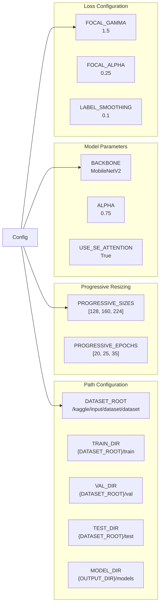
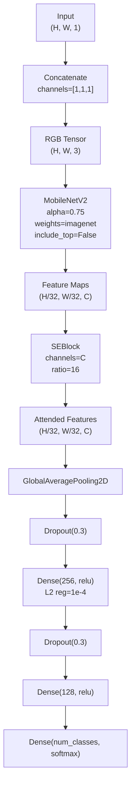
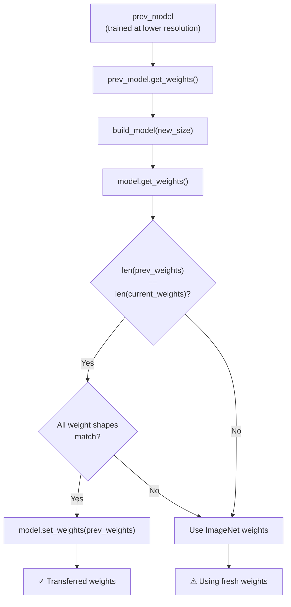

## Purpose and Scope

The Core Training System implements the production-ready approach for training wafer defect classification models using **progressive resizing**, **focal loss**, and **SE attention blocks**. This system represents the current state-of-the-art implementation, as opposed to the experimental approaches documented in [Alternative Training Approaches](./CNN-SVM_Ensemble_Approach_train1.py.md#5).

This document provides an overview of the training architecture, key components, and workflow orchestration. For detailed information about specific subsystems, see:
- [Model Architecture](./Model_Architecture.md#2.1) - MobileNetV2 backbone, SE attention, and classification head
- [Progressive Training Strategy](./Progressive_Training_Strategy.md#2.2) - Curriculum learning through staged resizing
- [Data Pipeline and Augmentation](./Data_Pipeline_and_Augmentation.md#2.3) - DataPipeline class and augmentation techniques
- [Kaggle Notebook Implementation](./Applied_via_Rescaling_layer.md#2.4) - Interactive development environment
- [Production Training Script](./Core_Training_System.md#2.5) - Standalone train.py execution

**Sources:** [kaggle-notebook.ipynb:1-700](../kaggle-notebook.ipynb#L1-L700), [train.py:1-702](../train.py#L1-L702)

---

## System Architecture

The Core Training System follows a modular architecture with five primary components that work together to train robust wafer defect classifiers:



**Component Locations:**

| Component | Purpose | Implementation |
|-----------|---------|----------------|
| `Config` | Centralized hyperparameters | [kaggle-notebook.ipynb:28-65](../kaggle-notebook.ipynb#L28-L65), [train.py:28-65](../train.py#L28-L65) |
| `SEBlock` | Squeeze-and-Excitation attention | [kaggle-notebook.ipynb:131-149](../kaggle-notebook.ipynb#L131-L149), [train.py:131-149](../train.py#L131-L149) |
| `DataPipeline` | tf.data pipeline with augmentation | [kaggle-notebook.ipynb:156-286](../kaggle-notebook.ipynb#L156-L286), [train.py:156-286](../train.py#L156-L286) |
| `FocalLoss` | Class-imbalance-aware loss | [kaggle-notebook.ipynb:293-321](../kaggle-notebook.ipynb#L293-L321), [train.py:293-321](../train.py#L293-L321) |
| `build_model()` | MobileNetV2 + SE + head | [kaggle-notebook.ipynb:328-366](../kaggle-notebook.ipynb#L328-L366), [train.py:328-366](../train.py#L328-L366) |
| `ProgressiveTrainer` | Multi-stage training orchestration | [kaggle-notebook.ipynb:384-627](../kaggle-notebook.ipynb#L384-L627), [train.py:384-627](../train.py#L384-L627) |
| `warmup_gpu()` | GPU initialization | [kaggle-notebook.ipynb:373-377](../kaggle-notebook.ipynb#L373-L377), [train.py:373-377](../train.py#L373-L377) |
| `combine_validation_sets()` | Val+Test combination | [kaggle-notebook.ipynb:72-124](../kaggle-notebook.ipynb#L72-L124), [train.py:72-124](../train.py#L72-L124) |

**Sources:** [kaggle-notebook.ipynb:1-700](../kaggle-notebook.ipynb#L1-L700), [train.py:1-702](../train.py#L1-L702)

---

## Configuration System

The `Config` class centralizes all hyperparameters, paths, and training settings. It uses class attributes (not instance attributes) to act as a global configuration namespace:



**Key Configuration Parameters:**

| Parameter | Value | Purpose |
|-----------|-------|---------|
| `PROGRESSIVE_SIZES` | `[128, 160, 224]` | Image resolutions for curriculum learning |
| `PROGRESSIVE_EPOCHS` | `[20, 25, 35]` | Epochs per stage (total 80 epochs) |
| `INITIAL_LR` | `1e-3` | Starting learning rate |
| `FINE_TUNE_LR` | `5e-5` | Learning rate for final fine-tuning |
| `BACKBONE` | `"MobileNetV2"` | Base architecture |
| `ALPHA` | `0.75` | MobileNetV2 width multiplier |
| `BATCH_SIZE` | `32` | Training batch size |
| `FOCAL_GAMMA` | `1.5` | Focal loss focusing parameter |
| `MIXUP_ALPHA` | `0.2` | MixUp augmentation strength |
| `USE_CLASS_WEIGHTS` | `True` | Enable inverse frequency weighting |

**Sources:** [kaggle-notebook.ipynb:28-65](../kaggle-notebook.ipynb#L28-L65), [train.py:28-65](../train.py#L28-L65)

---

## Progressive Training Workflow

The `ProgressiveTrainer` class orchestrates the multi-stage training process. Training progresses through three resolution stages with increasing model capacity and decreasing learning rates:

```mermaid
stateDiagram-v2
    [*] --> Init: ProgressiveTrainer.__init__()
    
    Init --> Stage1: train_stage(size=128, epochs=20, lr=1e-3)
    
    state Stage1 {
        [*] --> BuildModel1: build_model(128, use_se=True)
        BuildModel1 --> Warmup1: warmup_gpu(model, 128)
        Warmup1 --> CreateDS1: DataPipeline.create_dataset()
        CreateDS1 --> Compile1: model.compile(FocalLoss, Adam)
        Compile1 --> Fit1: model.fit(train_ds, val_ds)
        Fit1 --> Save1: model.save(stage_128.keras)
        Save1 --> [*]
    }
    
    Stage1 --> Stage2: train_stage(size=160, epochs=25, lr=5e-4)
    
    state Stage2 {
        [*] --> Transfer2: Transfer weights from 128x128 model
        Transfer2 --> Warmup2: warmup_gpu(model, 160)
        Warmup2 --> CreateDS2: DataPipeline.create_dataset()
        CreateDS2 --> Compile2: model.compile(FocalLoss, Adam)
        Compile2 --> Fit2: model.fit(train_ds, val_ds)
        Fit2 --> Save2: model.save(stage_160.keras)
        Save2 --> [*]
    }
    
    Stage2 --> Stage3: train_stage(size=224, epochs=35, lr=2e-4)
    
    state Stage3 {
        [*] --> Transfer3: Transfer weights from 160x160 model
        Transfer3 --> Unfreeze: Unfreeze top backbone layers
        Unfreeze --> Warmup3: warmup_gpu(model, 224)
        Warmup3 --> CreateDS3: DataPipeline.create_dataset()
        CreateDS3 --> Compile3: model.compile(FocalLoss, Adam)
        Compile3 --> Fit3: model.fit(train_ds, val_ds)
        Fit3 --> Save3: model.save(stage_224.keras)
        Save3 --> [*]
    }
    
    Stage3 --> FineTune: train_progressive() final tuning
    
    state FineTune {
        [*] --> UnfreezeMore: Unfreeze top 20 layers
        UnfreezeMore --> CompileFT: model.compile(lr=5e-6)
        CompileFT --> FitFT: model.fit(20 epochs, batch_size=16)
        FitFT --> SaveFinal: model.save(final_model.keras)
        SaveFinal --> [*]
    }
    
    FineTune --> [*]
```



**Training Stage Configuration:**

| Stage | Resolution | Epochs | Learning Rate | Backbone | Unfrozen Layers |
|-------|-----------|--------|---------------|----------|-----------------|
| 1 | 128×128 | 20 | 1e-3 | Frozen | None (feature extraction) |
| 2 | 160×160 | 25 | 5e-4 | Frozen | None (feature extraction) |
| 3 | 224×224 | 35 | 2e-4 | Partially | Top 54 layers (fine-tuning) |
| Final | 224×224 | 20 | 5e-6 | Partially | Top 20 layers (fine-tuning) |

**Sources:** [kaggle-notebook.ipynb:384-627](../kaggle-notebook.ipynb#L384-L627), [train.py:384-627](../train.py#L384-L627)

---

## Class Weighting Strategy

The `ProgressiveTrainer` automatically calculates inverse frequency class weights to address dataset imbalance:

**Weight Calculation:**

```python
total = sum(class_counts.values())
class_weights = {
    i: total / (num_classes * count) 
    for i, count in class_counts.items()
}
```

**Implementation:** [kaggle-notebook.ipynb:391-397](../kaggle-notebook.ipynb#L391-L397), [train.py:391-397](../train.py#L391-L397)

This ensures that minority classes receive higher loss contribution during training. The weights are applied through weighted sampling in `DataPipeline.create_dataset()` when `Config.USE_CLASS_WEIGHTS=True` [kaggle-notebook.ipynb:227-253](../kaggle-notebook.ipynb#L227-L253).

**Sources:** [kaggle-notebook.ipynb:384-397](../kaggle-notebook.ipynb#L384-L397), [train.py:384-397](../train.py#L384-L397)

---

## Model Building Process

The `build_model()` function constructs the complete architecture by assembling MobileNetV2 backbone, SE attention, and classification head:



**Architecture Specifications:**

| Component | Configuration | Location |
|-----------|--------------|----------|
| Input | (H, H, 1) grayscale | [kaggle-notebook.ipynb:331](../kaggle-notebook.ipynb#L331), [train.py:331](../train.py#L331) |
| Channel replication | Concatenate 3× | [kaggle-notebook.ipynb:334](../kaggle-notebook.ipynb#L334), [train.py:334](../train.py#L334) |
| Backbone | MobileNetV2(α=0.75) | [kaggle-notebook.ipynb:337-342](../kaggle-notebook.ipynb#L337-L342), [train.py:337-342](../train.py#L337-L342) |
| SE Attention | SEBlock(ratio=16) | [kaggle-notebook.ipynb:352-353](../kaggle-notebook.ipynb#L352-L353), [train.py:352-353](../train.py#L352-L353) |
| Head | GAP → FC(256) → FC(128) → FC(classes) | [kaggle-notebook.ipynb:356-362](../kaggle-notebook.ipynb#L356-L362), [train.py:356-362](../train.py#L356-L362) |
| Regularization | Dropout(0.3), L2(1e-4) | [kaggle-notebook.ipynb:357-360](../kaggle-notebook.ipynb#L357-L360), [train.py:357-360](../train.py#L357-L360) |

**Sources:** [kaggle-notebook.ipynb:328-366](../kaggle-notebook.ipynb#L328-L366), [train.py:328-366](../train.py#L328-L366)

---

## Data Pipeline Architecture

The `DataPipeline` class implements efficient data loading using `tf.keras.utils.image_dataset_from_directory` with custom augmentation and preprocessing:

```mermaid
graph LR
    Directory["train/<br/>├─ class1/<br/>├─ class2/<br/>└─ ..."]
    
    Load["image_dataset_from_directory<br/>grayscale, categorical"]
    
    subgraph "Training Pipeline"
        Rescale["Rescaling<br/>1/127.5, offset=-1"]
        Flip["random_flip_left_right"]
        Rotate["rot90(k=random[0,3])"]
        MixUp["apply_mixup<br/>alpha=0.2"]
        WeightedSample["Weighted Sampling<br/>using class_weights"]
        Shuffle["shuffle(1000)"]
        Repeat["repeat()"]
    end
    
    Prefetch["prefetch(AUTOTUNE)"]
    
    Directory --> Load
    Load --> WeightedSample
    WeightedSample --> Rescale
    Rescale --> Flip
    Flip --> Rotate
    Rotate --> MixUp
    MixUp --> Shuffle
    Shuffle --> Repeat
    Repeat --> Prefetch
```



**Pipeline Stages:**

| Stage | Operation | Training Only | Location |
|-------|-----------|---------------|----------|
| Loading | `image_dataset_from_directory()` | No | [kaggle-notebook.ipynb:216-224](../kaggle-notebook.ipynb#L216-L224) |
| Weighted Sampling | Inverse frequency sampling | Yes | [kaggle-notebook.ipynb:227-253](../kaggle-notebook.ipynb#L227-L253) |
| Normalization | Rescale to [-1, 1] | No | [kaggle-notebook.ipynb:256-258](../kaggle-notebook.ipynb#L256-L258) |
| Horizontal Flip | 50% probability | Yes | [kaggle-notebook.ipynb:262-265](../kaggle-notebook.ipynb#L262-L265) |
| Rotation | Random 0°/90°/180°/270° | Yes | [kaggle-notebook.ipynb:268-272](../kaggle-notebook.ipynb#L268-L272) |
| MixUp | Linear interpolation (α=0.2) | Yes | [kaggle-notebook.ipynb:275-279](../kaggle-notebook.ipynb#L275-L279) |
| Shuffling | Buffer size 1000 | Yes | [kaggle-notebook.ipynb:281](../kaggle-notebook.ipynb#L281) |
| Repeat | Infinite loop | Yes | [kaggle-notebook.ipynb:282](../kaggle-notebook.ipynb#L282) |
| Prefetch | Asynchronous loading | No | [kaggle-notebook.ipynb:284](../kaggle-notebook.ipynb#L284) |

**Sources:** [kaggle-notebook.ipynb:156-286](../kaggle-notebook.ipynb#L156-L286), [train.py:156-286](../train.py#L156-L286)

---

## Loss Function and Metrics

The system uses `FocalLoss` with label smoothing to handle class imbalance and prevent overconfidence:

**FocalLoss Formula:**

```
FL(p_t) = -α * (1 - p_t)^γ * log(p_t)

where:
  p_t = model's predicted probability for true class
  γ = 1.5 (focusing parameter)
  α = 0.25 (class balance weight)
  label_smoothing = 0.1
```

**Implementation Details:**

| Aspect | Value | Purpose |
|--------|-------|---------|
| Gamma (γ) | 1.5 | Down-weight easy examples |
| Alpha (α) | 0.25 | Class balance factor |
| Label Smoothing | 0.1 | Prevent overconfidence |
| Clipping | [1e-7, 1-1e-7] | Numerical stability |

**Training Metrics:**

The model is compiled with three metrics [kaggle-notebook.ipynb:499-507](../kaggle-notebook.ipynb#L499-L507):
- `accuracy`: Categorical accuracy
- `keras.metrics.Precision(name='prec')`: Per-class precision
- `keras.metrics.Recall(name='rec')`: Per-class recall

**Sources:** [kaggle-notebook.ipynb:293-321](../kaggle-notebook.ipynb#L293-L321), [train.py:293-321](../train.py#L293-L321)

---

## Callbacks and Checkpointing

The training loop uses three Keras callbacks for adaptive learning and model persistence:

**Callback Configuration:**

| Callback | Monitor | Parameters | Purpose |
|----------|---------|------------|---------|
| `ModelCheckpoint` | `val_accuracy` | `save_best_only=True` | Save best model per stage |
| `EarlyStopping` | `val_accuracy` | `patience=10, restore_best_weights=True` | Prevent overfitting |
| `ReduceLROnPlateau` | `val_loss` | `factor=0.5, patience=5, min_lr=1e-7` | Adaptive learning rate |

**Implementation:** [kaggle-notebook.ipynb:510-530](../kaggle-notebook.ipynb#L510-L530), [train.py:510-530](../train.py#L510-L530)

**Saved Model Artifacts:**

| File | Stage | Description |
|------|-------|-------------|
| `stage_128.keras` | 1 | After 128×128 training |
| `stage_160.keras` | 2 | After 160×160 training |
| `stage_224.keras` | 3 | After 224×224 training |
| `checkpoint_128.keras` | 1 | Checkpoint copy |
| `checkpoint_160.keras` | 2 | Checkpoint copy |
| `checkpoint_224.keras` | 3 | Checkpoint copy |
| `final_best.keras` | Final | After fine-tuning |
| `final_model.keras` | Final | Production model |

**Sources:** [kaggle-notebook.ipynb:510-569](../kaggle-notebook.ipynb#L510-L569), [train.py:510-569](../train.py#L510-L569)

---

## Implementation Variants

The Core Training System exists in two forms: an interactive Jupyter notebook for development and a standalone Python script for production execution.

**Comparison:**

| Aspect | kaggle-notebook.ipynb | train.py |
|--------|----------------------|----------|
| **Purpose** | Development, experimentation, visualization | Production training, automation |
| **Environment** | Kaggle Notebooks (interactive) | Any Python 3.x environment |
| **Execution** | Cell-by-cell | Single `python train.py` command |
| **GPU Detection** | Automatic (Kaggle T4) | Manual TF GPU setup |
| **Outputs** | Inline plots, printed metrics | File-based logs, saved models |
| **Debugging** | Interactive inspection | Print statements, logs |
| **Code Structure** | Identical core logic | Identical core logic |
| **Dependencies** | Pre-installed in Kaggle | Requires manual installation |

**Code Duplication:**

Both implementations contain **identical** implementations of:
- `Config` class [kaggle-notebook.ipynb:28-65](../kaggle-notebook.ipynb#L28-L65), [train.py:28-65](../train.py#L28-L65)
- `SEBlock` class [kaggle-notebook.ipynb:131-149](../kaggle-notebook.ipynb#L131-L149), [train.py:131-149](../train.py#L131-L149)
- `DataPipeline` class [kaggle-notebook.ipynb:156-286](../kaggle-notebook.ipynb#L156-L286), [train.py:156-286](../train.py#L156-L286)
- `FocalLoss` class [kaggle-notebook.ipynb:293-321](../kaggle-notebook.ipynb#L293-L321), [train.py:293-321](../train.py#L293-L321)
- `build_model()` function [kaggle-notebook.ipynb:328-366](../kaggle-notebook.ipynb#L328-L366), [train.py:328-366](../train.py#L328-L366)
- `ProgressiveTrainer` class [kaggle-notebook.ipynb:384-627](../kaggle-notebook.ipynb#L384-L627), [train.py:384-627](../train.py#L384-L627)

This duplication suggests a notebook-first development workflow where prototyping occurs in Jupyter, then code is copied to the production script.

**Sources:** [kaggle-notebook.ipynb:1-700](../kaggle-notebook.ipynb#L1-L700), [train.py:1-702](../train.py#L1-L702)

---

## Execution Entry Points

Both implementations follow the same main execution flow:

**Main Execution Sequence:**

1. **Setup** [kaggle-notebook.ipynb:636-639](../kaggle-notebook.ipynb#L636-L639), [train.py:636-639](../train.py#L636-L639)
   - Combine validation and test sets
   - Create output directories

2. **Initialization** [kaggle-notebook.ipynb:648-664](../kaggle-notebook.ipynb#L648-L664), [train.py:648-664](../train.py#L648-L664)
   - Load class names from dataset
   - Count samples per class
   - Calculate class weights

3. **Training** [kaggle-notebook.ipynb:667-668](../kaggle-notebook.ipynb#L667-L668), [train.py:667-668](../train.py#L667-L668)
   - Instantiate `ProgressiveTrainer`
   - Execute `train_progressive()` for all stages

4. **Evaluation** [kaggle-notebook.ipynb:671-685](../kaggle-notebook.ipynb#L671-L685), [train.py:671-685](../train.py#L671-L685)
   - Evaluate on combined validation set
   - Print final metrics (accuracy, precision, recall)

5. **Persistence** [kaggle-notebook.ipynb:687-696](../kaggle-notebook.ipynb#L687-L696), [train.py:687-696](../train.py#L687-L696)
   - Save `final_model.keras`
   - Write `metrics.json` with results

**Entry Point Code Pattern:**

```python
if __name__ == "__main__":
    main()
```

**Location:** [kaggle-notebook.ipynb:700](../kaggle-notebook.ipynb#L700), [train.py:700-701](../train.py#L700-L701)

**Sources:** [kaggle-notebook.ipynb:634-700](../kaggle-notebook.ipynb#L634-L700), [train.py:634-702](../train.py#L634-L702)

---

## GPU Optimization

The system includes several optimizations for Kaggle T4 GPU stability:

**GPU Configuration:**

| Setting | Value | Purpose | Location |
|---------|-------|---------|----------|
| `TF_CPP_MIN_LOG_LEVEL` | `'3'` | Suppress TensorFlow warnings | [kaggle-notebook.ipynb:17](../kaggle-notebook.ipynb#L17) |
| `TF_XLA_FLAGS` | `'--tf_xla_enable_xla_devices=false'` | Disable XLA to avoid timeouts | [kaggle-notebook.ipynb:18](../kaggle-notebook.ipynb#L18) |
| `tf.config.optimizer.set_jit(False)` | N/A | Disable JIT compilation | [kaggle-notebook.ipynb:22](../kaggle-notebook.ipynb#L22) |

**GPU Warmup:**

The `warmup_gpu()` function performs a dummy forward pass to initialize CUDA kernels before training [kaggle-notebook.ipynb:373-377](../kaggle-notebook.ipynb#L373-L377):

```python
def warmup_gpu(model, image_size, batch_size=8):
    """Minimal GPU warmup"""
    dummy_data = tf.random.normal([batch_size, image_size, image_size, 1])
    _ = model(dummy_data, training=False)
    print("✓ GPU warmup complete")
```

This prevents timeout errors during the first training batch.

**Sources:** [kaggle-notebook.ipynb:16-22](../kaggle-notebook.ipynb#L16-L22), [kaggle-notebook.ipynb:373-377](../kaggle-notebook.ipynb#L373-L377), [train.py:16-22](../train.py#L16-L22), [train.py:373-377](../train.py#L373-L377)

---

## Weight Transfer Between Stages

The progressive training strategy transfers learned weights from smaller to larger resolutions to accelerate convergence:

**Transfer Logic:**



**Implementation:** [kaggle-notebook.ipynb:430-457](../kaggle-notebook.ipynb#L430-L457), [train.py:430-457](../train.py#L430-L457)

Weight transfer succeeds when:
1. Previous model exists (`prev_model is not None`)
2. Layer count matches between models
3. All weight tensor shapes are identical

If transfer fails, the model initializes with ImageNet weights.

**Sources:** [kaggle-notebook.ipynb:406-460](../kaggle-notebook.ipynb#L406-L460), [train.py:406-460](../train.py#L406-L460)

---

## Output Artifacts

The training system produces multiple output files for model deployment and analysis:

**Directory Structure:**

```
{OUTPUT_DIR}/
├── models/
│   ├── stage_128.keras           # Stage 1 best model
│   ├── stage_160.keras           # Stage 2 best model
│   ├── stage_224.keras           # Stage 3 best model
│   ├── checkpoint_128.keras      # Stage 1 checkpoint
│   ├── checkpoint_160.keras      # Stage 2 checkpoint
│   ├── checkpoint_224.keras      # Stage 3 checkpoint
│   ├── final_best.keras          # Fine-tuning best model
│   └── final_model.keras         # Final production model
└── results/
    └── metrics.json              # Final evaluation metrics
```

**metrics.json Schema:**

```json
{
    "accuracy": 0.8521,
    "precision": 0.8432,
    "recall": 0.8298,
    "class_names": ["class1", "class2", ...]
}
```

**Sources:** [kaggle-notebook.ipynb:34-35](../kaggle-notebook.ipynb#L34-L35), [kaggle-notebook.ipynb:688-696](../kaggle-notebook.ipynb#L688-L696), [train.py:34-35](../train.py#L34-L35), [train.py:688-696](../train.py#L688-L696)