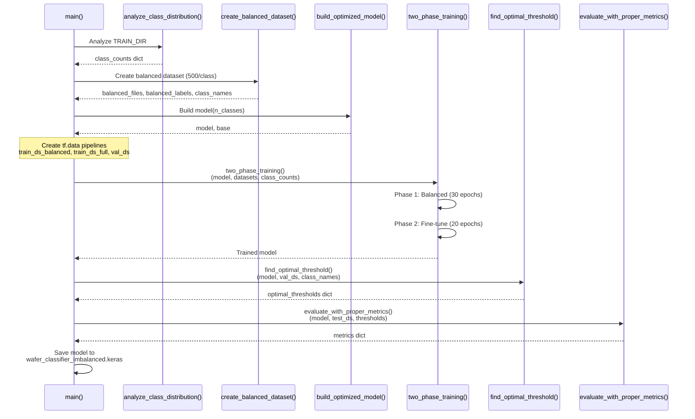

import tensorflow as tf                    # Model training, layers
import numpy as np                         # Array operations
from collections import Counter            # Class counting
from sklearn.utils.class_weight import compute_class_weight  # Class weight computation
from sklearn.metrics import (
    classification_report,                # Detailed metrics
    confusion_matrix,                     # Misclassification analysis
    precision_recall_fscore_support       # Per-class metrics
)
```

The script requires:
- TensorFlow 2.x with Keras API
- scikit-learn for metric computation
- NumPy for numerical operations
- Access to preprocessed grayscale images organized by class

**Sources:** [Previous_training_scripts/train2.py:1-5](), [Previous_training_scripts/train2.py:354](), [Previous_training_scripts/train2.py:401]()

---

## Execution Workflow

The main execution flow follows a linear pipeline:



The `main()` function [Previous_training_scripts/train2.py:503-531]() orchestrates the complete pipeline, though the actual dataset creation code (step 4 in the function) is omitted from the file, indicated by the comment `# ... (dataset creation code)` at line 517.

**Sources:** [Previous_training_scripts/train2.py:503-534]()