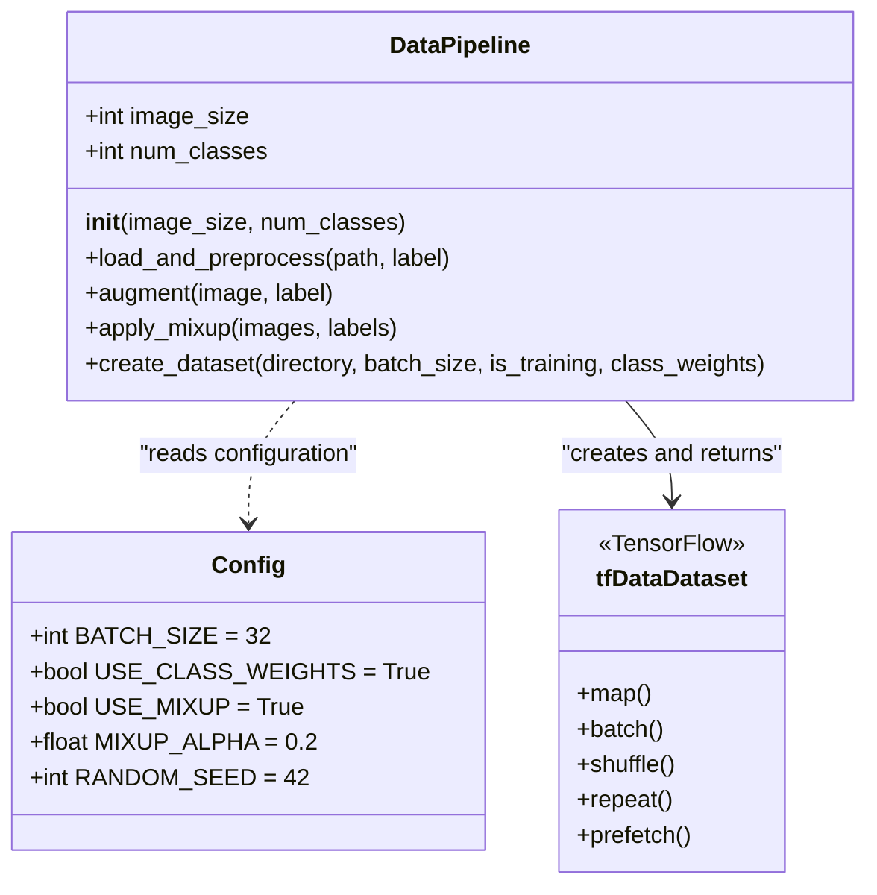
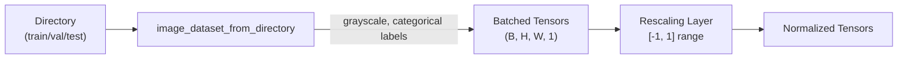

## Purpose and Scope

This document details the `DataPipeline` class and associated augmentation strategies used in the core training system. The pipeline transforms preprocessed grayscale wafer images into optimized `tf.data.Dataset` objects with configurable augmentation, class weighting, and performance optimizations. This covers training-time transformations only; for permanent preprocessing steps (grayscale conversion, dataset splitting), see [Dataset Organization](#3.1) and [Grayscale Conversion](#3.2).

**Sources:** [kaggle-notebook.ipynb:1-701](../kaggle-notebook.ipynb#L1-L701), [train.py:1-702](../train.py#L1-L702)

---

## DataPipeline Class Architecture

The `DataPipeline` class ([kaggle-notebook.ipynb:156-286](../kaggle-notebook.ipynb#L156-L286), [train.py:156-286](../train.py#L156-L286)) encapsulates all dataset creation logic, providing a unified interface for both training and validation data loading.



**Key Design Principles:**
- **Stateless operations**: All methods are pure functions operating on TensorFlow tensors
- **Lazy evaluation**: Transformations are graph-compiled with `@tf.function` where applicable
- **Conditional augmentation**: Training and validation pipelines use the same class with `is_training` flag

**Sources:** [kaggle-notebook.ipynb:156-159](../kaggle-notebook.ipynb#L156-L159), [train.py:156-159](../train.py#L156-L159)

---

## Image Loading and Normalization

### Loading Pipeline

The `create_dataset` method ([kaggle-notebook.ipynb:212-286](../kaggle-notebook.ipynb#L212-L286), [train.py:212-286](../train.py#L212-L286)) uses `tf.keras.utils.image_dataset_from_directory` for efficient batch loading:



**Parameters:**
| Parameter | Value | Purpose |
|-----------|-------|---------|
| `image_size` | (128, 128), (160, 160), or (224, 224) | Progressive resizing stages |
| `batch_size` | 32 (default) | Memory-stable batch size for T4 GPU |
| `label_mode` | `'categorical'` | One-hot encoded labels for 8 classes |
| `color_mode` | `'grayscale'` | Single-channel input (already preprocessed) |
| `shuffle` | `is_training` | Shuffle only during training |
| `seed` | 42 | Reproducible shuffling |

**Sources:** [kaggle-notebook.ipynb:216-224](../kaggle-notebook.ipynb#L216-L224), [train.py:216-224](../train.py#L216-L224)

### Normalization Strategy

Images are normalized to the `[-1, 1]` range to match MobileNetV2's expected input distribution:

```python