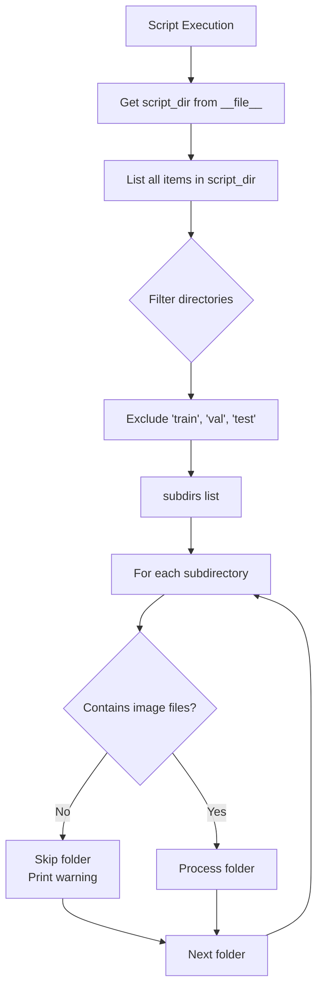
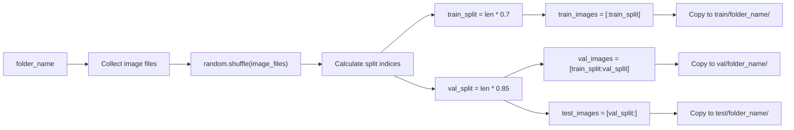
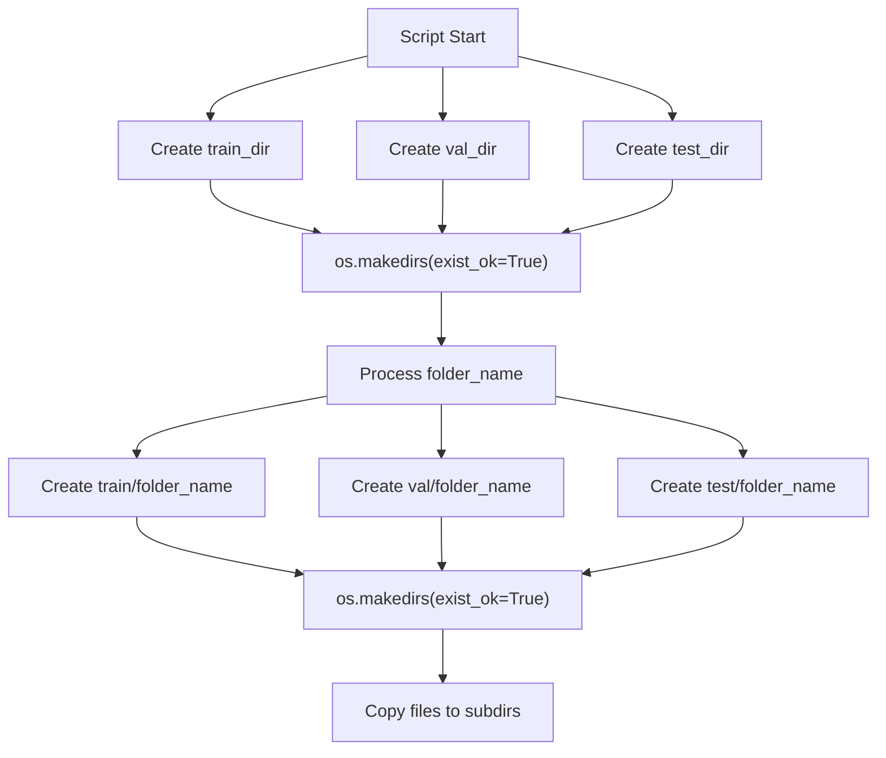
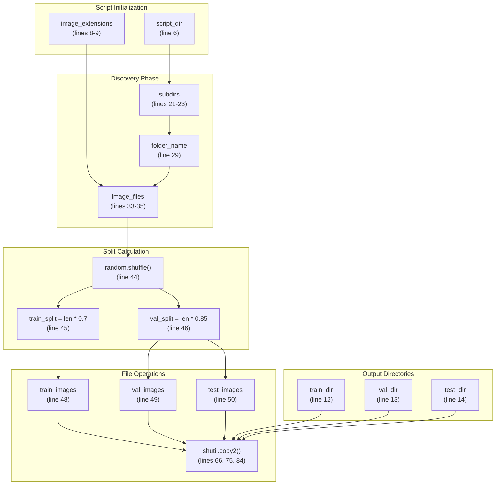
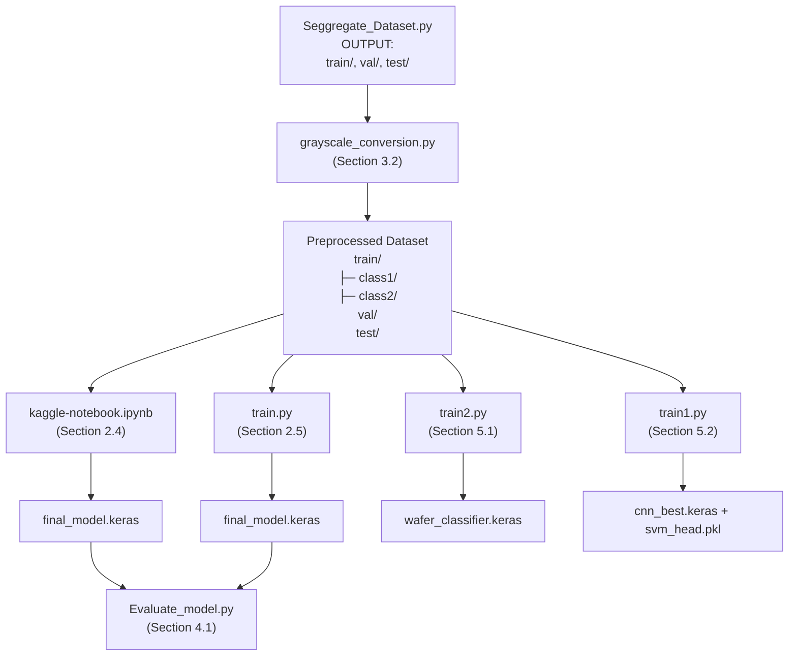

## Purpose and Scope

The `Seggregate_Dataset.py` script establishes the canonical train/validation/test split for the wafer defect detection dataset. This script is the **foundational preprocessing step** that creates the standardized directory structure consumed by all training systems in the repository.

**Scope**: This document covers the dataset splitting logic, directory structure requirements, and output format. For subsequent preprocessing steps, see [Grayscale Conversion](./Grayscale_Conversion.md#3.2). For the complete preprocessing workflow, see [Data Preprocessing Pipeline](./Data_Pipeline_and_Augmentation.md#3).

**Sources**: [Preprocessing_Scripts/Seggregate_Dataset.py:1-94](../Preprocessing_Scripts/Seggregate_Dataset.py#L1-L94)

---

## Script Overview

The script performs a class-preserving stratified split of a raw image dataset into three subsets using a **70/15/15 ratio** (train/validation/test). It operates on a directory structure where each subdirectory represents a distinct defect class, and maintains this class structure in the output.

### Key Characteristics

| Property | Value |
|----------|-------|
| **Split Ratio** | 70% train, 15% validation, 15% test |
| **Operation Type** | Copy (preserves original data) |
| **Stratification** | Class-preserving (per-folder splitting) |
| **Randomization** | Shuffles images before splitting |
| **Supported Formats** | `.jpg`, `.jpeg`, `.png`, `.gif`, `.bmp`, `.tiff`, `.webp` |
| **Location** | `Preprocessing_Scripts/` directory |

**Sources**: [Preprocessing_Scripts/Seggregate_Dataset.py:8-9](../Preprocessing_Scripts/Seggregate_Dataset.py#L8-L9), [Preprocessing_Scripts/Seggregate_Dataset.py:26](../Preprocessing_Scripts/Seggregate_Dataset.py#L26)

---

## Input Directory Structure

The script expects a directory containing subdirectories, where each subdirectory represents a class and contains images for that class. The script automatically excludes the output directories (`train`, `val`, `test`) from processing.

### Expected Input Layout

```
Preprocessing_Scripts/
├── Seggregate_Dataset.py
├── Center/               # Class 1
│   ├── image1.jpg
│   ├── image2.jpg
│   └── ...
├── Edge-Loc/            # Class 2
│   ├── image1.jpg
│   └── ...
├── Edge-Ring/           # Class 3
│   └── ...
└── [other class folders]
```

### Directory Discovery Logic



**Sources**: [Preprocessing_Scripts/Seggregate_Dataset.py:5-6](../Preprocessing_Scripts/Seggregate_Dataset.py#L5-L6), [Preprocessing_Scripts/Seggregate_Dataset.py:20-23](../Preprocessing_Scripts/Seggregate_Dataset.py#L20-L23), [Preprocessing_Scripts/Seggregate_Dataset.py:32-39](../Preprocessing_Scripts/Seggregate_Dataset.py#L32-L39)

---

## Processing Algorithm

### Split Calculation and File Organization

The script processes each class folder independently, applying the same 70/15/15 split ratio to maintain class balance across splits.



**Sources**: [Preprocessing_Scripts/Seggregate_Dataset.py:43-50](../Preprocessing_Scripts/Seggregate_Dataset.py#L43-L50)

### Implementation Details

The split indices are calculated as follows:

| Split | Calculation | Percentage |
|-------|-------------|------------|
| **train_split** | `int(len(image_files) * 0.7)` | 70% |
| **val_split** | `int(len(image_files) * 0.85)` | 85% cumulative |
| **Training Set** | `image_files[:train_split]` | 70% |
| **Validation Set** | `image_files[train_split:val_split]` | 15% (70%-85%) |
| **Test Set** | `image_files[val_split:]` | 15% (85%-100%) |

**Critical Note**: The script uses `shutil.copy2()` rather than `shutil.move()`, preserving the original dataset. This allows re-running the script with different random seeds without data loss.

**Sources**: [Preprocessing_Scripts/Seggregate_Dataset.py:43-50](../Preprocessing_Scripts/Seggregate_Dataset.py#L43-L50), [Preprocessing_Scripts/Seggregate_Dataset.py:61-86](../Preprocessing_Scripts/Seggregate_Dataset.py#L61-L86)

---

## Output Structure

The script creates three top-level directories (`train`, `val`, `test`), each containing class-named subdirectories mirroring the input structure.

### Output Directory Layout

```
Preprocessing_Scripts/
├── train/                 # 70% of data
│   ├── Center/
│   │   ├── c_1.jpg
│   │   ├── c_5.jpg
│   │   └── ...
│   ├── Edge-Loc/
│   │   └── ...
│   └── [other classes]
│
├── val/                   # 15% of data
│   ├── Center/
│   ├── Edge-Loc/
│   └── [other classes]
│
└── test/                  # 15% of data
    ├── Center/
    ├── Edge-Loc/
    └── [other classes]
```

### Directory Creation Workflow



**Sources**: [Preprocessing_Scripts/Seggregate_Dataset.py:11-18](../Preprocessing_Scripts/Seggregate_Dataset.py#L11-L18), [Preprocessing_Scripts/Seggregate_Dataset.py:52-59](../Preprocessing_Scripts/Seggregate_Dataset.py#L52-L59)

---

## Code Entity Mapping

This diagram maps the script's functions and variables to their roles in the processing pipeline:



**Sources**: [Preprocessing_Scripts/Seggregate_Dataset.py:5-94](../Preprocessing_Scripts/Seggregate_Dataset.py#L5-L94)

---

## Execution and Usage

### Running the Script

Execute from the command line in the directory containing the class folders:

```bash
cd Preprocessing_Scripts/
python Seggregate_Dataset.py
```

### Console Output Format

The script provides progress feedback during execution:

| Output Type | Example |
|-------------|---------|
| **Discovery** | `Found 9 folders to process` |
| **Split Ratio** | `Split ratio: 70% train, 15% val, 15% test` |
| **Per-Folder** | `Processing Center: 4294 images found` |
| **Split Counts** | `Train: 3005 images \| Val: 644 images \| Test: 645 images` |
| **Completion** | `✓ All folders split successfully!` |
| **Output Paths** | Lists absolute paths to train/val/test directories |

**Sources**: [Preprocessing_Scripts/Seggregate_Dataset.py:25-26](../Preprocessing_Scripts/Seggregate_Dataset.py#L25-L26), [Preprocessing_Scripts/Seggregate_Dataset.py:41](../Preprocessing_Scripts/Seggregate_Dataset.py#L41), [Preprocessing_Scripts/Seggregate_Dataset.py:88](../Preprocessing_Scripts/Seggregate_Dataset.py#L88), [Preprocessing_Scripts/Seggregate_Dataset.py:90-93](../Preprocessing_Scripts/Seggregate_Dataset.py#L90-L93)

---

## Error Handling

The script implements defensive error handling at two levels:

### 1. Empty Directory Handling

If a subdirectory contains no image files, it is skipped with a warning:

```python
if not image_files:
    print(f"No images found in {folder_name}, skipping...")
    continue
```

**Sources**: [Preprocessing_Scripts/Seggregate_Dataset.py:37-39](../Preprocessing_Scripts/Seggregate_Dataset.py#L37-L39)

### 2. File Copy Exception Handling

Each `shutil.copy2()` operation is wrapped in a try-except block to handle individual file failures without terminating the entire process:

```python
try:
    shutil.copy2(src_path, dst_path)
except Exception as e:
    print(f"Error copying {image} to train: {e}")
```

This pattern is repeated for train, validation, and test copies at [Preprocessing_Scripts/Seggregate_Dataset.py:65-68](../Preprocessing_Scripts/Seggregate_Dataset.py#L65-L68), [Preprocessing_Scripts/Seggregate_Dataset.py:74-77](../Preprocessing_Scripts/Seggregate_Dataset.py#L74-L77), and [Preprocessing_Scripts/Seggregate_Dataset.py:83-86](../Preprocessing_Scripts/Seggregate_Dataset.py#L83-L86).

**Sources**: [Preprocessing_Scripts/Seggregate_Dataset.py:65-86](../Preprocessing_Scripts/Seggregate_Dataset.py#L65-L86)

---

## Integration with Training Pipeline

The output of this script serves as the **canonical dataset structure** consumed by all training systems in the repository. The three-directory layout (train/val/test) is the single source of truth for model development.

### Downstream Consumers



**Key Integration Points**:

1. **Immediate Next Step**: The split dataset is processed by `grayscale_conversion.py` (see [Grayscale Conversion](./Grayscale_Conversion.md#3.2)), which converts images to single-channel format while preserving the train/val/test structure.

2. **Training Script Compatibility**: All four training approaches expect this exact directory structure:
   - Current production system: [kaggle-notebook.ipynb](#2.4) and [train.py](#2.5)
   - Alternative approaches: [train2.py](#5.1) and [train1.py](#5.2)

3. **Class Preservation**: The class-named subdirectories enable Keras' `image_dataset_from_directory()` function to automatically infer labels without manual annotation.

**Sources**: [Preprocessing_Scripts/Seggregate_Dataset.py:11-18](../Preprocessing_Scripts/Seggregate_Dataset.py#L11-L18), [Preprocessing_Scripts/Seggregate_Dataset.py:52-59](../Preprocessing_Scripts/Seggregate_Dataset.py#L52-L59)

---

## Implementation Considerations

### Random Seed Management

The script uses Python's `random` module without explicit seed setting. Each execution produces a different train/val/test split:

**Sources**: [Preprocessing_Scripts/Seggregate_Dataset.py:3](../Preprocessing_Scripts/Seggregate_Dataset.py#L3), [Preprocessing_Scripts/Seggregate_Dataset.py:44](../Preprocessing_Scripts/Seggregate_Dataset.py#L44)

**Implication**: To ensure reproducibility across experiments, either:
- Run the script once and version the split dataset
- Modify line 44 to include `random.seed(42)` before shuffling

### Memory Efficiency

The script loads only **filenames** into memory, not image data. The `image_files` list contains strings, making the script scalable to datasets with millions of images:

**Sources**: [Preprocessing_Scripts/Seggregate_Dataset.py:33-35](../Preprocessing_Scripts/Seggregate_Dataset.py#L33-L35)

### File Preservation Strategy

Using `shutil.copy2()` instead of `shutil.move()` preserves:
- Original file timestamps (`copy2` preserves metadata)
- Source directory structure (for debugging or re-processing)

**Trade-off**: Requires 2x storage space during preprocessing but prevents accidental data loss.

**Sources**: [Preprocessing_Scripts/Seggregate_Dataset.py:66](../Preprocessing_Scripts/Seggregate_Dataset.py#L66), [Preprocessing_Scripts/Seggregate_Dataset.py:75](../Preprocessing_Scripts/Seggregate_Dataset.py#L75), [Preprocessing_Scripts/Seggregate_Dataset.py:84](../Preprocessing_Scripts/Seggregate_Dataset.py#L84)

---

## Summary

The `Seggregate_Dataset.py` script is the **entry point** to the preprocessing pipeline, establishing the foundational train/validation/test split that all subsequent components depend on. Its class-preserving 70/15/15 split, defensive error handling, and copy-based operation make it a reliable first step in preparing raw image datasets for deep learning workflows.

**Next Step in Pipeline**: After running this script, proceed to [Grayscale Conversion](./Grayscale_Conversion.md#3.2) to transform the split dataset into single-channel images suitable for training.

**Sources**: [Preprocessing_Scripts/Seggregate_Dataset.py:1-94](../Preprocessing_Scripts/Seggregate_Dataset.py#L1-L94)