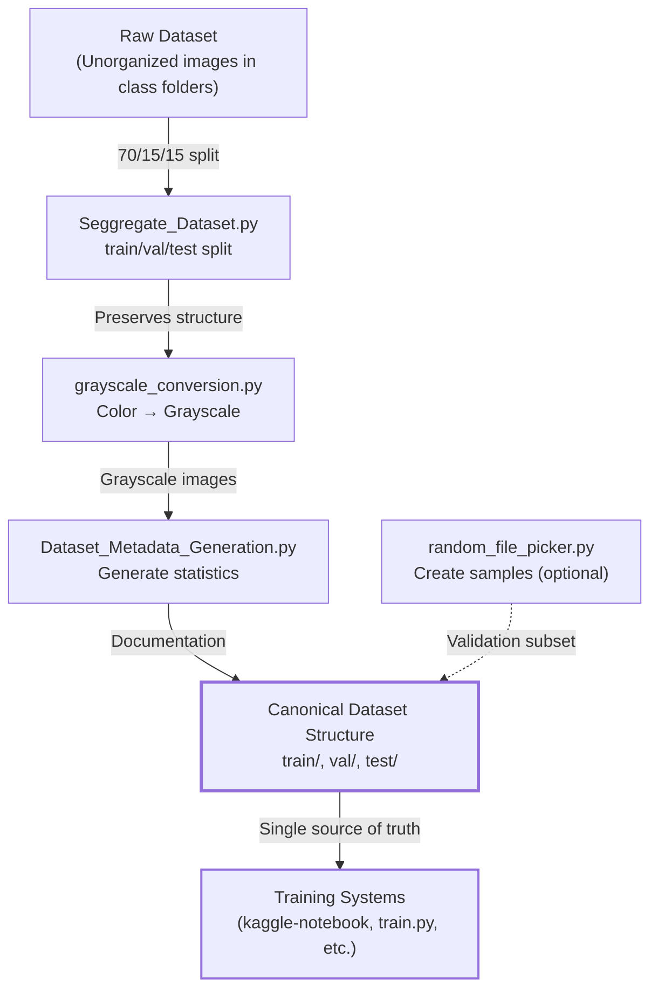
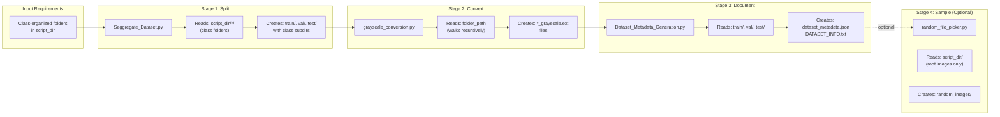
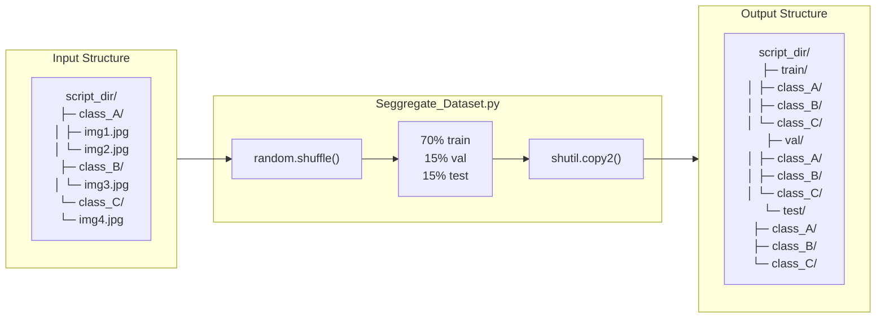
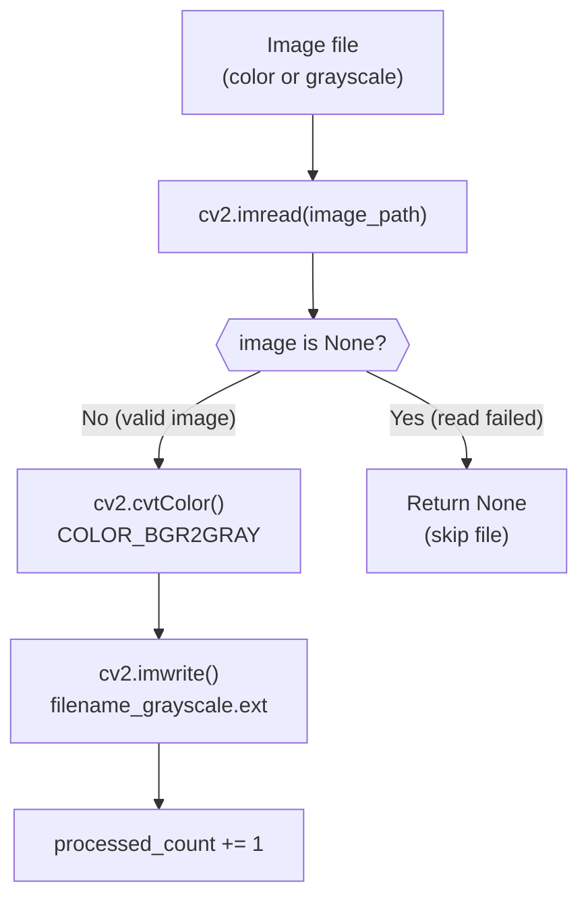
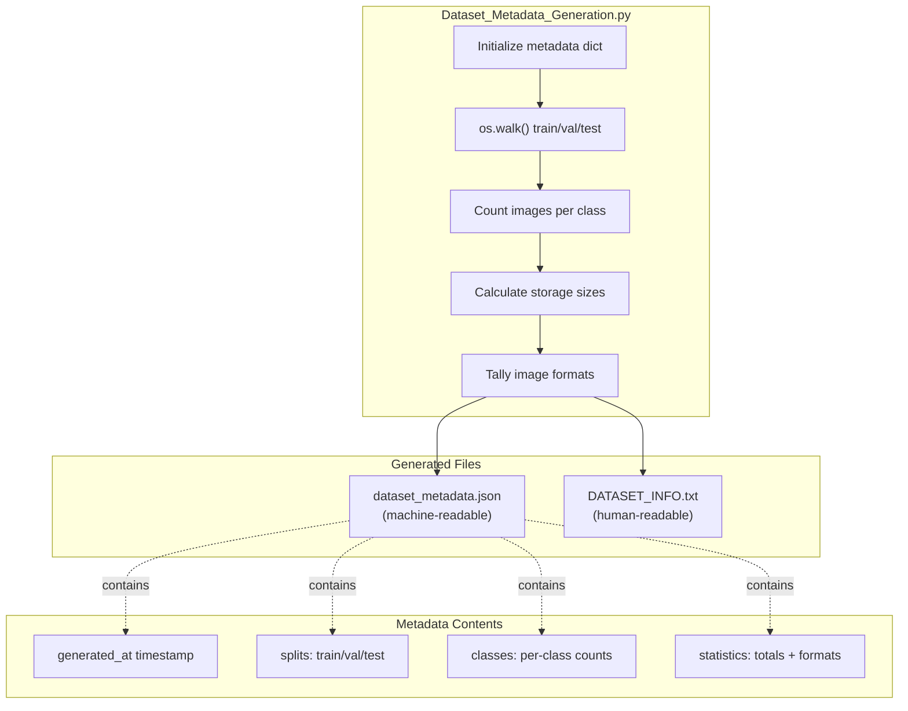
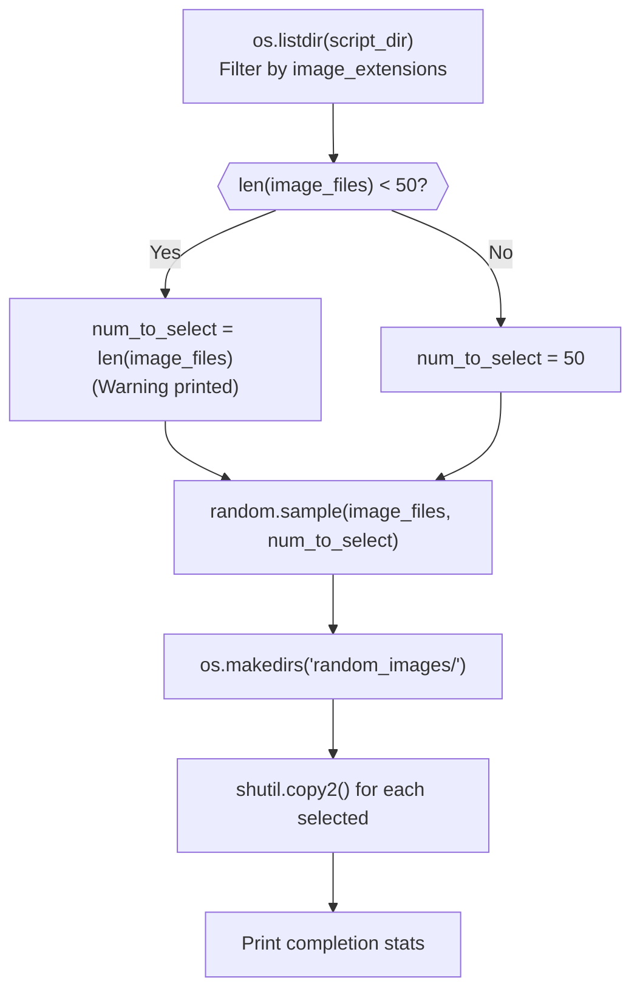
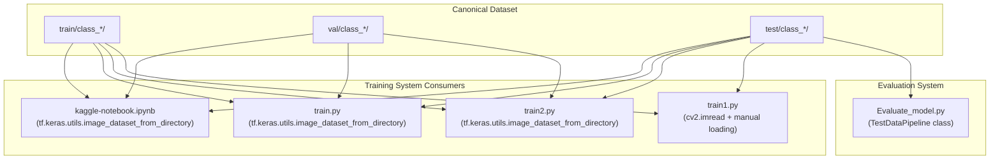

Final Accuracy: 85.21%
Precision: 84.35%
Recall: 83.91%

✓ Complete! Saved to /kaggle/working/prototype_b_optimized
```

**Sources:** [train.py:634-701]()

# Data Preprocessing Pipeline


## Purpose and Scope

The Data Preprocessing Pipeline transforms raw wafer defect images into a standardized, training-ready dataset structure. This pipeline performs **permanent, one-time transformations** that create the canonical directory structure consumed by all training systems in the repository.

The pipeline consists of four Python scripts located in `Preprocessing_Scripts/`:
1. **Seggregate_Dataset.py** - Performs train/val/test splitting with class preservation
2. **grayscale_conversion.py** - Converts color images to single-channel grayscale
3. **Dataset_Metadata_Generation.py** - Generates dataset documentation and statistics
4. **random_file_picker.py** - Creates sample subsets for validation

**Note**: For runtime data augmentation strategies applied during training, see [Data Pipeline and Augmentation](#2.3). For dataset inspection tools, see [Utility Tools](#6).

Sources: High-level architecture diagrams, `Preprocessing_Scripts/` directory structure

---

## Pipeline Architecture Overview

The preprocessing pipeline follows a linear execution model where each script performs a distinct transformation stage. Unlike training-time augmentations, these transformations are executed once and produce persistent filesystem changes.



**Execution Characteristics:**

| Aspect | Description |
|--------|-------------|
| **Execution Frequency** | One-time, before training begins |
| **Data Persistence** | All transformations write to disk |
| **Idempotency** | Scripts can be re-run to regenerate structure |
| **Dependencies** | Each script expects specific input structure |
| **Output Consumers** | All training scripts in repository |

Sources: High-level Diagram 1, Diagram 3

---

## Execution Order and Dependencies

### Sequential Processing Chain

The preprocessing scripts must be executed in a specific order due to their input/output dependencies:



**Dependency Table:**

| Script | Requires | Produces | Can Run Standalone |
|--------|----------|----------|-------------------|
| `Seggregate_Dataset.py` | Class folders in `script_dir` | `train/`, `val/`, `test/` directories | ✓ |
| `grayscale_conversion.py` | Images in target folder | `*_grayscale.*` files | ✓ (any folder) |
| `Dataset_Metadata_Generation.py` | `train/`, `val/`, `test/` directories | JSON + TXT documentation | ✗ (needs splits) |
| `random_file_picker.py` | Images in `script_dir` | `random_images/` directory | ✓ |

Sources: [Preprocessing_Scripts/Seggregate_Dataset.py:1-94](), [Preprocessing_Scripts/grayscale_conversion.py:1-55](), [Preprocessing_Scripts/Dataset_Metadata_Generation.py:1-139]()

---

## Dataset Splitting (Seggregate_Dataset.py)

### Purpose

`Seggregate_Dataset.py` performs the foundational split of raw images into train/validation/test sets with a **70/15/15 ratio** while preserving class structure. This creates the canonical directory layout consumed by all training systems.

### Directory Transformation



### Key Implementation Details

**Supported Image Formats:**
```python
image_extensions = ['.jpg', '.jpeg', '.png', '.gif', '.bmp', '.tiff', '.webp']
```
[Preprocessing_Scripts/Seggregate_Dataset.py:9]()

**Split Logic:**
- Discovers all subdirectories except `train`, `val`, `test` [Preprocessing_Scripts/Seggregate_Dataset.py:21-23]()
- Shuffles images randomly per class [Preprocessing_Scripts/Seggregate_Dataset.py:44]()
- Calculates split indices: `train_split = int(len * 0.7)`, `val_split = int(len * 0.85)` [Preprocessing_Scripts/Seggregate_Dataset.py:45-46]()
- Uses `shutil.copy2()` to preserve metadata [Preprocessing_Scripts/Seggregate_Dataset.py:66]()

**Error Handling:**
| Scenario | Behavior |
|----------|----------|
| Empty class folder | Skips with warning message [Preprocessing_Scripts/Seggregate_Dataset.py:37-39]() |
| Copy failure | Prints error, continues processing [Preprocessing_Scripts/Seggregate_Dataset.py:67-68]() |
| Non-image files | Ignored by extension filter [Preprocessing_Scripts/Seggregate_Dataset.py:35]() |

### Usage

```bash
cd Preprocessing_Scripts/
python Seggregate_Dataset.py
```

The script operates on its own directory (`script_dir`), discovering class folders automatically [Preprocessing_Scripts/Seggregate_Dataset.py:6]().

**Console Output Example:**
```
Found 9 folders to process
Split ratio: 70% train, 15% val, 15% test

Processing center: 4100 images found
  Train: 2870 images | Val: 615 images | Test: 615 images
Processing edge-loc: 5100 images found
  Train: 3570 images | Val: 765 images | Test: 765 images
...
✓ All folders split successfully!
```

Sources: [Preprocessing_Scripts/Seggregate_Dataset.py:1-94]()

---

## Grayscale Conversion (grayscale_conversion.py)

### Purpose

`grayscale_conversion.py` converts color wafer images to single-channel grayscale format. This preprocessing step reduces color images to intensity-based representations, as defect patterns are primarily intensity-based rather than color-based.

### Conversion Pipeline



### Function Reference

**`convert_to_grayscale(image_path)`** [Preprocessing_Scripts/grayscale_conversion.py:5-10]()
- **Parameters**: `image_path` (str) - Path to input image
- **Returns**: NumPy array of grayscale image or `None` on failure
- **Implementation**: 
  - Reads image with OpenCV [line 6]()
  - Applies `cv2.cvtColor()` with `COLOR_BGR2GRAY` flag [line 9]()

**`process_folder(folder_path)`** [Preprocessing_Scripts/grayscale_conversion.py:12-40]()
- **Parameters**: `folder_path` (str) - Root directory to process
- **Returns**: None (prints statistics to console)
- **Behavior**: 
  - Recursively walks directory tree with `os.walk()` [line 18]()
  - Processes all supported image formats [line 20]()
  - Saves with `_grayscale` suffix [line 28]()
  - Reports counts: `processed_count` and `skipped_count` [lines 39-40]()

### Supported Formats

| Format | Extension | Notes |
|--------|-----------|-------|
| JPEG | `.jpg`, `.jpeg` | Most common for wafer images |
| PNG | `.png` | Lossless format |
| BMP | `.bmp` | Uncompressed bitmap |
| GIF | `.gif` | Supports animation (first frame) |
| TIFF | `.tiff` | Multi-page support |

**Format Set:** [Preprocessing_Scripts/grayscale_conversion.py:14]()

### Naming Convention

**Output Filename Pattern:**
```
Original: wafer_123.jpg
Converted: wafer_123_grayscale.jpg
```

Implementation: [Preprocessing_Scripts/grayscale_conversion.py:26-29]()
```python
filename = Path(file).stem          # "wafer_123"
extension = Path(file).suffix       # ".jpg"
output_filename = f"{filename}_grayscale{extension}"
```

### Usage

```bash
python grayscale_conversion.py <folder_path>
```

**Command-line Interface:**
- Requires exactly one argument [Preprocessing_Scripts/grayscale_conversion.py:44-46]()
- Validates directory existence [Preprocessing_Scripts/grayscale_conversion.py:50-52]()
- Processes folder recursively [line 54]()

**Console Output:**
```
Converted: /path/to/train/center/img1.jpg
Converted: /path/to/train/center/img2.jpg
...
Processing complete!
Total images processed: 2457
Total images skipped: 3
```

### Integration Notes

After running `Seggregate_Dataset.py`, execute grayscale conversion on each split:
```bash
python grayscale_conversion.py train/
python grayscale_conversion.py val/
python grayscale_conversion.py test/
```

This creates both color and grayscale versions in each directory. Training systems should reference the `_grayscale.ext` files.

Sources: [Preprocessing_Scripts/grayscale_conversion.py:1-55]()

---

## Metadata Generation (Dataset_Metadata_Generation.py)

### Purpose

`Dataset_Metadata_Generation.py` creates comprehensive documentation of the preprocessed dataset, generating both machine-readable JSON and human-readable text reports. This script provides statistics on dataset composition, class distribution, and file formats.

### Metadata Structure



### Output File Formats

**`dataset_metadata.json`** [Preprocessing_Scripts/Dataset_Metadata_Generation.py:98-104]()

Structure:
```json
{
  "generated_at": "2024-01-15T10:30:00.123456",
  "dataset_root": "/path/to/Preprocessing_Scripts",
  "splits": {
    "train": {
      "path": "train",
      "total_images": 12500,
      "categories": {
        "center": {"count": 2870, "size_mb": 145.32, "formats": {".jpg": 2870}},
        "edge-loc": {"count": 3570, "size_mb": 178.50, "formats": {".jpg": 3570}}
      }
    },
    "val": { ... },
    "test": { ... }
  },
  "classes": {
    "center": 4100,
    "edge-loc": 5100,
    ...
  },
  "statistics": {
    "total_images": 25000,
    "total_size_mb": 1250.45,
    "image_formats": {".jpg": 24500, ".png": 500}
  }
}
```

**`DATASET_INFO.txt`** [Preprocessing_Scripts/Dataset_Metadata_Generation.py:107-134]()

Human-readable format:
```
============================================================
DATASET METADATA
============================================================

Generated: 2024-01-15T10:30:00.123456

STATISTICS:
  Total Images: 25000
  Total Size: 1250.45 MB
  Image Formats: {'.jpg': 24500, '.png': 500}

CLASSES:
  center: 4100 images
  edge-loc: 5100 images
  ...

SPLITS:

  TRAIN (12500 images):
    center: 2870 images (145.32 MB)
    edge-loc: 3570 images (178.50 MB)
    ...
```

### Key Implementation Details

**Initialization:** [Preprocessing_Scripts/Dataset_Metadata_Generation.py:13-23]()
- Uses `datetime.now().isoformat()` for timestamp [line 14]()
- Resolves `script_dir` from `__file__` [line 7]()
- Initializes nested dictionaries for splits, classes, statistics [lines 16-22]()

**Processing Logic:**
1. **Split Discovery**: Iterates through `['train', 'val', 'test']` [line 26]()
2. **Class Detection**: Lists subdirectories in each split [line 47]()
3. **Image Counting**: Filters files by extension [lines 53-55]()
4. **Size Calculation**: Uses `os.path.getsize()` [line 66]()
5. **Format Tracking**: Counts by extension with dict accumulation [lines 68-69]()

**Aggregation:**
- Per-class totals across splits [lines 87-89]()
- Per-format totals across all images [lines 82-84]()
- Grand totals [lines 94-95]()

### Error Handling

| Scenario | Behavior |
|----------|----------|
| Missing split directory | Skips with warning `"⚠ {split}/ folder not found"` [lines 36-38]() |
| Empty class folder | Skips silently with `if not image_files: continue` [lines 57-58]() |
| JSON write failure | Prints exception message [lines 103-104]() |
| TXT write failure | Prints exception message [lines 133-134]() |

### Usage

```bash
cd Preprocessing_Scripts/
python Dataset_Metadata_Generation.py
```

**Console Output:**
```
Generating dataset metadata...

✓ train: 12500 images from 9 classes
✓ val: 6250 images from 9 classes
✓ test: 6250 images from 9 classes

✓ Metadata saved: dataset_metadata.json
✓ README saved: DATASET_INFO.txt

✓ Dataset metadata generation complete!
Total images: 25000
Total size: 1250.45 MB
```

### Use Cases

1. **Documentation**: Permanent record of dataset composition
2. **Validation**: Verify split ratios and class distributions
3. **Debugging**: Identify missing or imbalanced classes
4. **Reporting**: Generate statistics for papers or presentations
5. **Automation**: Parse JSON for pipeline validation scripts

Sources: [Preprocessing_Scripts/Dataset_Metadata_Generation.py:1-139]()

---

## Random Sampling Tool (random_file_picker.py)

### Purpose

`random_file_picker.py` creates small, random subsets of images (default: 50) for quick validation, testing, or visual inspection without processing the full dataset.

### Sampling Process



### Implementation Details

**File Discovery:** [Preprocessing_Scripts/random_file_picker.py:12-14]()
- Operates on `script_dir` (script's own directory)
- Filters by `image_extensions` list [line 9]()
- Only processes files in root (no subdirectory recursion)

**Randomization:** [Preprocessing_Scripts/random_file_picker.py:26]()
```python
selected_images = random.sample(image_files, num_to_select)
```
- Uses `random.sample()` for true random selection (no replacement)
- Ensures uniform probability distribution

**Output Directory:** [Preprocessing_Scripts/random_file_picker.py:29-30]()
- Creates `random_images/` subdirectory
- Uses `exist_ok=True` to prevent errors on re-runs

**File Copying:** [Preprocessing_Scripts/random_file_picker.py:33-40]()
- Uses `shutil.copy2()` to preserve timestamps
- Try-catch per file to handle individual failures
- Prints each copied filename

### Edge Cases

| Condition | Behavior | Line Reference |
|-----------|----------|----------------|
| Fewer than 50 images | Selects all available, prints warning | [19-23]() |
| Zero images | Attempts to sample 0 images (no error) | [26]() |
| Copy failure | Prints error, continues with remaining | [39-40]() |
| Non-image files | Ignored by extension filter | [14]() |

### Usage

```bash
cd Preprocessing_Scripts/
python random_file_picker.py
```

**No command-line arguments required** - operates on current directory automatically.

**Console Output:**
```
Total images found: 4100
Copied: wafer_001.jpg
Copied: wafer_142.jpg
...
Copied: wafer_3982.jpg

Total images copied: 50
Images saved to: /path/to/Preprocessing_Scripts/random_images
```

### Use Cases

1. **Quick Testing**: Validate preprocessing steps on small subset
2. **Visual Inspection**: Manually review sample images for quality
3. **Demo Data**: Create portable dataset samples for presentations
4. **Debugging**: Isolate issues with specific image properties
5. **Performance Testing**: Benchmark algorithms on manageable dataset size

### Limitations

- **No Class Preservation**: Does not maintain class distribution
- **Flat Structure**: Ignores subdirectory organization
- **Fixed Sample Size**: Hardcoded to 50 images [line 23]()
- **Single Directory**: Cannot process multiple folders in one run

For class-preserving sampling, consider modifying the script to iterate through class subdirectories and sample proportionally.

Sources: [Preprocessing_Scripts/random_file_picker.py:1-44]()

---

## Canonical Directory Structure

### Final Dataset Layout

After executing the preprocessing pipeline, the canonical directory structure is established as the **single source of truth** for all training systems:

```
Preprocessing_Scripts/
├── train/
│   ├── center/
│   │   ├── c_1_grayscale.jpg
│   │   ├── c_2_grayscale.jpg
│   │   └── ...
│   ├── edge-loc/
│   ├── edge-ring/
│   ├── loc/
│   ├── near-full/
│   ├── none/
│   ├── random/
│   ├── scratch/
│   └── donut/
├── val/
│   └── (same class structure)
├── test/
│   └── (same class structure)
├── dataset_metadata.json
├── DATASET_INFO.txt
└── random_images/
    └── (50 sample images)
```

### Directory Properties

**Split Ratios:**
| Split | Percentage | Purpose |
|-------|------------|---------|
| `train/` | 70% | Model training and weight updates |
| `val/` | 15% | Hyperparameter tuning and early stopping |
| `test/` | 15% | Final evaluation (see [Model Evaluation Framework](#4)) |

**Class Structure:**
- Each split contains identical subdirectory names (classes)
- Class names correspond to wafer defect types (e.g., `center`, `edge-loc`)
- Preserved across all splits by [Preprocessing_Scripts/Seggregate_Dataset.py:52-59]()

**File Naming:**
- Original: `c_N.jpg` (varies by dataset)
- Grayscale: `c_N_grayscale.jpg` (added by conversion script)
- Both versions coexist in same directory after conversion

### Path Resolution Patterns

**Absolute Paths:**
```python
script_dir = os.path.dirname(os.path.abspath(__file__))
train_dir = os.path.join(script_dir, "train")
```
Used by: `Seggregate_Dataset.py` [lines 6, 12](), `Dataset_Metadata_Generation.py` [line 7]()

**Relative Paths:**
Training scripts typically use relative references:
```python
train_data_dir = 'Preprocessing_Scripts/train'
val_data_dir = 'Preprocessing_Scripts/val'
test_data_dir = 'Preprocessing_Scripts/test'
```

### Validation

**Integrity Checks:**
1. **Split Existence**: All three splits must exist for `Dataset_Metadata_Generation.py` [lines 33-38]()
2. **Class Consistency**: Same class names across splits (verified by metadata generation)
3. **Image Counts**: Verify 70/15/15 ratio in `DATASET_INFO.txt`
4. **File Readability**: `grayscale_conversion.py` reports skipped files [lines 35-36]()

**Metadata Validation:**
Load `dataset_metadata.json` and verify:
- `statistics.total_images` matches expected count
- Each class appears in all three splits
- `image_formats` shows expected extensions

Sources: [Preprocessing_Scripts/Seggregate_Dataset.py:12-18](), [Preprocessing_Scripts/Dataset_Metadata_Generation.py:26-38]()

---

## Integration with Training Systems

### Data Loading Patterns

The canonical directory structure is consumed by all training systems through standardized data loading patterns:



### Training System References

**Primary Training (kaggle-notebook.ipynb, train.py):**
These systems use `tf.keras.utils.image_dataset_from_directory()` which expects the exact structure produced by the preprocessing pipeline:
- Automatically discovers classes from subdirectory names
- Loads grayscale images by specifying `color_mode='grayscale'`
- Applies batch size and shuffling during dataset construction
- See [Data Pipeline and Augmentation](#2.3) for details

**Alternative Training Systems:**
- **train2.py**: Uses identical directory loading with oversampling for minority classes (see [Two-Phase Training](#5.1))
- **train1.py**: Manual loading with OpenCV for CNN-SVM ensemble (see [CNN-SVM Ensemble](#5.2))

**Evaluation Framework:**
- **Evaluate_model.py**: Loads test split through `TestDataPipeline` class
- Only processes `test/` directory for final model validation
- See [Model Evaluation Framework](#4) for complete evaluation workflow

### Expected Image Properties

**After Preprocessing:**
| Property | Value | Set By |
|----------|-------|--------|
| Color Mode | Grayscale (single channel) | `grayscale_conversion.py` |
| File Format | Original format preserved (`.jpg`, `.png`, etc.) | All scripts maintain format |
| Directory Structure | `split/class/image.ext` | `Seggregate_Dataset.py` |
| Class Names | Subdirectory names in original dataset | Discovered automatically |

**Training-Time Modifications:**
- Resizing: Progressive (128→160→224) or fixed
- Normalization: Pixel values scaled to [0, 1] or [-1, 1]
- Augmentation: Geometric transforms, MixUp, noise (see [Data Pipeline](#2.3))

### Critical Dependencies

**All training scripts depend on:**
1. Completed execution of `Seggregate_Dataset.py` → `train/`, `val/`, `test/` must exist
2. Completed execution of `grayscale_conversion.py` → `*_grayscale.*` files must exist
3. Consistent class naming across splits

**Breaking Changes:**
- Renaming class directories after splitting → Training scripts fail to load data
- Moving/deleting split directories → `FileNotFoundError` in training
- Incomplete grayscale conversion → Color images loaded by mistake (dimension mismatch)

### Verification Before Training

**Pre-Training Checklist:**
```bash
# 1. Verify split directories exist
ls Preprocessing_Scripts/train/
ls Preprocessing_Scripts/val/
ls Preprocessing_Scripts/test/

# 2. Verify metadata was generated
cat Preprocessing_Scripts/dataset_metadata.json

# 3. Check class consistency
ls Preprocessing_Scripts/train/  # List classes
ls Preprocessing_Scripts/val/    # Should match train
ls Preprocessing_Scripts/test/   # Should match train

# 4. Verify grayscale files exist
ls Preprocessing_Scripts/train/center/*_grayscale.jpg | wc -l
```

Sources: High-level Diagram 3, Diagram 5, [Preprocessing_Scripts/Seggregate_Dataset.py:12-18]()

---

## Design Philosophy

### One-Time Transformations

The preprocessing pipeline implements a **permanent transformation strategy** where all preprocessing steps write persistent changes to disk. This contrasts with training-time augmentation (see [Data Pipeline and Augmentation](#2.3)) which applies ephemeral transformations during model training.

**Rationale:**
1. **Reproducibility**: Canonical structure ensures all experiments use identical data
2. **Performance**: Avoids repeated preprocessing in training loops
3. **Debugging**: Preprocessed images can be manually inspected
4. **Modularity**: Training scripts focus on model architecture, not data preparation

### Script Independence

Each preprocessing script is **standalone and reusable**:

**`Seggregate_Dataset.py`**:
- Can operate on any directory with class-organized images
- No dependencies on other preprocessing scripts
- Idempotent: Can re-run to regenerate splits (with different random shuffles)

**`grayscale_conversion.py`**:
- Accepts any folder path as argument
- Works on pre-split or unsplit datasets
- Can convert individual class directories

**`Dataset_Metadata_Generation.py`**:
- Requires split structure but not grayscale conversion
- Can generate documentation at any point after splitting
- Useful for tracking dataset evolution

**`random_file_picker.py`**:
- Completely independent utility
- Can sample from any directory containing images
- No side effects on main dataset

### Preprocessing vs. Augmentation

| Aspect | Preprocessing (This Page) | Augmentation ([Section 2.3](#2.3)) |
|--------|---------------------------|-------------------------------------|
| **Execution** | One-time, before training | Every training epoch |
| **Persistence** | Written to disk | In-memory only |
| **Scripts** | `Preprocessing_Scripts/*.py` | Defined in training scripts |
| **Examples** | Grayscale conversion, train/val/test split | MixUp, rotation, brightness adjustment |
| **Purpose** | Create canonical dataset | Increase effective dataset size |
| **Reversibility** | Permanent (creates new files) | Ephemeral (original data unchanged) |

Sources: High-level Diagram 3 analysis

---

## Common Issues and Troubleshooting

### Issue: Classes Missing from Splits

**Symptom**: Metadata shows classes in `train/` but not in `val/` or `test/`

**Cause**: Class had fewer than ~7 images (insufficient for 70/15/15 split)

**Solution**:
```python