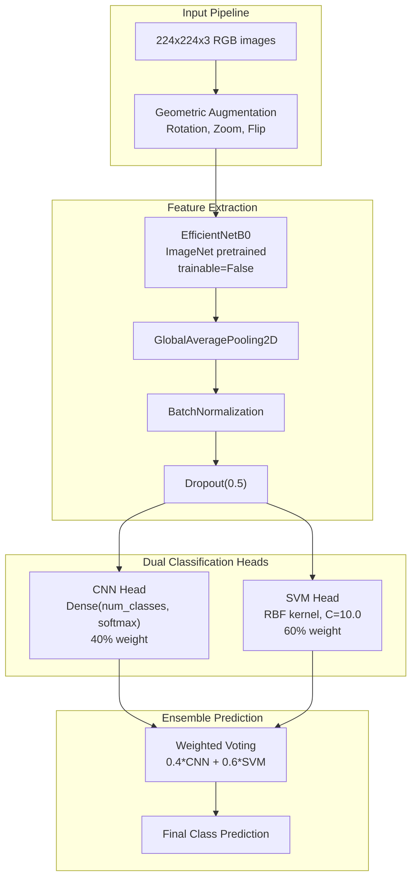
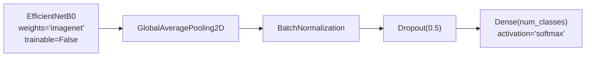
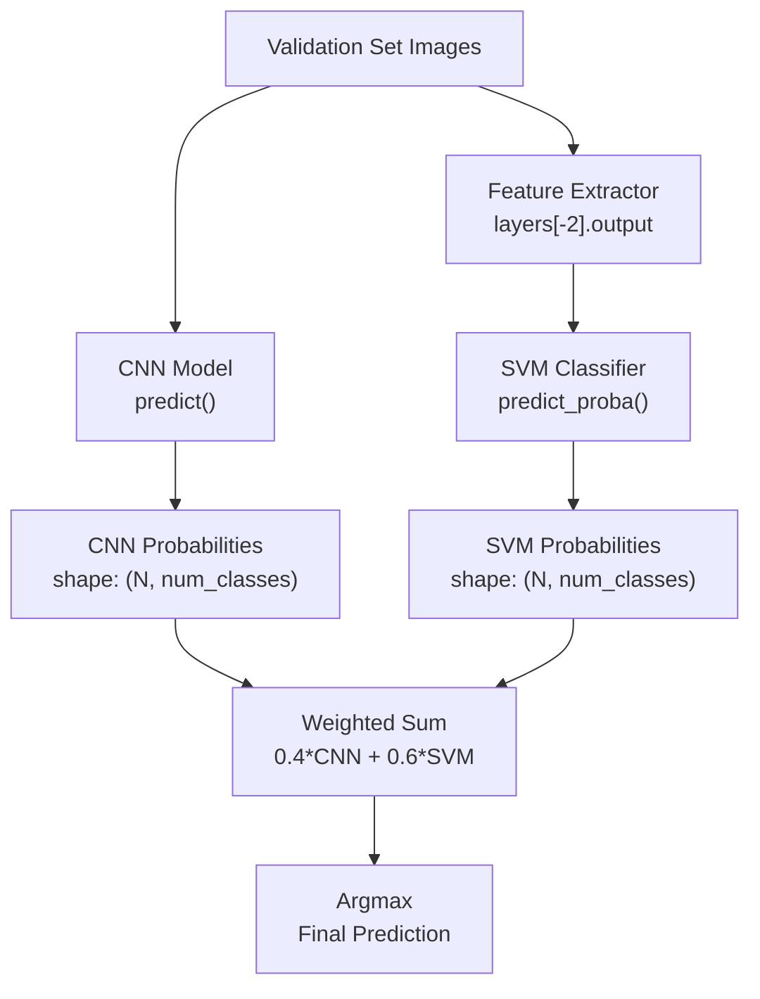
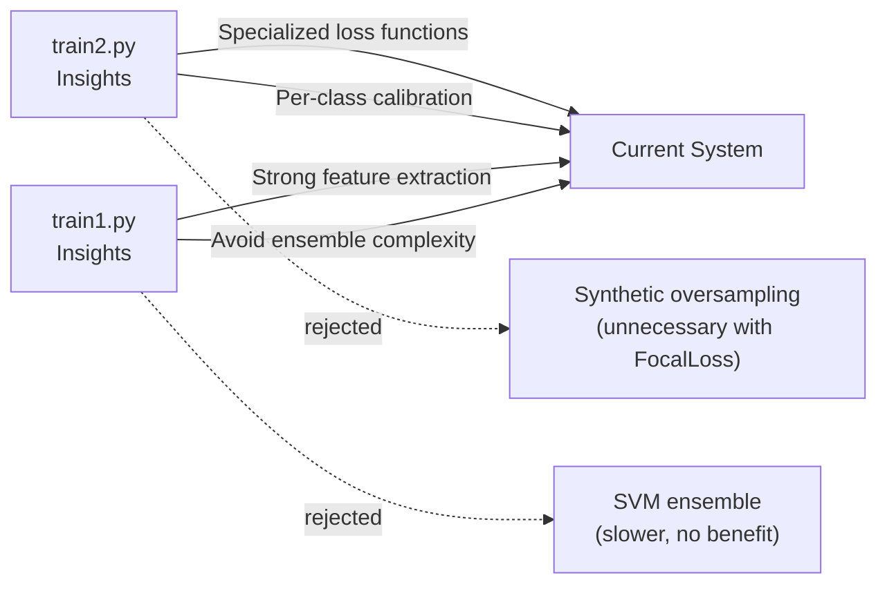

gen = SyntheticDataGenerator(
    image_paths=good_wafer_paths,  # 5 images
    labels=[0]*5,
    batch_size=32,
    target_samples=500  # Will repeat each 100x
)
```

**Sources:** [Previous_training_scripts/train2.py:440-498](../Previous_training_scripts/train2.py#L440-L498)

---

### Evaluation Methodology

The `evaluate_with_proper_metrics()` function [Previous_training_scripts/train2.py:350-435](../Previous_training_scripts/train2.py#L350-L435) implements imbalance-aware evaluation:

**Metrics Reported:**

| Metric | Type | Purpose |
|--------|------|---------|
| Precision | Per-class | Fraction of correct positive predictions |
| Recall | Per-class | Fraction of actual positives found |
| F1-Score | Per-class | Harmonic mean of precision/recall |
| Support | Per-class | Number of actual samples |
| Confusion Matrix | Overall | Detailed misclassification pattern |

**Special Handling for "good" Class:**

```python
if good_recall < 0.5:
    print("⚠️ WARNING: Low recall for 'good' class - model is biased toward defects!")
```

This check [Previous_training_scripts/train2.py:427-428](../Previous_training_scripts/train2.py#L427-L428) alerts if the minority class is being missed, which is critical for production deployment where false negatives (missing defect-free wafers) are costly.

**Differences from Standard Evaluation:**

- Prioritizes **F1 score** over accuracy (accuracy is misleading for imbalanced data)
- Reports **per-class metrics** with support counts
- Uses **optimal thresholds** instead of 0.5
- Provides **weighted averages** accounting for class sizes

**Sources:** [Previous_training_scripts/train2.py:350-435](../Previous_training_scripts/train2.py#L350-L435)

---

## CNN-SVM Ensemble Approach (train1.py)

### Architecture Overview

The `train1.py` approach combines deep learning feature extraction with classical machine learning classification:



**Diagram: CNN-SVM Ensemble Architecture**

**Design Philosophy:**

This approach reflects **distrust in pure neural networks** for critical wafer inspection. The 60% weight on SVM suggests that traditional ML with proper kernel selection was considered more reliable than softmax classification alone.

**Sources:** [Previous_training_scripts/train1.py:82-96](../Previous_training_scripts/train1.py#L82-L96), [Previous_training_scripts/train1.py:156-195](../Previous_training_scripts/train1.py#L156-L195)

---

### Configuration and Data Pipeline

**Config Class:**

The `Config` class [Previous_training_scripts/train1.py:26-41](../Previous_training_scripts/train1.py#L26-L41) defines system parameters:

| Parameter | Value | Notes |
|-----------|-------|-------|
| `INPUT_SHAPE` | (224, 224, 3) | Full RGB input (not grayscale) |
| `BATCH_SIZE` | 32 | Standard batch size |
| `EPOCHS` | 20 | CNN training epochs |
| `LR` | 1e-3 | Initial learning rate |
| `RANDOM_SEED` | 42 | Reproducibility |

**Data Augmentation:**

The `create_dataset()` function [Previous_training_scripts/train1.py:47-76](../Previous_training_scripts/train1.py#L47-L76) applies **geometric-only augmentation**:

```python
data_augmentation = tf.keras.Sequential([
    layers.RandomRotation(0.2),
    layers.RandomZoom(0.2),
    layers.RandomFlip("horizontal_and_vertical"),
])
```

**Rationale**: Avoids color/brightness augmentation that might distort defect signatures. This conservative approach is appropriate when defect appearance is critical for diagnosis.

**Sources:** [Previous_training_scripts/train1.py:26-76](../Previous_training_scripts/train1.py#L26-L76)

---

### CNN Component

**Model Construction:**

The `build_cnn()` function [Previous_training_scripts/train1.py:82-96](../Previous_training_scripts/train1.py#L82-L96) creates a frozen feature extractor:



**Diagram: CNN Architecture Components**

**Key Design Decisions:**

1. **Frozen Base**: `base.trainable = False` prevents fine-tuning EfficientNet
2. **High Dropout**: 0.5 rate prevents overfitting on limited data
3. **BatchNorm**: Stabilizes training with frozen features
4. **Softmax Output**: Standard classification head

**Training Configuration:**

```python
model.compile(
    optimizer=keras.optimizers.Adam(learning_rate=1e-3),
    loss='categorical_crossentropy',
    metrics=['accuracy']
)
```

The CNN trains for 20 epochs with early stopping (patience=5) monitoring validation accuracy.

**Sources:** [Previous_training_scripts/train1.py:82-151](../Previous_training_scripts/train1.py#L82-L151)

---

### SVM Component

**Feature Extraction:**

The SVM head requires dense feature vectors. The code [Previous_training_scripts/train1.py:156-171](../Previous_training_scripts/train1.py#L156-L171) extracts features from the layer before softmax:

```python
feature_extractor = keras.Model(
    inputs=cnn_model.input, 
    outputs=cnn_model.layers[-2].output  # Before softmax
)

X_train = feature_extractor.predict(train_ds_svm, verbose=1)
X_val = feature_extractor.predict(val_ds, verbose=1)
```

**Output Shape**: `(batch_size, feature_dim)` where `feature_dim` depends on the Dense layer before softmax.

**SVM Configuration:**

```python
svm_clf = make_pipeline(
    StandardScaler(), 
    svm.SVC(
        kernel='rbf',      # Radial Basis Function
        C=10.0,            # Regularization
        probability=True,  # Enable predict_proba
        class_weight='balanced'  # Handle imbalance
    )
)
```

**Key Parameters:**

| Parameter | Value | Purpose |
|-----------|-------|---------|
| `kernel='rbf'` | Radial Basis Function | Non-linear decision boundaries |
| `C=10.0` | Regularization | Balances margin vs violations |
| `probability=True` | Enables probabilistic output | Required for ensemble voting |
| `class_weight='balanced'` | Inverse frequency weighting | Handles class imbalance |

**StandardScaler**: Normalizes features to zero mean and unit variance, critical for SVM performance.

**Sources:** [Previous_training_scripts/train1.py:154-182](../Previous_training_scripts/train1.py#L154-L182)

---

### Ensemble Voting Strategy



**Diagram: Ensemble Voting Flow**

**Implementation:**

The ensemble logic [Previous_training_scripts/train1.py:184-195](../Previous_training_scripts/train1.py#L184-L195) combines predictions:

```python
cnn_probs = cnn_model.predict(val_ds, verbose=0)
svm_probs = svm_clf.predict_proba(X_val)

# Weighted vote (60% SVM + 40% CNN)
ensemble_probs = (0.4 * cnn_probs) + (0.6 * svm_probs)
y_pred = np.argmax(ensemble_probs, axis=1)
```

**Weight Rationale:**

The 60/40 split favoring SVM suggests:
- **SVM reliability**: RBF kernel with balanced weights handles imbalance better
- **CNN uncertainty**: Frozen features may not capture defect nuances
- **Empirical tuning**: These weights likely optimized validation performance

**Alternative Approaches Considered:**

- **Max voting**: Take argmax from each head, majority wins (discarded - loses probability information)
- **Stacking**: Train meta-classifier on concatenated probabilities (adds complexity)
- **Dynamic weighting**: Per-class weights (not implemented)

**Sources:** [Previous_training_scripts/train1.py:184-204](../Previous_training_scripts/train1.py#L184-L204)

---

### Evaluation and Reporting

The final evaluation [Previous_training_scripts/train1.py:197-216](../Previous_training_scripts/train1.py#L197-L216) generates comprehensive reports:

**Metrics Computed:**

1. **Accuracy Score**: `metrics.accuracy_score(y_val, y_pred)`
2. **Classification Report**: Per-class precision, recall, F1
3. **Confusion Matrix**: Heatmap visualization saved to `ensemble_matrix.png`

**Confusion Matrix Visualization:**

```python
plt.figure(figsize=(10, 8))
sns.heatmap(cm, annot=True, fmt='d', cmap='Blues', 
            xticklabels=class_names, yticklabels=class_names)
plt.title(f'Ensemble Confusion Matrix (Acc: {acc*100:.1f}%)')
plt.ylabel('Actual')
plt.xlabel('Predicted')
plt.savefig(f"{Config.OUTPUT_DIR}/ensemble_matrix.png")
```

**Saved Artifacts:**

| File | Type | Content |
|------|------|---------|
| `cnn_best.keras` | Model | Best CNN checkpoint |
| `svm_head.pkl` | Pickle | Trained SVM classifier |
| `ensemble_matrix.png` | Image | Confusion matrix heatmap |

**Sources:** [Previous_training_scripts/train1.py:197-216](../Previous_training_scripts/train1.py#L197-L216)

---

## Comparison and Lessons Learned

### Performance Characteristics

| Aspect | train2.py | train1.py | Current System |
|--------|-----------|-----------|----------------|
| **Class Imbalance Handling** | Excellent (CB Loss + oversampling) | Good (SVM balanced weights) | Excellent (FocalLoss) |
| **Training Complexity** | High (two phases) | Medium (dual training) | Medium (progressive) |
| **Inference Speed** | Fast (single model) | Slow (feature extraction + SVM) | Fast (single model) |
| **Memory Requirements** | High (expanded dataset) | Medium | Low (progressive loading) |
| **Minority Class Recall** | High (aggressive aug) | Medium | High (focal loss) |

### Key Insights

**From train2.py:**

1. **Loss Functions Matter**: Class-Balanced Loss effectively handles imbalance without synthetic data
2. **Threshold Tuning**: Per-class thresholds significantly improve minority class performance
3. **Oversampling Limitations**: Synthetic data helps but doesn't replace better loss functions
4. **Two-Phase Complexity**: Separate balanced/imbalanced phases add training overhead

**From train1.py:**

1. **Ensemble Overhead**: Two-stage prediction (CNN → features → SVM) is slow for production
2. **Frozen Features**: EfficientNet without fine-tuning may miss domain-specific patterns
3. **SVM Strengths**: Classical ML with proper kernels handles small datasets well
4. **Weighted Voting**: Hardcoded weights (60/40) require manual tuning

### Evolution to Current System

The current production system combines the best insights:



**Diagram: Knowledge Transfer to Current System**

**Current System Advantages:**

1. **FocalLoss**: Inherently handles imbalance without synthetic data
2. **SEBlock**: Attention mechanism improves feature extraction without SVM
3. **Progressive Resizing**: Curriculum learning replaces two-phase training
4. **Single Model**: No ensemble complexity, faster inference
5. **MixUp**: Data augmentation during training, no dataset expansion needed

**Sources:** [Previous_training_scripts/train2.py:1-535](../Previous_training_scripts/train2.py#L1-L535), [Previous_training_scripts/train1.py:1-220](../Previous_training_scripts/train1.py#L1-L220)

---

## Usage and Reproduction

### Running train2.py

**Prerequisites:**
- Dataset in `/kaggle/input/data1423/Segregated_defects_grayscale/`
- TensorFlow 2.x with F1Score metric support

**Execution:**

```bash
python Previous_training_scripts/train2.py
```

**Expected Outputs:**
- `best_balanced.keras`: Phase 1 checkpoint
- `best_finetuned.keras`: Phase 2 checkpoint
- `wafer_classifier_imbalanced.keras`: Final model
- Console output with class distribution analysis and per-class metrics

**Key Configuration Points:**

To modify behavior, edit constants at [Previous_training_scripts/train2.py:7-16](../Previous_training_scripts/train2.py#L7-L16):
- `IMG_SIZE`: Change input resolution
- `EPOCHS_PHASE1` / `EPOCHS_PHASE2`: Adjust training duration
- Target samples in `create_balanced_dataset()` call

### Running train1.py

**Prerequisites:**
- Dataset in `/kaggle/input/dataset/dataset/`
- scikit-learn, joblib for SVM training

**Execution:**

```bash
python Previous_training_scripts/train1.py
```

**Expected Outputs:**
- `cnn_best.keras`: CNN checkpoint
- `svm_head.pkl`: Trained SVM classifier
- `ensemble_matrix.png`: Confusion matrix visualization
- `combined_validation_server/`: Merged val+test directory

**Important Note:**

The script creates `combined_validation_server/` by merging validation and test sets [Previous_training_scripts/train1.py:108-119](../Previous_training_scripts/train1.py#L108-L119) for more robust evaluation. This is a **data leakage risk** in true validation scenarios but acceptable for final system comparison.

**Sources:** [Previous_training_scripts/train2.py:503-534](../Previous_training_scripts/train2.py#L503-L534), [Previous_training_scripts/train1.py:102-219](../Previous_training_scripts/train1.py#L102-L219)