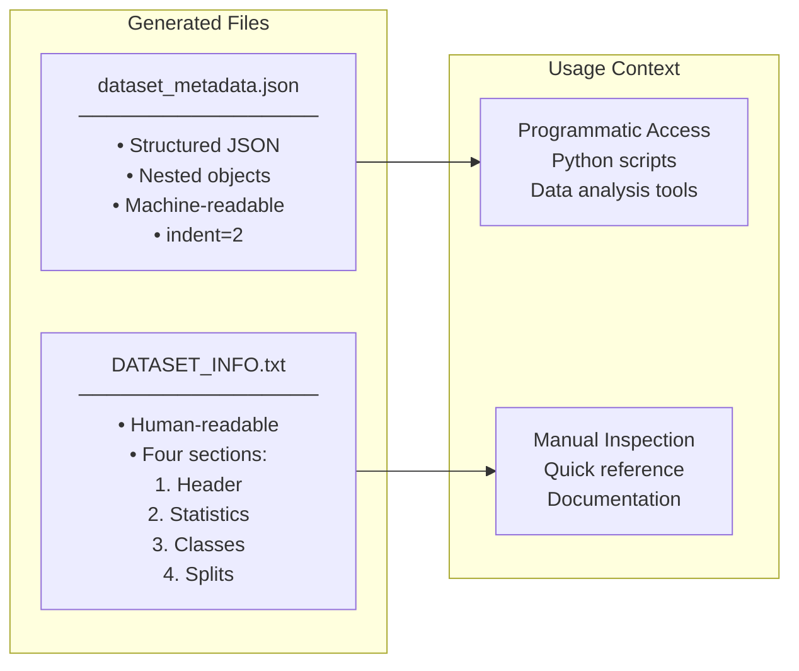
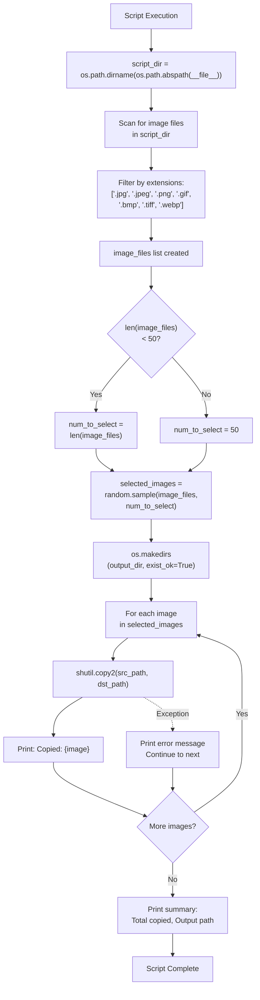
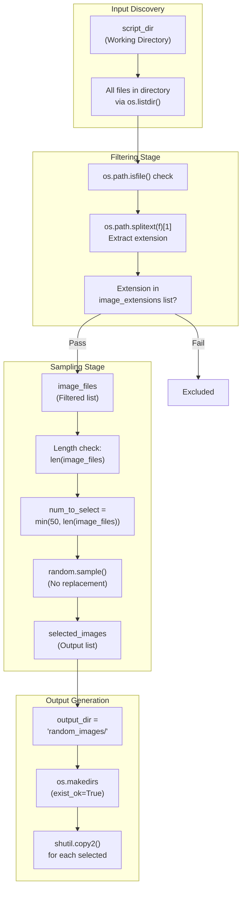
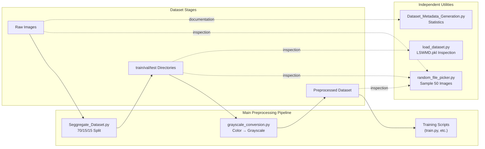

for fmt, count in format_count.items():
    metadata["statistics"]["image_formats"][fmt] = metadata["statistics"]["image_formats"].get(fmt, 0) + count
```

**Sources:** [Preprocessing_Scripts/Dataset_Metadata_Generation.py:78-95](../Preprocessing_Scripts/Dataset_Metadata_Generation.py#L78-L95)

---

## Output Generation

### JSON Output

The structured metadata is serialized to JSON with 2-space indentation at [Preprocessing_Scripts/Dataset_Metadata_Generation.py:98-104](../Preprocessing_Scripts/Dataset_Metadata_Generation.py#L98-L104):

```python
json_filename = os.path.join(script_dir, "dataset_metadata.json")
try:
    with open(json_filename, 'w', encoding='utf-8') as f:
        json.dump(metadata, f, indent=2)
    print(f"\n✓ Metadata saved: {json_filename}")
except Exception as e:
    print(f"Error saving JSON: {e}")
```

This file is machine-readable and suitable for programmatic access or integration with automated pipelines.

### Human-Readable Text Output

The `DATASET_INFO.txt` file provides a formatted summary with four sections, generated at [Preprocessing_Scripts/Dataset_Metadata_Generation.py:107-134](../Preprocessing_Scripts/Dataset_Metadata_Generation.py#L107-L134):

1. **Header** - Title and timestamp (lines 110-114)
2. **Global Statistics** - Total counts and sizes (lines 116-119)
3. **Class Breakdown** - Per-class totals across all splits (lines 121-124)
4. **Split Details** - Per-split, per-class breakdowns (lines 126-130)

### Diagram: Output File Structure



**Sources:** [Preprocessing_Scripts/Dataset_Metadata_Generation.py:98-134](../Preprocessing_Scripts/Dataset_Metadata_Generation.py#L98-L134)

---

## Console Output

During execution, the script provides real-time progress feedback:

| Output | Purpose | Location |
|--------|---------|----------|
| `"Generating dataset metadata..."` | Startup message | Line 30 |
| `"✓ {split}: {count} images from {n} classes"` | Per-split summary | Line 91 |
| `"⚠ {split}/ folder not found, skipping..."` | Missing directory warning | Line 37 |
| `"✓ Metadata saved: {filename}"` | JSON save confirmation | Line 102 |
| `"✓ README saved: {filename}"` | TXT save confirmation | Line 132 |
| `"✓ Dataset metadata generation complete!"` | Final status | Line 136 |

Error handling is implemented for file I/O operations at [Preprocessing_Scripts/Dataset_Metadata_Generation.py:103-104](../Preprocessing_Scripts/Dataset_Metadata_Generation.py#L103-L104) and [Preprocessing_Scripts/Dataset_Metadata_Generation.py:133-134](../Preprocessing_Scripts/Dataset_Metadata_Generation.py#L133-L134), printing exceptions if write operations fail.

**Sources:** [Preprocessing_Scripts/Dataset_Metadata_Generation.py:30-139](../Preprocessing_Scripts/Dataset_Metadata_Generation.py#L30-L139)

---

## Execution Context

The script is designed to be executed from the command line after dataset preprocessing is complete:

```bash
cd Preprocessing_Scripts/
python Dataset_Metadata_Generation.py
```

**Prerequisites:**
- Dataset must be organized in train/val/test structure (see [Dataset Organization](#3.1))
- Script must be located in the same directory as the split folders
- Write permissions required for output files

**No Configuration Required:** The script operates entirely based on directory structure discovery, with no command-line arguments or configuration files.

**Sources:** [Preprocessing_Scripts/Dataset_Metadata_Generation.py:6-7](../Preprocessing_Scripts/Dataset_Metadata_Generation.py#L6-L7)

---

## Implementation Details

### Script Location Handling

The script uses its own location as the dataset root at [Preprocessing_Scripts/Dataset_Metadata_Generation.py:7](../Preprocessing_Scripts/Dataset_Metadata_Generation.py#L7):

```python
script_dir = os.path.dirname(os.path.abspath(__file__))
```

This allows the script to work regardless of where it's executed from, as long as the train/val/test directories are siblings of the script file.

### Robustness Features

| Feature | Implementation | Purpose |
|---------|---------------|---------|
| Missing split handling | Lines 36-38 | Continues if train/val/test missing |
| Empty class filtering | Lines 57-58 | Skips classes with no images |
| Exception handling | Lines 103-104, 133-134 | Graceful degradation on I/O errors |
| Case-insensitive extensions | Line 55, 68 | Handles `.JPG` vs `.jpg` |

### Supported Image Formats

The script recognizes seven common image formats at [Preprocessing_Scripts/Dataset_Metadata_Generation.py:10](../Preprocessing_Scripts/Dataset_Metadata_Generation.py#L10):

- `.jpg` / `.jpeg` - JPEG compressed images
- `.png` - Portable Network Graphics
- `.gif` - Graphics Interchange Format
- `.bmp` - Bitmap images
- `.tiff` - Tagged Image File Format
- `.webp` - WebP format

**Sources:** [Preprocessing_Scripts/Dataset_Metadata_Generation.py:7](../Preprocessing_Scripts/Dataset_Metadata_Generation.py#L7), [Preprocessing_Scripts/Dataset_Metadata_Generation.py:10](../Preprocessing_Scripts/Dataset_Metadata_Generation.py#L10), [Preprocessing_Scripts/Dataset_Metadata_Generation.py:36-58](../Preprocessing_Scripts/Dataset_Metadata_Generation.py#L36-L58), [Preprocessing_Scripts/Dataset_Metadata_Generation.py:103-104](../Preprocessing_Scripts/Dataset_Metadata_Generation.py#L103-L104), [Preprocessing_Scripts/Dataset_Metadata_Generation.py:133-134](../Preprocessing_Scripts/Dataset_Metadata_Generation.py#L133-L134)

---

## Use Cases

### Dataset Documentation
After running `Seggregate_Dataset.py` and `grayscale_conversion.py`, this script provides comprehensive documentation of the final dataset state for reproducibility and analysis.

### Class Imbalance Analysis
The cross-split class totals in the `classes` object enable identification of severely imbalanced classes that may require special handling during training (e.g., focal loss, class weighting).

### Storage Planning
The size calculations help estimate storage requirements for different dataset configurations and identify large classes that may benefit from compression.

### Format Validation
The format tracking confirms that image preprocessing (e.g., grayscale conversion) completed successfully and all images are in expected formats.

**Sources:** [Preprocessing_Scripts/Dataset_Metadata_Generation.py:1-139](../Preprocessing_Scripts/Dataset_Metadata_Generation.py#L1-L139)

# Dataset Sampling Tool


## Purpose and Scope

The Dataset Sampling Tool (`random_file_picker.py`) is a standalone utility for creating representative subsets of image datasets through random sampling. It extracts up to 50 images from a source directory and copies them to a dedicated output folder for quick inspection, validation, or testing workflows. This tool operates independently of the main preprocessing pipeline and does not modify source files.

For dataset organization and train/val/test splitting, see [Dataset Organization](#3.1). For comprehensive dataset analysis, see [Metadata Generation](#3.3).

**Sources:** [Preprocessing_Scripts/random_file_picker.py:1-44](../Preprocessing_Scripts/random_file_picker.py#L1-L44)

---

## Overview

The `random_file_picker.py` script implements a simple file-based sampling strategy that scans a directory for image files, randomly selects up to 50 samples, and copies them to a new subdirectory named `random_images`. The tool uses `random.sample()` from Python's standard library to ensure unbiased selection without replacement.

**Key Characteristics:**

| Property | Value |
|----------|-------|
| Execution Model | Standalone script (no imports from other modules) |
| Operating Directory | Script's own location (`script_dir`) |
| Sample Size | 50 images (or all available if fewer) |
| Output Directory | `random_images/` (created in script directory) |
| Image Formats | `.jpg`, `.jpeg`, `.png`, `.gif`, `.bmp`, `.tiff`, `.webp` |
| File Handling | Copy (non-destructive, preserves originals) |

**Sources:** [Preprocessing_Scripts/random_file_picker.py:5-30](../Preprocessing_Scripts/random_file_picker.py#L5-L30)

---

## Execution Flow



**Diagram: Execution Flow with Code Entity References**

This diagram maps the script's linear execution sequence to specific code constructs, showing how directory detection, file scanning, sampling, and copying operations are orchestrated.

**Sources:** [Preprocessing_Scripts/random_file_picker.py:5-43](../Preprocessing_Scripts/random_file_picker.py#L5-L43)

---

## Selection Algorithm



**Diagram: File Filtering and Random Sampling Pipeline**

This diagram shows how the script transforms a directory listing into a random sample through filtering, size determination, and sampling stages using specific Python functions.

**Sources:** [Preprocessing_Scripts/random_file_picker.py:8-26](../Preprocessing_Scripts/random_file_picker.py#L8-L26)

---

## File Operations

### Supported Image Extensions

The tool recognizes seven common image formats through case-insensitive extension matching:

```python
image_extensions = ['.jpg', '.jpeg', '.png', '.gif', '.bmp', '.tiff', '.webp']
```

Extensions are normalized to lowercase using `os.path.splitext(f)[1].lower()` before comparison to handle variations like `.JPG` or `.PNG`.

**Sources:** [Preprocessing_Scripts/random_file_picker.py:8-14](../Preprocessing_Scripts/random_file_picker.py#L8-L14)

### Copy Operations

The script uses `shutil.copy2()` rather than `shutil.copy()` to preserve file metadata:

| Function | Metadata Preservation | Use Case |
|----------|----------------------|----------|
| `shutil.copy()` | Content only | Basic file duplication |
| `shutil.copy2()` | Content + timestamps + permissions | Exact replication (used here) |

Each copy operation is wrapped in a try-except block to handle errors gracefully without halting the entire process. Failed copies print an error message but do not raise exceptions.

**Sources:** [Preprocessing_Scripts/random_file_picker.py:32-40](../Preprocessing_Scripts/random_file_picker.py#L32-L40)

---

## Configuration and Constraints

### Hardcoded Parameters

| Parameter | Value | Location |
|-----------|-------|----------|
| Sample size | `50` | [Preprocessing_Scripts/random_file_picker.py:23](../Preprocessing_Scripts/random_file_picker.py#L23) |
| Output directory name | `"random_images"` | [Preprocessing_Scripts/random_file_picker.py:29](../Preprocessing_Scripts/random_file_picker.py#L29) |
| Image extensions | 7 formats (see above) | [Preprocessing_Scripts/random_file_picker.py:9](../Preprocessing_Scripts/random_file_picker.py#L9) |

### Operational Constraints

1. **Working Directory Dependency**: The script operates in its own directory (`os.path.dirname(os.path.abspath(__file__))`), meaning it must be executed from within the directory containing target images.

2. **Sample Size Adaptation**: If fewer than 50 images are available, all images are selected with a warning message:
   ```
   Warning: Only {N} images found. Selecting all available images.
   ```
   [Preprocessing_Scripts/random_file_picker.py:19-21](../Preprocessing_Scripts/random_file_picker.py#L19-L21)

3. **Output Directory Handling**: The output directory is created with `exist_ok=True`, allowing repeated executions. Existing files with matching names are overwritten.

**Sources:** [Preprocessing_Scripts/random_file_picker.py:5-30](../Preprocessing_Scripts/random_file_picker.py#L5-L30)

---

## Use Cases

### 1. Quick Visual Inspection

When working with large datasets (thousands of images), this tool creates a manageable subset for manual review of image quality, defect patterns, or preprocessing results.

### 2. Preprocessing Validation

After running [grayscale_conversion.py](#3.2), use this tool to sample converted images and verify that the transformation preserved important defect features.

### 3. Model Debugging

When investigating model mispredictions on specific classes, copy a class directory to a temporary location, run the sampler, and analyze the subset with visualization tools.

### 4. Documentation and Reporting

Generate representative samples for inclusion in project documentation, research papers (via [extract_pdf_images.py](#6.3)), or stakeholder presentations.

**Sources:** [Preprocessing_Scripts/random_file_picker.py:1-44](../Preprocessing_Scripts/random_file_picker.py#L1-L44)

---

## Console Output Format

The script provides detailed execution feedback through print statements:

| Stage | Output | Purpose |
|-------|--------|---------|
| Discovery | `Total images found: {count}` | Confirm directory scan |
| Warning (if needed) | `Warning: Only {N} images found...` | Alert to small datasets |
| Per-file copy | `Copied: {filename}` | Track progress |
| Error (if any) | `Error copying {filename}: {exception}` | Report failures |
| Summary | `Total images copied: {count}` | Final count |
| Summary | `Images saved to: {path}` | Output location |

**Sources:** [Preprocessing_Scripts/random_file_picker.py:16-43](../Preprocessing_Scripts/random_file_picker.py#L16-L43)

---

## Error Handling

### Copy Failure Recovery

The script implements fault-tolerant copying through exception handling:

```python
try:
    shutil.copy2(src_path, dst_path)
    print(f"Copied: {image}")
except Exception as e:
    print(f"Error copying {image}: {e}")
```

This approach ensures that permission errors, disk space issues, or file lock conditions on individual files do not abort the entire sampling process. The summary count at the end reflects the actual number of successfully copied files.

### Potential Error Scenarios

| Error Type | Cause | Behavior |
|------------|-------|----------|
| Permission denied | Read-restricted source or write-restricted destination | Skip file, print error, continue |
| Disk full | Insufficient space in output directory | Skip file, print error, continue |
| File not found | File deleted between scan and copy | Skip file, print error, continue |
| Invalid filename | Special characters in path | Skip file, print error, continue |

**Sources:** [Preprocessing_Scripts/random_file_picker.py:36-40](../Preprocessing_Scripts/random_file_picker.py#L36-L40)

---

## Relationship to Main Pipeline



**Diagram: Position of random_file_picker.py in the Data Ecosystem**

Unlike preprocessing scripts that form a sequential pipeline, `random_file_picker.py` operates as an inspection tool that can be applied at any stage (raw, split, or preprocessed) without modifying the dataset.

**Sources:** [Preprocessing_Scripts/random_file_picker.py:1-44](../Preprocessing_Scripts/random_file_picker.py#L1-L44)

---

## Execution Example

### Directory Structure Before Execution

```
Preprocessing_Scripts/
├── random_file_picker.py
├── image_001.jpg
├── image_002.png
├── ...
└── image_300.jpg
```

### Command

```bash
cd Preprocessing_Scripts/
python random_file_picker.py
```

### Console Output

```
Total images found: 300
Copied: image_042.jpg
Copied: image_187.png
Copied: image_023.jpg
...
(47 more lines)
...
Copied: image_299.jpg

Total images copied: 50
Images saved to: /path/to/Preprocessing_Scripts/random_images
```

### Directory Structure After Execution

```
Preprocessing_Scripts/
├── random_file_picker.py
├── image_001.jpg
├── image_002.png
├── ...
├── image_300.jpg
└── random_images/          ← New directory
    ├── image_042.jpg       ← Randomly selected copies
    ├── image_187.png
    ├── ...
    └── image_299.jpg       (50 total)
```

**Sources:** [Preprocessing_Scripts/random_file_picker.py:1-44](../Preprocessing_Scripts/random_file_picker.py#L1-L44)

---

## Limitations and Design Tradeoffs

### Lack of Stratification

The sampling is purely random and does not preserve class distribution. For class-balanced sampling, manual execution per class directory is required:

```bash
cd train/class_A/
python ../../random_file_picker.py

cd ../class_B/
python ../../random_file_picker.py
```

### No Seed Parameter

The script does not accept a random seed, making samples non-reproducible across executions. For reproducible sampling, modify line 26 to add `random.seed(42)` before the `random.sample()` call.

### Fixed Output Location

The output directory is always created in the script's location. To sample from a different directory, the script must be copied there or modified to accept command-line arguments.

### No Recursive Scanning

The script only scans the immediate directory and does not traverse subdirectories. This is appropriate for flat directory structures but requires manual execution for hierarchical datasets like the train/val/test split structure created by [Seggregate_Dataset.py](#3.1).

**Sources:** [Preprocessing_Scripts/random_file_picker.py:1-44](../Preprocessing_Scripts/random_file_picker.py#L1-L44)