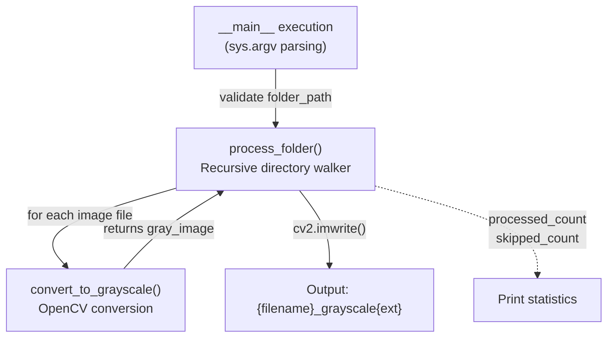
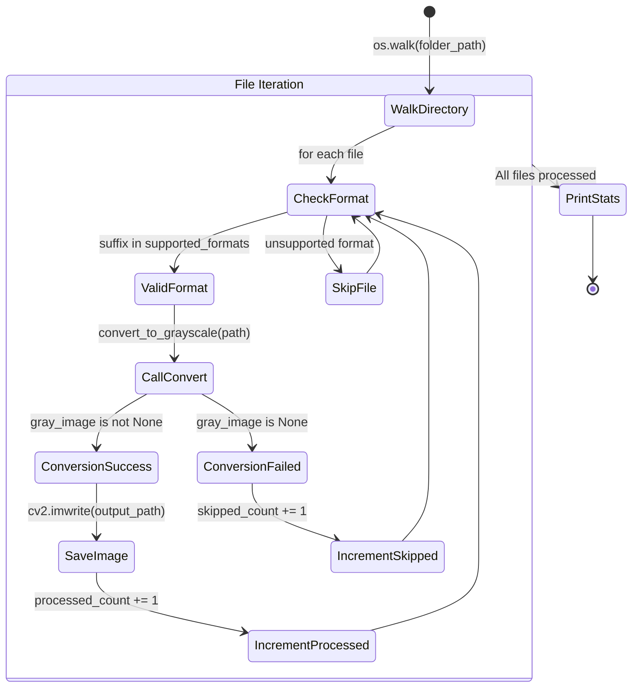
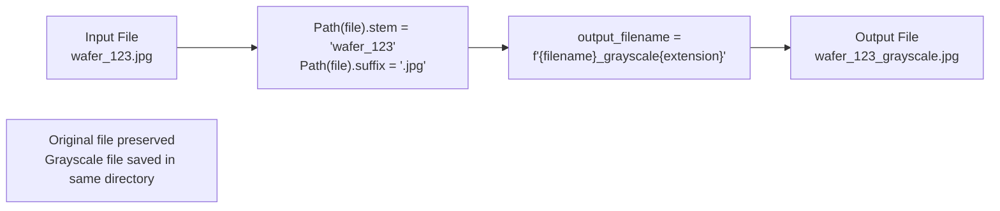
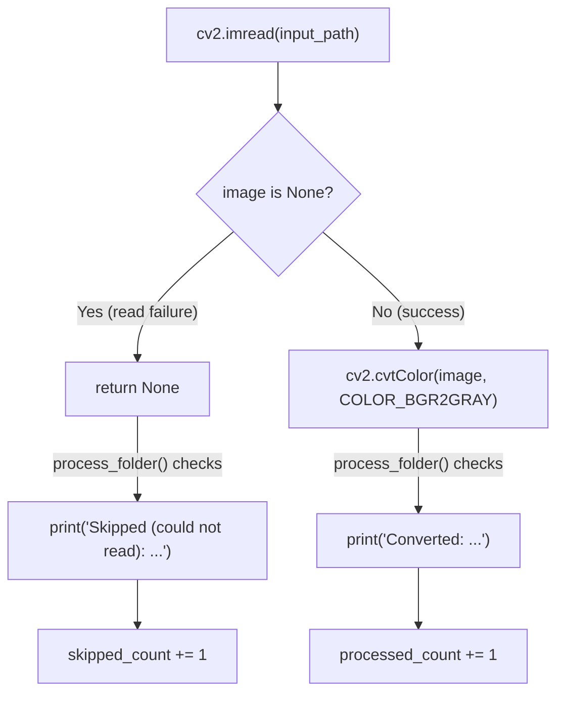
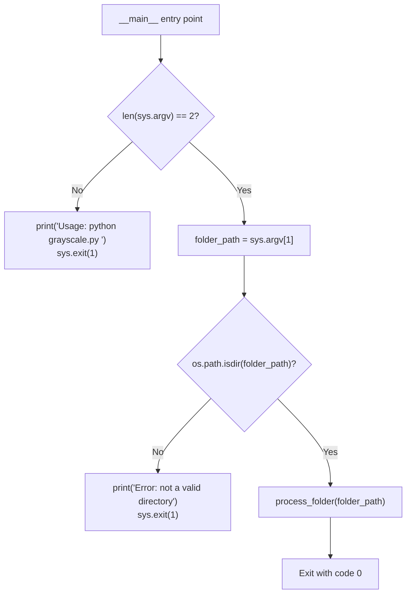
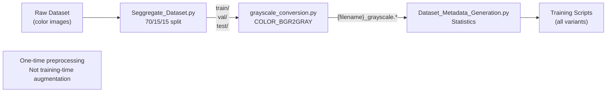

## Purpose and Scope

This document describes the grayscale conversion preprocessing step implemented in [Preprocessing_Scripts/grayscale_conversion.py](). The script performs one-time conversion of color wafer images to single-channel grayscale format, which serves as the canonical image representation for all training systems in the repository. This conversion reduces computational overhead and emphasizes intensity-based defect patterns that are critical for wafer classification.

For information about the preceding dataset organization step, see [Dataset Organization (Seggregate_Dataset.py)](#3.1). For information about subsequent metadata generation, see [Metadata Generation](#3.3).

---

## Rationale for Grayscale Conversion

The grayscale conversion serves multiple purposes in the wafer defect detection pipeline:

| **Rationale** | **Benefit** |
|---------------|-------------|
| **Reduced Memory Footprint** | Single-channel images (H×W×1) consume 67% less memory than RGB (H×W×3) |
| **Faster Processing** | Training operations on 1-channel tensors are significantly faster than 3-channel |
| **Defect Pattern Emphasis** | Wafer defects manifest as intensity variations rather than color differences |
| **Model Generalization** | Removes color variations that may be artifacts of imaging equipment rather than defect characteristics |
| **Consistent Preprocessing** | All training scripts ([kaggle-notebook.ipynb](), [train.py](), [train1.py](), [train2.py]()) expect grayscale input |

The conversion occurs **before** dataset splitting (as shown in Diagram 1 of the high-level architecture), making it a permanent preprocessing transformation rather than a training-time augmentation.

**Sources:** High-level architecture diagrams, [Preprocessing_Scripts/grayscale_conversion.py:1-54]()

---

## Script Architecture

### Function Overview

The script implements a two-tier architecture with core conversion logic and batch processing orchestration:

**Diagram: Function Call Hierarchy**



**Sources:** [Preprocessing_Scripts/grayscale_conversion.py:5-54]()

---

## Core Conversion Function

### `convert_to_grayscale()`

The `convert_to_grayscale()` function encapsulates the OpenCV-based color space transformation:

```python
def convert_to_grayscale(image_path):
    image = cv2.imread(image_path)
    if image is None:
        return None
    gray_image = cv2.cvtColor(image, cv2.COLOR_BGR2GRAY)
    return gray_image
```

**Key Implementation Details:**

| **Aspect** | **Implementation** | **Location** |
|------------|-------------------|--------------|
| **Image Loading** | `cv2.imread()` with default flags | [grayscale_conversion.py:6]() |
| **Color Space Conversion** | `cv2.cvtColor()` with `COLOR_BGR2GRAY` constant | [grayscale_conversion.py:9]() |
| **Error Handling** | Returns `None` if image cannot be read | [grayscale_conversion.py:7-8]() |
| **Output Format** | Single-channel NumPy array with dtype `uint8` | [grayscale_conversion.py:9]() |

The `COLOR_BGR2GRAY` conversion uses the standard luminosity formula:

```
Gray = 0.299*R + 0.587*G + 0.114*B
```

This weighted average accounts for human perception, where green contributes most to perceived brightness.

**Sources:** [Preprocessing_Scripts/grayscale_conversion.py:5-10]()

---

## Batch Processing Workflow

### `process_folder()` Architecture

The `process_folder()` function implements recursive directory traversal with format filtering and error tracking:

**Diagram: Processing State Machine**



**Sources:** [Preprocessing_Scripts/grayscale_conversion.py:12-40]()

---

## Supported Image Formats

### Format Specification

The script processes images with the following extensions (case-insensitive):

```python
supported_formats = {'.jpg', '.jpeg', '.png', '.bmp', '.gif', '.tiff'}
```

| **Format** | **Extension(s)** | **Typical Use Case** |
|------------|------------------|----------------------|
| **JPEG** | `.jpg`, `.jpeg` | Compressed wafer scans (most common) |
| **PNG** | `.png` | Lossless wafer images from automated systems |
| **BMP** | `.bmp` | Raw bitmap captures from imaging equipment |
| **GIF** | `.gif` | Legacy format support |
| **TIFF** | `.tiff` | High-resolution scientific imaging |

The format check uses `Path(file).suffix.lower()` to ensure case-insensitive matching ([grayscale_conversion.py:20]()).

**Sources:** [Preprocessing_Scripts/grayscale_conversion.py:14-20]()

---

## Output File Naming Convention

### Suffix-Based Naming

The script preserves original filenames while appending a `_grayscale` suffix before the extension:

**Diagram: File Transformation Pattern**



**Example Transformations:**

| **Input Filename** | **Output Filename** |
|--------------------|---------------------|
| `c_1.png` | `c_1_grayscale.png` |
| `wafer_defect.jpg` | `wafer_defect_grayscale.jpg` |
| `IMG_0042.bmp` | `IMG_0042_grayscale.bmp` |

The output file is saved in the same directory as the input using `os.path.join(root, output_filename)` ([grayscale_conversion.py:29]()).

**Sources:** [Preprocessing_Scripts/grayscale_conversion.py:26-31]()

---

## Error Handling and Diagnostics

### Error Classification

The script distinguishes between two types of processing outcomes:

**Diagram: Error Handling Flow**



**Failure Modes:**

| **Failure Type** | **Detection Method** | **Common Causes** |
|------------------|---------------------|-------------------|
| **Corrupted File** | `cv2.imread()` returns `None` | Incomplete downloads, disk errors |
| **Invalid Format** | OpenCV cannot decode file | Wrong extension, non-image file |
| **Permission Error** | File system access denied | OS-level read restrictions |
| **Missing File** | Race condition (rare) | File deleted between discovery and processing |

The script prints diagnostic messages for each outcome ([grayscale_conversion.py:32-36]()) and provides summary statistics ([grayscale_conversion.py:38-40]()).

**Sources:** [Preprocessing_Scripts/grayscale_conversion.py:7-8,22-40]()

---

## Command-Line Interface

### Usage Pattern

The script requires a single command-line argument specifying the target directory:

```bash
python Preprocessing_Scripts/grayscale_conversion.py <folder_path>
```

**Validation Logic:**



**Sources:** [Preprocessing_Scripts/grayscale_conversion.py:42-54]()

---

## Integration with Preprocessing Pipeline

### Pipeline Position

The grayscale conversion step occupies a specific position in the data preprocessing workflow:

**Diagram: Preprocessing Pipeline Context**



**Processing Order:**

1. **Organization** ([Seggregate_Dataset.py]()): Creates canonical directory structure
2. **Grayscale Conversion** (this script): Converts all images to single-channel format
3. **Metadata Generation** ([Dataset_Metadata_Generation.py]()): Documents resulting dataset
4. **Training Consumption**: All training scripts load grayscale images

The script processes **all subdirectories recursively** ([grayscale_conversion.py:18]()), making it compatible with the nested class structure created by `Seggregate_Dataset.py`.

**Sources:** [Preprocessing_Scripts/grayscale_conversion.py:12-40](), High-level architecture Diagram 3

---

## Example Execution

### Typical Invocation

```bash
# Process entire dataset after segregation
python Preprocessing_Scripts/grayscale_conversion.py ./dataset/

# Process specific split
python Preprocessing_Scripts/grayscale_conversion.py ./dataset/train/

# Process single class
python Preprocessing_Scripts/grayscale_conversion.py ./dataset/train/defect_type_1/
```

### Expected Output

```
Converted: ./dataset/train/defect_type_1/c_1.png
Converted: ./dataset/train/defect_type_1/c_2.png
Skipped (could not read): ./dataset/train/defect_type_1/corrupted.png
Converted: ./dataset/train/defect_type_1/c_3.png
...

Processing complete!
Total images processed: 2847
Total images skipped: 3
```

**Sources:** [Preprocessing_Scripts/grayscale_conversion.py:32-40]()

---

## Performance Characteristics

### Processing Metrics

The script's performance depends on several factors:

| **Factor** | **Impact** | **Typical Value** |
|------------|-----------|-------------------|
| **Image Resolution** | Linear time complexity O(width × height) | 128×128 to 224×224 for wafer images |
| **File I/O** | Dominates processing time for small images | ~10-50ms per image on SSD |
| **OpenCV Conversion** | Minimal overhead (~1-2ms per image) | Highly optimized C++ backend |
| **Directory Traversal** | Constant overhead per file | Negligible for typical dataset sizes |

**Estimated Processing Time:**
- **Small dataset** (1000 images): ~10-20 seconds
- **Medium dataset** (10,000 images): ~2-3 minutes  
- **Large dataset** (100,000 images): ~20-30 minutes

**Sources:** [Preprocessing_Scripts/grayscale_conversion.py:9,31]()

---

## Limitations and Considerations

### Known Constraints

1. **No In-Place Conversion**: Original color files are preserved, doubling disk usage temporarily
2. **No Batch Optimization**: Processes images sequentially (no parallelization)
3. **No Progress Bar**: Only prints per-file status (can be verbose for large datasets)
4. **Fixed Naming Convention**: Always appends `_grayscale` suffix (not configurable)
5. **No Recursive Deletion**: Does not remove original color images after conversion

### Future Enhancement Opportunities

- Implement multi-threaded processing using `concurrent.futures.ThreadPoolExecutor`
- Add optional `--overwrite` flag to replace original files
- Include progress bar using `tqdm` library
- Support custom output directory separate from input directory

**Sources:** [Preprocessing_Scripts/grayscale_conversion.py:1-54]()