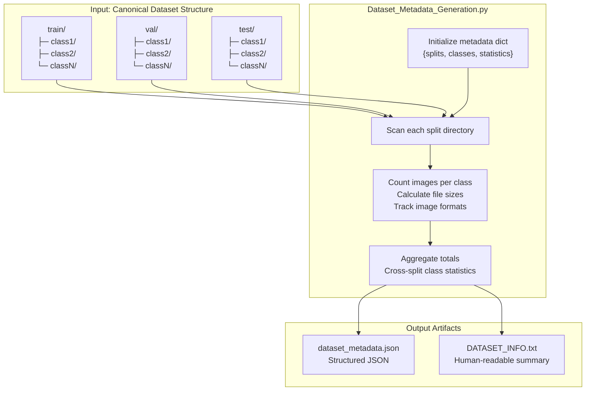
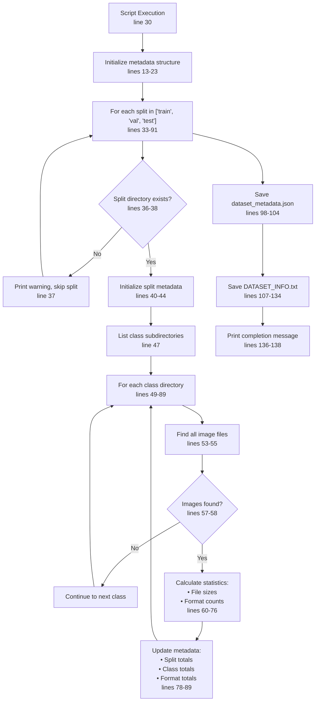
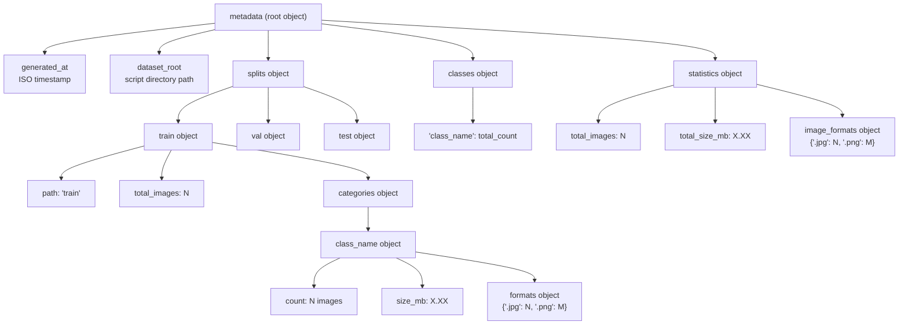

## Purpose and Scope

This document describes the `Dataset_Metadata_Generation.py` script, which generates comprehensive documentation of dataset composition, statistics, and class distribution after preprocessing. The script produces both machine-readable JSON and human-readable text outputs that capture dataset structure, image counts, file sizes, and format information across train/validation/test splits.

For information about the dataset organization that precedes this step, see [Dataset Organization](./Dataset_Organization_Seggregate_Dataset.py.md#3.1). For details on grayscale preprocessing, see [Grayscale Conversion](./Grayscale_Conversion.md#3.2).

**Sources:** [Preprocessing_Scripts/Dataset_Metadata_Generation.py:1-139](../Preprocessing_Scripts/Dataset_Metadata_Generation.py#L1-L139)

---

## Functional Overview

The `Dataset_Metadata_Generation.py` script serves as a post-processing documentation tool that analyzes the canonical train/val/test directory structure and generates statistical summaries. Unlike other preprocessing scripts that transform data, this script is **read-only** and non-destructive—it only inspects the dataset and creates documentation artifacts.

The script generates two complementary outputs:
1. **`dataset_metadata.json`** - Structured JSON containing detailed statistics organized by split and class
2. **`DATASET_INFO.txt`** - Human-readable text summary for quick reference

### Diagram: Metadata Generation System Architecture



**Sources:** [Preprocessing_Scripts/Dataset_Metadata_Generation.py:6-139](../Preprocessing_Scripts/Dataset_Metadata_Generation.py#L6-L139)

---

## Input Requirements

The script expects a specific directory structure matching the output of `Seggregate_Dataset.py`:

| Directory Level | Description | Example |
|----------------|-------------|---------|
| Root | Script directory | `Preprocessing_Scripts/` |
| Split Level | `train/`, `val/`, `test/` directories | Fixed names |
| Class Level | Subdirectories named by class | `Center/`, `Edge-Loc/`, `good/`, etc. |
| Image Files | Image files with supported extensions | `*.jpg`, `*.png`, `*.gif`, `*.bmp`, `*.tiff`, `*.webp` |

The supported image extensions are defined at [Preprocessing_Scripts/Dataset_Metadata_Generation.py:10](../Preprocessing_Scripts/Dataset_Metadata_Generation.py#L10):

```python
image_extensions = ['.jpg', '.jpeg', '.png', '.gif', '.bmp', '.tiff', '.webp']
```

The script assumes it is located in the same directory as the train/val/test folders and uses its own location as the dataset root at [Preprocessing_Scripts/Dataset_Metadata_Generation.py:7](../Preprocessing_Scripts/Dataset_Metadata_Generation.py#L7).

**Sources:** [Preprocessing_Scripts/Dataset_Metadata_Generation.py:7-26](../Preprocessing_Scripts/Dataset_Metadata_Generation.py#L7-L26)

---

## Processing Workflow

### Diagram: Metadata Collection Process Flow



**Sources:** [Preprocessing_Scripts/Dataset_Metadata_Generation.py:30-139](../Preprocessing_Scripts/Dataset_Metadata_Generation.py#L30-L139)

---

## Metadata Structure

The script maintains a nested dictionary structure that captures dataset information at multiple levels of granularity.

### Root Metadata Schema

The root metadata object is initialized at [Preprocessing_Scripts/Dataset_Metadata_Generation.py:13-23](../Preprocessing_Scripts/Dataset_Metadata_Generation.py#L13-L23):

| Field | Type | Description |
|-------|------|-------------|
| `generated_at` | ISO timestamp | Metadata generation time |
| `dataset_root` | String | Absolute path to dataset root |
| `splits` | Object | Per-split statistics (train/val/test) |
| `classes` | Object | Cross-split class totals |
| `statistics` | Object | Global statistics |

### Split-Level Structure

Each entry in the `splits` object follows the structure defined at [Preprocessing_Scripts/Dataset_Metadata_Generation.py:40-44](../Preprocessing_Scripts/Dataset_Metadata_Generation.py#L40-L44):

```json
{
  "path": "train",
  "total_images": 1500,
  "categories": {
    "class_name": {
      "count": 250,
      "size_mb": 12.5,
      "formats": {".jpg": 250}
    }
  }
}
```

### Diagram: Metadata JSON Hierarchy



**Sources:** [Preprocessing_Scripts/Dataset_Metadata_Generation.py:13-23](../Preprocessing_Scripts/Dataset_Metadata_Generation.py#L13-L23), [Preprocessing_Scripts/Dataset_Metadata_Generation.py:40-44](../Preprocessing_Scripts/Dataset_Metadata_Generation.py#L40-L44), [Preprocessing_Scripts/Dataset_Metadata_Generation.py:72-76](../Preprocessing_Scripts/Dataset_Metadata_Generation.py#L72-L76)

---

## Image Statistics Calculation

For each class within each split, the script calculates three key metrics:

### File Count
The number of images is determined by filtering directory contents for files with supported extensions at [Preprocessing_Scripts/Dataset_Metadata_Generation.py:53-55](../Preprocessing_Scripts/Dataset_Metadata_Generation.py#L53-L55):

```python
image_files = [f for f in os.listdir(class_path)
               if os.path.isfile(os.path.join(class_path, f))
               and os.path.splitext(f)[1].lower() in image_extensions]
```

### Size Calculation
Total storage size is computed by summing individual file sizes at [Preprocessing_Scripts/Dataset_Metadata_Generation.py:64-66](../Preprocessing_Scripts/Dataset_Metadata_Generation.py#L64-L66):

```python
for img_file in image_files:
    img_path = os.path.join(class_path, img_file)
    class_size += os.path.getsize(img_path)
```

The size is converted to megabytes and rounded to 2 decimal places at [Preprocessing_Scripts/Dataset_Metadata_Generation.py:74](../Preprocessing_Scripts/Dataset_Metadata_Generation.py#L74).

### Format Tracking
Image formats are tallied using a dictionary accumulator at [Preprocessing_Scripts/Dataset_Metadata_Generation.py:68-69](../Preprocessing_Scripts/Dataset_Metadata_Generation.py#L68-L69):

```python
ext = os.path.splitext(img_file)[1].lower()
format_count[ext] = format_count.get(ext, 0) + 1
```

**Sources:** [Preprocessing_Scripts/Dataset_Metadata_Generation.py:53-76](../Preprocessing_Scripts/Dataset_Metadata_Generation.py#L53-L76)

---

## Aggregation Logic

The script maintains running totals across multiple dimensions:

### Per-Split Aggregation
Each split accumulates its own total image count at [Preprocessing_Scripts/Dataset_Metadata_Generation.py:78](../Preprocessing_Scripts/Dataset_Metadata_Generation.py#L78):

```python
metadata["splits"][split_name]["total_images"] += len(image_files)
```

### Cross-Split Class Totals
The `classes` object tracks how many images of each class exist across all splits at [Preprocessing_Scripts/Dataset_Metadata_Generation.py:87-89](../Preprocessing_Scripts/Dataset_Metadata_Generation.py#L87-L89):

```python
if class_name not in metadata["classes"]:
    metadata["classes"][class_name] = 0
metadata["classes"][class_name] += len(image_files)
```

This allows analysis of class distribution independent of split boundaries.

### Global Statistics
Dataset-wide totals are accumulated at [Preprocessing_Scripts/Dataset_Metadata_Generation.py:79-80](../Preprocessing_Scripts/Dataset_Metadata_Generation.py#L79-L80) and [Preprocessing_Scripts/Dataset_Metadata_Generation.py:82-84](../Preprocessing_Scripts/Dataset_Metadata_Generation.py#L82-L84):

```python
total_images += len(image_files)
total_size += class_size