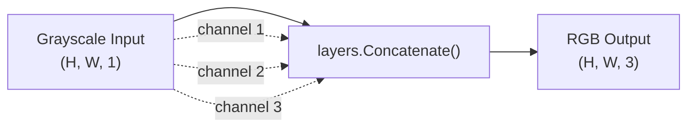
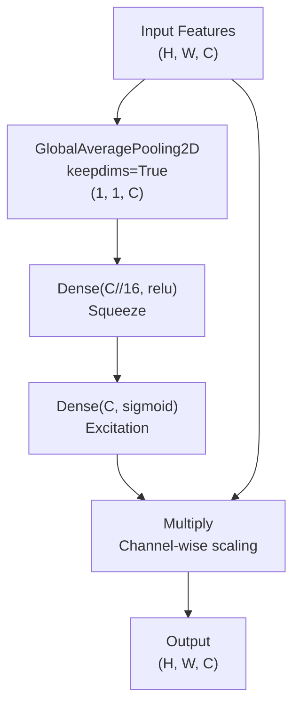
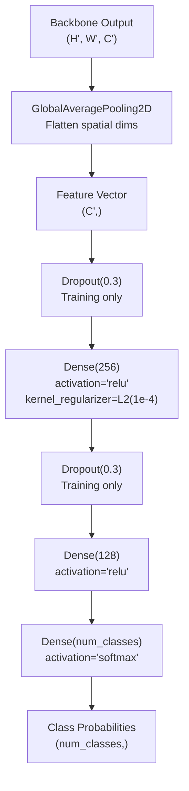
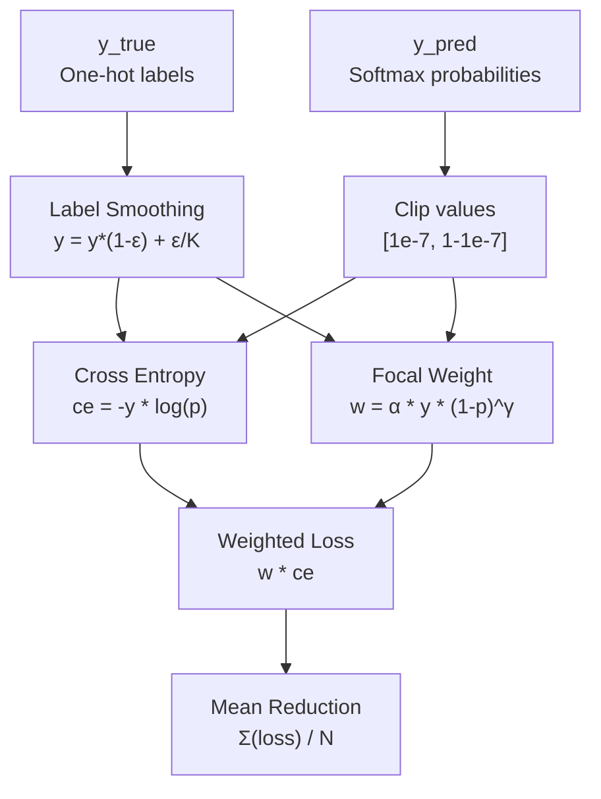
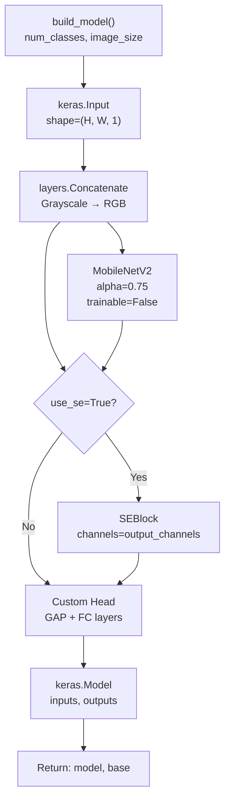
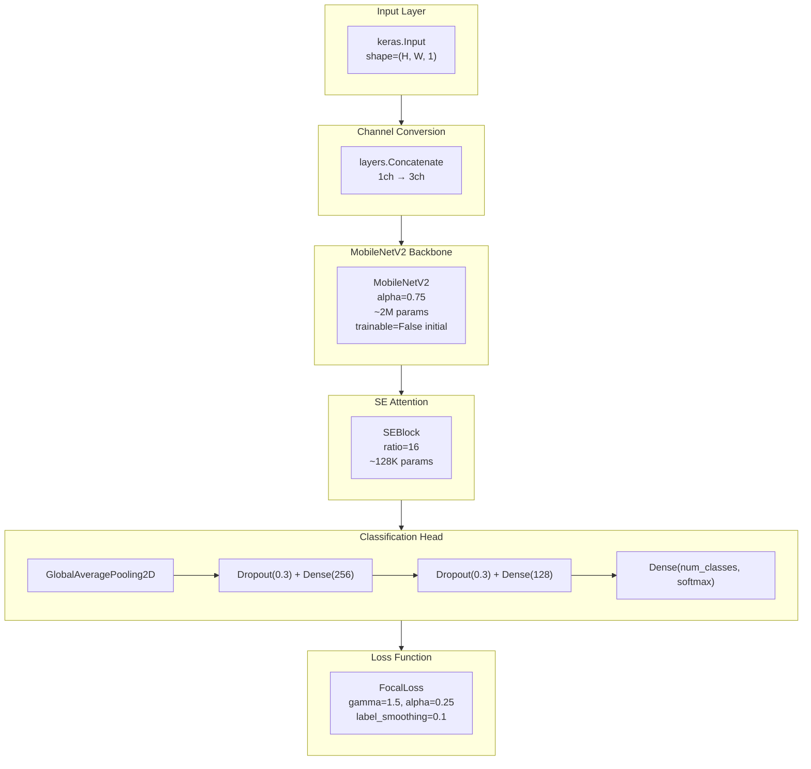

## Purpose and Scope

This document describes the neural network architecture used in the Core Training System for wafer defect classification. The architecture combines a MobileNetV2 backbone with Squeeze-and-Excitation (SE) attention and a custom classification head, trained using FocalLoss with label smoothing.

For information about how this architecture is trained progressively, see [Progressive Training Strategy](#2.2). For the data preprocessing pipeline feeding this model, see [Data Pipeline and Augmentation](#2.3).

---

## Architecture Overview

The model architecture consists of four sequential components: grayscale-to-RGB conversion, a MobileNetV2 feature extractor, optional SE attention, and a custom classification head.

**Architecture Flow Diagram**

```mermaid
graph LR
    Input["Input<br/>(H, W, 1)<br/>Grayscale"] --> Conv["Concatenate()<br/>Replicate to 3 channels"]
    Conv --> Backbone["MobileNetV2<br/>alpha=0.75<br/>weights='imagenet'<br/>include_top=False"]
    Backbone --> SE["SEBlock<br/>channels=backbone_output<br/>ratio=16"]
    SE --> GAP["GlobalAveragePooling2D()"]
    GAP --> D1["Dropout(0.3)"]
    D1 --> FC1["Dense(256, relu)<br/>L2(1e-4)"]
    FC1 --> D2["Dropout(0.3)"]
    D2 --> FC2["Dense(128, relu)"]
    FC2 --> Output["Dense(num_classes, softmax)"]
    
    Output --> Loss["FocalLoss<br/>gamma=1.5<br/>alpha=0.25<br/>label_smoothing=0.1"]
```



Sources: [train.py:328-366](), [kaggle-notebook.ipynb:331-334]()

---

## MobileNetV2 Backbone Configuration

The backbone is a MobileNetV2 network with width multiplier α=0.75, pretrained on ImageNet. This reduced width provides a balance between computational efficiency and representational capacity for the wafer defect detection task.

### Backbone Parameters

| Parameter | Value | Purpose |
|-----------|-------|---------|
| `alpha` | 0.75 | Width multiplier (75% of base channels) |
| `include_top` | False | Remove classification head |
| `weights` | 'imagenet' | Initialize with ImageNet weights |
| `input_shape` | (H, H, 3) | Variable resolution (128/160/224) |
| `trainable` | False (initial) | Frozen during early training stages |

Sources: [train.py:337-342](), [train.py:48-49]()

### Grayscale to RGB Conversion

The model accepts single-channel grayscale images but MobileNetV2 requires 3-channel RGB input. The conversion is performed by triplicating the grayscale channel:



Sources: [train.py:331-334]()

**Implementation:**
```python
inputs = keras.Input(shape=(image_size, image_size, 1))
x = layers.Concatenate()([inputs, inputs, inputs])
```

This approach preserves the single-channel nature of wafer defect patterns while maintaining compatibility with ImageNet-pretrained weights.

---

## SE Attention Block

The Squeeze-and-Excitation (SE) Block implements channel-wise attention, allowing the model to recalibrate feature responses by explicitly modeling interdependencies between channels.

### SEBlock Class Architecture



Sources: [train.py:131-149]()

### Mathematical Formulation

The SE block performs three operations:

1. **Squeeze**: Global spatial information aggregation
   - `z = GlobalAveragePooling2D(x)`
   - Produces channel descriptor: z ∈ R^C

2. **Excitation**: Channel-wise gating mechanism
   - `s = σ(W₂ · ReLU(W₁ · z))`
   - W₁ reduces dimensionality by ratio r=16
   - W₂ restores to original channels C

3. **Scale**: Channel-wise multiplication
   - `y = x ⊙ s`

### Implementation Details

| Component | Type | Configuration |
|-----------|------|---------------|
| `global_pool` | GlobalAveragePooling2D | keepdims=True |
| `fc1` | Dense(channels // 16) | activation='relu' |
| `fc2` | Dense(channels) | activation='sigmoid' |
| `ratio` | 16 | Reduction ratio for bottleneck |

Sources: [train.py:131-149]()

**Code Entity Mapping:**
- Class: `SEBlock(layers.Layer)`
- Constructor parameters: `channels`, `ratio=16`
- Methods: `call(inputs)`, `get_config()`

---

## Classification Head

The classification head transforms backbone features into class probabilities through a series of fully-connected layers with dropout regularization.

### Head Architecture



Sources: [train.py:356-362]()

### Layer Specifications

| Layer | Output Shape | Parameters | Regularization |
|-------|-------------|------------|----------------|
| GlobalAveragePooling2D | (batch, channels) | 0 | - |
| Dropout | (batch, channels) | 0 | p=0.3 |
| Dense (FC1) | (batch, 256) | channels×256 | L2(1e-4) |
| Dropout | (batch, 256) | 0 | p=0.3 |
| Dense (FC2) | (batch, 128) | 256×128 | None |
| Dense (Output) | (batch, 8) | 128×8 | None |

**Total trainable parameters in head**: ~33K (excluding backbone)

Sources: [train.py:356-362]()

---

## FocalLoss Function

FocalLoss addresses class imbalance by down-weighting well-classified examples and focusing on hard negatives. This implementation includes label smoothing for regularization.

### FocalLoss Class Structure



Sources: [train.py:293-321]()

### Mathematical Definition

The focal loss with label smoothing is computed as:

**Step 1: Label Smoothing**
```
y_smooth = y_true * (1 - ε) + ε / K
```
where ε = 0.1 (LABEL_SMOOTHING), K = num_classes

**Step 2: Focal Loss**
```
FL(p_t) = -α * (1 - p_t)^γ * log(p_t)
```

**Step 3: Batch Aggregation**
```
L = (1/N) * Σ Σ FL(p_ij)
```

### Hyperparameter Configuration

| Parameter | Value | Purpose |
|-----------|-------|---------|
| `gamma` | 1.5 | Focusing parameter (down-weights easy examples) |
| `alpha` | 0.25 | Balancing factor for positive examples |
| `label_smoothing` | 0.1 | Regularization via soft targets |

Sources: [train.py:61-63](), [train.py:293-321]()

### Implementation Code Mapping

**Class:** `FocalLoss(keras.losses.Loss)`
- Constructor: `__init__(gamma=1.5, alpha=0.25, label_smoothing=0.1)`
- Core method: `call(y_true, y_pred)`
- Serialization: `get_config()`

The loss computation is fully vectorized using TensorFlow operations:
- [train.py:300-312](): Loss calculation with label smoothing and focal weighting

---

## Model Construction Pipeline

The `build_model()` function orchestrates the assembly of all architectural components into a complete Keras Model.

### Construction Flow



Sources: [train.py:328-366]()

### Function Signature and Parameters

```python
def build_model(num_classes, image_size, use_se=True, weights=None):
    """Build MobileNetV2 with optional SE attention"""
    # Returns: (model, base_backbone)
```

**Parameters:**
| Name | Type | Default | Description |
|------|------|---------|-------------|
| `num_classes` | int | - | Number of output classes (8 for wafer defects) |
| `image_size` | int | - | Input resolution (128, 160, or 224) |
| `use_se` | bool | True | Enable SE attention block |
| `weights` | array/None | None | Pre-trained weights to transfer |

**Returns:**
- `model`: Complete Keras Model with full forward pass
- `base`: MobileNetV2 backbone reference (for fine-tuning control)

Sources: [train.py:328-366]()

---

## Model Configuration Reference

All architectural hyperparameters are centralized in the `Config` class for consistent configuration across training scripts.

### Config Class Architecture Parameters

```python
class Config:
    # Model architecture
    BACKBONE = "MobileNetV2"
    ALPHA = 0.75
    USE_SE_ATTENTION = True
    
    # Loss function
    FOCAL_GAMMA = 1.5
    FOCAL_ALPHA = 0.25
    LABEL_SMOOTHING = 0.1
```

Sources: [train.py:28-65](), [kaggle-notebook.ipynb:39-63]()

### Complete Parameter Table

| Category | Parameter | Value | Location |
|----------|-----------|-------|----------|
| **Backbone** | BACKBONE | "MobileNetV2" | Config.BACKBONE |
| | ALPHA | 0.75 | Config.ALPHA |
| | USE_SE_ATTENTION | True | Config.USE_SE_ATTENTION |
| **Loss** | FOCAL_GAMMA | 1.5 | Config.FOCAL_GAMMA |
| | FOCAL_ALPHA | 0.25 | Config.FOCAL_ALPHA |
| | LABEL_SMOOTHING | 0.1 | Config.LABEL_SMOOTHING |
| **Training** | BATCH_SIZE | 32 | Config.BATCH_SIZE |
| | INITIAL_LR | 1e-3 | Config.INITIAL_LR |
| | FINE_TUNE_LR | 5e-5 | Config.FINE_TUNE_LR |
| **Progressive** | PROGRESSIVE_SIZES | [128, 160, 224] | Config.PROGRESSIVE_SIZES |
| | PROGRESSIVE_EPOCHS | [20, 25, 35] | Config.PROGRESSIVE_EPOCHS |

Sources: [train.py:28-65]()

---

## Architecture Component Summary

### Complete Model Stack



Sources: [train.py:328-366](), [train.py:131-149](), [train.py:293-321]()

### Key Design Decisions

1. **MobileNetV2 with α=0.75**: Reduces parameters while maintaining sufficient capacity for defect pattern recognition
2. **SE Attention**: Adds channel-wise recalibration with minimal parameter overhead (~128K)
3. **Deep Classification Head**: Two-stage fully-connected network (256→128) provides non-linear decision boundary
4. **FocalLoss with Label Smoothing**: Handles class imbalance while preventing overconfidence
5. **Dropout Regularization**: p=0.3 reduces overfitting in fully-connected layers

### Model Statistics

| Metric | Value | Notes |
|--------|-------|-------|
| Total Parameters | ~2.3M | Including backbone and head |
| Trainable (initial) | ~33K | Only head layers |
| Trainable (fine-tuned) | ~500K | Top backbone layers unfrozen |
| Input Shape | (H, H, 1) | H ∈ {128, 160, 224} |
| Output Shape | (8,) | 8 defect classes |
| FLOPs (224×224) | ~300M | Approximate inference cost |

Sources: [train.py:328-366](), [train.py:462-473]()