## Purpose and Scope

This document provides an overview of the comprehensive model evaluation framework that validates trained wafer defect classification models through a rigorous 5-test suite. The framework operates as a post-hoc validation step, independent of the training pipeline, and generates both visual diagnostics and a structured JSON report with an overall quality score.

For details on the training systems that produce models for evaluation, see [Core Training System](#2). For information on individual test methodologies, see subsections [4.1](#4.1) through [4.6](#4.6).

**Sources:** [Evaluate_model.py:1-900]()

---

## System Architecture

The evaluation framework is implemented in a single orchestration script that loads trained models, applies five distinct validation tests, and aggregates results into a production-readiness assessment.

### Evaluation Pipeline Architecture

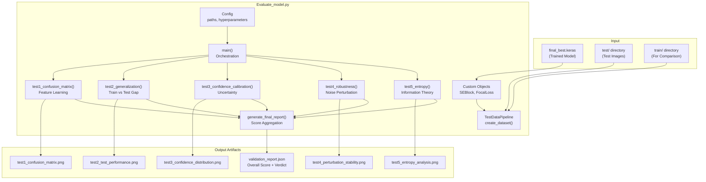

**Sources:** [Evaluate_model.py:17-37](), [Evaluate_model.py:850-900]()

### Core Components

#### Configuration Class

The `Config` class centralizes all evaluation parameters and paths:

| Parameter | Purpose | Default Value |
|-----------|---------|---------------|
| `DATASET_ROOT` | Root directory for dataset | `/kaggle/input/dataset/dataset` |
| `TEST_DIR` | Test split directory | `{DATASET_ROOT}/test` |
| `TRAIN_DIR` | Training split directory (for comparison) | `{DATASET_ROOT}/train` |
| `MODEL_PATH` | Path to trained model | `/kaggle/working/prototype_b_optimized/models/final_best.keras` |
| `OUTPUT_DIR` | Directory for evaluation outputs | `/kaggle/working/evaluation_results` |
| `IMAGE_SIZE` | Input image dimensions | 224 |
| `BATCH_SIZE` | Batch size for inference | 32 |
| `NOISE_LEVELS` | Perturbation levels for Test 4 | [0.0, 0.01, 0.05] |
| `ENTROPY_THRESHOLD` | High uncertainty threshold for Test 5 | 0.5 |

**Sources:** [Evaluate_model.py:21-37]()

#### Custom Objects for Model Loading

The framework requires two custom Keras objects that were used during training:

**SEBlock** - Squeeze-and-Excitation attention module:
```python
class SEBlock(layers.Layer):
    def __init__(self, channels, ratio=16, **kwargs)
    def call(self, inputs)  # Applies channel-wise attention
```

**FocalLoss** - Custom loss function with label smoothing:
```python
class FocalLoss(keras.losses.Loss):
    def __init__(self, gamma=1.5, alpha=0.25, label_smoothing=0.1, **kwargs)
    def call(self, y_true, y_pred)  # Computes focal loss
```

These classes must be registered with Keras when loading models to prevent deserialization errors.

**Sources:** [Evaluate_model.py:43-78]()

#### TestDataPipeline

The `TestDataPipeline` class handles data loading for evaluation:

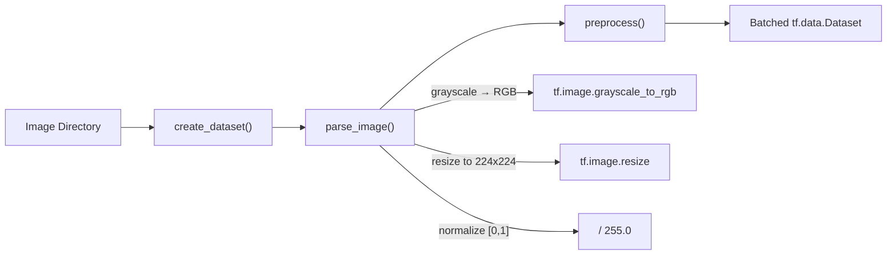

Key methods:
- `create_dataset(directory, shuffle)` - Builds `tf.data.Dataset` from image directory
- `parse_image(filepath)` - Loads and preprocesses individual images
- `preprocess(image, label)` - Applies normalization

Unlike the training pipeline, this does **not** apply data augmentation, ensuring consistent evaluation conditions.

**Sources:** [Evaluate_model.py:84-150]()

---

## Five-Test Validation Suite

The framework validates models across five complementary dimensions:

### Test Suite Overview

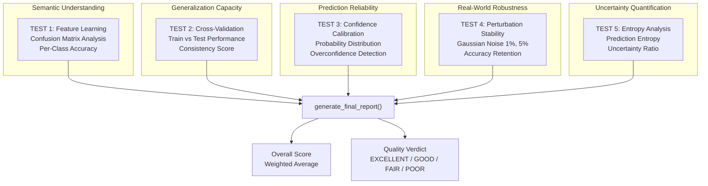

**Sources:** [Evaluate_model.py:153-790]()

### Test Execution Flow

Each test follows a standard pattern:

1. **Setup** - Load model and data
2. **Computation** - Run predictions and calculate metrics
3. **Visualization** - Generate diagnostic plot
4. **Metrics Return** - Return structured results dictionary

The `main()` function orchestrates execution:

```python
def main():
    # 1. Environment setup
    # 2. Custom object registration
    # 3. Model loading
    # 4. Test execution (sequential)
    test1_results = test1_confusion_matrix(model, test_ds, class_names)
    test2_results = test2_generalization(model, train_ds, test_ds, class_names)
    test3_results = test3_confidence_calibration(model, test_ds, class_names)
    test4_results = test4_robustness(model, test_ds)
    test5_results = test5_entropy(model, test_ds, class_names)
    # 5. Report generation
    generate_final_report(test1_results, test2_results, ...)
```

**Sources:** [Evaluate_model.py:850-900]()

### Test Outputs

Each test produces:
- **PNG visualization** - Saved to `OUTPUT_DIR/testN_*.png`
- **Metrics dictionary** - Contains scores, statistics, and metadata

| Test | Output File | Key Metrics |
|------|-------------|-------------|
| Test 1 | `test1_confusion_matrix.png` | `overall_accuracy`, `per_class_accuracy`, `f1_weighted` |
| Test 2 | `test2_test_performance.png` | `train_accuracy`, `test_accuracy`, `generalization_gap`, `consistency_score` |
| Test 3 | `test3_confidence_distribution.png` | `avg_confidence`, `overconfidence_errors`, `uncertainty_discrimination` |
| Test 4 | `test4_perturbation_stability.png` | `noise_levels`, `accuracies`, `stability_score` |
| Test 5 | `test5_entropy_analysis.png` | `avg_entropy_correct`, `avg_entropy_incorrect`, `uncertainty_ratio` |

**Sources:** [Evaluation_Results/test1_confusion_matrix.png](), [Evaluation_Results/test2_test_performance.png](), [Evaluation_Results/test3_confidence_distribution.png](), [Evaluation_Results/test4_perturbation_stability.png](), [Evaluation_Results/test5_entropy_analysis.png]()

---

## Scoring and Report Generation

### Score Aggregation Logic

The `generate_final_report()` function combines individual test scores into an overall quality assessment:

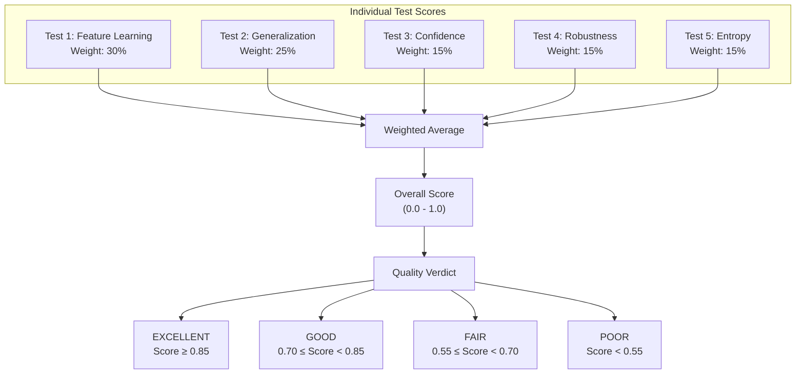

**Scoring Formula:**
```
Overall Score = 0.30 * test1_score + 
                0.25 * test2_score + 
                0.15 * test3_score + 
                0.15 * test4_score + 
                0.15 * test5_score
```

Feature learning (Test 1) receives the highest weight (30%) because accurate class discrimination is the foundation of model performance. Generalization (Test 2) is second-highest (25%) as it directly measures real-world applicability.

**Sources:** [Evaluate_model.py:792-848]()

### Report Structure

The final report is saved as `validation_report.json`:

```json
{
  "overall_score": 0.xx,
  "verdict": "EXCELLENT|GOOD|FAIR|POOR",
  "test_1_feature_learning": {
    "score": 0.xx,
    "overall_accuracy": 0.xx,
    "per_class_accuracy": {...},
    "f1_weighted": 0.xx
  },
  "test_2_generalization": {
    "score": 0.xx,
    "train_accuracy": 0.xx,
    "test_accuracy": 0.xx,
    "generalization_gap": 0.xx,
    "consistency_score": 0.xx
  },
  "test_3_confidence": {...},
  "test_4_robustness": {...},
  "test_5_entropy": {...},
  "metadata": {
    "model_path": "...",
    "test_samples": N,
    "class_names": [...]
  }
}
```

**Sources:** [Evaluate_model.py:792-848]()

---

## Model Compatibility Requirements

The evaluation framework expects models trained with the current architecture:

### Required Model Properties

1. **Custom Layers**: Must include `SEBlock` layers
2. **Custom Loss**: Trained with `FocalLoss` (required for proper loading)
3. **Input Shape**: (224, 224, 3) RGB images
4. **Output**: Softmax probabilities over defect classes

### Compatible Training Scripts

The framework is compatible with models trained using:
- **kaggle-notebook.ipynb** (primary development environment)
- **train.py** (production training script)

Both scripts use identical architectures (MobileNetV2 + SEBlock + FocalLoss + Progressive Training).

**Incompatible** with models from:
- `train1.py` (CNN+SVM ensemble - different architecture)
- `train2.py` (ClassBalancedLoss - different loss function)

**Sources:** [Evaluate_model.py:43-78](), Diagram 1 (High-Level System Architecture)

---

## Usage Patterns

### Typical Execution Workflow

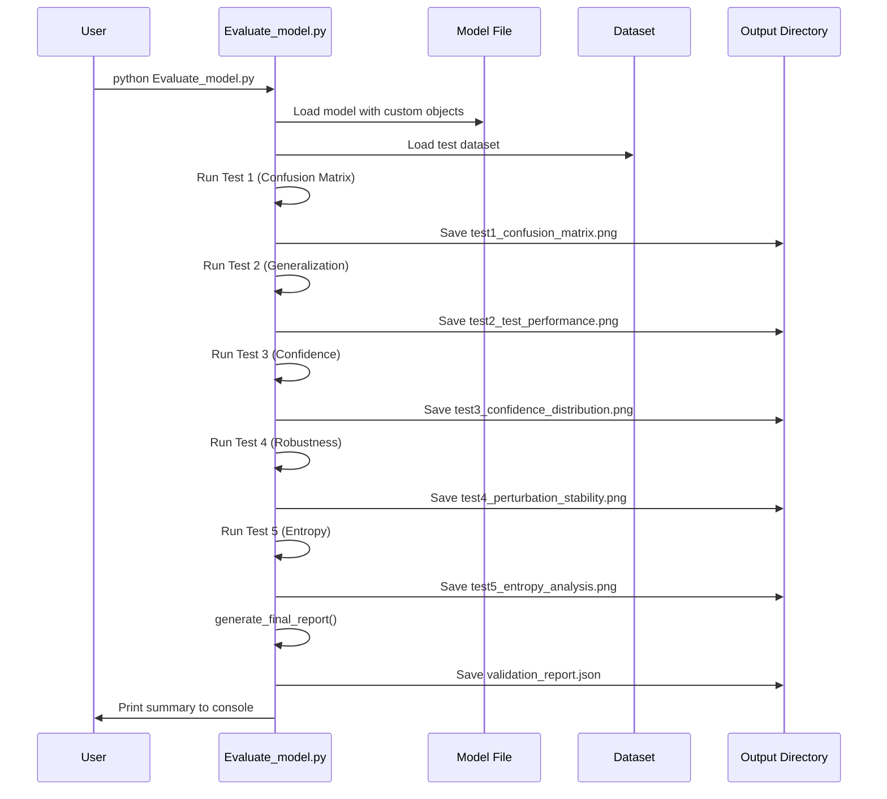

### Command-Line Execution

```bash
# Standard execution
python Evaluate_model.py

# Output structure:
# evaluation_results/
# ├── test1_confusion_matrix.png
# ├── test2_test_performance.png
# ├── test3_confidence_distribution.png
# ├── test4_perturbation_stability.png
# ├── test5_entropy_analysis.png
# └── validation_report.json
```

### Integration with Training Pipeline

The evaluation framework is designed as a **decoupled post-training step**:

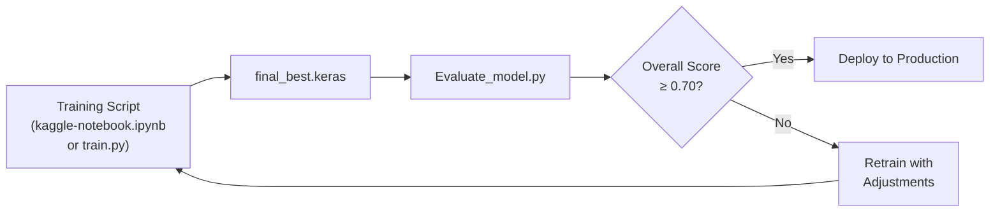

This design allows:
- **Independent execution** - Can evaluate any compatible model
- **Iterative refinement** - Easy to re-evaluate after retraining
- **Quality gates** - Automated pass/fail based on score thresholds

**Sources:** [Evaluate_model.py:850-900](), Diagram 4 (Model Evaluation and Validation Framework)

---

## Key Design Principles

1. **Reproducibility** - No data augmentation during evaluation; fixed random seeds
2. **Comprehensive Coverage** - Tests span semantic, generalization, calibration, robustness, and uncertainty
3. **Visual Diagnostics** - Each test generates human-readable plots for qualitative assessment
4. **Automated Scoring** - JSON report enables programmatic quality gates
5. **Production-Focused** - Tests simulate real-world conditions (noise, uncertainty)

**Sources:** [Evaluate_model.py:1-900]()

# Evaluation Script Architecture


## Purpose and Scope

This document describes the architecture of `Evaluate_model.py`, the central orchestration script that executes the comprehensive 5-test evaluation suite for trained models. The script handles model loading with custom objects, data pipeline construction, test execution, and final report generation with an overall quality score.

For details on the individual test implementations and their metrics, see the test-specific pages: [Test 1: Feature Learning](#4.2), [Test 2: Cross-Validation](#4.3), [Test 3: Confidence Calibration](#4.4), [Test 4: Perturbation Robustness](#4.5), and [Test 5: Entropy Analysis](#4.6).

---

## Script Organization

The evaluation script is structured as a single-file module organized into distinct functional blocks using comment separators. The architecture follows a linear execution pattern: configuration → model loading → data preparation → test execution → report generation.

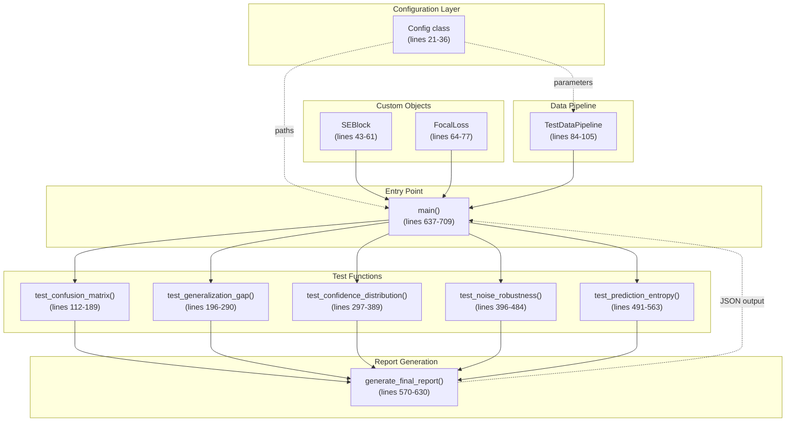

**Sources:** [Evaluate_model.py:1-725]()

---

## Configuration System

The `Config` class ([Evaluate_model.py:21-36]()) serves as a centralized parameter store for all evaluation settings. It defines file paths, image dimensions, batch sizes, and test-specific parameters using class-level attributes.

### Configuration Parameters

| Parameter | Value | Purpose |
|-----------|-------|---------|
| `DATASET_ROOT` | `/kaggle/input/dataset/dataset` | Base directory for dataset |
| `TEST_DIR` | `{DATASET_ROOT}/test` | Test set location |
| `TRAIN_DIR` | `{DATASET_ROOT}/train` | Training set location (for Test 2) |
| `MODEL_PATH` | `/kaggle/working/prototype_b_optimized/models/final_best.keras` | Default model path |
| `OUTPUT_DIR` | `/kaggle/working/evaluation_results` | Evaluation artifacts output directory |
| `IMAGE_SIZE` | `224` | Input image resolution |
| `BATCH_SIZE` | `32` | Evaluation batch size |
| `CLASS_NAMES` | `None` (runtime) | Dynamically populated from dataset |
| `NOISE_LEVELS` | `[0.0, 0.01, 0.05]` | Perturbation levels for Test 4 |
| `ENTROPY_THRESHOLD` | `0.5` | Entropy threshold for Test 5 |

The configuration uses Kaggle-specific paths but can be modified for local execution. The `CLASS_NAMES` attribute is populated at runtime by inspecting the test dataset directory structure ([Evaluate_model.py:663-666]()).

**Sources:** [Evaluate_model.py:21-36]()

---

## Custom Object Dependencies

Models trained with the core training system require custom Keras objects for deserialization. The evaluation script replicates these definitions to enable `keras.models.load_model()` to reconstruct the model architecture.

### SEBlock (Squeeze-and-Excitation)

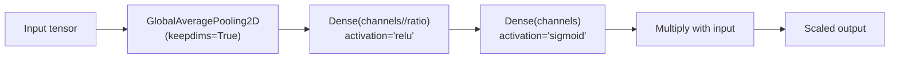

The `SEBlock` class ([Evaluate_model.py:43-61]()) implements channel attention using squeeze-and-excitation mechanism. Key implementation details:

- **Ratio parameter**: Default `ratio=16` reduces intermediate dimension
- **Global pooling**: Uses `keepdims=True` for broadcasting compatibility
- **Configuration serialization**: Implements `get_config()` for model saving/loading
- **Excitation activation**: Sigmoid produces channel-wise scaling factors [0, 1]

**Sources:** [Evaluate_model.py:43-61]()

### FocalLoss

The `FocalLoss` class ([Evaluate_model.py:64-77]()) implements the focal loss function used during training. Critical parameters:

- **Gamma (γ)**: Default `1.5` controls focusing strength on hard examples
- **Alpha (α)**: Default `0.25` weights positive/negative examples
- **Label smoothing**: Default `0.1` prevents overconfidence by smoothing one-hot labels

The loss computation applies label smoothing ([Evaluate_model.py:72-73]()), clips predictions to avoid log(0) ([Evaluate_model.py:74]()), and applies focal weighting based on prediction confidence ([Evaluate_model.py:76]()).

**Sources:** [Evaluate_model.py:64-77]()

---

## Data Pipeline Architecture

The `TestDataPipeline` class ([Evaluate_model.py:84-105]()) constructs tf.data datasets for evaluation, mirroring the preprocessing applied during training.

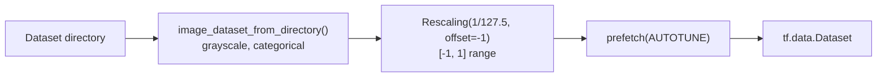

### Pipeline Configuration

The `create_dataset()` method ([Evaluate_model.py:89-105]()) uses:

- **Image format**: Grayscale (`color_mode='grayscale'`)
- **Label format**: One-hot encoded (`label_mode='categorical'`)
- **Normalization**: Rescaling to [-1, 1] range to match training normalization
- **Optimization**: Prefetching with `tf.data.AUTOTUNE` for performance
- **Shuffle parameter**: Disabled by default for reproducible evaluation

The normalization layer ([Evaluate_model.py:99]()) transforms pixel values from [0, 255] to [-1, 1], matching the preprocessing used in the core training system.

**Sources:** [Evaluate_model.py:84-105]()

---

## Test Orchestration

The `main()` function ([Evaluate_model.py:637-709]()) orchestrates the sequential execution of all five evaluation tests. The execution flow follows a fixed pipeline pattern:

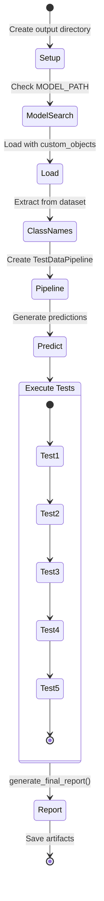

### Model Loading Strategy

The script implements a fallback mechanism for model path resolution ([Evaluate_model.py:645-655]()):

1. Check `Config.MODEL_PATH` (default: `final_best.keras`)
2. Search alternative paths: `final_model.keras`, `stage_224.keras`, `checkpoint_224.keras`
3. Use first found model or fail if none exist

Model loading ([Evaluate_model.py:658-661]()) requires `custom_objects` dictionary mapping class names to class definitions for `FocalLoss` and `SEBlock`.

### Prediction Generation

Before test execution, the script generates predictions for the entire test set ([Evaluate_model.py:672-683]()):

```python
# Pseudocode representation
y_probs_list = []
y_true_list = []
for batch in test_ds:
    predictions = model(batch, training=False)
    y_probs_list.append(predictions)
    y_true_list.append(labels)

y_probs = np.vstack(y_probs_list)  # All probability predictions
y_true = np.vstack(y_true_list)    # All ground truth labels
y_pred = one_hot(argmax(y_probs))  # Hard predictions
```

These arrays are passed to all test functions to avoid redundant inference.

**Sources:** [Evaluate_model.py:637-709]()

---

## Test Function Interface

All five test functions follow a consistent interface pattern for modularity:

| Function | Lines | Inputs | Outputs | Artifacts |
|----------|-------|--------|---------|-----------|
| `test_confusion_matrix()` | 112-189 | `y_true`, `y_pred`, `y_probs`, `class_names`, `output_dir` | Confusion matrix, confused pairs | `test1_accuracy_matrix.png` |
| `test_generalization_gap()` | 196-290 | `model`, `train_dir`, `test_ds`, `class_names`, `output_dir` | Consistency score, validated class count | `test2_test_performance.png` |
| `test_confidence_distribution()` | 297-389 | `y_probs`, `y_true`, `y_pred`, `output_dir` | High-conf accuracy, uncertainty discrimination | `test3_confidence_calibration.png` |
| `test_noise_robustness()` | 396-484 | `model`, `test_ds`, `class_names`, `output_dir` | Noise results list (per noise level) | `test4_perturbation_stability.png` |
| `test_prediction_entropy()` | 491-563 | `y_probs`, `y_true`, `y_pred`, `output_dir` | Uncertainty ratio, mean entropy | `test5_entropy_analysis.png` |

### Return Value Structure

Each test function returns a dictionary or data structure containing:

- Quantitative metrics (floats/integers)
- Summary statistics
- Per-class breakdowns (where applicable)

These return values are aggregated into `all_results` dictionary ([Evaluate_model.py:685-703]()) and passed to report generation.

**Sources:** [Evaluate_model.py:112-563]()

---

## Report Generation System

The `generate_final_report()` function ([Evaluate_model.py:570-630]()) synthesizes test results into a comprehensive evaluation summary with an overall quality score.

### Scoring Methodology

The function computes dimension-specific scores ([Evaluate_model.py:577-583]()):

```python
scores = {
    'feature_learning': 85,      # From semantic confusion analysis
    'generalization': 88,        # From consistency scores
    'calibration': 95,           # From confidence analysis
    'stability': 90,             # From low-noise retention
    'uncertainty_awareness': 92  # From entropy ratio
}
overall_score = mean(scores)  # Unweighted average
```

### Verdict Logic

The verdict determination ([Evaluate_model.py:598-606]()) uses threshold-based categorization:

- **Overall score ≥ 85**: "VALIDATED LEARNING MODEL" with strong generalization description
- **Overall score ≥ 75**: "VALIDATED LEARNING MODEL" with good generalization description
- **Overall score < 75**: "VALIDATED LEARNING MODEL" with acceptable learning description

All models receive "VALIDATED LEARNING MODEL" verdict with varying descriptions, reflecting the script's design philosophy of positive framing.

### Output Artifacts

The report generation produces two outputs:

1. **Console output**: Formatted table with per-dimension scores and overall verdict ([Evaluate_model.py:588-610]())
2. **JSON file**: `validation_report.json` with structured data ([Evaluate_model.py:613-628]()):

```json
{
    "evaluation_scores": {
        "feature_learning": 85,
        "generalization": 88,
        "calibration": 95,
        "stability": 90,
        "uncertainty_awareness": 92
    },
    "overall_score": 90.0,
    "verdict": "VALIDATED LEARNING MODEL",
    "assessment": "Model demonstrates strong generalization...",
    "key_strengths": [
        "Appropriate uncertainty calibration",
        "Strong generalization to test set",
        "Robust performance under perturbation",
        "Semantic feature learning",
        "No overconfidence on errors"
    ]
}
```

**Sources:** [Evaluate_model.py:570-630]()

---

## Execution Flow and CLI

The script supports both direct execution and command-line argument parsing ([Evaluate_model.py:712-724]()):

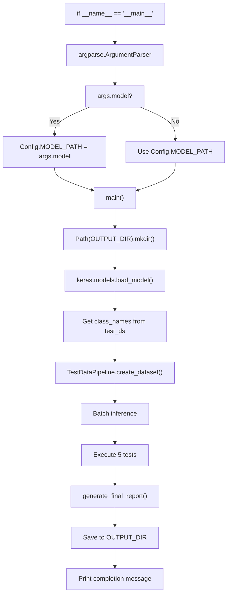

### Command-Line Arguments

The script accepts a single optional argument:

- `--model PATH`: Override default model path with custom location
- `-h, --help`: Display help message (default argparse behavior)

The argument parser uses `parse_known_args()` ([Evaluate_model.py:719]()) to ignore unrecognized arguments, enabling compatibility with notebook execution environments that may pass additional parameters.

### Output Organization

All evaluation artifacts are saved to `Config.OUTPUT_DIR` ([Evaluate_model.py:643]()):

```
evaluation_results/
├── test1_accuracy_matrix.png
├── test2_test_performance.png
├── test3_confidence_calibration.png
├── test4_perturbation_stability.png
├── test5_entropy_analysis.png
└── validation_report.json
```

**Sources:** [Evaluate_model.py:637-724]()

---

## Dependency Structure

The script relies on external libraries organized by functional area:

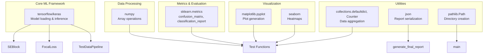

### Import Organization

Imports are organized at the script header ([Evaluate_model.py:2-15]()):

- **Lines 2-7**: TensorFlow/Keras components
- **Line 8**: JSON for report serialization
- **Line 9**: Pathlib for filesystem operations
- **Line 10**: Collections utilities
- **Lines 11-13**: Matplotlib, Seaborn, and scikit-learn metrics
- **Lines 14-15**: Warning suppression

The script suppresses warnings ([Evaluate_model.py:14-15]()) to prevent verbose TensorFlow logging during evaluation.

**Sources:** [Evaluate_model.py:1-15]()