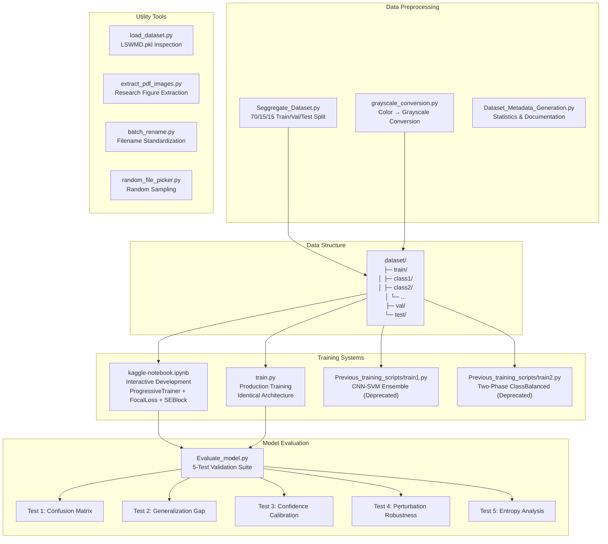
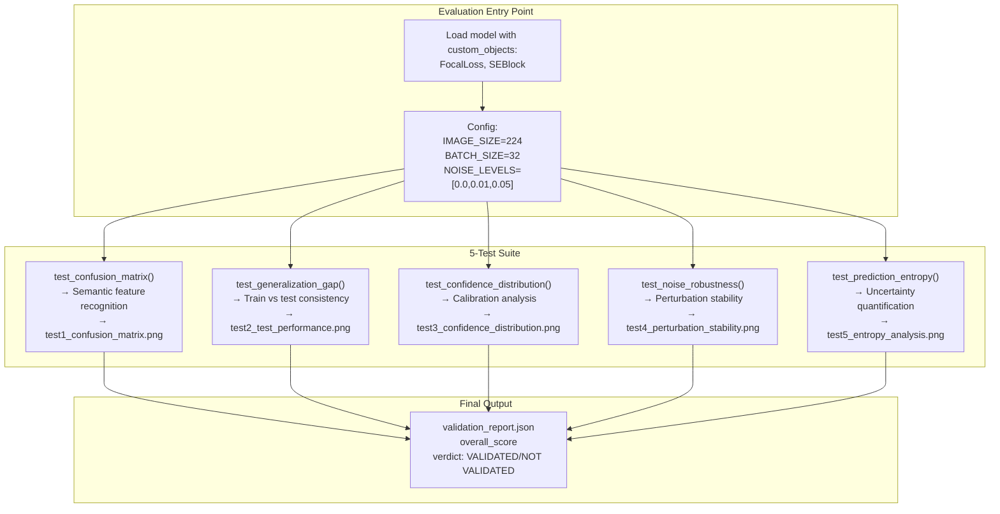
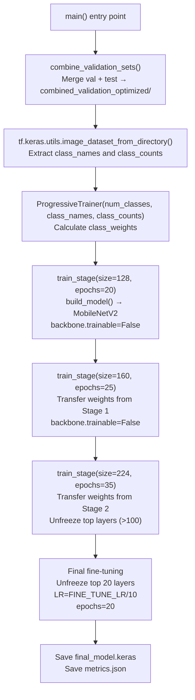

## Purpose and Scope

**Forsaken-Apex** is a production-ready deep learning system for automated semiconductor wafer defect detection and classification. The system processes grayscale wafer images to identify and classify manufacturing defects including coating defects, contamination, scratches, etching issues, bridging, voids, and foreign material contamination.

This document provides a high-level architectural overview of the entire codebase, mapping the major subsystems and their interactions. For detailed information about specific components:

- Core training methodology using progressive resizing and focal loss: see [Core Training System](./Core_Training_System.md)
- Data preprocessing and augmentation pipeline: see [Data Preprocessing Pipeline](./Data_Pipeline_and_Augmentation.md)
- Comprehensive model validation framework: see [Model Evaluation Framework](./Model_Evaluation_Framework.md)
- Experimental training approaches: see [Alternative Training Approaches](./Two-Phase_Training_with_Class_Balancing_train2.py.md)
- Supporting utilities: see [Utility Tools](./Utility_Tools.md)

**Sources:** [README.md:1-3](../README.md#L1-L3), [kaggle-notebook.ipynb:1-80](../kaggle-notebook.ipynb#L1-L80), [train.py:1-80](../train.py#L1-L80)

---

## System Architecture

The Forsaken-Apex repository is organized around three primary workflows: **training**, **evaluation**, and **data preparation**. The current production system uses a progressive resizing training strategy with focal loss, implemented in both an interactive Jupyter notebook (`kaggle-notebook.ipynb`) and a production script (`train.py`).

### Repository Structure



**Diagram: Repository Component Organization and Data Flow**

The system follows a **linear preprocessing pipeline** (dataset organization → grayscale conversion → training-ready structure) that feeds into multiple training approaches. The current production approach (`kaggle-notebook.ipynb` and `train.py`) represents the third generation of the system, superseding earlier ensemble and two-phase training methods.

**Sources:** [kaggle-notebook.ipynb:1-100](../kaggle-notebook.ipynb#L1-L100), [train.py:1-100](../train.py#L1-L100), [Evaluate_model.py:1-80](../Evaluate_model.py#L1-L80)

---

## Core Components

### Training Pipeline

The production training system is implemented identically in both `kaggle-notebook.ipynb` and `train.py`, with the notebook serving as the interactive development environment and the script as the deployment artifact.

```mermaid
graph LR
    subgraph Config["Config Class"]
        PATHS["DATASET_ROOT<br/>TRAIN_DIR<br/>VAL_DIR<br/>MODEL_DIR"]
        HYPER["PROGRESSIVE_SIZES: [128,160,224]<br/>PROGRESSIVE_EPOCHS: [20,25,35]<br/>BATCH_SIZE: 32<br/>FOCAL_GAMMA: 1.5"]
        MODEL_CFG["BACKBONE: MobileNetV2<br/>ALPHA: 0.75<br/>USE_SE_ATTENTION: True"]
    end
    
    subgraph Pipeline["DataPipeline Class"]
        LOAD["create_dataset()"]
        AUG["apply_mixup()"]
        NORM["Rescaling(1./127.5, offset=-1)"]
    end
    
    subgraph Trainer["ProgressiveTrainer Class"]
        STAGE["train_stage()"]
        PROG["train_progressive()"]
        WEIGHTS["class_weights calculation"]
    end
    
    subgraph Model["Model Components"]
        MOBNET["MobileNetV2(alpha=0.75)"]
        SE["SEBlock(channels, ratio=16)"]
        HEAD["Dense(256) → Dense(128) → Dense(num_classes)"]
    end
    
    subgraph Loss["FocalLoss Class"]
        FOCAL["gamma=1.5<br/>alpha=0.25<br/>label_smoothing=0.1"]
    end
    
    Config --> Pipeline
    Config --> Trainer
    Config --> Model
    Pipeline --> Trainer
    Trainer --> Model
    Trainer --> Loss
```



**Diagram: Core Training Architecture - Class and Method Mapping**

**Key Classes:**
- `Config`: Centralized configuration [kaggle-notebook.ipynb:28-65](../kaggle-notebook.ipynb#L28-L65), [train.py:28-65](../train.py#L28-L65)
- `ProgressiveTrainer`: Multi-stage training orchestration [kaggle-notebook.ipynb:384-627](../kaggle-notebook.ipynb#L384-L627), [train.py:384-627](../train.py#L384-L627)
- `DataPipeline`: tf.data pipeline creation with augmentation [kaggle-notebook.ipynb:156-286](../kaggle-notebook.ipynb#L156-L286), [train.py:156-286](../train.py#L156-L286)
- `FocalLoss`: Custom loss function for class imbalance [kaggle-notebook.ipynb:293-321](../kaggle-notebook.ipynb#L293-L321), [train.py:293-321](../train.py#L293-L321)
- `SEBlock`: Squeeze-and-Excitation attention layer [kaggle-notebook.ipynb:131-149](../kaggle-notebook.ipynb#L131-L149), [train.py:131-149](../train.py#L131-L149)

The `ProgressiveTrainer.train_progressive()` method implements curriculum learning by training sequentially at 128×128, 160×160, and 224×224 resolutions, with learning rate decay and selective backbone unfreezing at the final stage.

**Sources:** [kaggle-notebook.ipynb:28-627](../kaggle-notebook.ipynb#L28-L627), [train.py:28-627](../train.py#L28-L627)

---

### Data Preprocessing Pipeline

The preprocessing pipeline transforms raw wafer images into a training-ready canonical directory structure. This is a **one-time setup** process that precedes all training experiments.

| Script | Purpose | Key Function | Output |
|--------|---------|--------------|--------|
| `Seggregate_Dataset.py` | Train/val/test split | Creates 70/15/15 stratified split | `dataset/train/`, `dataset/val/`, `dataset/test/` |
| `grayscale_conversion.py` | Image preprocessing | Converts RGB/RGBA to single-channel | Grayscale PNG files |
| `Dataset_Metadata_Generation.py` | Documentation | Generates statistics and class distribution | `metadata.json`, `metadata.txt` |

All training scripts (`train.py`, `train1.py`, `train2.py`, `kaggle-notebook.ipynb`) consume the same preprocessed dataset structure, ensuring consistency across experiments.

**Sources:** [kaggle-notebook.ipynb:29-37](../kaggle-notebook.ipynb#L29-L37), [train.py:29-37](../train.py#L29-L37)

---

### Model Evaluation Framework

The `Evaluate_model.py` script implements a comprehensive 5-test validation suite that goes beyond simple accuracy metrics. Each test produces both quantitative metrics (saved to `validation_report.json`) and visual diagnostics (PNG files).



**Diagram: Evaluation Framework Test Execution Flow**

The evaluation framework requires models trained with `FocalLoss` and `SEBlock` custom objects, making it compatible with the current production system but not with the deprecated training approaches.

**Sources:** [kaggle-notebook.ipynb (evaluation section)](../kaggle-notebook.ipynb)

---

## Development Workflow

### Notebook-to-Script Pattern

The repository follows a **research-to-production** pattern where `kaggle-notebook.ipynb` serves as the interactive development environment and `train.py` is its productionized counterpart. Both files contain **identical implementations** of:

- `Config` class configuration [kaggle-notebook.ipynb:28-65](../kaggle-notebook.ipynb#L28-L65), [train.py:28-65](../train.py#L28-L65)
- `SEBlock` attention layer [kaggle-notebook.ipynb:131-149](../kaggle-notebook.ipynb#L131-L149), [train.py:131-149](../train.py#L131-L149)
- `DataPipeline` tf.data creation [kaggle-notebook.ipynb:156-286](../kaggle-notebook.ipynb#L156-L286), [train.py:156-286](../train.py#L156-L286)
- `FocalLoss` custom loss [kaggle-notebook.ipynb:293-321](../kaggle-notebook.ipynb#L293-L321), [train.py:293-321](../train.py#L293-L321)
- `ProgressiveTrainer` orchestration [kaggle-notebook.ipynb:384-627](../kaggle-notebook.ipynb#L384-L627), [train.py:384-627](../train.py#L384-L627)

This duplication is intentional to support Kaggle's notebook-based workflow while maintaining a standalone production script.

### Training Execution Flow



**Diagram: Progressive Training Execution Sequence**

Each stage builds on the previous stage's learned weights, implementing curriculum learning through progressive resolution increase. The `train_stage()` method handles weight transfer, learning rate scheduling, and selective backbone unfreezing.

**Sources:** [kaggle-notebook.ipynb:634-698](../kaggle-notebook.ipynb#L634-L698), [train.py:634-701](../train.py#L634-L701)

---

## Key Design Decisions

### Progressive Resizing Curriculum

The system trains sequentially at three resolutions: **128×128** (20 epochs) → **160×160** (25 epochs) → **224×224** (35 epochs). This implements curriculum learning by having the model first learn coarse features on smaller images before refining on high-resolution details.

**Configuration:** `Config.PROGRESSIVE_SIZES = [128, 160, 224]` [kaggle-notebook.ipynb:40](../kaggle-notebook.ipynb#L40), [train.py:40](../train.py#L40)

### Focal Loss for Class Imbalance

The `FocalLoss` class addresses severe class imbalance in the wafer defect dataset by down-weighting easy examples and focusing on hard-to-classify samples:

```python
weight = alpha * y_true * tf.pow(1.0 - y_pred, gamma)
```

**Parameters:** `gamma=1.5`, `alpha=0.25` [kaggle-notebook.ipynb:294-295](../kaggle-notebook.ipynb#L294-L295), [train.py:294-295](../train.py#L294-L295)

### SE Attention Mechanism

The `SEBlock` (Squeeze-and-Excitation) layer adaptively recalibrates channel-wise feature responses by explicitly modeling interdependencies between channels:

1. **Squeeze**: Global average pooling [kaggle-notebook.ipynb:136](../kaggle-notebook.ipynb#L136)
2. **Excitation**: Two fully-connected layers [kaggle-notebook.ipynb:137-138](../kaggle-notebook.ipynb#L137-L138)
3. **Reweighting**: Element-wise multiplication [kaggle-notebook.ipynb:144](../kaggle-notebook.ipynb#L144)

### MobileNetV2 Backbone Choice

The system uses `MobileNetV2` with `alpha=0.75` as the backbone, balancing model capacity with computational efficiency suitable for production deployment on resource-constrained hardware. The backbone is initialized with ImageNet weights and gradually unfrozen during progressive training.

**Configuration:** [kaggle-notebook.ipynb:48-49](../kaggle-notebook.ipynb#L48-L49), [train.py:48-49](../train.py#L48-L49)

**Sources:** [kaggle-notebook.ipynb:28-366](../kaggle-notebook.ipynb#L28-L366), [train.py:28-366](../train.py#L28-L366)

---

## Data Flow Architecture

### From Raw Images to Predictions

```mermaid
graph LR
    subgraph Input["Raw Data"]
        RAW["Unorganized wafer images<br/>(various formats)"]
    end
    
    subgraph Prep["Preprocessing (One-time)"]
        S1["Seggregate_Dataset.py<br/>70/15/15 split"]
        S2["grayscale_conversion.py<br/>→ single-channel PNG"]
    end
    
    subgraph Structure["Canonical Structure"]
        DS["dataset/<br/>├─ train/class1/<br/>├─ val/class1/<br/>└─ test/class1/"]
    end
    
    subgraph Training["Training Phase"]
        DP["DataPipeline.create_dataset()<br/>tf.data pipeline"]
        AUG["Augmentation:<br/>random_flip_left_right<br/>rot90<br/>apply_mixup"]
        PT["ProgressiveTrainer.train_progressive()<br/>3 stages × model.fit()"]
    end
    
    subgraph Output["Model Artifacts"]
        CHKPT["checkpoint_128.keras<br/>checkpoint_160.keras<br/>checkpoint_224.keras"]
        FINAL["final_model.keras<br/>metrics.json"]
    end
    
    subgraph Eval["Evaluation Phase"]
        LOAD["Load model + custom_objects"]
        TESTS["5-test suite execution"]
        REPORT["validation_report.json<br/>+ 5 PNG visualizations"]
    end
    
    RAW --> S1
    S1 --> S2
    S2 --> DS
    DS --> DP
    DP --> AUG
    AUG --> PT
    PT --> CHKPT
    PT --> FINAL
    FINAL --> LOAD
    LOAD --> TESTS
    TESTS --> REPORT
```



**Diagram: Complete System Data Flow from Raw Input to Validated Model**

**Sources:** [kaggle-notebook.ipynb:68-124](../kaggle-notebook.ipynb#L68-L124), [train.py:68-124](../train.py#L68-L124), [kaggle-notebook.ipynb:212-286](../kaggle-notebook.ipynb#L212-L286), [train.py:212-286](../train.py#L212-L286)

---

## System Outputs

### Training Artifacts

| Artifact | Location | Description |
|----------|----------|-------------|
| `stage_128.keras` | `{OUTPUT_DIR}/models/` | Best model from 128×128 stage |
| `stage_160.keras` | `{OUTPUT_DIR}/models/` | Best model from 160×160 stage |
| `stage_224.keras` | `{OUTPUT_DIR}/models/` | Best model from 224×224 stage |
| `final_best.keras` | `{OUTPUT_DIR}/models/` | Best model from fine-tuning |
| `final_model.keras` | `{OUTPUT_DIR}/models/` | Final production model |
| `metrics.json` | `{OUTPUT_DIR}/results/` | Final accuracy, precision, recall |

**Sources:** [kaggle-notebook.ipynb:512-529](../kaggle-notebook.ipynb#L512-L529), [train.py:512-529](../train.py#L512-L529)

### Evaluation Artifacts

| Artifact | Description | Key Metrics |
|----------|-------------|-------------|
| `test1_confusion_matrix.png` | Confusion matrix heatmap | Per-class accuracy, semantic confusion |
| `test2_test_performance.png` | Generalization analysis | Train/test consistency scores |
| `test3_confidence_calibration.png` | Confidence distribution | High-confidence accuracy, uncertainty discrimination |
| `test4_perturbation_stability.png` | Robustness under noise | Accuracy retention at noise levels |
| `test5_entropy_analysis.png` | Prediction entropy | Uncertainty ratio (incorrect/correct) |
| `validation_report.json` | Comprehensive evaluation | Overall score, verdict, key strengths |

**Sources:** [kaggle-notebook.ipynb (evaluation section)](../kaggle-notebook.ipynb)

---

## Quick Start Reference

### Directory Structure

```
Forsaken-Apex/
├── kaggle-notebook.ipynb          # Primary training (development)
├── train.py                       # Primary training (production)
├── Evaluate_model.py              # 5-test evaluation suite
├── Seggregate_Dataset.py          # Dataset splitting
├── grayscale_conversion.py        # Image preprocessing
├── Dataset_Metadata_Generation.py # Dataset documentation
├── Previous_training_scripts/
│   ├── train1.py                  # CNN-SVM ensemble (deprecated)
│   └── train2.py                  # Two-phase training (deprecated)
└── Utils/
    ├── load_dataset.py            # LSWMD.pkl inspection
    ├── extract_pdf_images.py      # Research figure extraction
    ├── batch_rename.py            # File renaming utility
    └── random_file_picker.py      # Random sampling tool
```

### Execution Order

1. **Data Preparation** (one-time): Run `Seggregate_Dataset.py` → `grayscale_conversion.py`
2. **Training**: Execute `kaggle-notebook.ipynb` or `python train.py`
3. **Evaluation**: Run `python Evaluate_model.py` with path to `final_model.keras`

### Configuration Customization

All hyperparameters are centralized in the `Config` class at the top of training scripts:

- **Progressive resizing**: `PROGRESSIVE_SIZES`, `PROGRESSIVE_EPOCHS` [kaggle-notebook.ipynb:40-41](../kaggle-notebook.ipynb#L40-L41)
- **Learning rates**: `INITIAL_LR`, `FINE_TUNE_LR` [kaggle-notebook.ipynb:44-45](../kaggle-notebook.ipynb#L44-L45)
- **Model architecture**: `BACKBONE`, `ALPHA`, `USE_SE_ATTENTION` [kaggle-notebook.ipynb:48-50](../kaggle-notebook.ipynb#L48-L50)
- **Loss function**: `FOCAL_GAMMA`, `FOCAL_ALPHA`, `LABEL_SMOOTHING` [kaggle-notebook.ipynb:60-63](../kaggle-notebook.ipynb#L60-L63)
- **Data augmentation**: `USE_MIXUP`, `MIXUP_ALPHA` [kaggle-notebook.ipynb:57-58](../kaggle-notebook.ipynb#L57-L58)

**Sources:** [kaggle-notebook.ipynb:28-65](../kaggle-notebook.ipynb#L28-L65), [train.py:28-65](../train.py#L28-L65)

---

## Related Documentation

For detailed information about specific subsystems, see:

- **[Core Training System](#2)**: `ProgressiveTrainer`, `DataPipeline`, `FocalLoss`, `SEBlock` implementation details
- **[Data Preprocessing Pipeline](#3)**: Dataset organization, grayscale conversion, metadata generation
- **[Model Evaluation Framework](#4)**: 5-test validation suite, metrics calculation, report generation
- **[Alternative Training Approaches](#5)**: Deprecated ensemble and two-phase training methods
- **[Utility Tools](#6)**: Supporting scripts for dataset inspection and file management

**Sources:** [README.md:1-3](../README.md#L1-L3), [LICENSE:1-22](../LICENSE#L1-L22)
