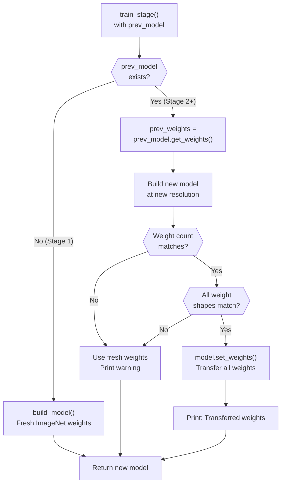
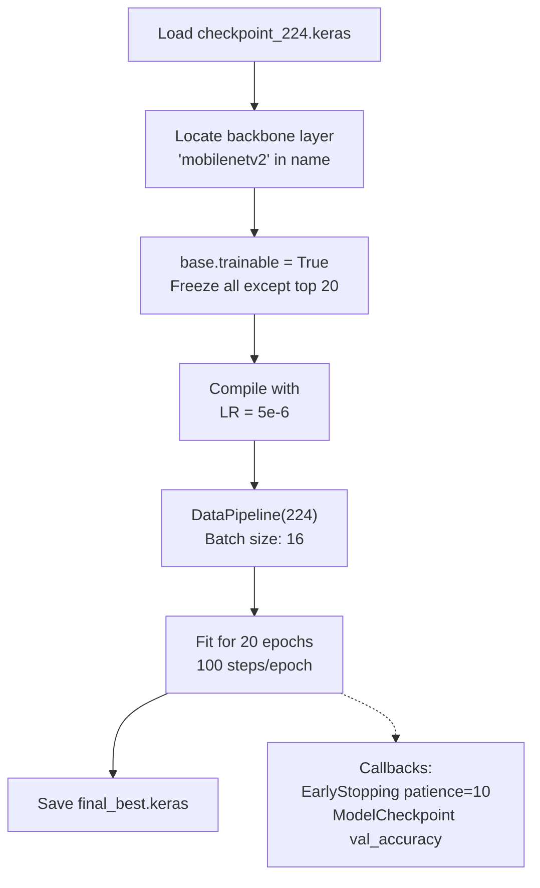

## Purpose and Scope

This document describes the progressive resizing curriculum learning approach implemented in the core training system. Progressive training is a staged training strategy where the model is trained sequentially at increasing image resolutions (128×128 → 160×160 → 224×224), with controlled learning rate decay and selective layer unfreezing at later stages. This technique enables faster convergence, better generalization, and more stable training compared to training directly at full resolution.

For details on the overall model architecture including MobileNetV2 backbone and SE attention, see [Model Architecture](#2.1). For data augmentation and pipeline implementation, see [Data Pipeline and Augmentation](#2.3).

---

## Progressive Resizing Overview

Progressive resizing is a curriculum learning technique where the model starts training on low-resolution images and gradually increases resolution. This approach provides several benefits:

1. **Faster initial convergence**: Low-resolution images require less computation, enabling faster epoch times during early training
2. **Regularization effect**: Starting with coarse features prevents overfitting to high-frequency noise
3. **Transfer learning**: Features learned at lower resolutions transfer to higher resolutions, providing warm-start initialization
4. **Memory efficiency**: Smaller images allow larger batch sizes or reduced memory pressure

The Forsaken-Apex implementation uses three resolution stages followed by a final fine-tuning phase, as specified in [train.py:39-41](../train.py#L39-L41) and [kaggle-notebook.ipynb:40-41](../kaggle-notebook.ipynb#L40-L41):

```python
PROGRESSIVE_SIZES = [128, 160, 224]
PROGRESSIVE_EPOCHS = [20, 25, 35]
```

**Sources:** [train.py:28-66](../train.py#L28-L66), [kaggle-notebook.ipynb:28-66](../kaggle-notebook.ipynb#L28-L66)

---

## Three-Stage Training Pipeline

The `ProgressiveTrainer` class orchestrates the multi-stage training process through its `train_progressive()` method. The pipeline progresses through three resolution stages, transferring weights between stages, with each stage training a new model at increased resolution.

```mermaid
flowchart LR
    subgraph Stage1["Stage 1: 128×128"]
        S1_Build["build_model()<br/>128×128 input"]
        S1_Train["Train 20 epochs<br/>LR: 1e-3<br/>Frozen backbone"]
        S1_Save["Save checkpoint_128.keras"]
        S1_Build --> S1_Train --> S1_Save
    end
    
    subgraph Stage2["Stage 2: 160×160"]
        S2_Build["build_model()<br/>160×160 input<br/>Transfer weights"]
        S2_Train["Train 25 epochs<br/>LR: 5e-4<br/>Frozen backbone"]
        S2_Save["Save checkpoint_160.keras"]
        S2_Build --> S2_Train --> S2_Save
    end
    
    subgraph Stage3["Stage 3: 224×224"]
        S3_Build["build_model()<br/>224×224 input<br/>Transfer weights"]
        S3_Train["Train 35 epochs<br/>LR: 2e-4<br/>Unfreeze top layers"]
        S3_Save["Save checkpoint_224.keras"]
        S3_Build --> S3_Train --> S3_Save
    end
    
    subgraph FineTune["Final Fine-Tuning"]
        FT_Unfreeze["Unfreeze top 20 layers"]
        FT_Train["Train 20 epochs<br/>LR: 5e-6<br/>224×224"]
        FT_Save["Save final_best.keras"]
        FT_Unfreeze --> FT_Train --> FT_Save
    end
    
    S1_Save --> S2_Build
    S2_Save --> S3_Build
    S3_Save --> FT_Unfreeze
```



**Sources:** [train.py:554-627](../train.py#L554-L627), [kaggle-notebook.ipynb:554-627](../kaggle-notebook.ipynb#L554-L627)

---

## Stage Configuration Matrix

Each training stage has distinct hyperparameters optimized for its resolution and position in the curriculum. The following table summarizes the configuration for each stage:

| Stage | Resolution | Epochs | Learning Rate | Backbone Status | Batch Size | Purpose |
|-------|-----------|--------|---------------|-----------------|------------|---------|
| **1** | 128×128 | 20 | 1e-3 (`INITIAL_LR`) | Fully frozen | 32 | Fast initial feature learning on coarse patterns |
| **2** | 160×160 | 25 | 5e-4 (`INITIAL_LR / 2`) | Fully frozen | 32 | Refinement with moderate resolution |
| **3** | 224×224 | 35 | 2e-4 (`INITIAL_LR / 5`) | Top layers unfrozen (>100) | 32 | High-resolution feature extraction |
| **Fine-tune** | 224×224 | 20 | 5e-6 (`FINE_TUNE_LR / 10`) | Top 20 layers unfrozen | 16 | Final calibration with minimal updates |

The learning rate schedule implements a conservative decay strategy to prevent instability as training progresses. The stage-specific learning rates are computed in [train.py:416-427](../train.py#L416-L427):

```python
if stage_idx == 0:
    lr = Config.INITIAL_LR           # 1e-3
    unfreeze = False
elif stage_idx == 1:
    lr = Config.INITIAL_LR / 2       # 5e-4
    unfreeze = False
else:  # stage_idx == 2 (224x224)
    lr = Config.INITIAL_LR / 5       # 2e-4
    unfreeze = True
```

**Sources:** [train.py:39-45](../train.py#L39-L45), [train.py:416-427](../train.py#L416-L427), [train.py:589](../train.py#L589)

---

## Weight Transfer Mechanism

Between stages, the trainer attempts to transfer learned weights from the previous model to the new model. This warm-start initialization accelerates convergence and preserves learned features. The transfer logic is implemented in [train.py:430-457](../train.py#L430-L457):



The weight transfer attempts to reuse the entire model's weights when possible. However, if weight counts or shapes differ between stages (which typically happens due to different input resolutions affecting the backbone's feature map dimensions), the system falls back to fresh initialization with ImageNet pretrained weights.

**Key implementation details:**

1. **Weight extraction**: `prev_weights = prev_model.get_weights()` extracts all layer weights as NumPy arrays
2. **Shape validation**: The system checks both weight count and individual tensor shapes before transfer
3. **Fallback strategy**: On mismatch, the new model uses ImageNet initialization rather than risking shape incompatibility errors
4. **Logging**: Explicit console output indicates whether transfer succeeded or failed

**Sources:** [train.py:430-460](../train.py#L430-L460), [kaggle-notebook.ipynb:430-460](../kaggle-notebook.ipynb#L430-L460)

---

## Layer Unfreezing Strategy

The backbone (MobileNetV2) remains frozen during the first two stages to prevent catastrophic forgetting of ImageNet features. In Stage 3 (224×224), the top layers are selectively unfrozen to allow fine-tuning for defect-specific features.

### Stage 1 and 2: Fully Frozen Backbone

During the first two stages, the entire MobileNetV2 backbone is frozen via [train.py:347](../train.py#L347):

```python
base.trainable = False
```

This ensures that only the custom classification head (SEBlock + Dense layers) is trained, preserving the general-purpose feature extraction capabilities learned from ImageNet.

### Stage 3: Selective Unfreezing

At the final 224×224 resolution stage, the system unfreezes the top layers while keeping early layers frozen. The unfreezing logic in [train.py:463-473](../train.py#L463-L473) targets layers beyond index 100:

```python
if unfreeze and base is not None:
    base.trainable = True
    # Freeze first 100 layers, train the rest
    for layer in base.layers[:100]:
        layer.trainable = False
    print(f"✓ Unfroze top {len(base.layers) - 100} layers of backbone")
```

**MobileNetV2 α=0.75 layer structure:**
- Total layers: ~154 layers
- Frozen layers: First 100 (early feature extraction blocks)
- Trainable layers: Last 54 (high-level semantic features)

This selective unfreezing allows the model to adapt high-level features to wafer defect patterns while preserving low-level edge and texture detectors.

**Sources:** [train.py:347](../train.py#L347), [train.py:463-473](../train.py#L463-L473), [kaggle-notebook.ipynb:463-473](../kaggle-notebook.ipynb#L463-L473)

---

## Final Fine-Tuning Phase

After completing the three progressive stages, an additional fine-tuning phase performs minimal updates to the top 20 layers of the backbone. This phase uses an extremely low learning rate to calibrate predictions without disrupting learned features.



**Configuration details** from [train.py:583-623](../train.py#L583-L623):

| Parameter | Value | Rationale |
|-----------|-------|-----------|
| Unfrozen layers | Top 20 (out of ~154) | Minimal updates to highest-level features only |
| Learning rate | 5e-6 (`FINE_TUNE_LR / 10`) | Extremely conservative to avoid disruption |
| Batch size | 16 (vs 32 in stages) | Reduced for more frequent updates with low LR |
| Steps per epoch | 100 | Fixed step count for consistent training duration |
| Epochs | 20 | With early stopping (patience=10) |

The fine-tuning phase targets layers identified by iterating over the model and finding the backbone:

```python
base = None
for layer in model.layers:
    if 'mobilenetv2' in layer.name.lower():
        base = layer
        break

if base is not None:
    base.trainable = True
    for layer in base.layers[:-20]:  # Freeze all except top 20
        layer.trainable = False
```

**Sources:** [train.py:571-627](../train.py#L571-L627), [kaggle-notebook.ipynb:571-627](../kaggle-notebook.ipynb#L571-L627)

---

## Training Callbacks and Optimization

Each stage employs three Keras callbacks to optimize training efficiency and prevent overfitting:

### Callback Configuration Table

| Callback | Monitor | Parameters | Purpose |
|----------|---------|------------|---------|
| **ModelCheckpoint** | `val_accuracy` | `save_best_only=True` | Saves only the best-performing model per stage to `stage_{size}.keras` |
| **EarlyStopping** | `val_accuracy` | `patience=10`, `restore_best_weights=True` | Halts training after 10 epochs without improvement, reverts to best weights |
| **ReduceLROnPlateau** | `val_loss` | `factor=0.5`, `patience=5`, `min_lr=1e-7` | Reduces learning rate by 50% after 5 epochs of stagnant validation loss |

These callbacks are configured in [train.py:509-530](../train.py#L509-L530):

```python
callbacks = [
    keras.callbacks.ModelCheckpoint(
        f"{Config.MODEL_DIR}/stage_{image_size}.keras",
        monitor='val_accuracy',
        save_best_only=True,
        verbose=1
    ),
    keras.callbacks.EarlyStopping(
        monitor='val_accuracy',
        patience=10,
        restore_best_weights=True,
        verbose=1
    ),
    keras.callbacks.ReduceLROnPlateau(
        monitor='val_loss',
        factor=0.5,
        patience=5,
        min_lr=1e-7,
        verbose=1
    )
]
```

### GPU Warmup

Before each stage begins training, the system performs GPU warmup to initialize CUDA kernels and avoid compilation overhead during the first training batch. The `warmup_gpu()` function ([train.py:373-377](../train.py#L373-L377)) runs a dummy forward pass:

```python
def warmup_gpu(model, image_size, batch_size=8):
    """Minimal GPU warmup"""
    dummy_data = tf.random.normal([batch_size, image_size, image_size, 1])
    _ = model(dummy_data, training=False)
    print("✓ GPU warmup complete")
```

This is called in [train.py:476](../train.py#L476) before creating datasets for each stage.

### Steps Per Epoch Calculation

The number of training steps per epoch accounts for class-weight-based oversampling applied by the `DataPipeline`. Since minority classes are oversampled (approximately 2× the original dataset size), steps per epoch is calculated as:

```python
total_train = sum(self.class_counts.values()) * 2  # Account for oversampling
steps_per_epoch = max(1, total_train // batch_size)
```

This ensures each epoch sees a representative sample of the oversampled training distribution.

**Sources:** [train.py:373-377](../train.py#L373-L377), [train.py:476](../train.py#L476), [train.py:493-494](../train.py#L493-L494), [train.py:509-530](../train.py#L509-L530)

---

## Training Execution Flow

The complete progressive training workflow is orchestrated by the `ProgressiveTrainer.train_progressive()` method, which iterates through stages and manages weight transfer:

```mermaid
stateDiagram-v2
    [*] --> CalculateWeights: __init__(num_classes, class_names, class_counts)
    
    CalculateWeights --> Stage1: train_progressive(train_dir, val_dir)
    
    state "Stage 1: 128×128" as Stage1 {
        [*] --> BuildModel1: build_model(128, use_se=True)
        BuildModel1 --> Warmup1: warmup_gpu(model, 128)
        Warmup1 --> CreateDS1: DataPipeline(128).create_dataset()
        CreateDS1 --> Compile1: Compile with LR=1e-3, FocalLoss
        Compile1 --> Fit1: Fit 20 epochs, callbacks
        Fit1 --> Save1: Save checkpoint_128.keras
        Save1 --> [*]
    }
    
    Stage1 --> Stage2: model → prev_model
    
    state "Stage 2: 160×160" as Stage2 {
        [*] --> Transfer2: Try transfer weights from Stage 1
        Transfer2 --> BuildModel2: build_model(160, use_se=True)
        BuildModel2 --> Warmup2: warmup_gpu(model, 160)
        Warmup2 --> CreateDS2: DataPipeline(160).create_dataset()
        CreateDS2 --> Compile2: Compile with LR=5e-4, FocalLoss
        Compile2 --> Fit2: Fit 25 epochs, callbacks
        Fit2 --> Save2: Save checkpoint_160.keras
        Save2 --> [*]
    }
    
    Stage2 --> Stage3: model → prev_model
    
    state "Stage 3: 224×224" as Stage3 {
        [*] --> Transfer3: Try transfer weights from Stage 2
        Transfer3 --> BuildModel3: build_model(224, use_se=True)
        BuildModel3 --> Unfreeze3: Unfreeze top layers (>100)
        Unfreeze3 --> Warmup3: warmup_gpu(model, 224)
        Warmup3 --> CreateDS3: DataPipeline(224).create_dataset()
        CreateDS3 --> Compile3: Compile with LR=2e-4, FocalLoss
        Compile3 --> Fit3: Fit 35 epochs, callbacks
        Fit3 --> Save3: Save checkpoint_224.keras
        Save3 --> [*]
    }
    
    Stage3 --> FineTune: model
    
    state "Final Fine-Tuning" as FineTune {
        [*] --> FindBackbone: Locate MobileNetV2 backbone
        FindBackbone --> Unfreeze20: Unfreeze only top 20 layers
        Unfreeze20 --> CompileFT: Compile with LR=5e-6, FocalLoss
        CompileFT --> CreateDSFT: DataPipeline(224), batch=16
        CreateDSFT --> FitFT: Fit 20 epochs, 100 steps/epoch
        FitFT --> SaveFinal: Save final_best.keras
        SaveFinal --> [*]
    }
    
    FineTune --> [*]
```



**Key method invocations:**

1. **Main entry**: `trainer.train_progressive(train_dir, val_dir)` ([train.py:668](../train.py#L668))
2. **Stage iteration**: Loop over `zip(PROGRESSIVE_SIZES, PROGRESSIVE_EPOCHS)` ([train.py:559-561](../train.py#L559-L561))
3. **Stage execution**: `self.train_stage(train_dir, val_dir, size, epochs, batch_size, stage, model)` ([train.py:563-565](../train.py#L563-L565))
4. **Weight persistence**: `model.save(f"{MODEL_DIR}/checkpoint_{size}.keras")` ([train.py:569](../train.py#L569))
5. **Fine-tuning**: Conditional block starting at [train.py:583](../train.py#L583)

**Sources:** [train.py:384-627](../train.py#L384-L627), [train.py:554-627](../train.py#L554-L627), [kaggle-notebook.ipynb:384-627](../kaggle-notebook.ipynb#L384-L627)