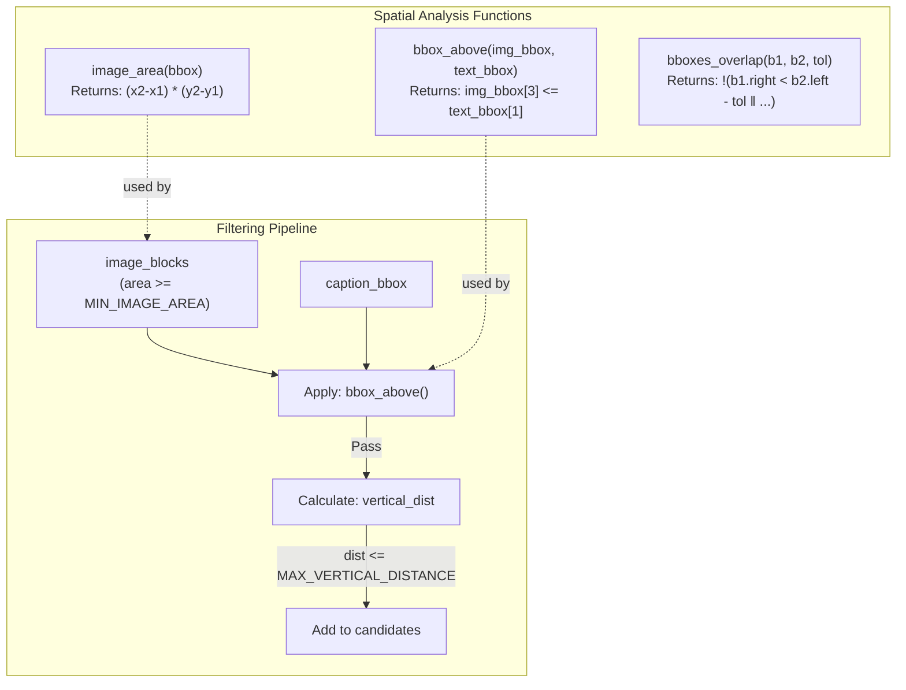
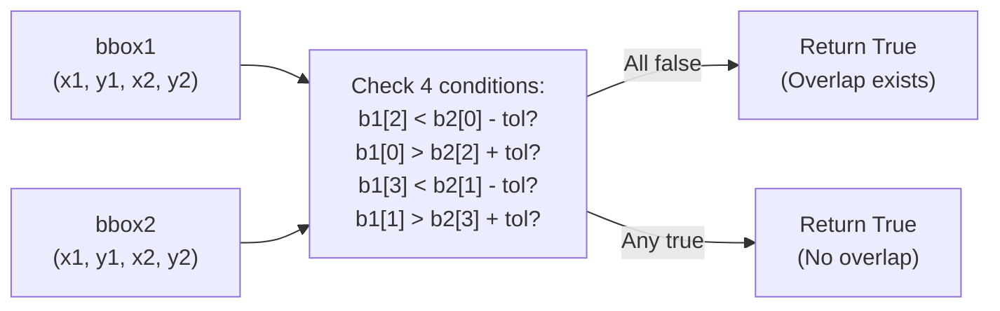
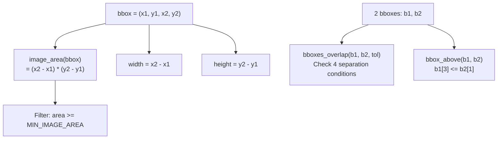
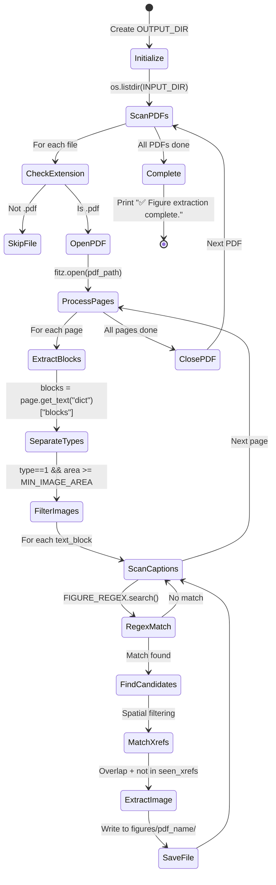

for line in text_block["lines"]:
    for span in line["spans"]:
        text += span["text"]
```

This flattens the hierarchical text structure into a single searchable string.

### Pattern Matching

The `FIGURE_REGEX` is applied with `re.IGNORECASE` flag [Utility_Scripts/extract_pdf_images.py:73-75](../Utility_Scripts/extract_pdf_images.py#L73-L75):

```python
match = FIGURE_REGEX.search(text)
if not match:
    continue
fig_num = match.group(2)  # Extract figure number
```

**Captured Groups:**
- Group 1: "fig" or "figure" keyword (discarded)
- Group 2: Numeric identifier (used in filename)
- Group 3: Optional subfigure letter (used in multi-part figures)

**Sources:** [Utility_Scripts/extract_pdf_images.py:66-78](../Utility_Scripts/extract_pdf_images.py#L66-L78)

---

## Spatial Matching Strategy

Once a caption is detected, the script performs spatial analysis to locate associated images using a two-stage process:

### Stage 1: Vertical Proximity Filtering

Images must satisfy two geometric constraints [Utility_Scripts/extract_pdf_images.py:80-91](../Utility_Scripts/extract_pdf_images.py#L80-L91):

1. **Above Caption**: `bbox_above(img_bbox, caption_bbox)` verifies `img_bbox[3] <= text_bbox[1]`
2. **Within Distance**: `caption_bbox[1] - img_bbox[3] <= MAX_VERTICAL_DISTANCE`



### Stage 2: Horizontal Sorting

Candidate images are sorted left-to-right by x-coordinate [Utility_Scripts/extract_pdf_images.py:93](../Utility_Scripts/extract_pdf_images.py#L93):

```python
candidates.sort(key=lambda b: b["bbox"][0])
```

This ordering supports multi-part figures (e.g., "Figure 1a" on the left, "Figure 1b" on the right).

**Sources:** [Utility_Scripts/extract_pdf_images.py:80-94](../Utility_Scripts/extract_pdf_images.py#L80-L94)

---

## Bounding Box Overlap Detection

The script must map abstract layout blocks (from `get_text("dict")`) to concrete image objects (from `get_images()`). This requires the `bboxes_overlap` function:

### Overlap Algorithm



The function implements a negated separation test [Utility_Scripts/extract_pdf_images.py:27-33](../Utility_Scripts/extract_pdf_images.py#L27-L33):

**Separation Conditions** (if any are true, boxes don't overlap):
- `b1[2] < b2[0] - tol`: b1 is left of b2
- `b1[0] > b2[2] + tol`: b1 is right of b2
- `b1[3] < b2[1] - tol`: b1 is above b2
- `b1[1] > b2[3] + tol`: b1 is below b2

The `BBOX_TOLERANCE` adds a 5-pixel margin to account for rounding errors in PDF coordinate systems.

**Sources:** [Utility_Scripts/extract_pdf_images.py:23-33](../Utility_Scripts/extract_pdf_images.py#L23-L33)

---

## Image Extraction and Deduplication

After matching layout blocks to image xrefs, the script extracts and saves the actual image data:

### Extraction Workflow


### Filename Convention

The output filename format depends on the number of candidate images:

| Scenario | Example Input | Output Filename |
|----------|---------------|-----------------|
| Single image | "Figure 3" | `Figure_3.png` |
| Multiple images | "Figure 5" (2 images) | `Figure_5a.jpg`, `Figure_5b.jpg` |
| With subfigure | "Figure 2a" | `Figure_2a.pdf` (retains original extension) |

The `chr(ord('a') + idx)` expression [Utility_Scripts/extract_pdf_images.py:119](../Utility_Scripts/extract_pdf_images.py#L119) generates sequential letters (a, b, c, ...) for multi-part figures.

### Deduplication Mechanism

The `seen_xrefs` set [Utility_Scripts/extract_pdf_images.py:50, 110-113]() prevents duplicate extraction when:
- The same image appears multiple times in the PDF
- Multiple captions reference the same image
- An image is reused across pages

**Sources:** [Utility_Scripts/extract_pdf_images.py:95-124](../Utility_Scripts/extract_pdf_images.py#L95-L124)

---

## Helper Functions

The script defines three utility functions for geometric computations:

### Function Reference Table

| Function | Signature | Returns | Purpose |
|----------|-----------|---------|---------|
| `image_area` | `(bbox) -> float` | `(x2-x1) * (y2-y1)` | Calculate bounding box area for filtering |
| `bboxes_overlap` | `(b1, b2, tol=5) -> bool` | True if overlap exists | Match layout blocks to image xrefs |
| `bbox_above` | `(img_bbox, text_bbox) -> bool` | True if image is above text | Verify spatial relationship |

### Coordinate System

All bounding boxes use the format `(x1, y1, x2, y2)` where:
- `(x1, y1)`: Top-left corner
- `(x2, y2)`: Bottom-right corner
- Origin: Top-left of page
- Units: Points (1/72 inch)



**Sources:** [Utility_Scripts/extract_pdf_images.py:23-38](../Utility_Scripts/extract_pdf_images.py#L23-L38)

---

## Output Directory Structure

The script organizes extracted figures by source PDF:

```
figures/
├── paper_A/
│   ├── Figure_1.png
│   ├── Figure_2a.jpg
│   ├── Figure_2b.jpg
│   └── Figure_3.pdf
├── paper_B/
│   ├── Figure_1.png
│   └── Figure_2.png
└── paper_C/
    └── Figure_1.jpg
```

**Directory Creation:**
- Root `OUTPUT_DIR` created at script startup [Utility_Scripts/extract_pdf_images.py:20](../Utility_Scripts/extract_pdf_images.py#L20)
- Per-PDF subdirectories created during processing [Utility_Scripts/extract_pdf_images.py:46-47](../Utility_Scripts/extract_pdf_images.py#L46-L47)

**Filename Preservation:**
- Original image format (PNG, JPG, PDF) is preserved via `base_image["ext"]`
- Embedded image metadata may include resolution, color space, and compression settings

**Sources:** [Utility_Scripts/extract_pdf_images.py:20, 40-47, 115-123](../Utility_Scripts/extract_pdf_images.py#L20, 40-L47, 115-123)

---

## Execution Workflow

The script follows a single-pass, batch processing model:



**Completion Message:** [Utility_Scripts/extract_pdf_images.py:127](../Utility_Scripts/extract_pdf_images.py#L127)

**Sources:** [Utility_Scripts/extract_pdf_images.py:40-127](../Utility_Scripts/extract_pdf_images.py#L40-L127)

---

## Limitations and Edge Cases

### Known Limitations

| Limitation | Impact | Workaround |
|------------|--------|------------|
| Caption below image | No detection | Captions must appear below figures |
| Multi-column layouts | May associate wrong images | `MAX_VERTICAL_DISTANCE` may need adjustment |
| Non-standard numbering | No extraction | Only detects "Figure N" or "Fig. N" patterns |
| Rotated images | Bounding box mismatch | PyMuPDF may not report correct coordinates |
| Image captions split across blocks | Incomplete text | May fail regex match |

### Filtering Behavior

**Small Image Filtering:** [Utility_Scripts/extract_pdf_images.py:63-64](../Utility_Scripts/extract_pdf_images.py#L63-L64)
- Images with area < 10,000 px² are excluded
- Typical icons: 32×32 = 1,024 px² (excluded)
- Minimum accepted: ~100×100 px

**Vertical Distance Threshold:**
- 250 px ≈ 3.5 inches at 72 DPI
- May include unrelated images in dense layouts
- May exclude images with large vertical gaps

**Sources:** [Utility_Scripts/extract_pdf_images.py:1-128](../Utility_Scripts/extract_pdf_images.py#L1-L128)

---

## Dependencies

The script requires a single external library:

```python
import fitz  # PyMuPDF
```

**PyMuPDF Installation:**
```bash
pip install PyMuPDF
```

**Version Compatibility:**
- Tested with PyMuPDF 1.18+ (uses `get_image_bbox` API)
- Python 3.6+ required for f-strings

**Standard Library Dependencies:**
- `os`: Directory and file operations
- `re`: Regular expression matching

**Sources:** [Utility_Scripts/extract_pdf_images.py:1-3](../Utility_Scripts/extract_pdf_images.py#L1-L3)