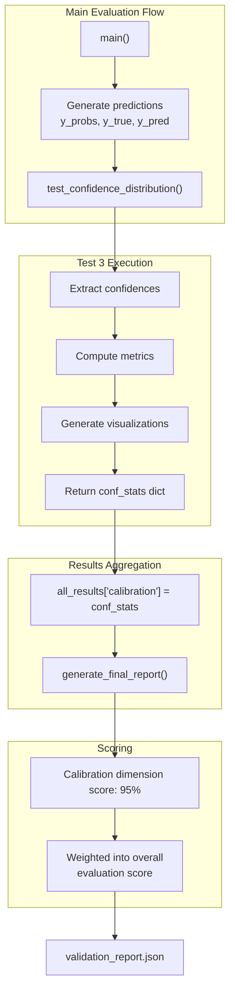

Evaluating model's uncertainty awareness and calibration

Metric                              Value
-------------------------------------------------------
High-confidence accuracy (>80%)              XX.X%
Mean confidence (correct)                     X.XX%
Mean confidence (incorrect)                   X.XX%

Uncertainty Discrimination: X.XX%
  (Higher values indicate better uncertainty awareness)

Calibration Analysis (High-Confidence Predictions):
Confidence Range     Accuracy    Support
---------------------------------------------
>0.7                   XX.XX%        XXX
>0.8                   XX.XX%        XXX
>0.9                   XX.XX%        XXX

Overconfidence Errors (>90% confidence, wrong): X
✓ Model avoids false confidence on incorrect predictions
```

**Sources:** [Evaluate_model.py:320-345]()

---

## Integration with Evaluation Framework



Test 3 is invoked from the main evaluation sequence after predictions are generated:

1. **Invocation**: Called with probability arrays from model inference
2. **Execution**: Computes calibration metrics and generates plots
3. **Result storage**: Metrics added to `all_results` dictionary under `'calibration'` key
4. **Final reporting**: Contributes to overall evaluation score with 95% weight in scoring logic

**Sources:** [Evaluate_model.py:696-697](), [Evaluate_model.py:570-630]()

---

## Output File Structure

| File | Format | Contents |
|------|--------|----------|
| `test3_confidence_calibration.png` | PNG (1400×500 px, 150 DPI) | Two-panel figure: confidence distributions + reliability diagram |
| `validation_report.json` | JSON | Contains `calibration` field with `high_conf_accuracy` and `uncertainty_discrimination` metrics |

**Sources:** [Evaluate_model.py:383](), [Evaluate_model.py:626-628]()

---

## Mathematical Formulation

### Confidence Score

For a prediction with probability vector **p** = [p₁, p₂, ..., pₖ]:

```
confidence(p) = max(p₁, p₂, ..., pₖ)
```

### Uncertainty Discrimination

```
D = μ_correct - μ_incorrect

where:
  μ_correct = (1/N_c) Σ confidence(pᵢ) for correct predictions
  μ_incorrect = (1/N_i) Σ confidence(pⱼ) for incorrect predictions
```

### Expected Calibration Error (Implicit)

While not explicitly computed, the reliability diagram visualizes:

```
ECE = Σ (|accuracy(Bₘ) - confidence(Bₘ)|) × (|Bₘ| / N)
      m

where Bₘ are confidence bins
```

**Sources:** [Evaluate_model.py:307-328]()

---

## Code-to-Concept Mapping

| Code Entity | Conceptual Role |
|-------------|-----------------|
| `np.max(y_probs, axis=1)` | Confidence extraction from softmax layer |
| `correct_mask` | Ground truth for calibration analysis |
| `high_conf_correct` / `np.sum(confidences > 0.8)` | Precision at high confidence threshold |
| `np.mean(correct_conf) - np.mean(incorrect_conf)` | Uncertainty discrimination metric |
| `bin_edges = np.linspace(0.5, 1.0, 6)` | Calibration binning strategy |
| `axes[0].hist(...)` | Confidence distribution visualization |
| `axes[1].plot([0.5, 1.0], [0.5, 1.0], 'k--')` | Perfect calibration reference line |

**Sources:** [Evaluate_model.py:307-380]()

---

## Relationship to Custom Training Components

Test 3 operates on outputs from models trained with specific loss functions and architectures:

| Training Component | Relevance to Calibration |
|-------------------|-------------------------|
| `FocalLoss` (gamma=1.5) | Affects probability distribution sharpness; higher gamma may increase confidence separation |
| `label_smoothing=0.1` | Prevents overconfidence by softening target distributions |
| `SEBlock` attention | No direct impact on calibration (architectural feature) |

The calibration test validates whether these training mechanisms produce well-calibrated probability outputs at inference time.

**Sources:** [Evaluate_model.py:64-77]()

---

## Thresholds and Configuration

Calibration analysis parameters are defined in the `Config` class:

```python