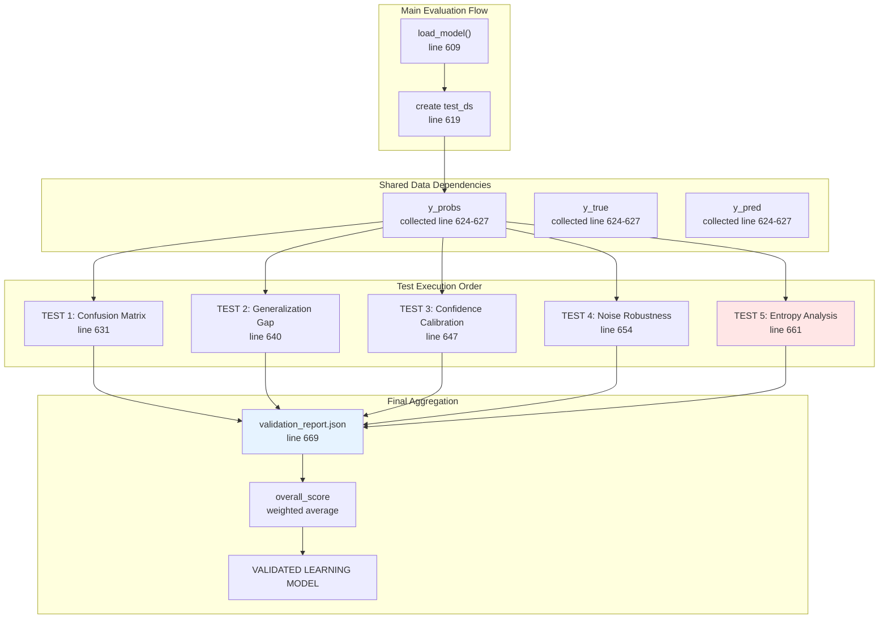
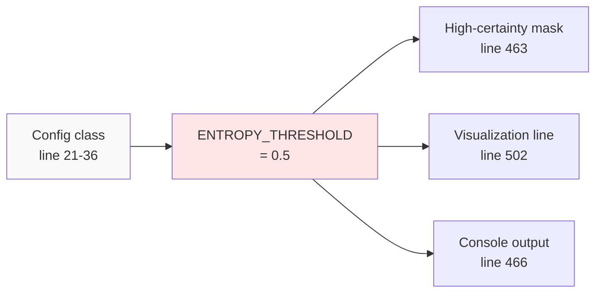
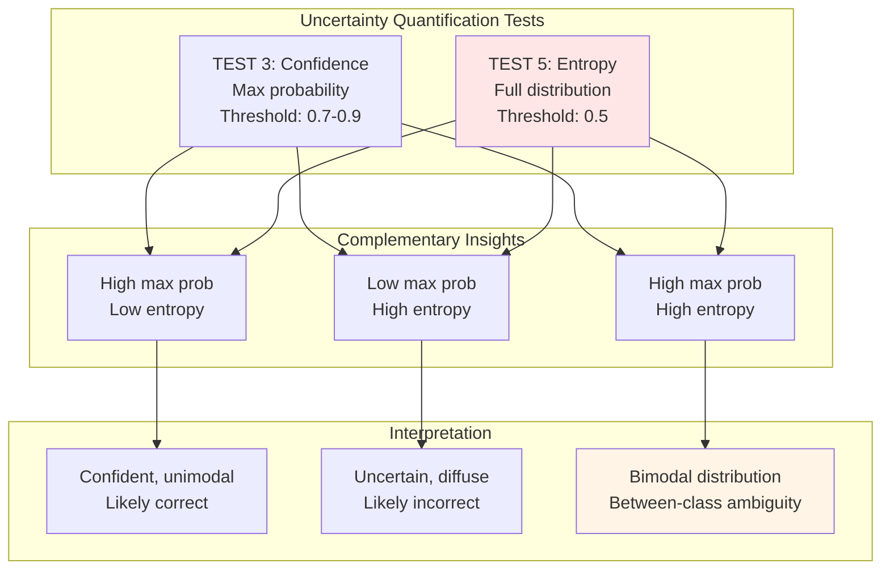
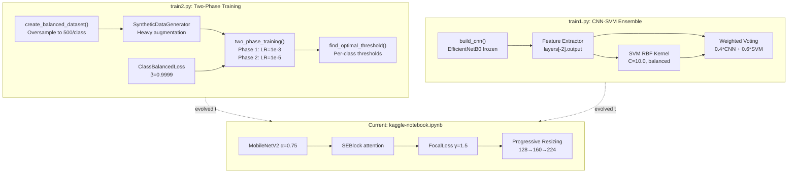
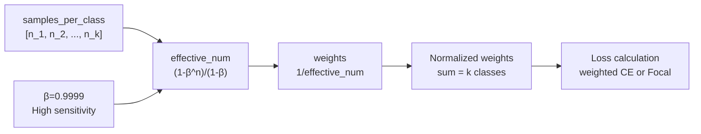
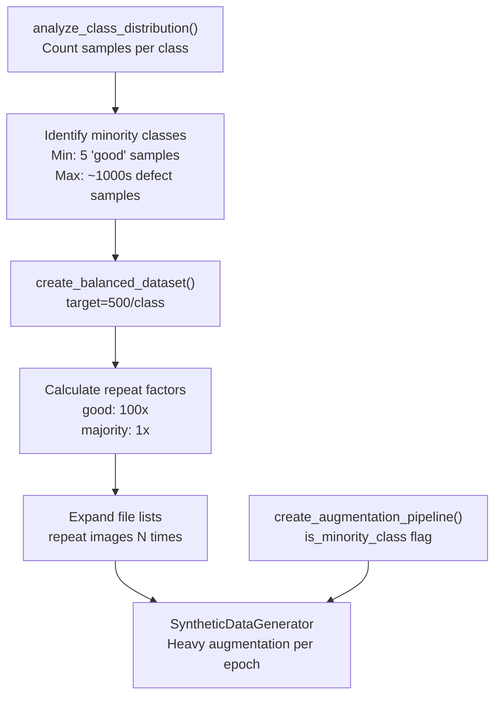
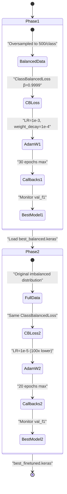
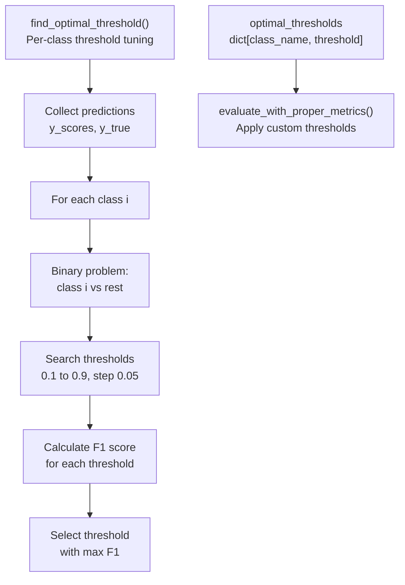
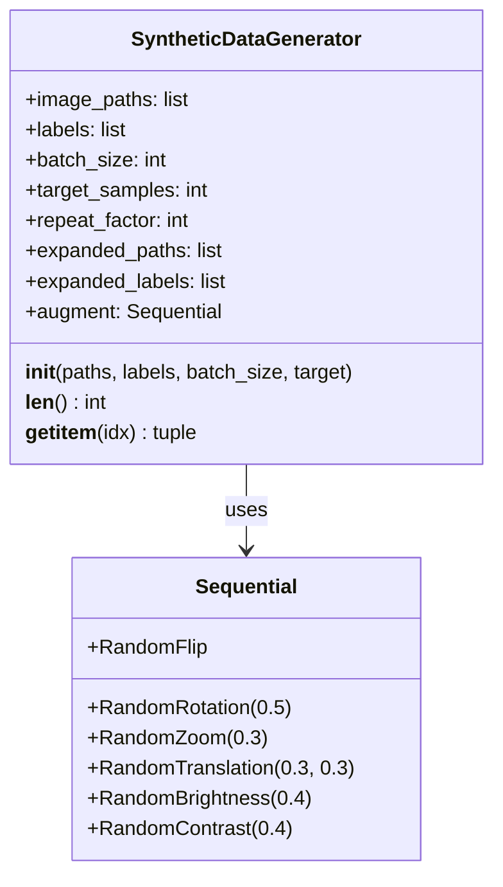

Entropy Statistics:
  Mean entropy (correct predictions):     0.23 ± 0.15
  Mean entropy (incorrect predictions):   0.67 ± 0.32
  Uncertainty Ratio (incorrect/correct):  2.91

Threshold-Based Analysis (threshold = 0.5):
  High-certainty predictions (< 0.5):     1847 samples
  High-certainty accuracy:                93.4%
  Low-certainty predictions (>= 0.5):     203 samples
  
✓ Model demonstrates strong uncertainty discrimination
  (Incorrect predictions have 191% higher entropy)

Per-Class Entropy:
Class                    Mean Entropy       Std Dev      Samples
------------------------------------------------------------------------
block etch                      0.18          0.12          256
bridge                          0.21          0.14          312
...
```

**Key Metrics Interpretation:**

| Metric | Desirable Range | Significance |
|--------|----------------|--------------|
| Uncertainty Ratio | > 1.5 | Incorrect predictions show clearly elevated entropy |
| High-certainty accuracy | > 90% | Low-entropy predictions are reliable |
| Mean entropy (correct) | < 0.4 | Model confident on correct classifications |

**Sources:** [Evaluate_model.py:454-487](../Evaluate_model.py#L454-L487)

---

## Integration with Evaluation Framework

### Position in Test Suite Execution



### Return Value Structure

Test 5 returns a dictionary (line 523-525) containing:

```python
{
    'uncertainty_ratio': float,           # incorrect_entropy / correct_entropy
    'high_certainty_accuracy': float,     # accuracy when entropy < threshold
    'mean_entropy_correct': float,        # average entropy for correct preds
    'mean_entropy_incorrect': float       # average entropy for incorrect preds
}
```

These metrics contribute to the overall evaluation score calculated at [Evaluate_model.py:669-701](../Evaluate_model.py#L669-L701).

**Sources:** [Evaluate_model.py:661-665](../Evaluate_model.py#L661-L665), [Evaluate_model.py:523-525](../Evaluate_model.py#L523-L525), [Evaluate_model.py:669-701](../Evaluate_model.py#L669-L701)

---

## Theoretical Justification

### Why Entropy Over Maximum Probability?

| Approach | Formula | Sensitivity |
|----------|---------|-------------|
| **Max Probability** (Test 3) | `max(p)` | Only captures dominant class |
| **Entropy** (Test 5) | `-Σ p*log(p)` | Captures full distribution shape |

**Example Comparison:**

| Prediction | Max Prob | Entropy | Interpretation |
|------------|----------|---------|----------------|
| `[0.95, 0.05, ...]` | 0.95 | 0.20 | High confidence, low uncertainty |
| `[0.50, 0.30, 0.20]` | 0.50 | 1.03 | Low confidence, high uncertainty |
| `[0.90, 0.08, 0.02]` | 0.90 | 0.42 | Moderate confidence, but entropy reveals some doubt |

Entropy detects cases where probability mass is distributed across multiple classes, indicating the model sees multiple plausible explanations—useful for identifying ambiguous defect patterns.

**Sources:** [Evaluate_model.py:451-452](../Evaluate_model.py#L451-L452)

---

## Configuration Parameters

Test 5 uses one primary configuration constant from the `Config` class:



**Threshold Tuning Guidance:**

- **Lower threshold (0.3)**: Stricter definition of "high certainty", fewer predictions qualify
- **Higher threshold (0.7)**: More lenient, but may include genuinely uncertain predictions
- **Current value (0.5)**: Balanced, roughly corresponding to 60-70% probability for top class

**Sources:** [Evaluate_model.py:36](../Evaluate_model.py#L36), [Evaluate_model.py:463](../Evaluate_model.py#L463), [Evaluate_model.py:502](../Evaluate_model.py#L502)

---

## Relationship to Other Tests



**Test Synergies:**

- **Test 1 (Confusion Matrix)**: Entropy analysis can identify which class pairs cause high-uncertainty confusions
- **Test 3 (Confidence)**: Entropy provides complementary view—can catch overconfident but uncertain predictions
- **Test 4 (Robustness)**: Expected behavior is increased entropy under noise perturbation

**Sources:** [Evaluate_model.py:295-390](../Evaluate_model.py#L295-L390) (Test 3), [Evaluate_model.py:438-525](../Evaluate_model.py#L438-L525) (Test 5)

---

## Output Artifacts Summary

Test 5 produces the following files in `OUTPUT_DIR`:

| Artifact | Path | Content |
|----------|------|---------|
| **Visualization** | `test5_entropy_analysis.png` | 2-panel figure: entropy distributions + per-class bars |
| **Metrics** | `validation_report.json` | Contains `test5_entropy_analysis` key with metrics dict |
| **Console Log** | Terminal output | Formatted statistical summary with interpretation |

The PNG file is saved at [Evaluate_model.py:523](../Evaluate_model.py#L523) and referenced in Diagram 4 of the high-level system overview.

**Sources:** [Evaluate_model.py:523](../Evaluate_model.py#L523), [Evaluate_model.py:669-701](../Evaluate_model.py#L669-L701)

# Alternative Training Approaches


## Purpose and Scope

This document describes experimental training methodologies developed prior to the current production system. These approaches explored different strategies for handling extreme class imbalance and defect classification in wafer imagery. While not currently used in production, they informed the architectural decisions in the final system.

For information about the current production training approach, see [Core Training System](./Core_Training_System.md#2). For evaluation methodology applied to these models, see [Model Evaluation Framework](./Model_Evaluation_Framework.md#4).

---

## Overview

The repository contains two alternative training implementations in `Previous_training_scripts/`:

| Script | Approach | Key Innovation | Status |
|--------|----------|----------------|--------|
| `train2.py` | Two-Phase Training | ClassBalancedLoss + oversampling | Archived |
| `train1.py` | CNN-SVM Ensemble | Hybrid deep learning + classical ML | Archived |

Both approaches were designed to address the severe class imbalance in the wafer defect dataset, particularly the scarcity of "good" (defect-free) samples. The evolution from these methods to the current progressive resizing + FocalLoss approach represents a shift toward curriculum learning and better loss functions rather than synthetic data generation or ensemble architectures.

**Sources:** [Previous_training_scripts/train2.py:1-535](../Previous_training_scripts/train2.py#L1-L535), [Previous_training_scripts/train1.py:1-220](../Previous_training_scripts/train1.py#L1-L220)

---

## System Architecture Comparison



**Diagram: Architectural Evolution**

The diagram shows how both alternative approaches contributed insights to the current system: `train2.py` demonstrated the effectiveness of specialized loss functions for imbalanced data, while `train1.py` validated the need for robust feature extraction but revealed that pure neural approaches with proper loss functions outperform hybrid ensembles.

**Sources:** [Previous_training_scripts/train2.py:51-95](../Previous_training_scripts/train2.py#L51-L95), [Previous_training_scripts/train1.py:82-96](../Previous_training_scripts/train1.py#L82-L96)

---

## Two-Phase Training with Class Balancing (train2.py)

### Architecture Overview

The `train2.py` approach tackles extreme class imbalance through a three-pronged strategy:

1. **Synthetic oversampling** to balance training data
2. **Class-Balanced Loss** (CVPR 2019) based on effective number of samples
3. **Two-phase training**: balanced dataset → full dataset

**Configuration Parameters:**

| Parameter | Value | Purpose |
|-----------|-------|---------|
| `IMG_SIZE` | 224 | Input resolution |
| `BATCH_SIZE` | 32 | Training batch size |
| `EPOCHS_PHASE1` | 30 | Balanced training epochs |
| `EPOCHS_PHASE2` | 20 | Fine-tuning epochs |
| Target samples/class | 500 | Oversampling target |

**Sources:** [Previous_training_scripts/train2.py:7-16](../Previous_training_scripts/train2.py#L7-L16)

---

### Class-Balanced Loss Implementation



**Diagram: ClassBalancedLoss Computation Pipeline**

The `ClassBalancedLoss` class implements the CVPR 2019 paper's approach for handling imbalanced datasets. The loss reweights each sample based on the effective number of samples in its class, where β controls the degree of reweighting.

**Key Implementation Details:**

- **Formula**: `CB(p, y) = (1-β)/(1-β^n_y) * L(p, y)`
- **β=0.9999**: High value makes weights closer to inverse frequency
- **Loss types**: Supports both `"crossentropy"` and `"focal"` (γ=2.0)
- **Normalization**: Weights sum to number of classes for stability

**Class Definition:**

The `ClassBalancedLoss` class [Previous_training_scripts/train2.py:51-95](../Previous_training_scripts/train2.py#L51-L95) extends `tf.keras.losses.Loss` with the following key methods:

- `__init__(samples_per_class, beta, loss_type, gamma)`: Computes and stores class weights
- `call(y_true, y_pred)`: Applies weights to cross-entropy or focal loss

**Weight Calculation Example:**

For a class with 5 samples (like "good" wafers) and β=0.9999:
- `effective_num = (1 - 0.9999^5) / (1 - 0.9999) ≈ 5.0`
- For a class with 1000 samples: `effective_num ≈ 632.1`
- This gives the minority class ~126x higher weight after normalization

**Sources:** [Previous_training_scripts/train2.py:51-95](../Previous_training_scripts/train2.py#L51-L95)

---

### Data Balancing Pipeline



**Diagram: Oversampling and Augmentation Flow**

**Balancing Strategy:**

The `create_balanced_dataset()` function [Previous_training_scripts/train2.py:100-141](../Previous_training_scripts/train2.py#L100-L141) creates a training set where all classes have approximately equal representation:

1. **Analysis Phase**: `analyze_class_distribution()` [Previous_training_scripts/train2.py:21-46](../Previous_training_scripts/train2.py#L21-L46) computes class counts
2. **Repeat Factor Calculation**: Each class is repeated `max(1, target / n_samples)` times
3. **File List Expansion**: Image paths are duplicated in the dataset

**Augmentation Differentiation:**

The `create_augmentation_pipeline()` function [Previous_training_scripts/train2.py:146-169](../Previous_training_scripts/train2.py#L146-L169) applies different augmentation strategies based on class size:

| Augmentation | Minority Classes | Majority Classes |
|--------------|------------------|------------------|
| RandomFlip | horizontal_and_vertical | horizontal only |
| RandomRotation | 0.5 (180°) | 0.25 (90°) |
| RandomZoom | 0.2 | N/A |
| RandomTranslation | 0.2, 0.2 | N/A |
| RandomBrightness | 0.3 | 0.1 |
| RandomContrast | 0.3 | 0.1 |

**Rationale**: Minority classes need more aggressive augmentation to create diverse synthetic samples, while majority classes preserve defect patterns with conservative transforms.

**Sources:** [Previous_training_scripts/train2.py:21-46](../Previous_training_scripts/train2.py#L21-L46), [Previous_training_scripts/train2.py:100-141](../Previous_training_scripts/train2.py#L100-L141), [Previous_training_scripts/train2.py:146-169](../Previous_training_scripts/train2.py#L146-L169)

---

### Two-Phase Training Strategy



**Diagram: Two-Phase Training Workflow**

**Phase 1: Balanced Training**

The first phase [Previous_training_scripts/train2.py:192-243](../Previous_training_scripts/train2.py#L192-L243) trains on the artificially balanced dataset:

- **Objective**: Learn to recognize all classes equally
- **Learning Rate**: 1e-3 (standard initial rate)
- **Callbacks**:
  - `EarlyStopping`: patience=10, monitor `val_f1`
  - `ReduceLROnPlateau`: factor=0.5, patience=5
  - `ModelCheckpoint`: saves `best_balanced.keras`
- **Metrics**: Accuracy, Precision, Recall, F1 (weighted)

**Phase 2: Fine-Tuning**

The second phase [Previous_training_scripts/train2.py:245-289](../Previous_training_scripts/train2.py#L245-L289) adapts to real-world class distribution:

- **Objective**: Adjust decision boundaries to actual class frequencies
- **Learning Rate**: 1e-5 (100x lower for gentle adaptation)
- **Dataset**: Original imbalanced training data
- **Callbacks**:
  - `EarlyStopping`: patience=15 (longer for stability)
  - `ReduceLROnPlateau`: factor=0.3, patience=7
  - `ModelCheckpoint`: saves `best_finetuned.keras`

**Key Function: `two_phase_training()`**

The orchestrator function [Previous_training_scripts/train2.py:186-291](../Previous_training_scripts/train2.py#L186-L291) accepts:
- `model`: Keras model to train
- `train_ds_balanced`: Oversampled dataset
- `train_ds_full`: Original imbalanced dataset
- `val_ds`: Validation dataset
- `class_counts`: Dictionary of class frequencies

**Sources:** [Previous_training_scripts/train2.py:174-291](../Previous_training_scripts/train2.py#L174-L291)

---

### Optimal Threshold Finding



**Diagram: Threshold Optimization Process**

**Motivation:**

Standard classification uses a fixed 0.5 threshold for all classes. For imbalanced datasets, optimal thresholds vary by class. A minority class might require a lower threshold to improve recall.

**Algorithm:**

The `find_optimal_threshold()` function [Previous_training_scripts/train2.py:296-345](../Previous_training_scripts/train2.py#L296-L345) implements a grid search:

1. **Prediction Collection**: Gather all validation predictions
2. **Per-Class Search**: For each class, treat as binary classification problem
3. **Grid Search**: Test thresholds from 0.1 to 0.9 in steps of 0.05
4. **F1 Maximization**: Select threshold that maximizes F1 score
5. **Return Dictionary**: Maps class names to optimal thresholds

**Example Output:**

```
good                : threshold=0.30, F1=0.847
Center             : threshold=0.55, F1=0.921
Donut              : threshold=0.50, F1=0.889
```

**Application in Inference:**

The `evaluate_with_proper_metrics()` function [Previous_training_scripts/train2.py:350-435](../Previous_training_scripts/train2.py#L350-L435) applies these thresholds:

```python
if score[i] >= optimal_thresholds[class_name] and score[i] > max_score:
    pred_class = i
```

This replaces the standard `np.argmax()` with threshold-aware prediction.

**Sources:** [Previous_training_scripts/train2.py:296-345](../Previous_training_scripts/train2.py#L296-L345), [Previous_training_scripts/train2.py:350-435](../Previous_training_scripts/train2.py#L350-L435)

---

### SyntheticDataGenerator

The `SyntheticDataGenerator` class [Previous_training_scripts/train2.py:440-498](../Previous_training_scripts/train2.py#L440-L498) implements SMOTE-style augmentation for images:

**Architecture:**



**Key Features:**

1. **Expansion**: Repeats each sample `repeat_factor` times in memory
2. **Per-Epoch Variation**: Applies different augmentation each epoch
3. **Heavy Augmentation**: More aggressive than standard pipelines
4. **Memory Efficient**: Generates augmented images on-the-fly during training

**Usage Pattern:**

```python