HIGH_CONFIDENCE_THRESHOLD = 0.8
OVERCONFIDENCE_THRESHOLD = 0.9
CALIBRATION_THRESHOLDS = [0.7, 0.8, 0.9]
BIN_EDGES = np.linspace(0.5, 1.0, 6)  # 5 bins
MIN_SAMPLES_PER_BIN = 5
```

These values define operating points for metric computation and ensure statistical validity of binned analyses.

**Sources:** [Evaluate_model.py:316-369](../Evaluate_model.py#L316-L369)

---

## Execution Context

Test 3 requires:

1. **Loaded model**: Must be loaded with custom objects `FocalLoss` and `SEBlock`
2. **Test dataset**: Predictions generated via `TestDataPipeline.create_dataset()`
3. **Output directory**: `Config.OUTPUT_DIR` must exist for saving visualizations

It is executed after Test 1 (confusion matrix) and Test 2 (generalization gap) in the evaluation sequence, using the same prediction arrays to maintain consistency across tests.

**Sources:** [Evaluate_model.py:637-710](../Evaluate_model.py#L637-L710)

# Test 4: Perturbation Robustness


## Purpose and Scope

Test 4 validates model stability under realistic input variations by measuring accuracy retention when test images are perturbed with additive Gaussian noise. This test ensures the model's learned features are robust to sensor noise, image compression artifacts, and other real-world degradations that may occur in production wafer inspection systems.

For overall evaluation framework architecture, see [Evaluation Script Architecture](./Model_Evaluation_Framework.md#4.1). For other robustness-related validation, see [Test 5: Entropy Analysis](./TEST_5_ENTROPY-BASED_UNCERTAINTY_QUANTIFICATION.md#4.6) which measures uncertainty quantification for difficult predictions.

---

## Test Methodology

The perturbation robustness test applies controlled noise to test set images and measures the degradation in classification accuracy. Unlike adversarial robustness testing, this test focuses on realistic, naturally-occurring perturbations that would be encountered in manufacturing environments.

### Noise Perturbation Process

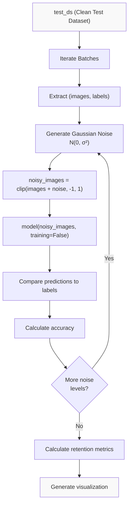

**Sources:** [Evaluate_model.py:396-484](../Evaluate_model.py#L396-L484)

### Noise Level Configuration

The test evaluates robustness at multiple perturbation intensities defined in the configuration:

| Noise Level (σ) | Semantic Meaning | Purpose |
|-----------------|------------------|---------|
| 0.0 | Baseline (no noise) | Reference accuracy |
| 0.01 | Low perturbation | Sensor noise, minor compression |
| 0.05 | Moderate perturbation | Significant degradation scenarios |

**Sources:** [Evaluate_model.py:32-34](../Evaluate_model.py#L32-L34)

---

## Implementation Architecture

### Function Signature and Flow

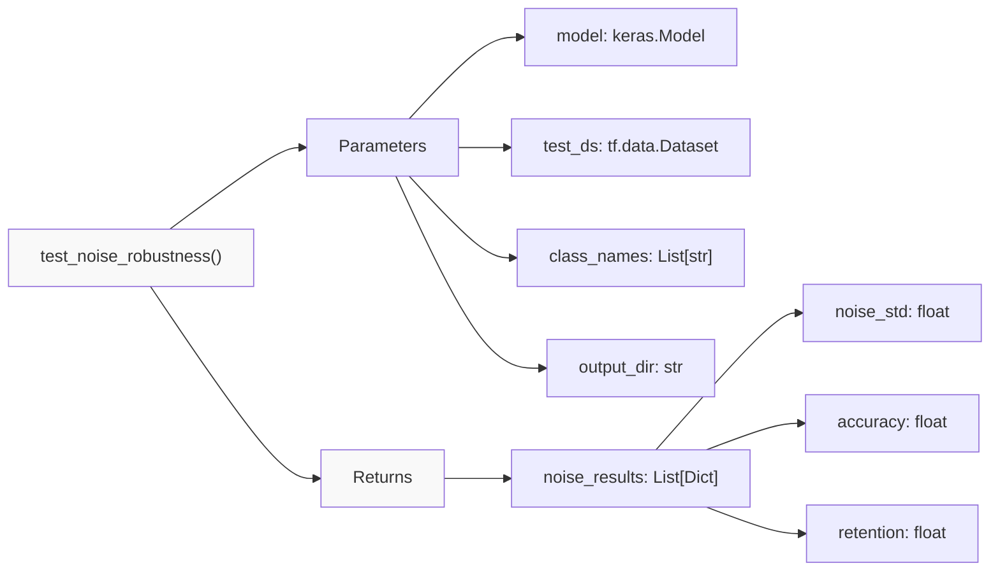

The test function defined at [Evaluate_model.py:396-484](../Evaluate_model.py#L396-L484) orchestrates the entire perturbation testing workflow.

**Sources:** [Evaluate_model.py:396-400](../Evaluate_model.py#L396-L400)

### Baseline Accuracy Calculation

Before applying perturbations, the test establishes baseline performance on clean images:

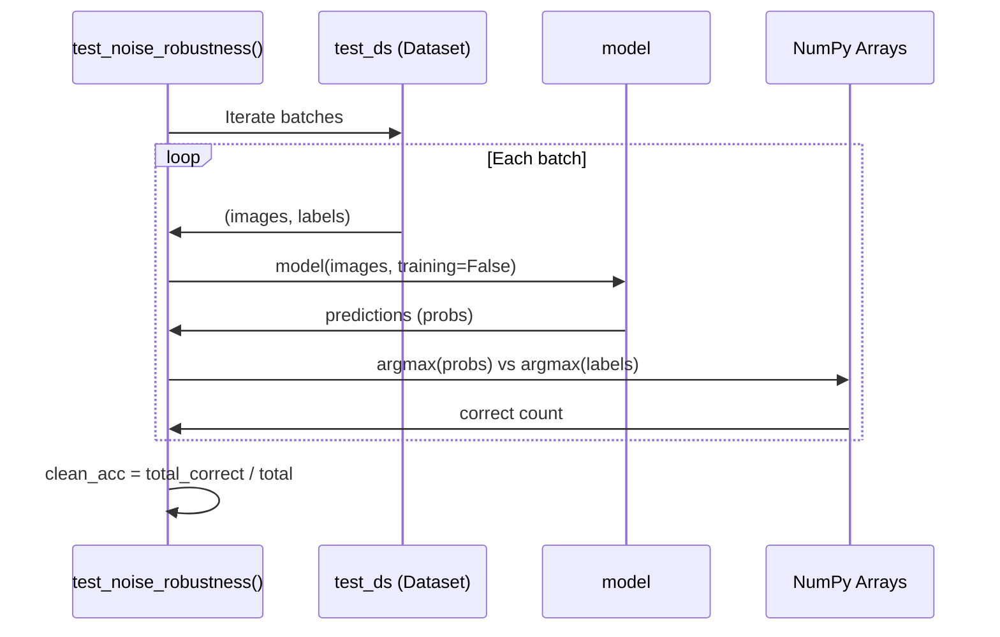

This baseline is computed at [Evaluate_model.py:406-421](../Evaluate_model.py#L406-L421) and serves as the reference for calculating accuracy retention percentages.

**Sources:** [Evaluate_model.py:406-421](../Evaluate_model.py#L406-L421)

---

## Perturbation Generation

### Additive Gaussian Noise

For each configured noise level σ, the test generates perturbations using TensorFlow's random number generation:

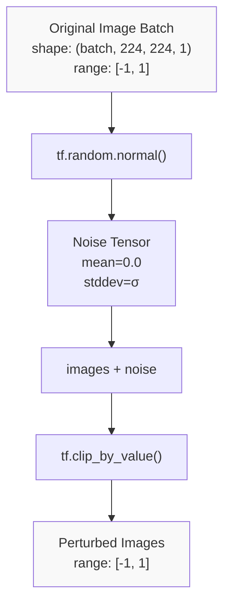

The clipping operation at [Evaluate_model.py:435](../Evaluate_model.py#L435) ensures perturbed images remain within the normalized range expected by the model ([-1, 1] after Rescaling normalization).

**Sources:** [Evaluate_model.py:433-435](../Evaluate_model.py#L433-L435)

### Evaluation Loop Structure

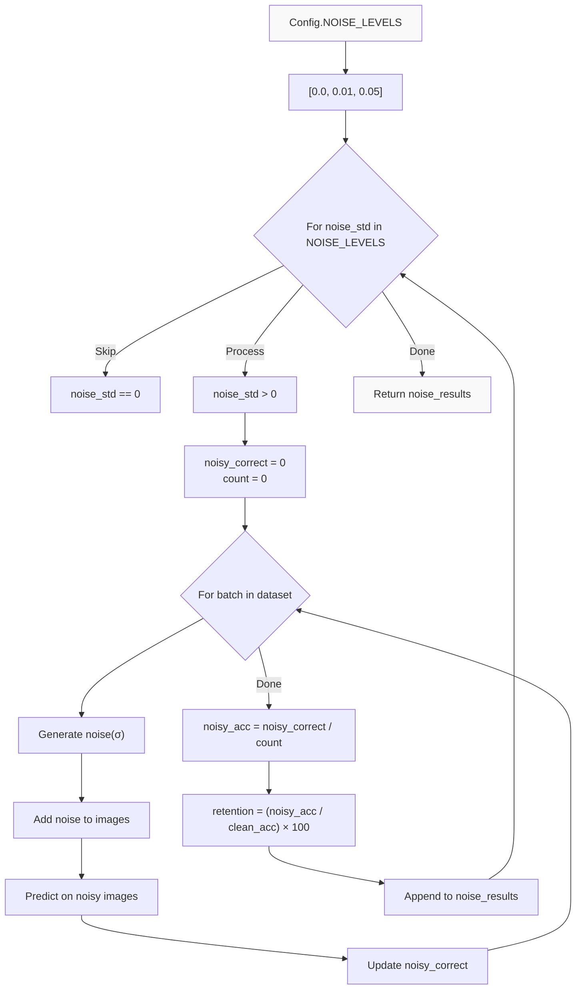

**Sources:** [Evaluate_model.py:426-453](../Evaluate_model.py#L426-L453)

---

## Metrics and Analysis

### Accuracy Retention Calculation

The primary metric is **accuracy retention**, which quantifies how much performance is preserved under perturbation:

```
retention = (noisy_accuracy / clean_accuracy) × 100%
```

This is a more interpretable metric than absolute accuracy drop, as it accounts for the baseline performance level. Implementation at [Evaluate_model.py:444](../Evaluate_model.py#L444).

**Sources:** [Evaluate_model.py:444](../Evaluate_model.py#L444)

### Results Data Structure

Each noise level produces a dictionary entry with three fields:

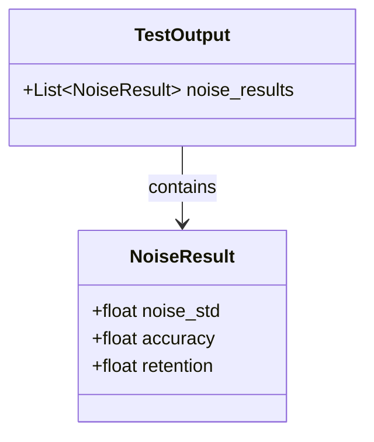

The `noise_results` list returned at [Evaluate_model.py:484](../Evaluate_model.py#L484) contains all perturbation test outcomes.

**Sources:** [Evaluate_model.py:446-450](../Evaluate_model.py#L446-L450)

### Console Output Format

The test prints structured results showing stability characteristics:

| Output Component | Purpose | Line Reference |
|-----------------|---------|----------------|
| Baseline Accuracy | Clean test set performance | [Evaluate_model.py:421](../Evaluate_model.py#L421) |
| Per-level accuracy | Accuracy at each σ value | [Evaluate_model.py:452](../Evaluate_model.py#L452) |
| Retention percentage | Performance preservation | [Evaluate_model.py:452](../Evaluate_model.py#L452) |
| Stability summary | Low-perturbation retention | [Evaluate_model.py:455-460](../Evaluate_model.py#L455-L460) |

**Sources:** [Evaluate_model.py:421](../Evaluate_model.py#L421), [Evaluate_model.py:452](../Evaluate_model.py#L452), [Evaluate_model.py:455-460](../Evaluate_model.py#L455-L460)

---

## Visualization Output

### Test 4 Plot: Perturbation Stability Curve

The test generates a line plot saved as `test4_perturbation_stability.png` showing accuracy retention across noise levels:

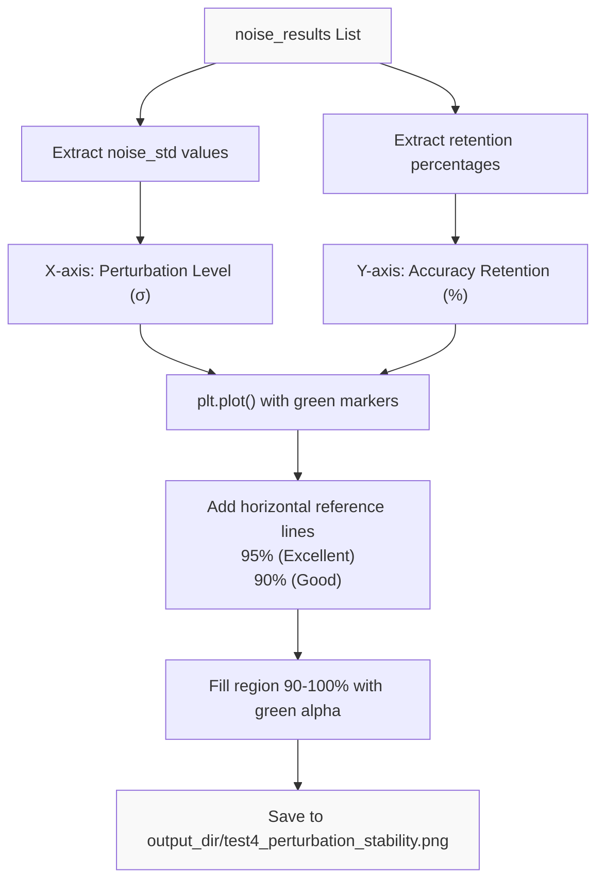

The visualization code at [Evaluate_model.py:463-482](../Evaluate_model.py#L463-L482) emphasizes the stability region (>90% retention) and uses reference lines to contextualize performance degradation.

**Sources:** [Evaluate_model.py:463-482](../Evaluate_model.py#L463-L482)

### Plot Components

| Visual Element | Implementation | Purpose |
|---------------|----------------|---------|
| Green line plot | `ax.plot(noise_levels, retentions, 'go-')` | Primary retention curve |
| 95% threshold line | `ax.axhline(y=95, color='green', linestyle='--')` | Excellent retention benchmark |
| 90% threshold line | `ax.axhline(y=90, color='orange', linestyle='--')` | Good retention benchmark |
| Shaded region | `ax.fill_between(noise_levels, 90, 100)` | Acceptable performance zone |
| Y-axis limits | `ax.set_ylim(85, 102)` | Focus on high-retention region |

**Sources:** [Evaluate_model.py:468-478](../Evaluate_model.py#L468-L478)

---

## Integration with Evaluation Framework

### Data Flow Context

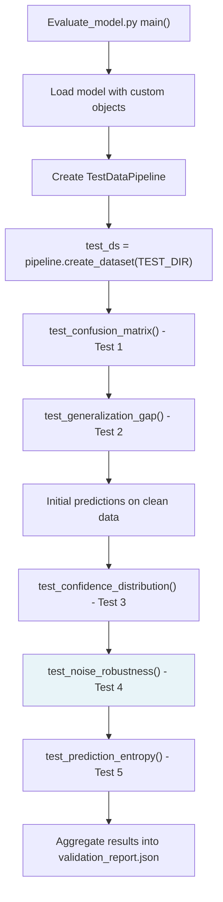

Test 4 is invoked after Tests 1-3 have completed their analysis on clean test data. The function receives:
- The loaded `model` object with custom `SEBlock` and `FocalLoss` layers
- The `test_ds` dataset already normalized and batched
- `class_names` extracted from the dataset
- `output_dir` for saving visualizations

**Sources:** [Evaluate_model.py:396-400](../Evaluate_model.py#L396-L400)

### Custom Object Requirements

The model loading at the beginning of evaluation requires custom object registration for perturbation testing to work:

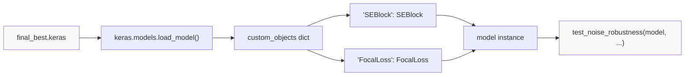

The `SEBlock` class at [Evaluate_model.py:43-61](../Evaluate_model.py#L43-L61) and `FocalLoss` class at [Evaluate_model.py:64-77](../Evaluate_model.py#L64-L77) must be available for model deserialization before perturbation testing can proceed.

**Sources:** [Evaluate_model.py:43-61](../Evaluate_model.py#L43-L61), [Evaluate_model.py:64-77](../Evaluate_model.py#L64-L77)

---

## Configuration Parameters

### Test-Specific Settings

The `Config` class at [Evaluate_model.py:21-36](../Evaluate_model.py#L21-L36) defines Test 4 parameters:

| Parameter | Value | Purpose |
|-----------|-------|---------|
| `NOISE_LEVELS` | `[0.0, 0.01, 0.05]` | Gaussian noise standard deviations |
| `IMAGE_SIZE` | `224` | Input dimensions (inherited from training) |
| `BATCH_SIZE` | `32` | Batch size for perturbation testing |

The noise levels are intentionally conservative (σ ≤ 0.05) to focus on realistic perturbations rather than extreme adversarial scenarios.

**Sources:** [Evaluate_model.py:21-36](../Evaluate_model.py#L21-L36)

### Relationship to Training Configuration

Perturbation testing parameters must align with training-time specifications:

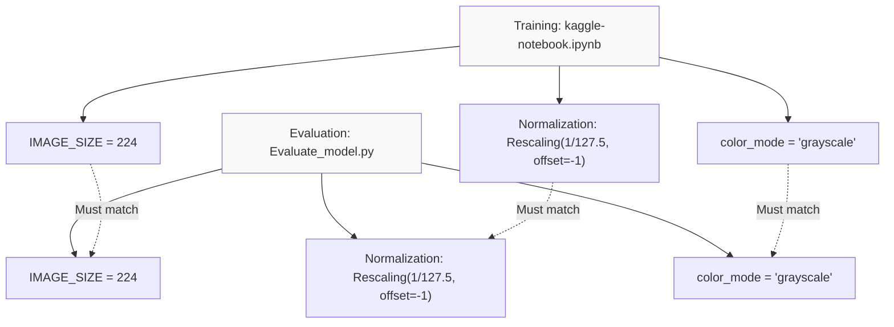

Mismatched configurations would invalidate perturbation test results by introducing distribution shift.

**Sources:** [Evaluate_model.py:28-29](../Evaluate_model.py#L28-L29), [Evaluate_model.py:99-100](../Evaluate_model.py#L99-L100)

---

## Interpretation Guidelines

### Retention Thresholds

The test output includes interpretive thresholds for retention metrics:

| Retention Level | Threshold | Interpretation |
|----------------|-----------|----------------|
| Excellent | > 95% | Minimal sensitivity to realistic noise |
| Good | > 90% | Acceptable degradation under perturbation |
| Concerning | < 90% | Potential production reliability issues |

These thresholds are applied in the stability summary at [Evaluate_model.py:459-460](../Evaluate_model.py#L459-L460).

**Sources:** [Evaluate_model.py:459-460](../Evaluate_model.py#L459-L460)

### Low-Perturbation Emphasis

The test specifically highlights retention at σ=0.01 (the first non-zero noise level) as the most relevant metric:

```python
low_noise_retention = noise_results[0]['retention'] if noise_results else 100
print(f"  Low-perturbation retention: {low_noise_retention:.1f}%")
```

This reflects the practical reality that most production variations correspond to low-magnitude perturbations.

**Sources:** [Evaluate_model.py:455-456](../Evaluate_model.py#L455-L456)

### Comparison with Other Tests

Test 4 complements other validation dimensions:

| Test | Focus | Perturbation Relevance |
|------|-------|------------------------|
| Test 1 (Confusion) | Class discrimination | Baseline feature quality |
| Test 2 (Generalization) | Train/test consistency | Dataset-level stability |
| Test 3 (Confidence) | Uncertainty quantification | Prediction-level reliability |
| **Test 4 (Perturbation)** | **Input stability** | **Noise-level robustness** |
| Test 5 (Entropy) | Information content | Uncertainty characterization |

Test 4 uniquely validates that learned features are not overly sensitive to pixel-level variations.

**Sources:** [Evaluate_model.py:396-484](../Evaluate_model.py#L396-L484)

---

## Expected Output Artifacts

### File System Output

When Test 4 completes, it produces one visualization file:

```
{OUTPUT_DIR}/
└── test4_perturbation_stability.png
```

The output directory is configured at [Evaluate_model.py:26](../Evaluate_model.py#L26) and typically points to `/kaggle/working/evaluation_results/`.

**Sources:** [Evaluate_model.py:26](../Evaluate_model.py#L26), [Evaluate_model.py:481](../Evaluate_model.py#L481)

### Returned Data Structure

The function returns a list of dictionaries for programmatic access:

```python
[
    {'noise_std': 0.01, 'accuracy': 0.85, 'retention': 94.4},
    {'noise_std': 0.05, 'accuracy': 0.78, 'retention': 86.7}
]
```

This data is incorporated into the final validation report by the calling code in `main()`.

**Sources:** [Evaluate_model.py:446-450](../Evaluate_model.py#L446-L450), [Evaluate_model.py:484](../Evaluate_model.py#L484)

---

## Sources Summary

Primary implementation: [Evaluate_model.py:396-484](../Evaluate_model.py#L396-L484)  
Configuration: [Evaluate_model.py:21-36](../Evaluate_model.py#L21-L36)  
Custom objects: [Evaluate_model.py:43-77](../Evaluate_model.py#L43-L77)  
Visualization output: [Evaluation_Results/test4_perturbation_stability.png](../Evaluation_Results/test4_perturbation_stability.png)

# Test 5: Entropy Analysis


## Purpose and Scope

Test 5 implements information-theoretic uncertainty quantification by analyzing the entropy of model predictions. This test validates that the model exhibits appropriate uncertainty awareness: confident (low-entropy) predictions should correlate with correctness, while uncertain (high-entropy) predictions should indicate potential misclassifications. This differs from Test 3 (Confidence Calibration, see [4.4](#4.4)), which examines maximum probability values; Test 5 uses Shannon entropy to measure the full probability distribution's uncertainty.

The test answers: **Does the model's internal uncertainty (measured by prediction entropy) align with prediction accuracy?**

**Sources:** [Evaluate_model.py:438-525](../Evaluate_model.py#L438-L525)

---

## Information-Theoretic Foundation

### Entropy as Uncertainty Measure

Test 5 employs Shannon entropy to quantify prediction uncertainty:

```
H(p) = -Σ p_i * log(p_i)
```

Where `p_i` represents the predicted probability for class `i`. Entropy characteristics:

| Entropy Value | Interpretation | Example Distribution |
|---------------|----------------|---------------------|
| 0.0 | Perfect certainty | [1.0, 0.0, 0.0, ...] |
| ~0.5 | Moderate uncertainty | [0.7, 0.2, 0.1, ...] |
| log(N) | Maximum uncertainty | [1/N, 1/N, ..., 1/N] |

For the 8-class wafer defect problem, maximum entropy is `log(8) ≈ 2.08`, representing uniform probability across all classes.

**Sources:** [Evaluate_model.py:451-452](../Evaluate_model.py#L451-L452)

---

## Implementation Architecture

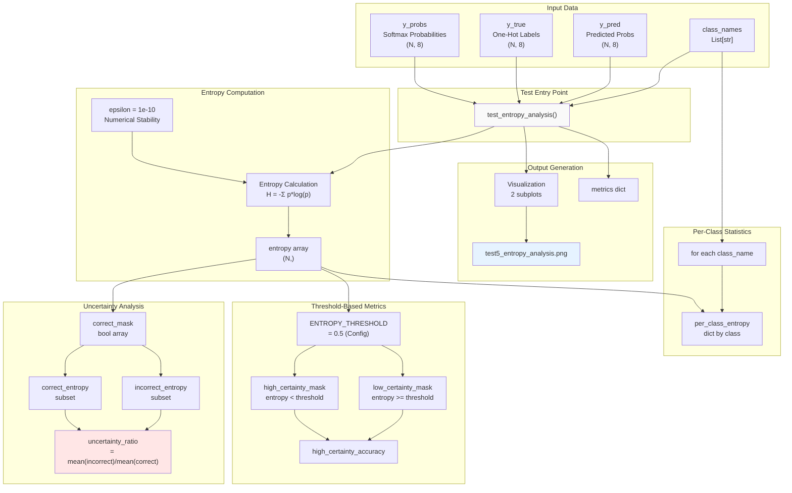

**Sources:** [Evaluate_model.py:438-525](../Evaluate_model.py#L438-L525)

---

## Entropy Calculation Process

### Numerical Implementation

The entropy calculation at [Evaluate_model.py:451-452](../Evaluate_model.py#L451-L452) follows this procedure:

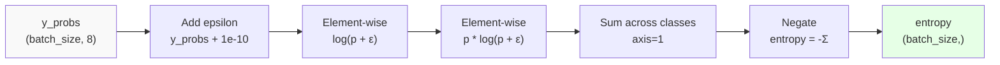

**Key Implementation Details:**

| Component | Value/Purpose | Code Reference |
|-----------|---------------|----------------|
| `epsilon` | `1e-10` | Prevents `log(0)` errors |
| Aggregation axis | `axis=1` | Sum across probability distribution (8 classes) |
| Negation | `-np.sum(...)` | Shannon entropy definition requires negative sign |
| Output shape | `(N,)` | One entropy value per prediction |

**Sources:** [Evaluate_model.py:451-452](../Evaluate_model.py#L451-L452)

---

## Uncertainty Discrimination Analysis

### Correctness-Entropy Correlation

The test stratifies predictions by correctness to measure uncertainty discrimination:

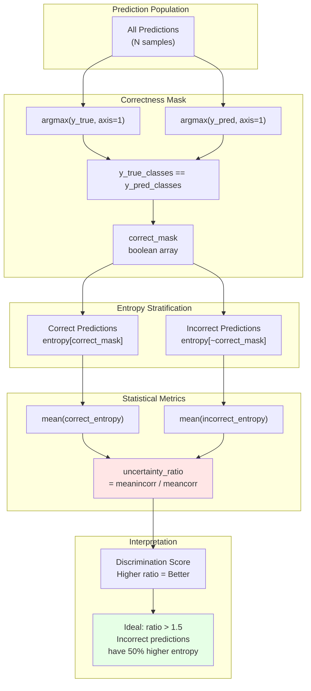

### Threshold-Based Classification

The `ENTROPY_THRESHOLD` (default `0.5` from [Evaluate_model.py:36](../Evaluate_model.py#L36)) partitions predictions:

| Category | Condition | Expected Behavior |
|----------|-----------|-------------------|
| **High Certainty** | `entropy < 0.5` | Majority should be correct predictions |
| **Low Certainty** | `entropy >= 0.5` | Higher proportion of incorrect predictions |

Metrics calculated at [Evaluate_model.py:461-473](../Evaluate_model.py#L461-L473):

- **High-certainty accuracy**: Percentage of correct predictions among low-entropy samples
- **Low-certainty support**: Number of predictions flagged as uncertain
- **Certainty rate**: Proportion of predictions below threshold

**Sources:** [Evaluate_model.py:438-473](../Evaluate_model.py#L438-L473), [Evaluate_model.py:36](../Evaluate_model.py#L36)

---

## Per-Class Entropy Statistics

### Class-Specific Uncertainty Patterns

The test computes mean entropy for each defect class at [Evaluate_model.py:476-486](../Evaluate_model.py#L476-L486):

```python
for i, class_name in enumerate(class_names):
    class_mask = y_true_classes == i
    if np.sum(class_mask) > 0:
        class_entropy = entropy[class_mask]
        per_class_entropy[class_name] = {
            'mean': float(np.mean(class_entropy)),
            'std': float(np.std(class_entropy)),
            'count': int(np.sum(class_mask))
        }
```

This reveals which defect types produce more uncertain predictions:

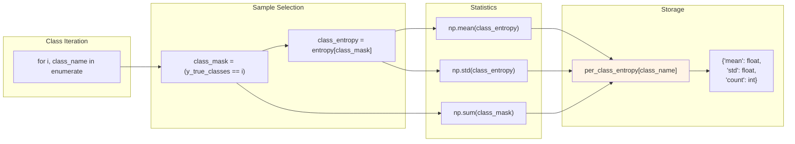

**Interpretation Guide:**

| Mean Entropy Range | Interpretation | Action |
|-------------------|----------------|--------|
| < 0.3 | Model highly confident for this class | Validate accuracy matches confidence |
| 0.3 - 0.7 | Moderate uncertainty | Expected for similar defect types |
| > 0.7 | High uncertainty | Investigate class confusion patterns |

**Sources:** [Evaluate_model.py:476-486](../Evaluate_model.py#L476-L486)

---

## Visualization and Reporting

### Dual-Panel Output

Test 5 generates `test5_entropy_analysis.png` with two visualizations (code at [Evaluate_model.py:489-525](../Evaluate_model.py#L489-L525)):

#### Panel 1: Entropy Distribution by Correctness

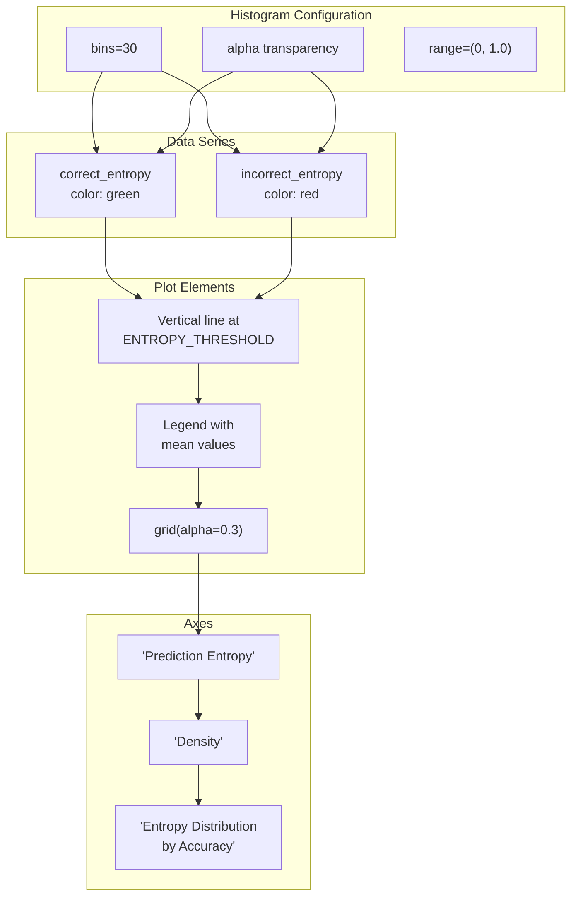

The vertical line at `entropy=0.5` marks the threshold separating high-certainty from low-certainty predictions.

#### Panel 2: Per-Class Entropy Bars

Bar chart showing mean entropy for each of the 8 defect classes, with error bars representing standard deviation. Classes sorted by mean entropy (lowest to highest) to highlight which defect types the model finds most/least certain.

**Sources:** [Evaluate_model.py:489-525](../Evaluate_model.py#L489-L525)

---

## Console Output Format

The test prints structured output to terminal at [Evaluate_model.py:454-487](../Evaluate_model.py#L454-L487):