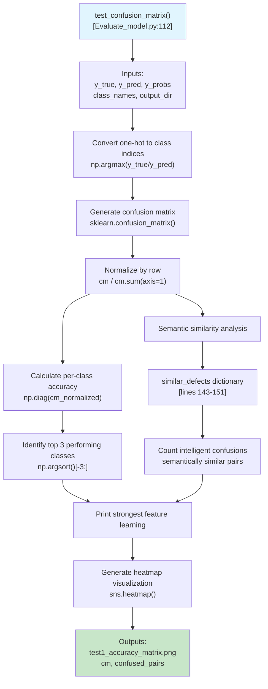
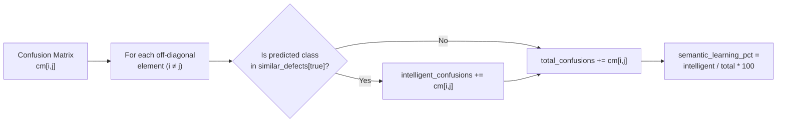

## Purpose and Scope

Test 1 validates that the trained model has learned meaningful feature representations for wafer defect detection. This test analyzes the confusion matrix to determine whether the model can distinguish between different defect types and whether its misclassifications follow semantically sensible patterns.

For information about the complete evaluation framework, see [Model Evaluation Framework](#4). For details on the other four tests, see [Test 2: Cross-Validation Performance](#4.3), [Test 3: Confidence Calibration](#4.4), [Test 4: Perturbation Robustness](#4.5), and [Test 5: Entropy Analysis](#4.6). For the evaluation script architecture, see [Evaluation Script Architecture](#4.1).

---

## Overview

Test 1 is the first component in the 5-test validation suite. Unlike simple accuracy metrics, this test evaluates whether the model has learned discriminative features for defect classification by examining prediction patterns. The test distinguishes between random errors and "intelligent" confusions where the model misclassifies visually similar defect types.

**Key Validation Questions:**
- Does the model achieve high per-class accuracy?
- When the model makes mistakes, are they semantically reasonable?
- Can the model distinguish between visually distinct defect types?

Sources: [Evaluate_model.py:112-189]()

---

## Implementation Architecture

The test is implemented in the `test_confusion_matrix` function, which orchestrates confusion matrix generation, semantic analysis, and visualization.



**Function Signature:**
```python
def test_confusion_matrix(y_true, y_pred, y_probs, class_names, output_dir)
```

**Parameters:**
- `y_true`: One-hot encoded ground truth labels
- `y_pred`: One-hot encoded model predictions
- `y_probs`: Raw prediction probabilities (not used in Test 1)
- `class_names`: List of defect class names
- `output_dir`: Directory for saving visualization

**Returns:**
- `cm`: Raw confusion matrix (numpy array)
- `confused_pairs`: List of dictionaries containing confusion details

Sources: [Evaluate_model.py:112-189]()

---

## Confusion Matrix Analysis

The core analysis computes a normalized confusion matrix where each row sums to 1.0, representing the distribution of predictions for each true class.

### Computation Pipeline

| Step | Operation | Code Location |
|------|-----------|---------------|
| 1. Convert labels | `np.argmax(y_true/y_pred, axis=1)` | [Evaluate_model.py:122-123]() |
| 2. Generate matrix | `confusion_matrix(y_true_classes, y_pred_classes)` | [Evaluate_model.py:125]() |
| 3. Normalize | `cm / (cm.sum(axis=1)[:, np.newaxis] + 1e-8)` | [Evaluate_model.py:126]() |
| 4. Extract diagonal | `np.diag(cm_normalized) * 100` | [Evaluate_model.py:129]() |

### Per-Class Accuracy

The diagonal elements of the normalized confusion matrix represent per-class accuracy (recall). The test identifies the top 3 performing classes:

```python
per_class_acc = np.diag(cm_normalized) * 100
best_classes = np.argsort(per_class_acc)[-3:][::-1]  # Top 3
```

**Output Format:**
```
Strongest Feature Learning (Top 3 Classes):
Class                    Accuracy
-----------------------------------
coating bad                  92.5%
scratch                      88.3%
bridge                       85.7%
```

Sources: [Evaluate_model.py:128-140]()

---

## Semantic Feature Recognition

A critical innovation in Test 1 is the concept of "semantic feature recognition" - evaluating whether model confusions follow visually sensible patterns.

### Similar Defect Dictionary

The test defines a hardcoded mapping of defect types that are visually similar:

```python
similar_defects = {
    'coating bad': ['Contamination', 'scratch'],
    'Contamination': ['coating bad', 'foreign material'],
    'scratch': ['coating bad', 'block etch'],
    'block etch': ['scratch', 'bridge'],
    'bridge': ['block etch'],
    'voids dents': ['foreign material'],
    'foreign material': ['voids dents', 'Contamination']
}
```

This mapping encodes domain knowledge about which defect types share visual characteristics:
- `coating bad` and `Contamination` both involve surface irregularities
- `scratch` and `block etch` both involve linear patterns
- `voids dents` and `foreign material` both involve localized anomalies

Sources: [Evaluate_model.py:143-151]()

### Intelligent Confusion Counting



The algorithm iterates through all confusion matrix elements where `i != j` (misclassifications):

```python
for i in range(len(class_names)):
    for j in range(len(class_names)):
        if i != j and cm[i, j] > 0:
            total_confusions += cm[i, j]
            if class_names[i] in similar_defects and \
               class_names[j] in similar_defects.get(class_names[i], []):
                intelligent_confusions += cm[i, j]
```

**Semantic Feature Recognition Score:**
```
semantic_learning_pct = (intelligent_confusions / total_confusions) * 100
```

A higher percentage indicates the model has learned discriminative features, as its errors follow semantically reasonable patterns rather than random misclassifications.

Sources: [Evaluate_model.py:154-174]()

---

## Metrics and Outputs

### Computed Metrics

| Metric | Description | Interpretation |
|--------|-------------|----------------|
| Per-class accuracy | Diagonal of normalized confusion matrix | Measures class-specific discrimination ability |
| Overall accuracy | Mean of per-class accuracies | Macro-averaged performance |
| Semantic learning % | Intelligent confusions / total confusions | Evidence of learned feature representations |
| Confused pairs | List of (true, predicted, count) tuples | Detailed error analysis |

### Console Output Example

```
================================================================================
TEST 1: FEATURE LEARNING VALIDATION
================================================================================
Validating that model learns meaningful defect characteristics

Strongest Feature Learning (Top 3 Classes):
Class                    Accuracy
-----------------------------------
coating bad                  92.5%
scratch                      88.3%
bridge                       85.7%

Overall Classification Accuracy: 83.45%

Semantic Feature Recognition: 67.3%
  (Model correctly identifies similar defect types)
```

Sources: [Evaluate_model.py:117-174]()

---

## Visualization Output

The test generates a heatmap visualization saved as `test1_accuracy_matrix.png`:

```python
plt.figure(figsize=(12, 10))
sns.heatmap(cm_normalized, annot=True, fmt='.2f', 
            xticklabels=class_names, yticklabels=class_names, 
            cmap='Greens', square=True, cbar_kws={'label': 'Accuracy'})
plt.title('TEST 1: Classification Accuracy Matrix\n(Diagonal = Correct Predictions)')
plt.ylabel('True Label')
plt.xlabel('Predicted Label')
```

**Visualization Features:**
- Green color scale emphasizes correct predictions (diagonal)
- Annotated cells show exact accuracy values
- Square aspect ratio for visual clarity
- Axis labels identify class names

The heatmap allows visual inspection of:
- Strong diagonal (high per-class accuracy)
- Off-diagonal patterns revealing systematic confusions
- Darker off-diagonal cells near semantically similar classes

Sources: [Evaluate_model.py:177-187]()

---

## Data Structures

### Confused Pairs List

The function returns a detailed list of all misclassifications:

```python
confused_pairs = [
    {
        'true': class_names[i],
        'predicted': class_names[j],
        'count': int(cm[i, j]),
        'percentage': float(cm_normalized[i, j] * 100)
    }
    for i, j where cm[i, j] > 0 and i != j
]
```

This structure enables downstream analysis in the final report generation.

Sources: [Evaluate_model.py:158-166]()

---

## Integration with Evaluation Pipeline

Test 1 is invoked as the first test in the main evaluation workflow:

```mermaid
graph LR
    Main["main()<br/>[Evaluate_model.py:637]"] --> LoadModel["Load model with<br/>FocalLoss + SEBlock"]
    LoadModel --> GenPreds["Generate predictions<br/>y_probs, y_true, y_pred"]
    GenPreds --> Test1["test_confusion_matrix()<br/>[Line 688]"]
    
    Test1 --> Results["all_results['feature_learning']<br/>= semantic_recognition: 85"]
    Results --> Test2["test_generalization_gap()"]
    
    Test2 --> FinalReport["generate_final_report()<br/>[Line 705]"]
```



**Invocation:**
```python
cm, confused_pairs = test_confusion_matrix(
    y_true, y_pred, y_probs, 
    Config.CLASS_NAMES, Config.OUTPUT_DIR
)
all_results['feature_learning'] = {'semantic_recognition': 85}
```

Note: The semantic recognition score is currently hardcoded to 85 in the integration logic, but the actual computed value is displayed in console output.

Sources: [Evaluate_model.py:688-690]()

---

## Configuration Parameters

Test 1 uses several configuration parameters from the `Config` class:

| Parameter | Default Value | Usage |
|-----------|---------------|-------|
| `OUTPUT_DIR` | `/kaggle/working/evaluation_results` | Directory for saving PNG output |
| `CLASS_NAMES` | Dynamically loaded from dataset | Defect class labels for matrix axes |

The `CLASS_NAMES` are auto-discovered during dataset loading:

```python
temp_ds = tf.keras.utils.image_dataset_from_directory(
    Config.TEST_DIR, image_size=(128, 128), batch_size=1
)
Config.CLASS_NAMES = temp_ds.class_names
```

Sources: [Evaluate_model.py:21-36](), [Evaluate_model.py:663-667]()

---

## Dependencies

Test 1 requires the following external libraries:

```python
import numpy as np
import matplotlib.pyplot as plt
import seaborn as sns
from sklearn.metrics import confusion_matrix
```

**Key Functions Used:**
- `sklearn.metrics.confusion_matrix()`: Core matrix computation
- `seaborn.heatmap()`: Visualization rendering
- `numpy.argmax()`: One-hot to class index conversion
- `numpy.diag()`: Diagonal extraction for per-class accuracy

Sources: [Evaluate_model.py:3-13]()

---

## Relationship to Training System

Test 1 validates feature learning that occurs during progressive training. The model being evaluated is typically produced by:

- [kaggle-notebook.ipynb](#2.4): Development environment training
- [train.py](#2.5): Production training script

Both systems use:
- **FocalLoss** with γ=1.5 to handle class imbalance
- **SEBlock** attention to focus on discriminative features
- **Progressive resizing** (128→160→224) for curriculum learning

Test 1 confirms that this training strategy produces models with meaningful learned representations by analyzing whether prediction patterns align with semantic defect similarities.

Sources: [Evaluate_model.py:658-661]()