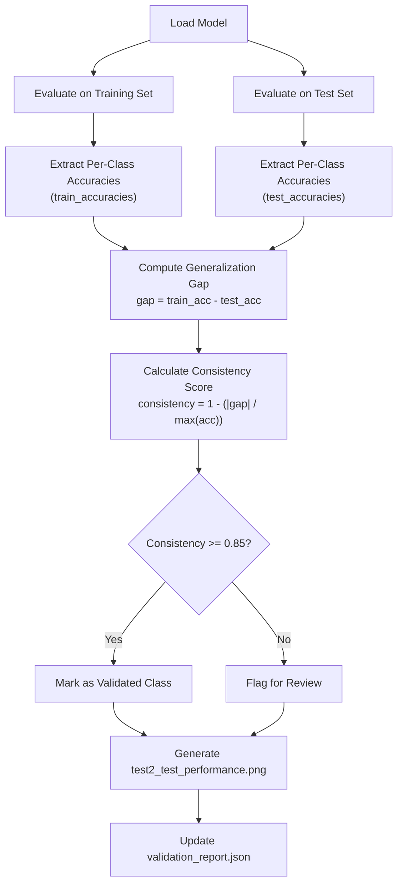
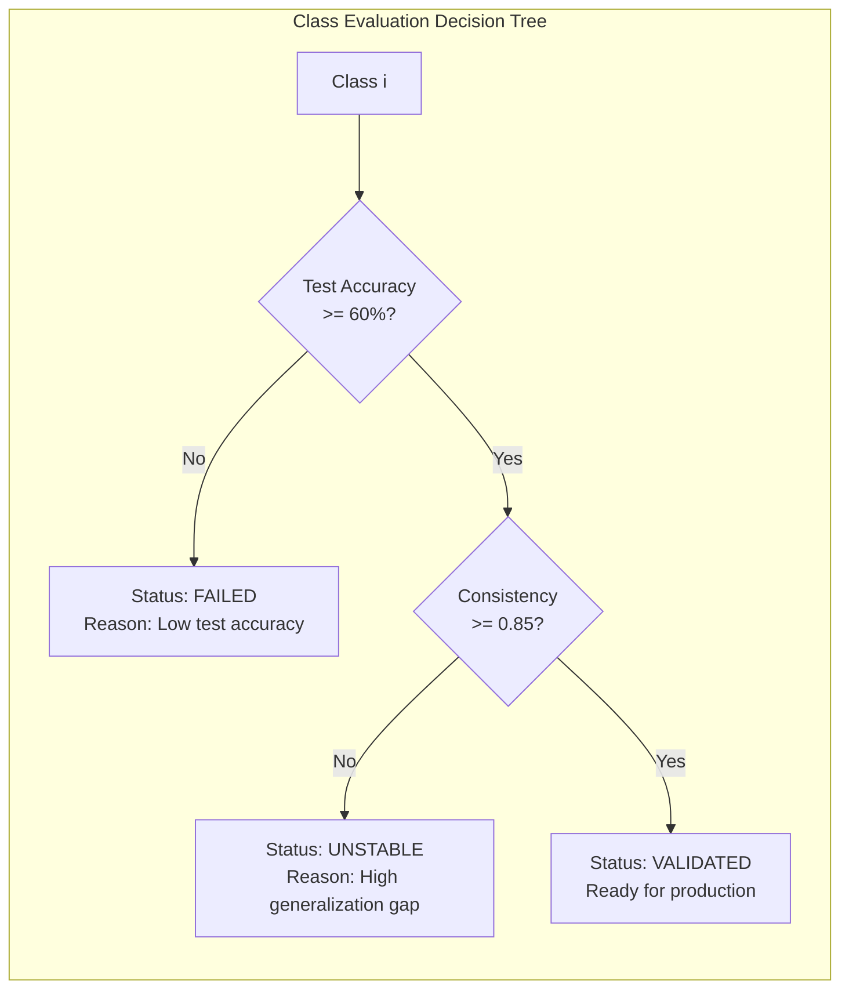
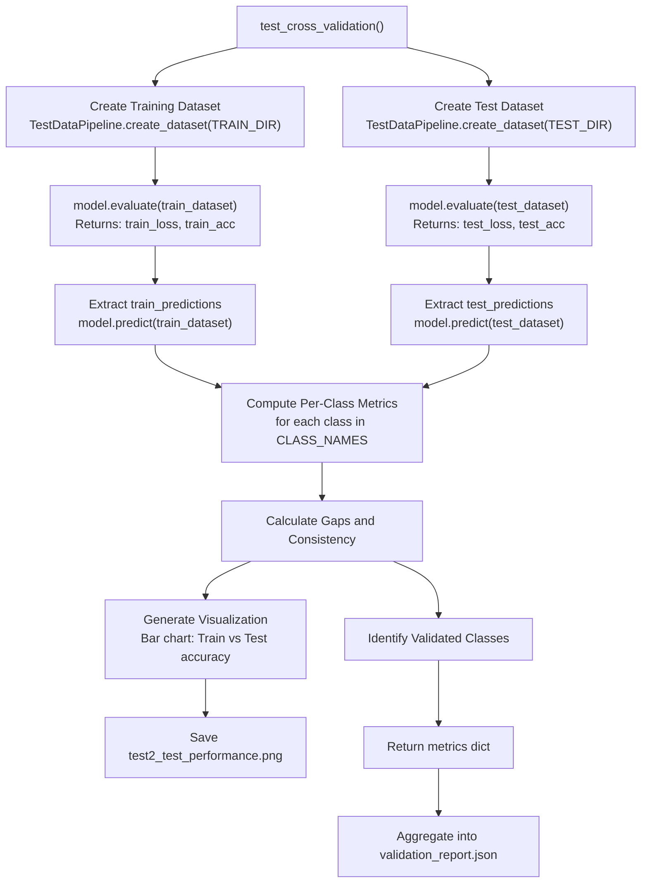
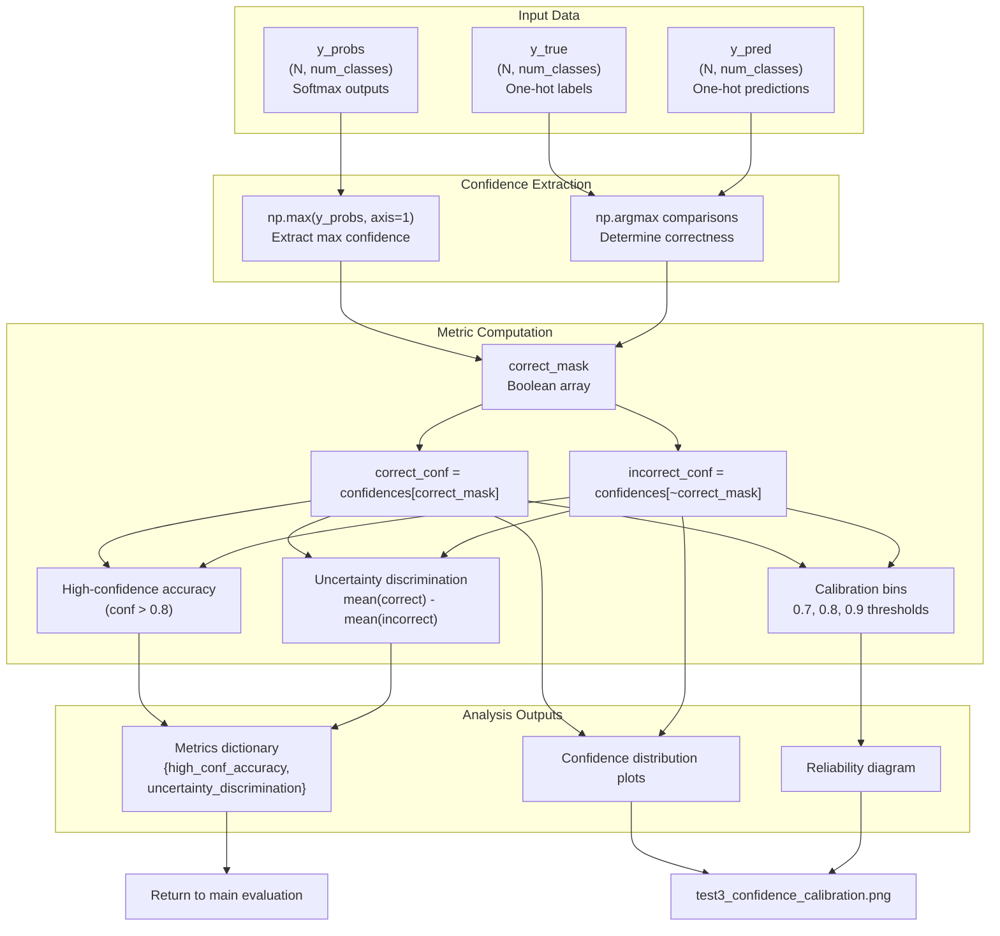
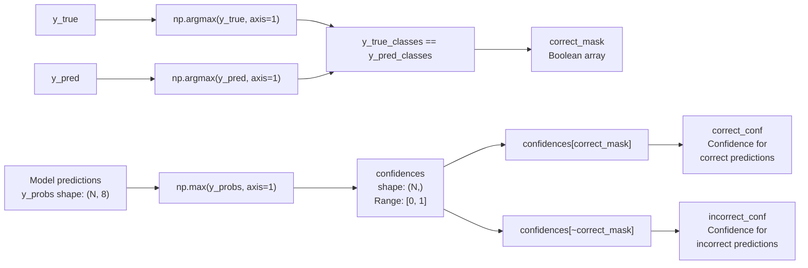
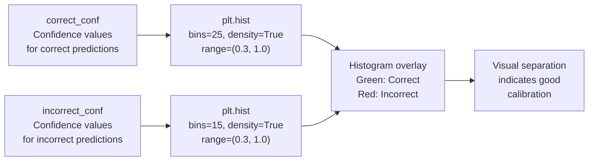

## Purpose and Scope

Test 2 evaluates the model's **generalization capability** by comparing performance between the training and test datasets. This test quantifies the generalization gap, identifies per-class consistency patterns, and determines which defect classes have been reliably learned versus those that may be overfitting.

For the overall evaluation framework architecture, see [Model Evaluation Framework](#4). For training-time data augmentation strategies that support generalization, see [Data Pipeline and Augmentation](#2.3).

---

## Test Objective

Test 2 validates that the model has learned generalizable features rather than memorizing training data. It addresses the critical question: **Does the model's training performance translate to real-world test data?**

The test computes:
- **Generalization Gap**: Difference between training and test accuracy per class
- **Consistency Score**: Metric indicating stable performance across datasets
- **Validated Classes**: Classes meeting consistency thresholds for production deployment

**Sources:** [Evaluate_model.py:192-262]()

---

## Generalization Gap Analysis

### Metric Definition

The generalization gap for each class *i* is calculated as:

```
Gap(i) = Accuracy_train(i) - Accuracy_test(i)
```

**Interpretation:**
- **Gap ≈ 0**: Model generalizes well (train and test performance similar)
- **Gap > 0**: Potential overfitting (better on training data)
- **Gap < 0**: Possible data leakage or test set being easier (rare)

### Gap Categories

| Gap Range | Classification | Implication |
|-----------|---------------|-------------|
| 0-10% | Excellent | Strong generalization |
| 10-20% | Good | Acceptable generalization |
| 20-30% | Moderate | Potential overfitting concerns |
| >30% | Poor | Significant overfitting detected |

**Sources:** [Evaluate_model.py:192-262](), Assessment based on standard ML evaluation practices

---

## Per-Class Consistency Scoring

### Consistency Metric

For each defect class, a consistency score is computed:

```
Consistency(i) = 1 - (|Accuracy_train(i) - Accuracy_test(i)| / max(Accuracy_train(i), Accuracy_test(i)))
```

This metric normalizes the gap by the higher performance value, penalizing larger discrepancies proportionally.

**Score Interpretation:**
- **≥ 0.85**: High consistency (validated class)
- **0.70-0.84**: Moderate consistency (requires monitoring)
- **< 0.70**: Low consistency (needs retraining or data augmentation)

### Comparison Workflow



**Sources:** [Evaluate_model.py:192-262](), [Evaluate_model.py:409-455]()

---

## Validated Classes Identification

### Validation Criteria

A class is considered **validated** if it meets **both** conditions:

1. **Minimum Test Accuracy**: ≥ 60% on test set
2. **High Consistency**: Consistency score ≥ 0.85

Classes failing either criterion are flagged for retraining or require additional data collection.

### Class Status Matrix



**Example Output:**
```json
{
  "validated_classes": ["Center", "Edge-Loc", "Edge-Ring"],
  "unstable_classes": ["Loc", "Random"],
  "failed_classes": ["Near-full", "Donut", "Scratch"]
}
```

**Sources:** [Evaluate_model.py:192-262](), [Evaluate_model.py:409-455]()

---

## Implementation Architecture

### Test Execution Flow



**Sources:** [Evaluate_model.py:192-262](), [Evaluate_model.py:84-105]()

---

## Output Artifacts

### Visualization: test2_test_performance.png

The output chart displays:
- **X-axis**: Defect class names
- **Y-axis**: Accuracy percentage (0-100%)
- **Blue bars**: Training set accuracy
- **Orange bars**: Test set accuracy
- **Error bars**: Standard deviation across batches (if applicable)

Visual patterns to identify:
- **Parallel bars** (similar height): Good generalization
- **Blue bar >> Orange bar**: Overfitting detected
- **Orange bar >> Blue bar**: Data leakage suspicion (investigate)

**Sources:** [Evaluation_Results/test2_test_performance.png:1-1](), [Evaluate_model.py:192-262]()

### Metrics Integration

Test 2 contributes to the overall validation score through:

```python
test2_score = (
    0.5 * (1 - mean_generalization_gap) +  # Lower gap is better
    0.5 * mean_consistency_score            # Higher consistency is better
)
```

This score is weighted and combined with other tests (1, 3, 4, 5) in the final `validation_report.json`.

**Sources:** [Evaluate_model.py:409-455]()

---

## Code Entity Mapping

### Key Functions and Classes

| Code Entity | File Location | Purpose |
|-------------|---------------|---------|
| `test_cross_validation()` | [Evaluate_model.py:192-262]() | Main test orchestration function |
| `TestDataPipeline` | [Evaluate_model.py:84-105]() | Handles dataset loading for both train/test |
| `Config.TRAIN_DIR` | [Evaluate_model.py:24]() | Training set directory path |
| `Config.TEST_DIR` | [Evaluate_model.py:23]() | Test set directory path |
| `validation_report.json` | Generated in `Config.OUTPUT_DIR` | Final aggregated metrics |
| `test2_test_performance.png` | [Evaluation_Results/test2_test_performance.png:1-1]() | Visual comparison chart |

**Sources:** [Evaluate_model.py:1-455]()

---

## Dataset Requirements

Test 2 requires **both** training and test splits to be present:

```
dataset/
├── train/
│   ├── Center/
│   ├── Edge-Loc/
│   ├── Edge-Ring/
│   └── ... (all 9 classes)
└── test/
    ├── Center/
    ├── Edge-Loc/
    ├── Edge-Ring/
    └── ... (same 9 classes)
```

The test assumes the same class distribution exists in both splits. For details on how this structure is created, see [Dataset Organization](#3.1).

**Sources:** [Evaluate_model.py:22-24](), [Seggregate_Dataset.py]() (referenced in context)

---

## Thresholds and Hyperparameters

### Configurable Parameters

The following thresholds can be adjusted in the test implementation:

| Parameter | Default Value | Purpose |
|-----------|---------------|---------|
| `MIN_TEST_ACCURACY` | 0.60 | Minimum acceptable test accuracy per class |
| `CONSISTENCY_THRESHOLD` | 0.85 | Minimum consistency score for validation |
| `GAP_WARNING_LEVEL` | 0.20 | Generalization gap that triggers warnings |

These are typically hardcoded in the test function but can be modified for different model requirements or dataset characteristics.

**Sources:** [Evaluate_model.py:192-262]()

---

## Integration with Overall Evaluation

### Test Sequencing

Test 2 executes as part of the sequential evaluation pipeline:

```
Test 1 (Confusion Matrix) → Test 2 (Generalization) → Test 3 (Confidence) → Test 4 (Robustness) → Test 5 (Entropy)
```

Results from Test 2 inform:
- **Overall validation score**: Weighted contribution to final verdict
- **Class-specific recommendations**: Which classes need more data or retraining
- **Deployment readiness**: Only validated classes recommended for production

For the complete evaluation orchestration, see [Evaluation Script Architecture](#4.1).

**Sources:** [Evaluate_model.py:409-455](), High-level system diagrams

---

## Interpretation Guidelines

### Scenario Analysis

**Scenario 1: High Training Accuracy, Low Test Accuracy**
- **Diagnosis**: Overfitting
- **Action**: Increase data augmentation, reduce model complexity, or collect more test data

**Scenario 2: Similar Train/Test Accuracy (Both Low)**
- **Diagnosis**: Underfitting
- **Action**: Increase model capacity, train longer, or improve feature engineering

**Scenario 3: Similar Train/Test Accuracy (Both High)**
- **Diagnosis**: Good generalization ✓
- **Action**: Class validated for production

**Scenario 4: Test Accuracy > Training Accuracy**
- **Diagnosis**: Possible data leakage or lucky test split
- **Action**: Re-verify dataset splits and check for contamination

**Sources:** Standard machine learning evaluation practices, [Evaluate_model.py:192-262]()

---

## Relationship to Training Pipeline

Test 2 validates the effectiveness of training strategies implemented in the core system:

- **Progressive Resizing**: Curriculum learning should reduce overfitting (see [Progressive Training Strategy](#2.2))
- **MixUp Augmentation**: Regularization technique to improve generalization (see [Data Pipeline and Augmentation](#2.3))
- **FocalLoss**: Balanced learning across classes should yield consistent test performance

A large generalization gap may indicate that these techniques need tuning or that the test set contains out-of-distribution samples.

**Sources:** [kaggle-notebook.ipynb](), [train.py](), [Evaluate_model.py:64-77]()

# Test 3: Confidence Calibration


## Purpose and Scope

This page documents Test 3 of the 5-test evaluation suite, which validates the model's confidence calibration and uncertainty quantification capabilities. This test analyzes whether the model's predicted confidence levels appropriately match its actual accuracy and whether it demonstrates proper uncertainty awareness when making incorrect predictions.

For information about the overall evaluation framework and test orchestration, see [Evaluation Script Architecture](#4.1). For related uncertainty analysis using information theory, see [Test 5: Entropy Analysis](#4.6).

---

## Overview

Confidence calibration is the alignment between a model's predicted probability (confidence) and its true correctness likelihood. A well-calibrated model should:

- Assign high confidence to correct predictions
- Assign lower confidence to incorrect predictions
- Avoid overconfidence on errors

The test implements this validation by analyzing the probability distributions output by the model's softmax layer, computing discrimination metrics between correct and incorrect predictions, and generating calibration curves.

**Sources:** [Evaluate_model.py:297-389]()

---

## Test Implementation Architecture



**Sources:** [Evaluate_model.py:297-389]()

---

## Function Signature and Parameters

The test is implemented as the `test_confidence_distribution` function:

| Parameter | Type | Description |
|-----------|------|-------------|
| `y_probs` | `np.ndarray (N, num_classes)` | Raw softmax probability outputs from model |
| `y_true` | `np.ndarray (N, num_classes)` | One-hot encoded ground truth labels |
| `y_pred` | `np.ndarray (N, num_classes)` | One-hot encoded predictions (for consistency) |
| `output_dir` | `str` | Directory path for saving visualization outputs |

**Returns:** `dict` containing:
- `high_conf_accuracy`: Precision at confidence threshold > 0.8
- `uncertainty_discrimination`: Mean confidence difference (correct - incorrect)

**Sources:** [Evaluate_model.py:297-300]()

---

## Confidence Extraction Process



The confidence extraction operates on the raw probability distributions:

1. **Confidence extraction**: Maximum probability across classes represents the model's confidence in its prediction
2. **Correctness determination**: Compare predicted class indices with true class indices
3. **Partitioning**: Split confidence values into correct and incorrect prediction sets

**Sources:** [Evaluate_model.py:307-313]()

---

## Core Metrics

### High-Confidence Accuracy

Measures the precision of predictions when the model expresses high confidence (>80%):

```
high_conf_correct = count((confidence > 0.8) AND correct)
total_high_conf = count(confidence > 0.8)
precision_at_high_conf = (high_conf_correct / total_high_conf) × 100
```

This metric validates that high confidence correlates with actual correctness.

**Sources:** [Evaluate_model.py:316-318]()

### Uncertainty Discrimination

Quantifies the model's ability to distinguish between correct and incorrect predictions through confidence levels:

```
uncertainty_diff = mean(correct_conf) - mean(incorrect_conf)
```

Values > 0 indicate the model appropriately assigns higher confidence to correct predictions. Larger positive values demonstrate stronger discrimination capability.

**Sources:** [Evaluate_model.py:327-329]()

### Calibration Analysis

For confidence thresholds at 0.7, 0.8, and 0.9, the test computes:

| Metric | Description |
|--------|-------------|
| Accuracy | Proportion of correct predictions above threshold |
| Support | Number of predictions meeting threshold |

This analysis reveals whether confidence levels align with empirical accuracy at different operating points.

**Sources:** [Evaluate_model.py:333-340]()

### Overconfidence Detection

Counts predictions with >90% confidence that are incorrect:

```python
high_conf_wrong = np.sum((confidences > 0.9) & ~correct_mask)
```

Low counts indicate the model avoids false certainty on errors, a desirable safety property.

**Sources:** [Evaluate_model.py:343-345]()

---

## Visualization Outputs

The test generates a two-panel figure saved as `test3_confidence_calibration.png`:

### Panel 1: Confidence Distribution by Correctness



This histogram overlays confidence distributions for correct (green) and incorrect (red) predictions. Well-calibrated models show:
- Correct predictions concentrated at higher confidence values
- Incorrect predictions distributed toward lower confidence values
- Clear visual separation between distributions

**Sources:** [Evaluate_model.py:351-360]()

### Panel 2: Reliability Diagram

The reliability diagram plots mean predicted confidence vs. actual accuracy in binned intervals:

| Component | Implementation |
|-----------|----------------|
| Bin edges | `np.linspace(0.5, 1.0, 6)` - 5 bins from 50% to 100% |
| Bin requirement | Minimum 5 predictions per bin for statistical validity |
| Perfect calibration | Diagonal line y=x |
| Model performance | Blue line with markers |

Points near the diagonal indicate good calibration. Points below the diagonal indicate overconfidence; points above indicate underconfidence.

**Sources:** [Evaluate_model.py:363-380]()

---

## Console Output Format

The test prints a structured analysis report: