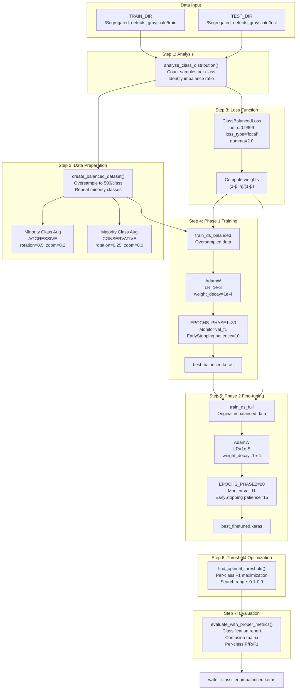
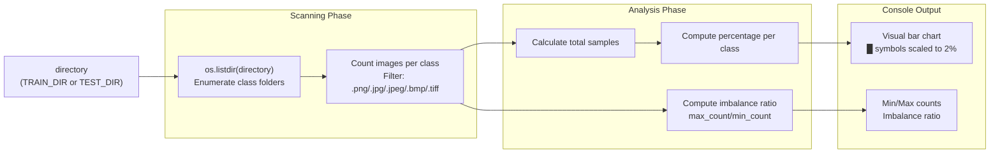
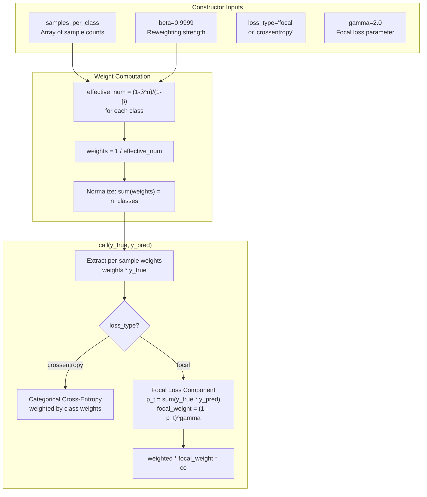
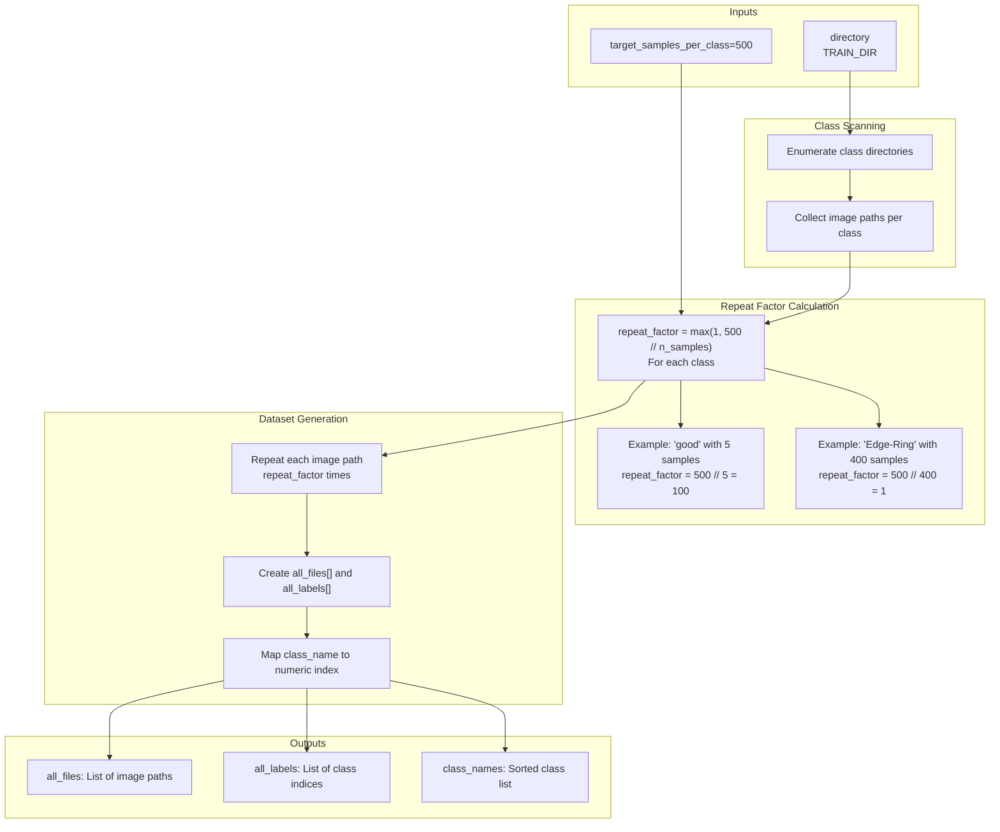
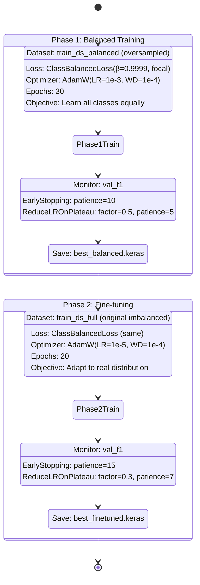
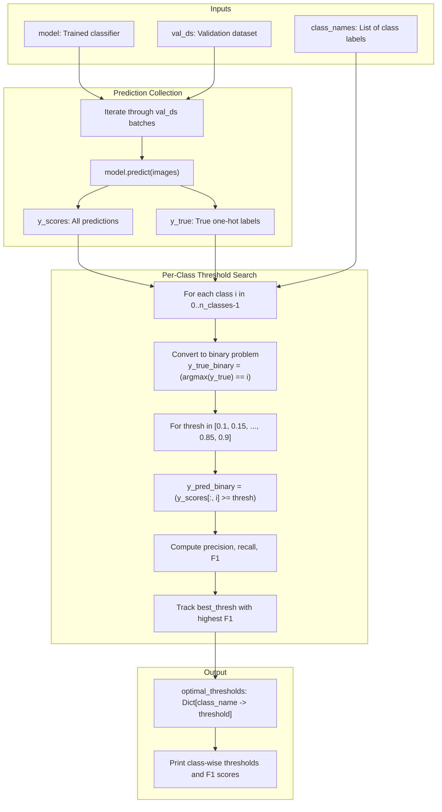
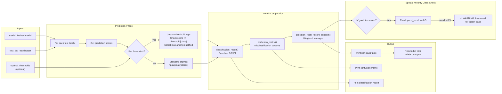
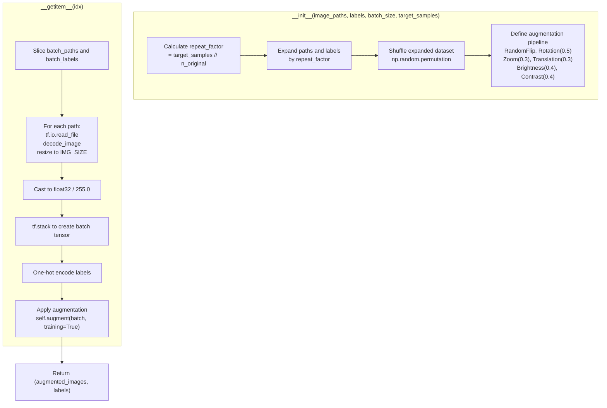
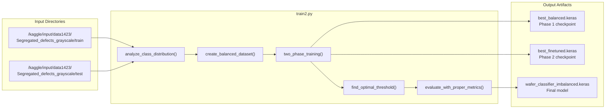

## Purpose and Scope

This document describes the two-phase training approach implemented in `train2.py`, an alternative training strategy that addresses extreme class imbalance in the wafer defect dataset through Class-Balanced Loss and staged training. This approach is particularly designed to handle cases where minority classes (such as the 'good' class with only 5 samples) are severely underrepresented.

This system is distinct from the current production approach (see [2](#2)) which uses progressive resizing and FocalLoss. For the CNN-SVM ensemble alternative, see [5.2](#5.2).

**Sources:** [Previous_training_scripts/train2.py:1-534](../Previous_training_scripts/train2.py#L1-L534)

---

## System Architecture Overview

The `train2.py` system employs a fundamentally different strategy than the current production system, focusing on data-level solutions (oversampling) combined with loss-function-based reweighting, followed by adaptation to the real-world distribution through fine-tuning.



**Sources:** [Previous_training_scripts/train2.py:1-534](../Previous_training_scripts/train2.py#L1-L534)

---

## Configuration and Hyperparameters

The system uses fixed configuration parameters that differ significantly from the production system:

| Parameter | Value | Purpose |
|-----------|-------|---------|
| `IMG_SIZE` | 224 | Fixed resolution (no progressive resizing) |
| `BATCH_SIZE` | 32 | Standard batch size |
| `EPOCHS_PHASE1` | 30 | Balanced dataset training duration |
| `EPOCHS_PHASE2` | 20 | Fine-tuning duration on full data |
| `target_samples_per_class` | 500 | Oversampling target |
| `beta` | 0.9999 | Class-Balanced Loss parameter |
| `gamma` | 2.0 | Focal loss focusing parameter |

The configuration is defined at [Previous_training_scripts/train2.py:10-13](../Previous_training_scripts/train2.py#L10-L13) and referenced throughout the training pipeline. Unlike the production system, there is no progressive resizing curriculum—all training occurs at 224×224 resolution.

**Sources:** [Previous_training_scripts/train2.py:10-16](../Previous_training_scripts/train2.py#L10-L16)

---

## Class Distribution Analysis

The `analyze_class_distribution()` function provides critical diagnostic information about the dataset imbalance before training begins:



The function implements a visualization using ASCII bar charts where each █ character represents approximately 2% of the dataset. This provides immediate visual feedback about the severity of class imbalance. The imbalance ratio (e.g., "Most imbalanced ratio: 1000:1") quantifies the disparity between the most and least represented classes.

**Example output structure:**
```
📊 CLASS DISTRIBUTION ANALYSIS:
============================================================
good                     :     5 ( 0.05%) █
Edge-Loc                 :   347 ( 3.47%) ██████
Center                   :   450 ( 4.50%) █████████
...
============================================================
Total images: 10000
Most imbalanced ratio: 2000.0:1
```

**Sources:** [Previous_training_scripts/train2.py:21-46](../Previous_training_scripts/train2.py#L21-L46)

---

## Class-Balanced Loss Function

The `ClassBalancedLoss` class implements the loss function from "Class-Balanced Loss Based on Effective Number of Samples" (CVPR 2019), which addresses imbalance by reweighting based on the effective number of samples rather than raw counts.

### Mathematical Formulation

The loss computes class weights using the effective number formula:

```
effective_num = (1 - β^n) / (1 - β)
weight = 1 / effective_num
```

Where:
- `n` is the number of samples in the class
- `β` is a hyperparameter (0.9999) that controls reweighting strength
- Higher `β` values approach inverse frequency weighting



### Implementation Details

The `ClassBalancedLoss.__init__()` method [Previous_training_scripts/train2.py:59-76](../Previous_training_scripts/train2.py#L59-L76) precomputes class weights during initialization, printing diagnostic output showing the sample count and computed weight for each class. This allows verification that minority classes receive appropriately higher weights.

The `call()` method [Previous_training_scripts/train2.py:78-95](../Previous_training_scripts/train2.py#L78-L95) applies these weights to either standard cross-entropy or focal loss. When `loss_type="focal"`, it combines:
1. Class-based reweighting from effective number of samples
2. Prediction-based reweighting from focal loss focusing parameter

This dual reweighting addresses both dataset-level imbalance (via class weights) and prediction-level difficulty (via focal loss).

**Sources:** [Previous_training_scripts/train2.py:51-96](../Previous_training_scripts/train2.py#L51-L96)

---

## Balanced Dataset Creation via Oversampling

The `create_balanced_dataset()` function implements aggressive oversampling to equalize class representation before training.



### Oversampling Strategy

The function [Previous_training_scripts/train2.py:100-141](../Previous_training_scripts/train2.py#L100-L141) implements simple repetition of file paths rather than immediate data duplication. For a minority class like 'good' with 5 samples:
- `repeat_factor = 500 // 5 = 100`
- Each of the 5 images appears 100 times in `all_files`
- Total: ~500 samples for the 'good' class

This approach defers augmentation to training time, where each repetition will receive different random augmentations, creating synthetic diversity. The repeated paths consume minimal memory compared to storing actual augmented images.

**Sources:** [Previous_training_scripts/train2.py:100-141](../Previous_training_scripts/train2.py#L100-L141)

---

## Differential Augmentation Strategy

The `create_augmentation_pipeline()` function creates different augmentation strategies based on class prevalence:

| Augmentation Type | Minority Classes | Majority Classes |
|-------------------|------------------|------------------|
| Flip | horizontal_and_vertical | horizontal only |
| Rotation | 0.5 (±180°) | 0.25 (±90°) |
| Zoom | 0.2 (±20%) | None |
| Translation | 0.2 (±20%) | None |
| Brightness | 0.3 (±30%) | 0.1 (±10%) |
| Contrast | 0.3 (±30%) | 0.1 (±10%) |

**Rationale:** Minority classes need more aggressive augmentation to create synthetic diversity since each base image is repeated many times (e.g., 100× for the 'good' class). Majority classes need only conservative augmentation to prevent overfitting while maintaining defect pattern integrity.

**Sources:** [Previous_training_scripts/train2.py:146-169](../Previous_training_scripts/train2.py#L146-L169)

---

## Two-Phase Training Strategy

The core training philosophy divides learning into two distinct phases with different objectives:



### Phase 1: Balanced Training

**Objective:** Teach the model to recognize all classes, especially minorities.

The `two_phase_training()` function's Phase 1 implementation [Previous_training_scripts/train2.py:192-243](../Previous_training_scripts/train2.py#L192-L243) uses:
- **Dataset:** `train_ds_balanced` with oversampled data (~500 samples per class)
- **Loss:** `ClassBalancedLoss` with `beta=0.9999` and `loss_type="focal"`
- **Learning Rate:** `1e-3` (standard initial LR for feature learning)
- **Metrics:** `['accuracy', 'precision', 'recall', 'f1']` with F1 as primary monitor
- **Callbacks:**
  - `EarlyStopping(monitor='val_f1', patience=10)`: Stop if no F1 improvement
  - `ReduceLROnPlateau(factor=0.5, patience=5)`: Halve LR if F1 plateaus
  - `ModelCheckpoint('best_balanced.keras', monitor='val_f1')`: Save best model

**Key Insight:** By training on balanced data first, the model learns feature representations for minority classes that would otherwise be ignored.

### Phase 2: Fine-tuning on Full Dataset

**Objective:** Adapt the learned representations to the real-world class distribution.

Phase 2 implementation [Previous_training_scripts/train2.py:245-289](../Previous_training_scripts/train2.py#L245-L289) differs in:
- **Dataset:** `train_ds_full` with original imbalanced distribution
- **Learning Rate:** `1e-5` (100× lower to prevent catastrophic forgetting)
- **Patience:** Increased to 15 epochs to allow gradual adaptation
- **Loss:** Still uses `ClassBalancedLoss` to prevent complete bias toward majority

**Key Insight:** The lower learning rate and class-balanced loss prevent the model from "forgetting" minority class features while adjusting prediction distributions to match real-world prevalence.

**Sources:** [Previous_training_scripts/train2.py:186-291](../Previous_training_scripts/train2.py#L186-L291)

---

## Optimal Threshold Finding

Unlike the standard argmax classification, `find_optimal_threshold()` computes per-class thresholds that maximize F1 score:



### Threshold Search Algorithm

The implementation [Previous_training_scripts/train2.py:296-345](../Previous_training_scripts/train2.py#L296-L345) performs an exhaustive grid search:

1. **Binary decomposition:** For each class, convert the multi-class problem to binary (class i vs. rest)
2. **Grid search:** Test thresholds from 0.1 to 0.9 in steps of 0.05
3. **F1 computation:** For each threshold, compute TP, FP, FN and derive F1 score
4. **Selection:** Choose threshold with maximum F1 for each class

**Example output:**
```
🔍 Finding optimal thresholds...
  good                : threshold=0.40, F1=0.823
  Center              : threshold=0.50, F1=0.891
  Edge-Loc            : threshold=0.65, F1=0.745
```

Lower thresholds (e.g., 0.40 for 'good') make the model more sensitive to that class, reducing false negatives at the cost of potential false positives.

**Sources:** [Previous_training_scripts/train2.py:296-345](../Previous_training_scripts/train2.py#L296-L345)

---

## Evaluation with Proper Metrics

The `evaluate_with_proper_metrics()` function emphasizes precision, recall, and F1 rather than accuracy, which is misleading for imbalanced datasets:



### Custom Threshold Application

When `optimal_thresholds` is provided [Previous_training_scripts/train2.py:369-384](../Previous_training_scripts/train2.py#L369-L384), the function uses custom logic:
```python
for score in scores:
    pred_class = None
    max_score = 0
    for i, class_name in enumerate(class_names):
        if score[i] >= optimal_thresholds[class_name] and score[i] > max_score:
            max_score = score[i]
            pred_class = i
    if pred_class is None:
        pred_class = np.argmax(score)  # Fallback to argmax
```

This selects the highest-scoring class among those that exceed their optimal threshold, with argmax as fallback if no class qualifies.

### Minority Class Warning System

The function specifically checks the 'good' class performance [Previous_training_scripts/train2.py:418-428](../Previous_training_scripts/train2.py#L418-L428) and issues a warning if recall < 0.5, indicating the model is biased toward predicting defects. This is critical for wafer screening where false negatives (missing good wafers) are costly.

**Sources:** [Previous_training_scripts/train2.py:350-435](../Previous_training_scripts/train2.py#L350-L435)

---

## Synthetic Data Generation

The `SyntheticDataGenerator` class implements a SMOTE-style approach for images:



### Implementation Characteristics

The generator [Previous_training_scripts/train2.py:440-498](../Previous_training_scripts/train2.py#L440-L498) inherits from `tf.keras.utils.Sequence` for proper integration with Keras training:

- **`__len__()`:** Returns `len(expanded_paths) // batch_size`, enabling proper epoch iteration
- **`__getitem__(idx)`:** Generates one batch on-demand with:
  1. Image loading from disk
  2. Resizing to `IMG_SIZE` (224×224)
  3. Normalization to [0, 1]
  4. Heavy augmentation with rotation=0.5, zoom=0.3, brightness=0.4

This approach generates synthetic diversity at training time without storing augmented images, essential when oversampling 5 images 100× to create 500 variations.

**Sources:** [Previous_training_scripts/train2.py:440-498](../Previous_training_scripts/train2.py#L440-L498)

---

## Comparison with Current Production Approach

| Aspect | train2.py (This System) | Current Production ([2](#2)) |
|--------|-------------------------|------------------------------|
| **Core Strategy** | Two-phase training with oversampling | Progressive resizing curriculum |
| **Loss Function** | `ClassBalancedLoss` with β=0.9999 | `FocalLoss` with γ=1.5 |
| **Data Handling** | Oversample minority to 500/class | Class weighting + MixUp |
| **Training Phases** | Phase 1 (balanced) → Phase 2 (full) | 128px → 160px → 224px progressive |
| **Learning Rates** | 1e-3 → 1e-5 (two phases) | Cosine decay per stage |
| **Augmentation** | Differential (aggressive for minorities) | Uniform MixUp + geometric |
| **Architecture** | Not specified (likely MobileNetV2) | MobileNetV2 α=0.75 + SEBlock |
| **Threshold** | Per-class optimal thresholds | Standard argmax |
| **Primary Metric** | F1 score (weighted) | Validation accuracy |
| **Saved Models** | `wafer_classifier_imbalanced.keras` | `final_model.keras` |

### Architectural Philosophy

**train2.py philosophy:** Address imbalance at the data level (oversampling) and loss level (class-balanced weighting), then adapt to reality through fine-tuning.

**Current production philosophy:** Address imbalance through curriculum learning (progressive resizing), advanced loss function (focal), and architectural improvements (SE attention).

The current production system evolved from this approach, suggesting that the progressive training and architectural enhancements proved more effective than data-level solutions in practice.

**Sources:** [Previous_training_scripts/train2.py:1-534](../Previous_training_scripts/train2.py#L1-L534)

---

## Integration Points and Dependencies

### File System Dependencies



### External Dependencies

```python