## Purpose and Scope

This document covers the standalone utility scripts located in the `Utility_Scripts/` directory. These tools support **dataset inspection**, **file management**, and **research workflows** but operate independently from the main training pipeline. Unlike the preprocessing scripts (see [Data Preprocessing Pipeline](#3)), which are integrated into the production workflow, these utilities serve ad-hoc purposes for data validation, organization, and figure extraction from academic papers.

The three utilities documented here are:
- **Dataset Inspection Tool** (`load_dataset.py`) - for examining the LSWMD.pkl pickle dataset
- **File Management Utility** (`batch_rename.py`) - for standardizing image filenames
- **PDF Figure Extraction** (`extract_pdf_images.py`) - for extracting figures from research papers

For the main data preprocessing pipeline (train/val/test splitting and grayscale conversion), see [Data Preprocessing Pipeline](#3).

---

## Utility Architecture Overview

The utility scripts are independent, single-purpose tools with no shared dependencies or inter-script communication. Each operates on different input sources and produces distinct outputs for manual inspection or downstream use.

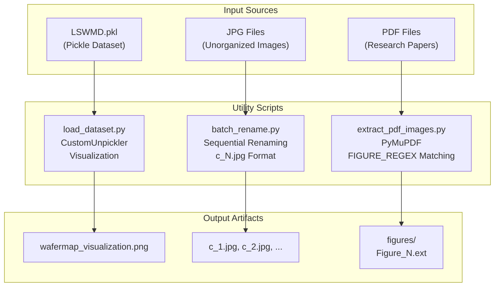

**Sources:** [Utility_Scripts/load_dataset.py:1-61](), [Utility_Scripts/batch_rename.py:1-28](), [Utility_Scripts/extract_pdf_images.py:1-128]()

---

## Utility Characteristics

| Utility | Primary Purpose | Input Format | Output Format | Integration |
|---------|----------------|--------------|---------------|-------------|
| `load_dataset.py` | Inspect pickled wafer data | `.pkl` (pandas DataFrame) | PNG visualization | Standalone |
| `batch_rename.py` | Standardize filenames | `.jpg` files | Renamed `.jpg` files | Standalone |
| `extract_pdf_images.py` | Extract research figures | `.pdf` files | Image files (PNG/JPG) | Standalone |

**Sources:** [Utility_Scripts/load_dataset.py:1-61](), [Utility_Scripts/batch_rename.py:1-28](), [Utility_Scripts/extract_pdf_images.py:1-128]()

---

## Dataset Inspection Tool

### Purpose

The `load_dataset.py` script loads and visualizes the **LSWMD.pkl** dataset, a pickled pandas DataFrame containing wafer map data. This tool addresses compatibility issues with legacy pickle files created using older pandas versions by implementing a `CustomUnpickler` class that remaps deprecated module paths.

**Sources:** [Utility_Scripts/load_dataset.py:1-61]()

---

### Implementation Details

#### CustomUnpickler Class

The core functionality relies on a custom unpickler that handles module path remapping for legacy pandas objects:

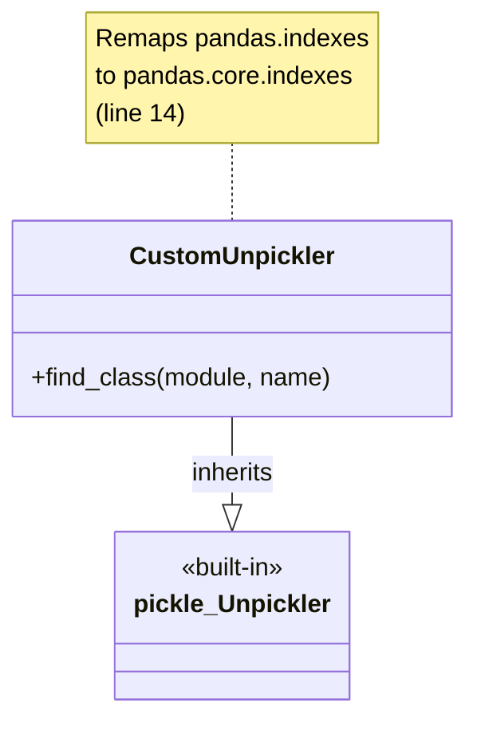

The `find_class()` method intercepts module resolution during unpickling and replaces deprecated `pandas.indexes` paths with their modern equivalents [Utility_Scripts/load_dataset.py:11-15]().

**Sources:** [Utility_Scripts/load_dataset.py:10-15]()

---

#### Execution Flow

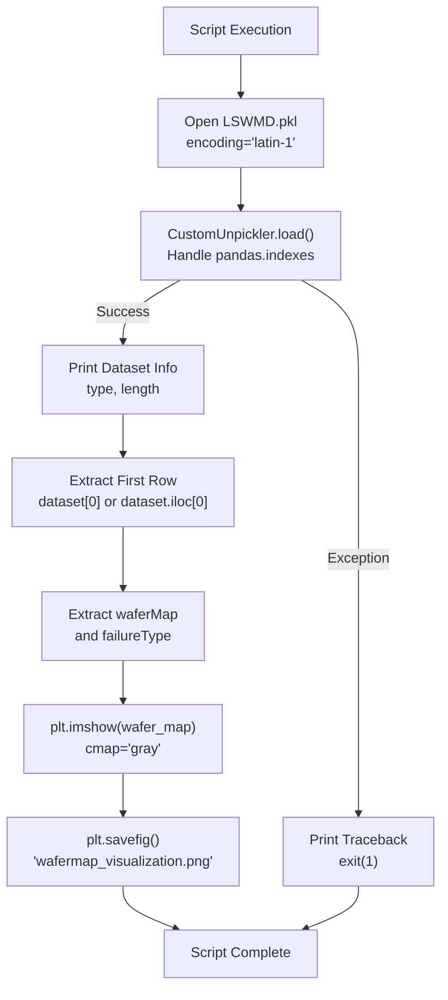

**Sources:** [Utility_Scripts/load_dataset.py:17-60]()

---

#### Data Extraction Logic

The script handles two possible data structures returned by the unpickler:

| Data Type | Access Method | waferMap Extraction | failureType Extraction |
|-----------|---------------|---------------------|------------------------|
| `dict` | Direct key access | `first_row.get('waferMap')` | `first_row.get('failureType', 'Unknown')` |
| `pandas.Series` | Column indexing | `first_row['waferMap']` | `first_row['failureType']` |

This dual-mode extraction ensures compatibility regardless of whether the pickle contains a raw dictionary or a pandas DataFrame [Utility_Scripts/load_dataset.py:39-45]().

**Sources:** [Utility_Scripts/load_dataset.py:38-45]()

---

#### Output Specifications

- **Console Output**: Dataset type, length, first row contents, wafer map shape
- **Visualization File**: `wafermap_visualization.png` (8x8 inches, 100 DPI)
- **Colormap**: Grayscale (`cmap='gray'`)
- **Metadata**: Title includes failure type from dataset [Utility_Scripts/load_dataset.py:50-60]()

**Sources:** [Utility_Scripts/load_dataset.py:28-60]()

---

## File Management Utility

### Purpose

The `batch_rename.py` script standardizes image filenames to the format `c_N.jpg`, where `N` is a sequential integer starting from 1. This utility operates on all JPG files in the directory where the script is located, sorting them alphabetically before applying sequential numbering.

**Sources:** [Utility_Scripts/batch_rename.py:1-28]()

---

### Renaming Algorithm

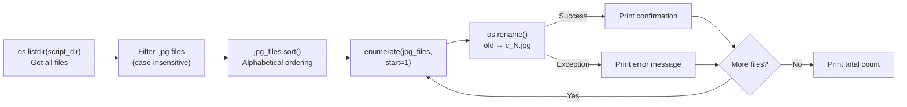

**Sources:** [Utility_Scripts/batch_rename.py:6-27]()

---

### Implementation Details

| Step | Code Reference | Description |
|------|---------------|-------------|
| Directory Resolution | [Utility_Scripts/batch_rename.py:4]() | Uses `os.path.abspath(__file__)` to locate script directory |
| File Filtering | [Utility_Scripts/batch_rename.py:10]() | Applies `.lower().endswith('.jpg')` and `os.path.isfile()` checks |
| Sorting | [Utility_Scripts/batch_rename.py:13]() | Sorts filenames to ensure deterministic ordering |
| Naming Convention | [Utility_Scripts/batch_rename.py:18]() | Formats as `f"c_{index}.jpg"` with 1-based indexing |
| Error Handling | [Utility_Scripts/batch_rename.py:21-25]() | Try-except block catches `os.rename()` exceptions |

**Sources:** [Utility_Scripts/batch_rename.py:1-28]()

---

### Execution Behavior

The script:
1. Processes only `.jpg` files (case-insensitive extension matching)
2. Ignores subdirectories and non-JPG files
3. Renames files in-place (no backup created)
4. Prints status for each file operation
5. Reports total count at completion [Utility_Scripts/batch_rename.py:16-27]()

**Warning**: This script modifies filenames destructively. Original filenames are not preserved unless manually backed up before execution.

**Sources:** [Utility_Scripts/batch_rename.py:15-27]()

---

## PDF Figure Extraction

### Purpose

The `extract_pdf_images.py` script extracts figures from research papers in PDF format using **PyMuPDF** (imported as `fitz`). It employs regex-based caption detection and spatial proximity matching to associate images with their figure numbers, outputting organized image files named according to their figure labels.

**Sources:** [Utility_Scripts/extract_pdf_images.py:1-128]()

---

### Configuration Parameters

The script uses compile-time constants for extraction behavior:

| Parameter | Value | Purpose |
|-----------|-------|---------|
| `INPUT_DIR` | `"pdfs"` | Source directory for PDF files |
| `OUTPUT_DIR` | `"figures"` | Root output directory |
| `FIGURE_REGEX` | See below | Pattern for caption detection |
| `MAX_VERTICAL_DISTANCE` | `250` pixels | Maximum gap between image and caption |
| `MIN_IMAGE_AREA` | `10,000` px² | Filters out small icons/decorations |
| `BBOX_TOLERANCE` | `5` pixels | Overlap detection tolerance |

The `FIGURE_REGEX` pattern matches variations like "Fig. 1", "Figure 2a", "FIG 3(b)":
```
r'\b(fig\.?|figure)\s*(\d+)\s*(?:[\(\[]?([a-z])[\)\]]?)?'
```

**Sources:** [Utility_Scripts/extract_pdf_images.py:5-16]()

---

### Extraction Pipeline

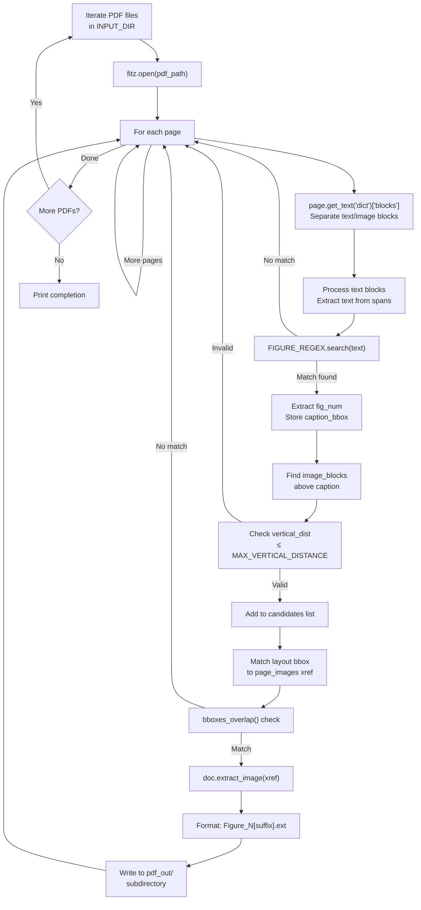

**Sources:** [Utility_Scripts/extract_pdf_images.py:40-127]()

---

### Spatial Matching Functions

The script implements three geometric helper functions for bbox operations:

#### image_area()
Calculates bounding box area to filter small images [Utility_Scripts/extract_pdf_images.py:23-24]():
```
area = (bbox[2] - bbox[0]) * (bbox[3] - bbox[1])
```

#### bboxes_overlap()
Determines if two bounding boxes overlap with tolerance [Utility_Scripts/extract_pdf_images.py:27-33]():
- Returns `False` if boxes are separated horizontally or vertically beyond tolerance
- Used to match layout image blocks to actual PDF image objects

#### bbox_above()
Checks if image bbox is above text bbox [Utility_Scripts/extract_pdf_images.py:36-37]():
```
return img_bbox[3] <= text_bbox[1]
```
This ensures captions are below their associated figures.

**Sources:** [Utility_Scripts/extract_pdf_images.py:23-37]()

---

### Caption Detection and Parsing

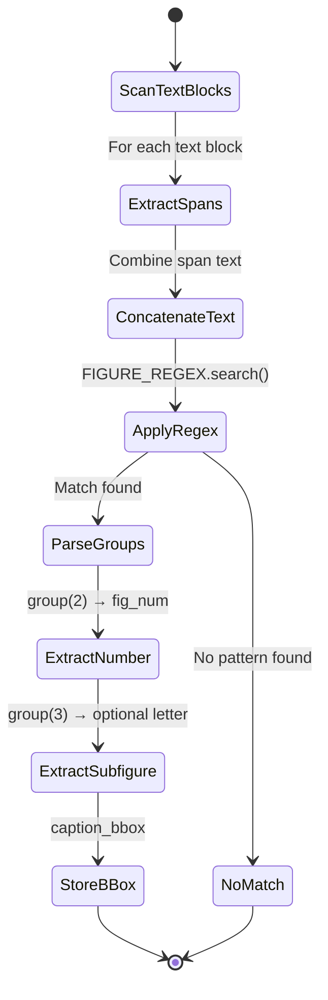

The regex extracts:
- **Group 1**: "fig" or "figure" (case-insensitive)
- **Group 2**: Numeric identifier (required)
- **Group 3**: Subfigure letter (optional, e.g., 'a', 'b') [Utility_Scripts/extract_pdf_images.py:73-77]()

**Sources:** [Utility_Scripts/extract_pdf_images.py:67-77]()

---

### Multi-Panel Figure Handling

When multiple image candidates are found above a single caption, the script:

1. **Sorts candidates horizontally** by x-coordinate (left to right) [Utility_Scripts/extract_pdf_images.py:93]()
2. **Assigns subfigure letters** using ASCII arithmetic: `chr(ord('a') + idx)` [Utility_Scripts/extract_pdf_images.py:119]()
3. **Names files** as `Figure_N[letter].ext` (e.g., `Figure_2a.png`, `Figure_2b.png`)
4. **Tracks extracted xrefs** via `seen_xrefs` set to prevent duplicates [Utility_Scripts/extract_pdf_images.py:50,110,113]()

**Sources:** [Utility_Scripts/extract_pdf_images.py:93-123]()

---

### Output Structure

```
figures/
├── paper1_name/
│   ├── Figure_1.png
│   ├── Figure_2a.jpg
│   ├── Figure_2b.jpg
│   └── Figure_3.png
└── paper2_name/
    ├── Figure_1.png
    └── Figure_4.jpg
```

Each PDF gets a subdirectory named after the PDF filename (without extension). Images preserve their original format extension (`ext`) as reported by PyMuPDF [Utility_Scripts/extract_pdf_images.py:46-47,116-123]().

**Sources:** [Utility_Scripts/extract_pdf_images.py:46-123]()

---

## Usage Patterns

### Typical Workflow Contexts

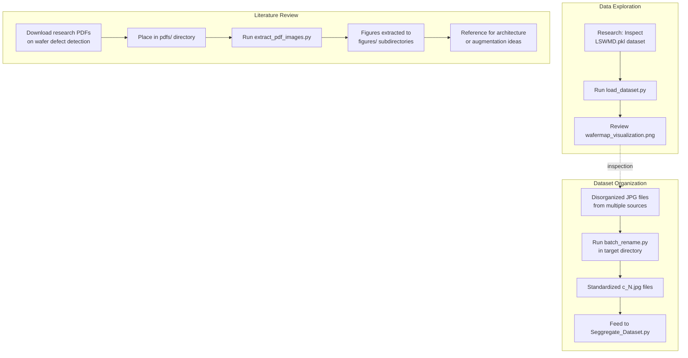

**Sources:** [Utility_Scripts/load_dataset.py:1-61](), [Utility_Scripts/batch_rename.py:1-28](), [Utility_Scripts/extract_pdf_images.py:1-128]()

---

### Integration with Main Pipeline

These utilities are **not** part of the automated training pipeline. Their relationship to the core system:

| Utility | Relationship to Core Pipeline | Typical Usage Frequency |
|---------|-------------------------------|-------------------------|
| `load_dataset.py` | Independent - inspects alternative dataset format | One-time or occasional |
| `batch_rename.py` | Pre-pipeline - prepares files before `Seggregate_Dataset.py` | As needed for new data |
| `extract_pdf_images.py` | External - supports research and development | Ad-hoc during literature review |

None of these scripts are imported by or import code from the training system ([Core Training System](#2)). They operate as standalone command-line tools executed manually.

**Sources:** [Utility_Scripts/load_dataset.py:1-61](), [Utility_Scripts/batch_rename.py:1-28](), [Utility_Scripts/extract_pdf_images.py:1-128]()

# Dataset Inspection Tool (load_dataset.py)


## Purpose and Scope

The `load_dataset.py` script is a standalone utility for loading, inspecting, and visualizing the legacy **LSWMD.pkl** (Labeled Semiconductor Wafer Map Dataset) pickle file. This tool addresses compatibility issues between older pandas serialization formats and modern Python environments by implementing a custom unpickler. It provides basic dataset statistics and generates a sample wafer map visualization.

This page documents the inspection tool only. For preprocessing the canonical train/val/test dataset structure used by training scripts, see [Dataset Organization](#3.1). For sampling tools that work with organized image directories, see [Dataset Sampling Tool](#3.4).

**Sources:** [Utility_Scripts/load_dataset.py:1-61]()

---

## LSWMD.pkl Dataset Format

The **LSWMD.pkl** file is a serialized pandas DataFrame or list structure containing wafer defect maps. Each record in the dataset represents a single semiconductor wafer with associated metadata and a 2D array representing the spatial defect pattern.

### Dataset Structure

| Field | Type | Description |
|-------|------|-------------|
| `waferMap` | 2D numpy array | Spatial grid showing defect locations on wafer surface |
| `failureType` | String | Classification label indicating the type of defect pattern |
| Additional metadata | Various | May include lot information, timestamps, or process parameters |

The dataset was serialized using an older version of pandas, causing incompatibility with modern pandas versions due to internal module restructuring. Specifically, the `pandas.indexes` module was relocated to `pandas.core.indexes`, requiring remapping during unpickling.

**Sources:** [Utility_Scripts/load_dataset.py:38-45]()

---

## Script Architecture

The script follows a linear execution flow with three primary phases: **loading**, **inspection**, and **visualization**. Error handling is implemented with a fail-fast approach, terminating execution if the pickle file cannot be loaded.

### Execution Flow Diagram

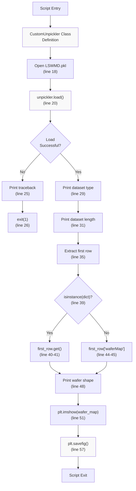

**Sources:** [Utility_Scripts/load_dataset.py:1-61]()

---

## CustomUnpickler Implementation

The `CustomUnpickler` class extends `pickle.Unpickler` to handle pandas module path changes between versions. This is the core compatibility fix that enables loading of legacy serialized objects.

### Class Definition

```
CustomUnpickler(pickle.Unpickler)
├── __init__: Inherited from pickle.Unpickler
└── find_class(module, name): Module remapping logic
```

The `find_class` method intercepts class resolution during unpickling and remaps `pandas.indexes.*` module paths to `pandas.core.indexes.*`. This method is called by the pickle protocol whenever it needs to resolve a class reference in the serialized data.

**Implementation Details:**

- **Line 10-15**: The `find_class` method checks if `'pandas.indexes'` appears in the module path
- **Line 14**: String replacement remaps to `'pandas.core.indexes'`
- **Line 15**: Delegates to parent class for actual class loading
- **Line 19**: Instantiated with `encoding='latin-1'` for compatibility with Python 2 pickles

**Sources:** [Utility_Scripts/load_dataset.py:10-15](), [Utility_Scripts/load_dataset.py:18-20]()

---

## Dataset Loading Process

The loading process uses a try-except block to capture detailed error information if unpickling fails. This provides diagnostic information for troubleshooting dataset compatibility issues.

### Loading Sequence

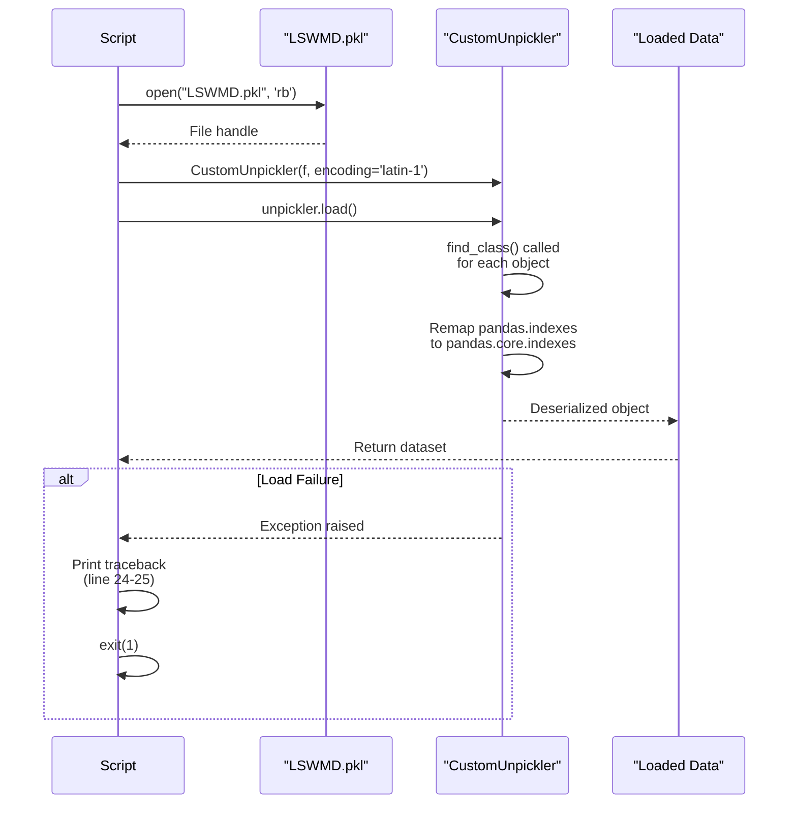

### Error Handling

- **Line 17-26**: Try-except block wraps entire loading operation
- **Line 23**: Captures both exception type and message
- **Line 24-25**: Prints full traceback for debugging
- **Line 26**: Exits with status code 1 to signal failure

**Sources:** [Utility_Scripts/load_dataset.py:17-26]()

---

## Data Inspection Features

After successful loading, the script performs automatic inspection to determine dataset structure and extract the first sample for visualization.

### Inspection Operations Table

| Operation | Code Location | Output |
|-----------|---------------|--------|
| Type detection | Line 29 | Prints Python type (DataFrame, list, tuple, etc.) |
| Length computation | Lines 30-31 | Prints number of records if `__len__` available |
| First row extraction | Line 35 | Accesses first element via indexing or `.iloc[0]` |
| Data structure detection | Lines 39-45 | Determines dict vs pandas Series access pattern |
| Wafer map extraction | Lines 40-45 | Retrieves `waferMap` field using appropriate accessor |
| Failure type extraction | Lines 41, 45 | Retrieves `failureType` label |
| Shape computation | Line 48 | Converts to numpy array and prints dimensions |

### Dual Access Pattern

The script implements a conditional access pattern to handle both dictionary-based and pandas Series-based records:

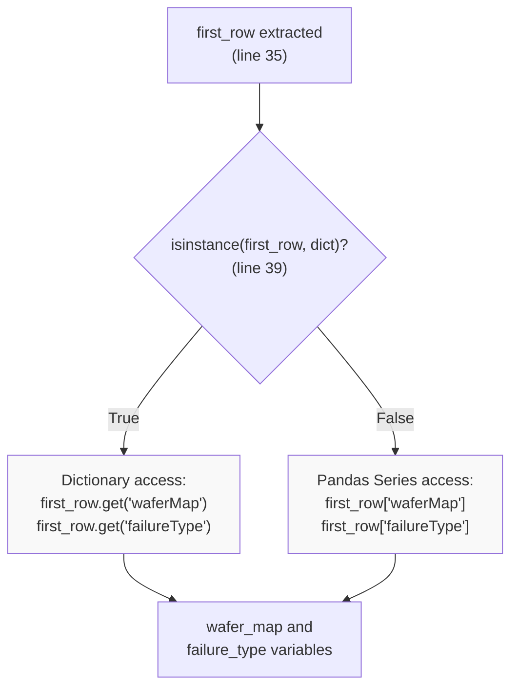

This dual pattern ensures compatibility whether the pickle contains a list of dictionaries or a pandas DataFrame (where `.iloc[0]` returns a Series).

**Sources:** [Utility_Scripts/load_dataset.py:28-48]()

---

## Visualization Output

The script generates a grayscale heatmap visualization of the first wafer map, saving it as **`wafermap_visualization.png`**. This provides visual confirmation of successful data loading and allows manual inspection of defect patterns.

### Matplotlib Configuration

| Parameter | Value | Purpose |
|-----------|-------|---------|
| `figsize` | `(8, 8)` | Square aspect ratio matches typical wafer shape |
| `cmap` | `'gray'` | Grayscale colormap for defect intensity |
| `colorbar` | Enabled | Shows mapping of pixel values to colors |
| `title` | Includes `failure_type` | Labels visualization with defect class |
| `dpi` | `100` | Resolution of saved image |
| `bbox_inches` | `'tight'` | Removes excess whitespace |

### Visualization Pipeline

```mermaid
flowchart LR
    WAFER["wafer_map<br/>2D array"] --> FIG["plt.figure(figsize=(8,8))<br/>(line 50)"]
    FIG --> IMSHOW["plt.imshow(wafer_map, cmap='gray')<br/>(line 51)"]
    IMSHOW --> CBAR["plt.colorbar(label='Pixel Value')<br/>(line 52)"]
    CBAR --> TITLE["plt.title(f'...{failure_type}')<br/>(line 53)"]
    TITLE --> LABELS["plt.xlabel/ylabel<br/>(line 54-55)"]
    LABELS --> LAYOUT["plt.tight_layout()<br/>(line 56)"]
    LAYOUT --> SAVE["plt.savefig('wafermap_visualization.png')<br/>(line 57)"]
    SAVE --> CLOSE["plt.close()<br/>(line 58)"]
    CLOSE --> OUTPUT["wafermap_visualization.png<br/>file created"]
    
    style IMSHOW fill:#f9f9f9
    style SAVE fill:#f9f9f9
```

The `plt.close()` call ensures proper resource cleanup and prevents memory leaks when running the script multiple times in a session.

**Sources:** [Utility_Scripts/load_dataset.py:50-60]()

---

## Usage and Output

### Execution Requirements

1. **LSWMD.pkl must exist** in the same directory as the script
2. **Dependencies**: `pickle`, `matplotlib`, `numpy`, `sys`, `warnings`
3. **Python version**: Compatible with Python 3.6+ (pandas compatibility layer handles legacy format)

### Command Line Invocation

```bash
cd Utility_Scripts/
python load_dataset.py
```

### Expected Console Output

```
Dataset loaded successfully
Dataset type: <class 'pandas.core.frame.DataFrame'>
Dataset length: 811457

First row:
waferMap     [[0, 0, 0, 0, 0, ...], [0, 0, 0, 0, 0, ...], ...]
failureType                                               Center
Name: 0, dtype: object

Wafer map type: <class 'numpy.ndarray'>
Wafer map shape: (26, 26)

Visualization saved as 'wafermap_visualization.png'
```

### Output Artifacts

- **Console output**: Dataset metadata and first record information
- **wafermap_visualization.png**: Grayscale heatmap of first wafer's defect pattern

### Common Use Cases

| Use Case | Workflow |
|----------|----------|
| **Dataset validation** | Verify LSWMD.pkl loads correctly after downloading |
| **Format inspection** | Determine whether dataset is DataFrame or list format |
| **Shape verification** | Check wafer map dimensions (typically 26x26 or similar) |
| **Sample visualization** | Preview defect pattern appearance before processing |
| **Debugging pickle errors** | Use traceback output to diagnose compatibility issues |

**Sources:** [Utility_Scripts/load_dataset.py:21-61]()

---

## Relationship to Training Pipeline

The `load_dataset.py` tool is **not integrated** into the main training workflow. The primary training systems ([Core Training System](#2), [Alternative Training Approaches](#5)) consume preprocessed image directories created by [Dataset Organization](#3.1), not the raw LSWMD.pkl file.

### Dataset Source Comparison

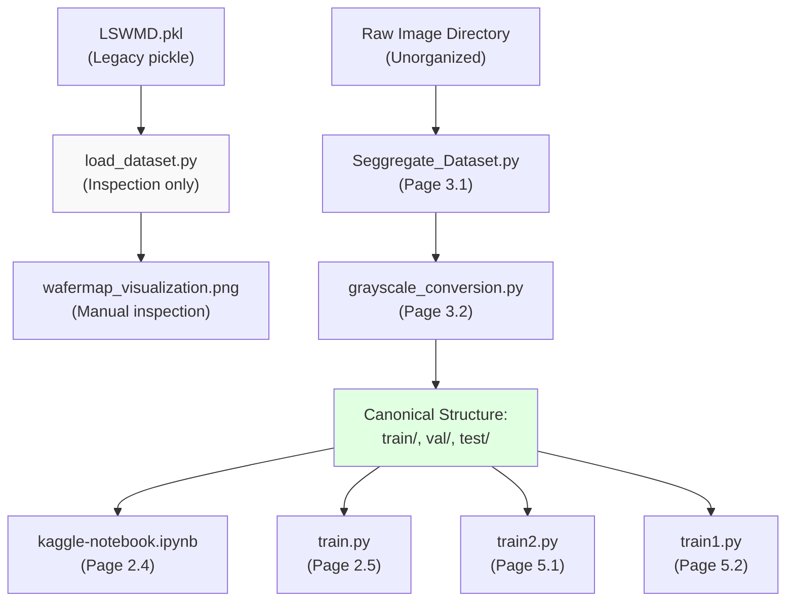

The LSWMD.pkl dataset represents an **alternative data source** that is not currently used in production training. Its primary value is historical or for researchers comparing different dataset formats.

**Sources:** [Utility_Scripts/load_dataset.py:1-61]()

# File Management Utilities (batch_rename.py)


## Purpose and Scope

The `batch_rename.py` script is a simple file management utility that standardizes image filenames into a consistent sequential format (`c_1.jpg`, `c_2.jpg`, etc.). This tool is used during dataset organization to ensure uniform naming conventions before images enter the preprocessing pipeline. It operates in-place on JPG files in the same directory as the script.

For dataset splitting and directory organization, see [Dataset Organization (Seggregate_Dataset.py)](#3.1). For dataset inspection tools, see [Dataset Inspection Tool (load_dataset.py)](#6.1).

---

## Script Overview

The script is a self-contained utility with no external dependencies beyond Python's standard library. It operates on the principle of processing all JPG files in its current directory and renaming them to a standardized sequential format.

### Key Characteristics

| Characteristic | Details |
|----------------|---------|
| **File Type** | Standalone Python script |
| **Target Files** | `.jpg` (case-insensitive) |
| **Naming Format** | `c_N.jpg` where N is sequential starting from 1 |
| **Directory Scope** | Script's own directory only |
| **Dependencies** | `os` (standard library) |
| **Error Handling** | Try-except with descriptive messages |

**Sources:** [Utility_Scripts/batch_rename.py:1-28]()

---

## Script Architecture

### Execution Flow

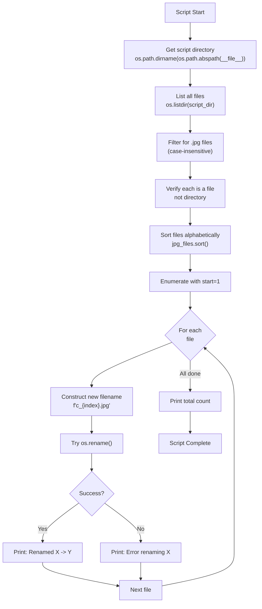

**Sources:** [Utility_Scripts/batch_rename.py:3-27]()

---

## File Selection Logic

### Selection Criteria

The script implements a three-step filtering process to identify candidate files for renaming:

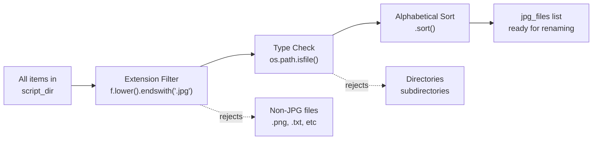

**Implementation Details:**

1. **Extension Filtering** [Utility_Scripts/batch_rename.py:10]()
   - Uses `f.lower().endswith('.jpg')` for case-insensitive matching
   - Accepts: `image.jpg`, `Image.JPG`, `PHOTO.Jpg`
   - Rejects: `.png`, `.jpeg`, `.gif`, etc.

2. **File Type Verification** [Utility_Scripts/batch_rename.py:10]()
   - Uses `os.path.isfile(os.path.join(script_dir, f))` to exclude directories
   - Prevents attempting to rename folders that might have `.jpg` in their name

3. **Sorting** [Utility_Scripts/batch_rename.py:13]()
   - Applies `jpg_files.sort()` for deterministic ordering
   - Ensures consistent numbering across multiple script executions

**Sources:** [Utility_Scripts/batch_rename.py:6-13]()

---

## Naming Convention and Transformation

### Standardized Format

The script applies the naming pattern `c_N.jpg` where:
- `c_` is a fixed prefix (possibly indicating "class" or "category")
- `N` is a sequential integer starting from 1
- `.jpg` is the preserved extension

### Transformation Example

| Original Filename | Sorted Order | New Filename | Index |
|-------------------|--------------|--------------|-------|
| `IMG_2045.jpg` | 1 | `c_1.jpg` | 1 |
| `defect_sample.jpg` | 2 | `c_2.jpg` | 2 |
| `photo_003.JPG` | 3 | `c_3.jpg` | 3 |
| `wafer_001.jpg` | 4 | `c_4.jpg` | 4 |

### Filename Construction

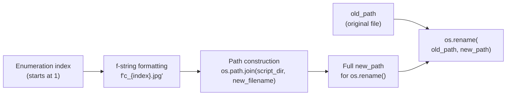

**Code Reference:** The enumeration starts at 1 using `enumerate(jpg_files, start=1)` [Utility_Scripts/batch_rename.py:16](), and the filename is constructed using an f-string: `f"c_{index}.jpg"` [Utility_Scripts/batch_rename.py:18]().

**Sources:** [Utility_Scripts/batch_rename.py:16-19]()

---

## Error Handling and Logging

### Exception Management

The script wraps the `os.rename()` operation in a try-except block to handle potential failures gracefully:

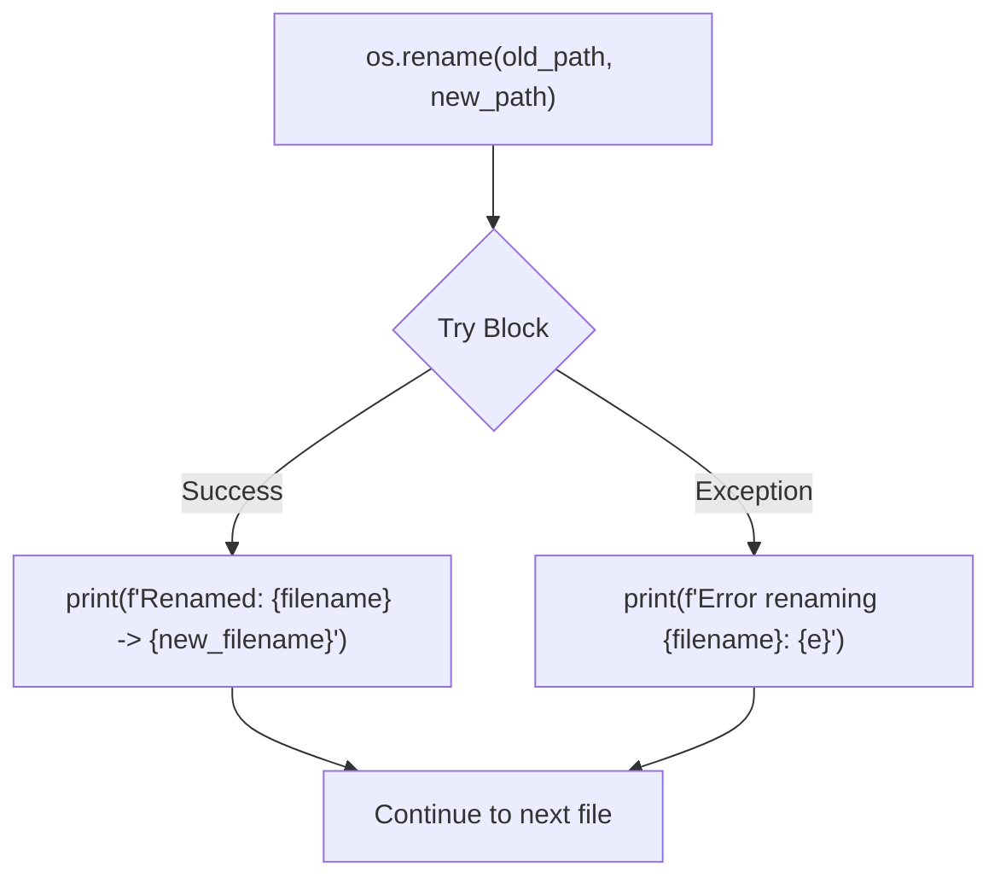

### Potential Error Scenarios

| Error Type | Cause | Handling |
|------------|-------|----------|
| **PermissionError** | Insufficient file permissions | Caught by except block, error printed |
| **FileExistsError** | Target filename already exists | Caught by except block, error printed |
| **OSError** | File locked by another process | Caught by except block, error printed |
| **Path too long** | Filesystem path length limits | Caught by except block, error printed |

### Logging Output

The script provides two types of log messages:

1. **Success Messages** [Utility_Scripts/batch_rename.py:23]()
   - Format: `"Renamed: {old_filename} -> {new_filename}"`
   - Example: `Renamed: IMG_2045.jpg -> c_1.jpg`

2. **Error Messages** [Utility_Scripts/batch_rename.py:25]()
   - Format: `"Error renaming {filename}: {exception_message}"`
   - Example: `Error renaming locked.jpg: [Errno 13] Permission denied`

3. **Summary** [Utility_Scripts/batch_rename.py:27]()
   - Format: `"Total files renamed: {count}"`
   - Example: `Total files renamed: 47`

**Sources:** [Utility_Scripts/batch_rename.py:21-27]()

---

## Usage Patterns and Workflow Integration

### Standalone Execution

The script is designed for standalone execution:

1. **Placement**: Copy `batch_rename.py` into the directory containing images to rename
2. **Execution**: Run `python batch_rename.py`
3. **Result**: All JPG files in that directory are renamed sequentially

### Integration with Data Pipeline

Based on the high-level system architecture, this utility operates at the "Organization Layer" before dataset segregation:

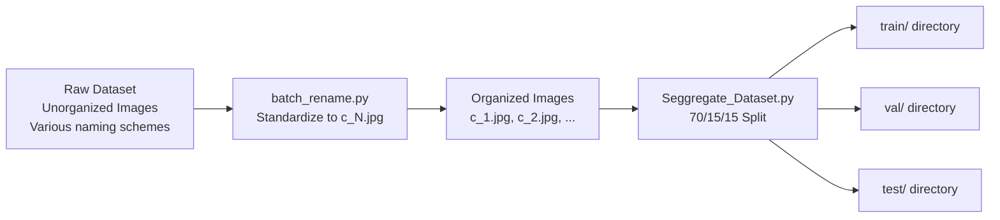

### Typical Use Cases

1. **Pre-preprocessing Organization**
   - Raw images from different sources have inconsistent naming
   - Run `batch_rename.py` to standardize before entering the pipeline

2. **Class Directory Preparation**
   - Before running `Seggregate_Dataset.py`, ensure each class folder has standardized names
   - Example: Run once in each class subdirectory

3. **Dataset Cleanup**
   - After extracting images from research papers with `extract_pdf_images.py` (see [PDF Figure Extraction](#6.3))
   - Standardize extracted filenames for consistency

**Sources:** [Utility_Scripts/batch_rename.py:1-28]()

---

## Script Limitations

| Limitation | Description | Workaround |
|------------|-------------|------------|
| **Single Directory** | Only processes files in script's own directory | Copy script to each target directory or modify `script_dir` variable |
| **JPG Only** | Does not handle `.jpeg`, `.png`, or other formats | Modify line 10 to include additional extensions |
| **No Undo** | Renames are permanent with no backup | Manual backup before running |
| **Overwrite Risk** | If `c_1.jpg` already exists, causes FileExistsError | Clear target naming pattern before running |
| **No Class Prefix** | All files get generic `c_` prefix | Modify line 18 to use class-specific prefix |

**Sources:** [Utility_Scripts/batch_rename.py:10,18]()

---

## Code Entity Reference

### Key Functions and Constructs

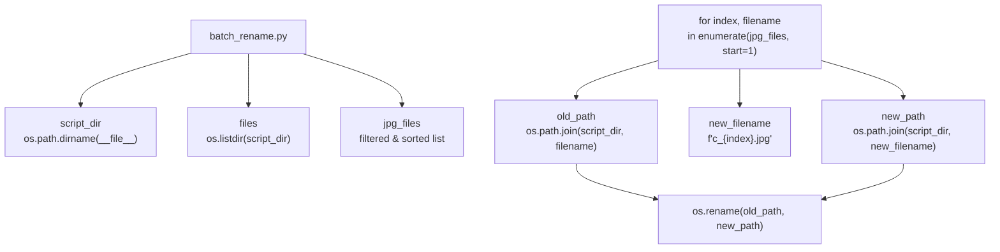

### Variable Lifecycle

| Variable | Defined At | Purpose | Type |
|----------|-----------|---------|------|
| `script_dir` | Line 4 | Store script's directory path | `str` |
| `files` | Line 7 | All items in directory | `list[str]` |
| `jpg_files` | Line 10 | Filtered JPG files only | `list[str]` |
| `index` | Line 16 | Sequential counter (1, 2, 3...) | `int` |
| `filename` | Line 16 | Current original filename | `str` |
| `old_path` | Line 17 | Full path to original file | `str` |
| `new_filename` | Line 18 | Generated new filename | `str` |
| `new_path` | Line 19 | Full path for renamed file | `str` |

**Sources:** [Utility_Scripts/batch_rename.py:4-19]()

# PDF Figure Extraction (extract_pdf_images.py)


## Purpose and Scope

This document describes the `extract_pdf_images.py` utility, which automates the extraction of figures from research papers in PDF format. The tool uses PyMuPDF (fitz) to parse PDF documents, identifies figure captions through regex pattern matching, performs spatial analysis to associate captions with their corresponding images, and exports the extracted figures with standardized filenames.

This is a standalone utility tool for research workflows and is not part of the main training/evaluation pipeline. For other utility scripts, see [Utility Tools](#6). For dataset inspection tools, see [Dataset Inspection Tool](#6.1).

**Sources:** [Utility_Scripts/extract_pdf_images.py:1-128]()

---

## System Context

The PDF extraction tool operates independently of the core training system, serving as a research assistant for acquiring visual data from academic papers. It processes PDFs from a designated input directory and outputs organized figures suitable for dataset augmentation or literature review.

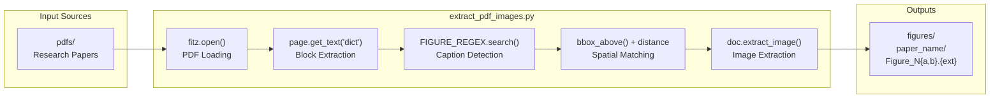

**Sources:** [Utility_Scripts/extract_pdf_images.py:1-128]()

---

## Configuration Parameters

The script defines configuration constants at the module level that control extraction behavior:

| Parameter | Value | Purpose |
|-----------|-------|---------|
| `INPUT_DIR` | `"pdfs"` | Source directory containing PDF files |
| `OUTPUT_DIR` | `"figures"` | Destination directory for extracted images |
| `MAX_VERTICAL_DISTANCE` | `250` px | Maximum distance between image bottom and caption top |
| `MIN_IMAGE_AREA` | `10,000` px² | Minimum area threshold to filter out icons/logos |
| `BBOX_TOLERANCE` | `5` px | Overlap tolerance for bounding box matching |

### Caption Detection Pattern

The `FIGURE_REGEX` pattern [Utility_Scripts/extract_pdf_images.py:9-12]() matches the following caption formats:

```regex
\b(fig\.?|figure)\s*(\d+)\s*(?:[\(\[]?([a-z])[\)\]]?)?
```

**Supported Formats:**
- `Figure 1`
- `Fig. 2`
- `Figure 3a`
- `Figure 4 (b)`
- `Fig. 5[c]`

The pattern captures:
1. Figure keyword (case-insensitive)
2. Figure number (required)
3. Subfigure letter (optional, group 3)

**Sources:** [Utility_Scripts/extract_pdf_images.py:5-17]()

---

## Processing Pipeline

The extraction pipeline processes PDFs sequentially, analyzing each page for figure-caption pairs:

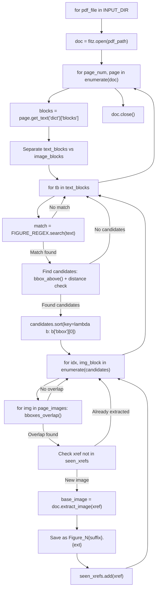

**Key Data Structures:**
- `text_blocks`: List of type=0 blocks from `page.get_text("dict")`
- `image_blocks`: List of type=1 blocks with area ≥ `MIN_IMAGE_AREA`
- `seen_xrefs`: Set tracking extracted image cross-references for deduplication
- `candidates`: Images passing spatial proximity tests for a given caption

**Sources:** [Utility_Scripts/extract_pdf_images.py:40-126]()

---

## Caption Detection Algorithm

The caption detection phase scans text blocks for figure references using regex matching:

### Text Extraction

For each text block (type=0), the script concatenates text from nested spans:

```python